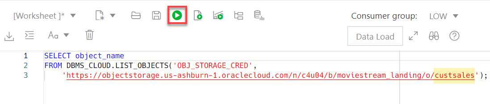

# Improve Query Performance

## Introduction

In this lab, you will learn how to use various techniques to improve your query performance. You can use materialized views to increase the speed of queries on very large databases. A materialized view is a database object that contains the results of a query.  Queries to large databases often involve joins between tables, aggregations such as SUM, or both. These operations are expensive in terms of time and processing power. The type of materialized view you create determines how the materialized view is refreshed and used by query rewrite.

Materialized views improve query performance by precalculating expensive join and aggregation operations on the database prior to execution and storing the results in the database. The query optimizer automatically recognizes when an existing materialized view can and should be used to satisfy a request. It then transparently rewrites the request to use the materialized view. Queries go directly to the materialized view and not to the underlying detail tables. In general, rewriting queries to use materialized views rather than detail tables improves response time.

Estimated Time: 10 minutes

<!-- Comments:  -->

### Objectives

In this lab, we will show you how to do the following:

* Create a materialized view on top of an external table to improve query response time.

### Prerequisites
None.

## Task 1: Navigate to the SQL Worksheet

1. Log in to the **Oracle Cloud Console**.

2. Open the **Navigation** menu and click **Oracle Database**. Under **Oracle Database**, click **Autonomous Database**.

3. On the **Autonomous Databases** page, click your **ADW-Data-Lake** ADB instance.

4. On the **Autonomous Database details** page, click **Database actions**.

5. A **Launch DB actions** message box with the message **Please wait. Initializing DB Actions** is displayed. Next, the **Database Actions | Launchpad** Home page is displayed in a new tab in your browser. In the In the **Development** section, click the **SQL** card.

## Task 2: Create a Materialized View on Top of an External Table

In this task, you will create a materialized view on top of the external table to improve query response time.

1. In **Lab 4: Link to Data in Public Object Storage Buckets > Task 2: Link to Data in Public Object Storage Buckets and Create Tables**, you created the **CUSTSALES** external table. The source data for this table was the **moviestream_landing** Oracle Object Storage bucket which is located in the **c4u04** public tenancy. Here's the location of the public Oracle Object Storage bucket:

    ```
    https://objectstorage.us-ashburn-1.oraclecloud.com/n/c4u04/b/moviestream_landing/o
    ```
    
    This bucket contains the **sales\_sample** data set in `parquet` format. When you linked to this bucket in **Lab 4**, a **sales\_sample** external table was generated; however, you changed the name of this table to **custsales**. This data set contains monthly partitioned customers sales data for years **2019** and **2020** as shown in the following partial screen capture. Each folder contains a single `.parquet` file such as **custsales-2019-1.parquet**.

    

    To query the table in the SQL Worksheet, drag and drop **CUSTSALES** from the Navigator pane onto the worksheet.

    

    A **Choose the type of insertion** dialog box is displayed. Choose the **Select** option, and then click **Apply**. The query is displayed. To run the query, click the **Run Statement** icon in the Worksheet toolbar.

    

2. Let's find out the sum of the actual price that is associated with movie_id 19. Copy and paste the following code into your SQL Worksheet, and then click the **Run Statement** icon in the Worksheet toolbar.

    ```
    <copy>
    SELECT MOVIE_ID, sum(actual_price)
    FROM ADMIN.CUSTSALES s
    where movie_id=19
    GROUP BY MOVIE_ID;
    /
    </copy>
    ```

    The result is displayed. The query took **8.354 seconds** to complete.

    

3. Create a materialized view over the **custsales** external table to improve the query response time. In data warehouses, you can use materialized views to pre-compute and store aggregated data such as the sum of **custsales**. Materialized views in these environments are often referred to as summaries, because they store summarized data. They can also be used to pre-compute joins with or without aggregations. A materialized view eliminates the overhead associated with expensive joins and aggregations for a large or important class of queries. Copy and paste the following code into your SQL Worksheet, and then click the **Run Statement** icon in the Worksheet toolbar. For additional information about materialized views, see [Basic Materialized Views](https://docs.oracle.com/en/database/oracle/oracle-database/19/dwhsg/basic-materialized-views.html#GUID-A7AE8E5D-68A5-4519-81EB-252EAAF0ADFF).

    ```
    <copy>
    CREATE MATERIALIZED VIEW sales_summary_mv
    BUILD IMMEDIATE
    REFRESH FORCE ON DEMAND
    ENABLE QUERY REWRITE
    AS
    select
    MOVIE_ID, sum(actual_price) actual_price from ADMIN.CUSTSALES s
    group by MOVIE_ID;
    </copy>
    ```

    The materialized view is created.

    

    >**Note:** Since you created the materialized view on top of an external table, you can't refresh it on commit;therefore, you had to include the `REFRESH FORCE ON DEMAND` clause. If you have new files in the bucket that you want included in the materialized view, you can refresh it by invoking the `REFRESH` procedure in the **`DBMS_MVIEW`** PL/SQL package as follows:

    ```
    BEGIN
    DBMS_MVIEW.REFRESH('sales_summary_mv');
    END;
    /
    ```

4. Gather some statistics for the query optimizer. This is an optional step since ADB will automatically gather statistics. In this lab, we will gather the optimizer statistics manually to show how it is done. The query optimizer (simply called the optimizer) is a built-in database software that determines the most efficient method for a SQL statement to access requested data. Use the **DBMS\_STATS** package to manipulate optimizer statistics. You can gather statistics on objects and columns at various levels of granularity: object, schema, and database. Use the **GATHER\_TABLE_STATS** procedure to collect statistics on the **CUSTSALES** table and the **SALES\_SUMMARY\_MV** materialized view. Copy and paste the following code into your SQL Worksheet, and then click the **Run Statement** icon in the Worksheet toolbar. For additional information about the optimizer, see [Query Optimizer Concepts](https://docs.oracle.com/en/database/oracle/oracle-database/19/tgsql/query-optimizer-concepts.html#GUID-06129ACE-36B2-4534-AE68-EDFCAEBB3B5D).

    ```
    <copy>
    BEGIN
  DBMS_STATS.GATHER_TABLE_STATS(
    ownname => 'ADMIN',
    tabname => 'CUSTSALES');
  DBMS_STATS.GATHER_TABLE_STATS(
    ownname => 'ADMIN',
    tabname => 'SALES_SUMMARY_MV');
    END;
    /
    </copy>
    ```

    

5. Let's run the same query again. Copy and paste the following code into your SQL Worksheet, and then click the **Run Statement** icon in the Worksheet toolbar.

    ```
    <copy>
    SELECT MOVIE_ID, sum(actual_price)
    FROM ADMIN.CUSTSALES s
    where movie_id=19
    GROUP BY MOVIE_ID;
    /
    </copy>
    ```

    With the use of the materialized view, the query took only **0.003 seconds** to complete instead of **8.354 seconds** without using the materialized view. The materialized view eliminated the overhead associated with the expensive aggregation.

    

6. Let's look at the execution plan to see if the query was re-written to use the materialized view. Copy and paste the following code into your SQL Worksheet, and then click the **Run Statement** icon in the Worksheet toolbar.

    ```
    <copy>
    SELECT /*+ MONITOR */MOVIE_ID, sum(actual_price)
    FROM ADMIN.CUSTSALES s
    where movie_id=19
    GROUP BY MOVIE_ID;
    </copy>
    ```

    

7. Click **Oracle Database Actions** in the banner to display the **Launchpad** landing page.

    

8. Scroll-down the page to the **Monitoring** section, and then click **PERFORMANCE HUB**.

    

9. Click the **SQL Monitoring** tab. Re-size the timeline border as needed to show the queries you ran. Click the link for the latest monitoring query that you ran.

    

10. In the **Real-time SQL Monitoring for SQL** page for the selected query, the execution plan shows that the query was re-written to use the materialized view.

    

## Learn more

* [Create Materialized Views](https://docs.oracle.com/en/database/oracle/oracle-database/19/sqlrf/CREATE-MATERIALIZED-VIEW.html#GUID-EE262CA4-01E5-4618-B659-6165D993CA1B).
* [Load Data with Autonomous Database](https://docs.oracle.com/en/cloud/paas/autonomous-data-warehouse-cloud/user/load-data.html#GUID-1351807C-E3F7-4C6D-AF83-2AEEADE2F83E)

You may now proceed to the next lab.

## Acknowledgements

* **Author:**
    * Lauran Serhal, Consulting User Assistance Developer, Oracle Database and Big Data
* **Contributor:**
    + Alexey Filanovskiy, Senior Principal Product Manager
* **Last Updated By/Date:** Lauran Serhal, May 2023

Data about movies in this workshop were sourced from Wikipedia.

Copyright (C) Oracle Corporation.

Permission is granted to copy, distribute and/or modify this document
under the terms of the GNU Free Documentation License, Version 1.3
or any later version published by the Free Software Foundation;
with no Invariant Sections, no Front-Cover Texts, and no Back-Cover Texts.
A copy of the license is included in the section entitled [GNU Free Documentation License](files/gnu-free-documentation-license.txt)