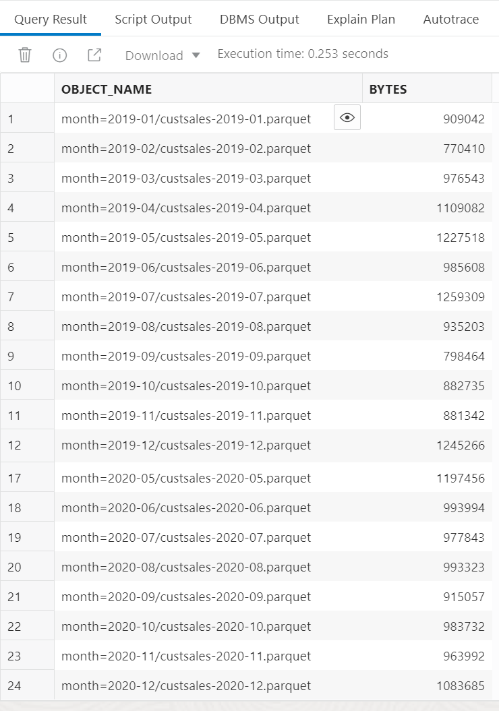
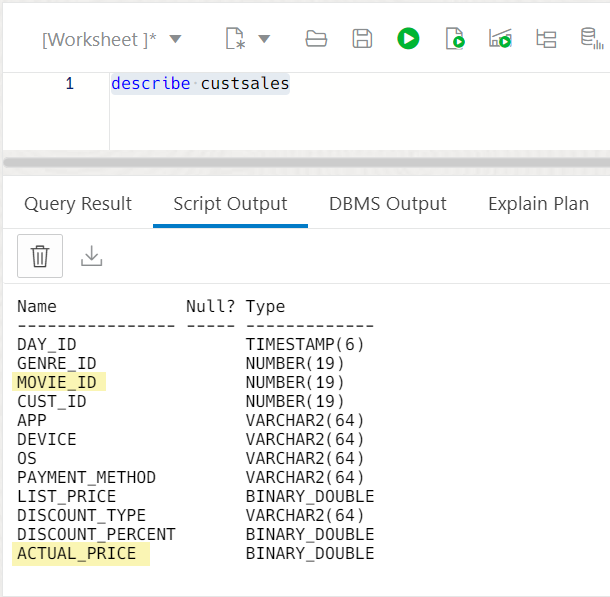
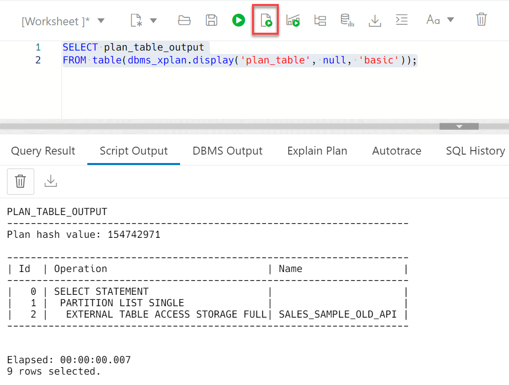
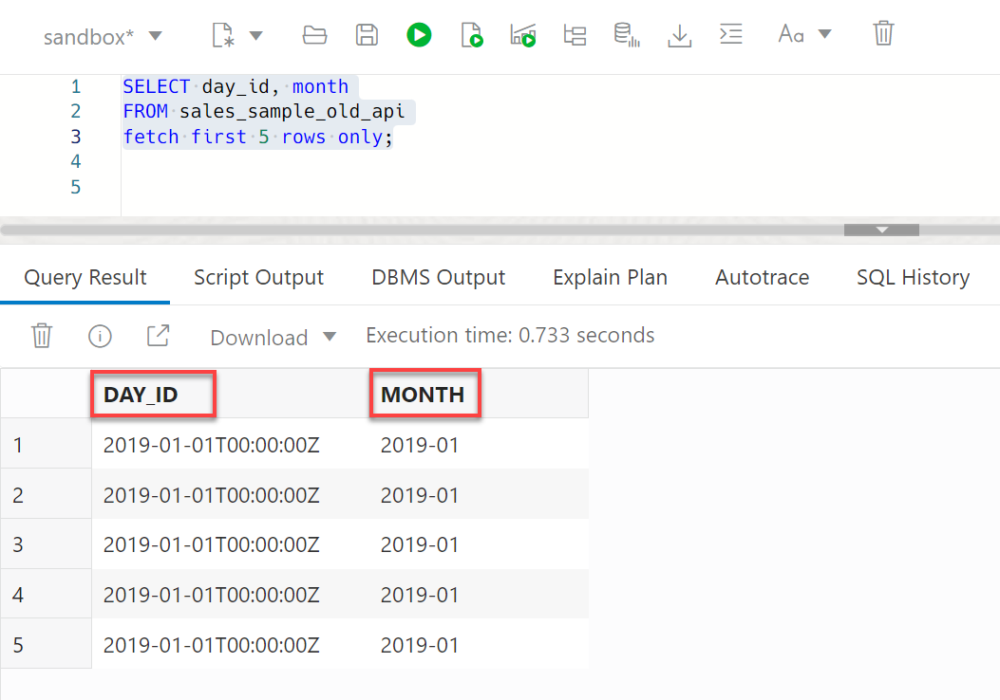

# Improve Query Performance

## Introduction

In this lab, you will learn how to use various techniques to improve your query performance. This includes using materialized views to increase the speed of queries on very large databases. A materialized view is a database object that contains the results of a query.  Queries to large databases often involve joins between tables, aggregations such as SUM, or both. These operations are expensive in terms of time and processing power. The type of materialized view you create determines how the materialized view is refreshed and used by query rewrite.

Materialized views improve query performance by precalculating expensive join and aggregation operations on the database prior to execution and storing the results in the database. The query optimizer automatically recognizes when an existing materialized view can and should be used to satisfy a request. It then transparently rewrites the request to use the materialized view. Queries go directly to the materialized view and not to the underlying detail tables. In general, rewriting queries to use materialized views rather than detail tables improves response time.

Estimated Time: 10 minutes

<!-- Comments:  -->

### Objectives

In this lab, we will show you how to do the following:

* Create a materialized view on top of an external table to improve query response time.
* Create and manage partitioned external tables to improve the database performance.

### Prerequisites

This lab requires the completion of the following labs/task from the **Contents** menu on the left:

* **Lab 1: Set up the Workshop Environment > Task 2:  Provision the Autonomous AI Database Instance**.
* **Lab 5: Link Data from Private Object Storage Buckets > Task 6: Define a Cloud Location and Create a Credential**.

## Task 1: Create a Materialized View for an External Table

In this task, you will create a materialized view on top of the **`custsales`** external table that you created in **Lab 4: Task 2** based on **`sales_sample`** to improve the query response time.

1. Let's look at the content of the **`sales_sample`** folder in the **`moviestream_landing`** Oracle Object Storage bucket. Copy and paste the following code into your SQL Worksheet, and then click the **Run Statement** icon in the Worksheet toolbar.

    ```
    <copy>
    SELECT OBJECT_NAME, BYTES
    FROM DBMS_CLOUD.LIST_OBJECTS(CREDENTIAL_NAME => 'OBJ_STORAGE_CRED',
    LOCATION_URI => 'https://objectstorage.us-ashburn-1.oraclecloud.com/n/c4u04/b/moviestream_landing/o/sales_sample');
    </copy>
    ```

    

    >**Note:** In **Lab 5 > Task 6**, you created a credential named **`OBJ_STORAGE_CRED`** that you used in the above query.

    There are **24** parquet data files in the **`sales_sample`** folder. Each file represents a month's worth of data for the years **`2019`** and **`2020`**.

    

2. Describe the structure of the **`custsales`** external table.

    ```
    <copy>
    describe custsales
    </copy>
    ```
    

3. Let's find out the sum of the actual price that is associated with **`movie_id 19`**. Copy and paste the following code into your SQL Worksheet, and then click the **Run Statement** icon in the Worksheet toolbar.

    ```
    <copy>
    SELECT MOVIE_ID, sum(actual_price)
    FROM ADMIN.CUSTSALES s
    where movie_id=19
    GROUP BY MOVIE_ID;
    /
    </copy>
    ```

    The result is displayed. The query took **8.354 seconds** to complete. This is OK but not great. Let's see if we can improve the query response time.

    

4. Create a materialized view over the **`custsales`** external table to improve the query response time. In data warehouses, you can use materialized views to pre-compute and store aggregated data such as the sum of **`custsales`**. Materialized views in these environments are often referred to as summaries, because they store summarized data. They can also be used to pre-compute joins with or without aggregations. A materialized view eliminates the overhead associated with expensive joins and aggregations for a large or important class of queries. Copy and paste the following code into your SQL Worksheet, and then click the **Run Statement** icon in the Worksheet toolbar. For additional information about materialized views, see [Basic Materialized Views](https://docs.oracle.com/en/database/oracle/oracle-database/19/dwhsg/basic-materialized-views.html#GUID-A7AE8E5D-68A5-4519-81EB-252EAAF0ADFF).

    ```
    <copy>
    CREATE MATERIALIZED VIEW sales_summary_mv
    BUILD IMMEDIATE
    REFRESH FORCE ON DEMAND
    ENABLE QUERY REWRITE
    AS
    select
    MOVIE_ID, sum(actual_price) actual_price from ADMIN.CUSTSALES s
    group by MOVIE_ID;
    </copy>
    ```

    >**Notes:**
    + The **`BUILD IMMEDIATE`** clause creates the materialized view and then populates it with data immediately.
    + When you create a materialized view, you can specify whether the refresh occurs **`ON DEMAND`** or **`ON COMMIT`**;However, since you are creating a materialized view over an external table, you must use the **`REFRESH FORCE ON DEMAND`** clause.
    + The **`ENABLE QUERY REWRITE`** clause enables query rewrite. One of the major benefits of creating and maintaining materialized views is the ability to take advantage of query rewrite, which transforms a SQL statement expressed in terms of tables or views into a statement accessing one or more materialized views that are defined on the detail tables. The transformation is transparent to the end user or application, requiring no intervention and no reference to the materialized view in the SQL statement.

    The materialized view is created.

    

    If you have new files in the Object Storage bucket that you want included in the materialized view, you can refresh the materialized view manually by invoking the **`REFRESH`** procedure in the **`DBMS_MVIEW`** PL/SQL package as follows:

    ```
    BEGIN
    DBMS_MVIEW.REFRESH('sales_summary_mv');
    END;
    /
    ```

5. Gather some statistics for the query optimizer. This is an optional step since ADB will automatically gather statistics. In this lab, we will gather the optimizer statistics manually to show how it is done. The query optimizer (simply called the optimizer) is a built-in database software that determines the most efficient method for a SQL statement to access requested data. Use the **`DBMS_STATS`** package to manipulate optimizer statistics. You can gather statistics on objects and columns at various levels of granularity: object, schema, and database. Use the **`GATHER_TABLE_STATS`** procedure to collect statistics on the **`CUSTSALES`** table and the **`SALES_SUMMARY_MV`** materialized view. Copy and paste the following code into your SQL Worksheet, and then click the **Run Statement** icon in the Worksheet toolbar. For additional information about the optimizer, see [Query Optimizer Concepts](https://docs.oracle.com/en/database/oracle/oracle-database/19/tgsql/query-optimizer-concepts.html#GUID-06129ACE-36B2-4534-AE68-EDFCAEBB3B5D).

    ```
    <copy>
    BEGIN
  DBMS_STATS.GATHER_TABLE_STATS(
    ownname => 'ADMIN',
    tabname => 'CUSTSALES');
  DBMS_STATS.GATHER_TABLE_STATS(
    ownname => 'ADMIN',
    tabname => 'SALES_SUMMARY_MV');
    END;
    /
    </copy>
    ```

    

6. Let's run the same query again. Copy and paste the following code into your SQL Worksheet, and then click the **Run Statement** icon in the Worksheet toolbar.

    ```
    <copy>
    SELECT MOVIE_ID, sum(actual_price)
    FROM ADMIN.CUSTSALES s
    where movie_id=19
    GROUP BY MOVIE_ID;
    /
    </copy>
    ```

    With the use of the materialized view, the query took only **0.003 seconds** to complete instead of **8.354 seconds** without using the materialized view. The materialized view eliminated the overhead associated with the expensive aggregation.

    

7. Let's look at the execution plan to see if the query was re-written to use the materialized view. Copy and paste the following code into your SQL Worksheet, and then click the **Run Statement** icon in the Worksheet toolbar.

    ```
    <copy>
    SELECT /*+ MONITOR */MOVIE_ID, sum(actual_price)
    FROM ADMIN.CUSTSALES s
    where movie_id=19
    GROUP BY MOVIE_ID;
    </copy>
    ```

    

8. Click **Database Actions | SQL** in the banner to display the **Launchpad** page. Click the **Monitoring** tab, and then click the **Performance Hub** tab.

    

9. Click the **SQL Monitoring** tab. Re-size the timeline border as needed to show the queries you ran. Click the link for the latest monitoring query that you ran.

    

10. In the **Real-time SQL Monitoring for SQL** page for the selected query, the execution plan shows that the query was re-written to use the materialized view. The data was obtained using the **`sales_summary_mv`** materialized view and not the **`custsales`** detailed table.

    

## Task 2: Create and Manage Partitioned External Tables

Partitioning is a well-established technique to improve the performance and manageability of database systems by dividing large objects into smaller partitions; any large data warehouse takes advantage of it. This is true for large objects inside the database and objects outside the database, such as data lakes in Object Stores.

In this task, you will learn about how ADB makes the management of your partitioned tables simple.

### **The traditional way to create a partitioned external table**

You can create partitioned external tables in Oracle Autonomous AI Database by using the **DBMS_CLOUD** API. This API simplifies the definition of the external table structure;however, you will have to provide the table's metadata.

For example, you will have to:

+ Specify the list of all columns with data types, even for self-describing file formats such as Parquet, Avro, or ORC.

+ List explicitly all of the partitions that are used in this table. For example, in the case when your dataset that spans three years that is partitioned by day, you will have more than 1000 partitions, translating into more than 1000 lines of code to define your external table.

+ Maintain table definition. If some new data – equivalent to partitions - is added or removed to/from the associated Object Store, your table must be manually adjusted using the **ADD PARTITION** or **DROP PARTITION** clauses in the **ALTER TABLE** command.

Let's just have a quick look at what all of this means for a relatively small partitioned table with an example.

A bunch of sales data-related files landed in our Oracle Object Storage bucket, ready to be analyzed in Oracle Autonomous AI Database. The data is transactional in nature and represents sales data for two years. The data is in the **`sales_sample`** folder in the **`moviestream_landing`** Object Storage bucket that you used in the previous task. There are **24** `parquet` data files in this folder. Each file represents a month's worth of data for the years **2019** and **2020**.

1. Click **Database Actions | Performance Hub** in the banner to display the **Launchpad** page. Click the **Development** tab, and then click the **SQL** tab.

2. Let's create a monthly partitioned external table on top of these `parquet` files, using the traditional **`DBMS_CLOUD`** PL/SQL package and the **`CREATE_EXTERNAL_PART_TABLE`** procedure. Copy and paste the following code into your SQL Worksheet, and then click the **Run Script (F5)** icon in the Worksheet toolbar.

    ```
    <copy>
    BEGIN
    DBMS_CLOUD.CREATE_EXTERNAL_PART_TABLE(
    TABLE_NAME => 'sales_sample_old_api',
    CREDENTIAL_NAME => 'OBJ_STORAGE_CRED',
    COLUMN_LIST => '
    DAY_ID TIMESTAMP,
    GENRE_ID NUMBER(19),
    MOVIE_ID NUMBER(19) ,
    CUST_ID NUMBER(19),
    APP VARCHAR2(4000) ,
    DEVICE VARCHAR2(4000) ,
    OS VARCHAR2(4000) ,
    PAYMENT_METHOD VARCHAR2(4000) ,
    LIST_PRICE BINARY_DOUBLE ,
    DISCOUNT_TYPE VARCHAR2(4000) ,
    DISCOUNT_PERCENT BINARY_DOUBLE ,
    ACTUAL_PRICE BINARY_DOUBLE ,
    MONTH VARCHAR2(100)',
    FORMAT => '{"type":"parquet"}',
    PARTITIONING_CLAUSE => 'partition by list (month)
    (partition p1 values (''2019-01'') location
    ( ''https://objectstorage.us-ashburn-1.oraclecloud.com/n/c4u04/b/moviestream_landing/o/sales_sample/month=2019-01/custsales-2019-01.parquet''),
    partition p2 values (''2019-02'') location
    ( ''https://objectstorage.us-ashburn-1.oraclecloud.com/n/c4u04/b/moviestream_landing/o/sales_sample/month=2019-02/custsales-2019-02.parquet''),
    partition p3 values (''2019-03'') location
    ( ''https://objectstorage.us-ashburn-1.oraclecloud.com/n/c4u04/b/moviestream_landing/o/sales_sample/month=2019-03/custsales-2019-03.parquet''),
    partition p4 values (''2019-04'') location
    ( ''https://objectstorage.us-ashburn-1.oraclecloud.com/n/c4u04/b/moviestream_landing/o/sales_sample/month=2019-04/custsales-2019-04.parquet''),
    partition p5 values (''2019-05'') location
    ( ''https://objectstorage.us-ashburn-1.oraclecloud.com/n/c4u04/b/moviestream_landing/o/sales_sample/month=2019-05/custsales-2019-05.parquet''),
    partition p6 values (''2019-06'') location
    ( ''https://objectstorage.us-ashburn-1.oraclecloud.com/n/c4u04/b/moviestream_landing/o/sales_sample/month=2019-06/custsales-2019-06.parquet''),
    partition p7 values (''2019-07'') location
    ( ''https://objectstorage.us-ashburn-1.oraclecloud.com/n/c4u04/b/moviestream_landing/o/sales_sample/month=2019-07/custsales-2019-07.parquet''),
    partition p8 values (''2019-08'') location
    ( ''https://objectstorage.us-ashburn-1.oraclecloud.com/n/c4u04/b/moviestream_landing/o/sales_sample/month=2019-08/custsales-2019-08.parquet''),
    partition p9 values (''2019-09'') location
    ( ''https://objectstorage.us-ashburn-1.oraclecloud.com/n/c4u04/b/moviestream_landing/o/sales_sample/month=2019-09/custsales-2019-09.parquet''),
    partition p10 values (''2019-10'') location
    ( ''https://objectstorage.us-ashburn-1.oraclecloud.com/n/c4u04/b/moviestream_landing/o/sales_sample/month=2019-10/custsales-2019-10.parquet''),
    partition p11 values (''2019-11'') location
    ( ''https://objectstorage.us-ashburn-1.oraclecloud.com/n/c4u04/b/moviestream_landing/o/sales_sample/month=2019-11/custsales-2019-11.parquet''),
    partition p12 values (''2019-12'') location
    ( ''https://objectstorage.us-ashburn-1.oraclecloud.com/n/c4u04/b/moviestream_landing/o/sales_sample/month=2019-12/custsales-2019-12.parquet''),
    partition p13 values (''2020-01'') location
    ( ''https://objectstorage.us-ashburn-1.oraclecloud.com/n/c4u04/b/moviestream_landing/o/sales_sample/month=2020-01/custsales-2020-01.parquet''),
    partition p14 values (''2020-02'') location
    ( ''https://objectstorage.us-ashburn-1.oraclecloud.com/n/c4u04/b/moviestream_landing/o/sales_sample/month=2020-02/custsales-2020-02.parquet''),
    partition p15 values (''2020-03'') location
    ( ''https://objectstorage.us-ashburn-1.oraclecloud.com/n/c4u04/b/moviestream_landing/o/sales_sample/month=2020-03/custsales-2020-03.parquet''),
    partition p16 values (''2020-04'') location
    ( ''https://objectstorage.us-ashburn-1.oraclecloud.com/n/c4u04/b/moviestream_landing/o/sales_sample/month=2020-04/custsales-2020-04.parquet''),
    partition p17 values (''2020-05'') location
    ( ''https://objectstorage.us-ashburn-1.oraclecloud.com/n/c4u04/b/moviestream_landing/o/sales_sample/month=2020-05/custsales-2020-05.parquet''),
    partition p18 values (''2020-06'') location
    ( ''https://objectstorage.us-ashburn-1.oraclecloud.com/n/c4u04/b/moviestream_landing/o/sales_sample/month=2020-06/custsales-2020-06.parquet''),
    partition p19 values (''2020-07'') location
    ( ''https://objectstorage.us-ashburn-1.oraclecloud.com/n/c4u04/b/moviestream_landing/o/sales_sample/month=2020-07/custsales-2020-07.parquet''),
    partition p20 values (''2020-08'') location
    ( ''https://objectstorage.us-ashburn-1.oraclecloud.com/n/c4u04/b/moviestream_landing/o/sales_sample/month=2020-08/custsales-2020-08.parquet''),
    partition p21 values (''2020-09'') location
    ( ''https://objectstorage.us-ashburn-1.oraclecloud.com/n/c4u04/b/moviestream_landing/o/sales_sample/month=2020-09/custsales-2020-09.parquet''),
    partition p22 values (''2020-10'') location
    ( ''https://objectstorage.us-ashburn-1.oraclecloud.com/n/c4u04/b/moviestream_landing/o/sales_sample/month=2020-10/custsales-2020-10.parquet''),
    partition p23 values (''2020-11'') location
    ( ''https://objectstorage.us-ashburn-1.oraclecloud.com/n/c4u04/b/moviestream_landing/o/sales_sample/month=2020-11/custsales-2020-11.parquet''),
    partition p24 values (''2020-12'') location
    ( ''https://objectstorage.us-ashburn-1.oraclecloud.com/n/c4u04/b/moviestream_landing/o/sales_sample/month=2020-12/custsales-2020-12.parquet'')
    )');
    END;
    /
    </copy>
    ```

    

    That's a lot of code that you will have to write and run starting with the columns' definitions to the explicit listing of each and every partition and so on. You also have to make sure you get the file-to-partition mapping correctly in the code.

3. Partitioning promises drastic performance improvements. Let's examine the explain plan for the following query to see whether or not this is true. The **EXPLAIN PLAN** statement determines the execution plan Oracle Database follows to execute a specified SQL statement. This statement inserts a row describing each step of the execution plan into a specified table. This statement also determines the cost of executing the statement. Copy and paste the following code into your SQL Worksheet, and then click the **Run Statement** icon in the Worksheet toolbar.

    ```
    <copy>
    EXPLAIN PLAN FOR
    SELECT *
    FROM sales_sample_old_api
    WHERE month='2019-11';
    </copy>
    ```
    

4. After issuing the **EXPLAIN PLAN** statement, you use a script or package provided by Oracle Database to display the most recent plan table output. The following example uses the **`DBMS_XPLAN.DISPLAY`** function. Copy and paste the following code into your SQL Worksheet, and then click the **Run Statement** icon in the Worksheet toolbar.

    ```
    <copy>
    SELECT plan_table_output
    FROM table(DBMS_XPLAN.DISPLAY('plan_table', null, 'basic'));
    </copy>
    ```

    

    Partition pruning is an essential performance feature for data warehouses. The optimizer analyzes the `FROM` and `WHERE` clauses in SQL statements to eliminate unneeded partitions when building the partition access list. This functionality enables Oracle Database to perform operations only on those partitions that are relevant to the SQL statement. In this example, the **PARTITION LIST SINGLE** row in the explain plan indicates that the predicate in the query was smartly used by the database. Partition pruning was used to access only the necessary partition to satisfy the query. Only partition **p11** out of **24** partitions (see the definition of the partitioned external table) containing the data for **2019-11** was used to satisfy the query request as specified in the `WHERE` clause of the query from step **3**. Mission accomplished!

5. Copy and paste the following code into your SQL Worksheet, and then click the **Run Statement** icon in the Worksheet toolbar.

    ```
    <copy>
    SELECT day_id, month
    FROM sales_sample_old_api
    FETCH FIRST 5 ROWS ONLY;
    </copy>
    ```

    

    The above example demonstrates how you can see the partition structure in a query.  **`day_id`** is a column in the files whereas **`month`** is a virtual column that is derived from the directory structure that you saw in **Task 2 > Step 2**. We use the FETCH clause to limit the number of rows returned so that it's more readable.

    The process to get here was quite cumbersome and long even with only 24 partitions! Let's see how we can simplify creating a new partitioned table.

### **Create a partitioned external table the new way**

6. Let's now use the new simplified way to create the same partitioned external table with a fraction of code. Copy and paste the following code into your SQL Worksheet, and then click the **Run Statement** icon in the Worksheet toolbar.

    ```
    <copy>
    BEGIN
    DBMS_CLOUD.CREATE_EXTERNAL_PART_TABLE(
    TABLE_NAME => 'sales_sample_new_api',
    CREDENTIAL_NAME => 'OBJ_STORAGE_CRED',
    FILE_URI_LIST => 'https://objectstorage.us-ashburn-1.oraclecloud.com/n/c4u04/b/moviestream_landing/o/sales_sample/*.parquet',
    FORMAT => '{"type":"parquet", "schema": "first","partition_columns":[{"name":"month","type":"varchar2(100)"}]}'
    );
    END;
    /
    </copy>
    ```

    

7. Describe the structure of the newly created table. Copy and paste the following code into your SQL Worksheet, and then click the **Run Script (F5)** icon in the Worksheet toolbar.

    ```
    <copy>
    DESCRIBE sales_sample_new_api
    </copy>
    ```

    

    The structure of the newly created partitioned table is similar to that that you created manually; however, the code is much simpler which means there will be less chances to make mistakes in the partition definition. In addition, the column metadata was automatically derived from the underlying self-describing parquet data. You didn't have to provide all that tedious information. So, what has changed?

    + The column structure is derived for the self-describing table formats with partitioned external tables, just like with non-partitioned external tables.
    + The hierarchical nature of the object storage file, together with the additional external table metadata of providing the partition_columns, enables the kernel to build the complete partitioning syntax based on the metadata and the existing files. The code is exactly the same, whether we end up with 24 or 1000 partitions!

    To view the Data Definition Language (DDL) for the newly created partitioned external table, right-click the **`SALES_SAMPLE_NEW_API`** table in the **Navigator** tab in your SQL worksheet. Next, click **Quick DDL** > **Save to File** from the context menu. The table definition is downloaded to your local machine as shown in the 

    

    The table definition is downloaded to your local machine as shown in the following partial screen capture.
    
    

## Learn more

* [Create Materialized Views](https://docs.oracle.com/en/database/oracle/oracle-database/19/sqlrf/CREATE-MATERIALIZED-VIEW.html#GUID-EE262CA4-01E5-4618-B659-6165D993CA1B).
* [Load Data with Autonomous AI Database](https://docs.oracle.com/en/cloud/paas/autonomous-data-warehouse-cloud/user/load-data.html#GUID-1351807C-E3F7-4C6D-AF83-2AEEADE2F83E)

<if type="freetier">
    You may now proceed to the next lab.
</if>

<if type="livelabs">
**This concludes the lab and the workshop**.
</if>

## Acknowledgements

* **Author:** Lauran K. Serhal, Consulting User Assistance Developer
* **Contributor:** Alexey Filanovskiy, Senior Principal Product Manager
* **Last Updated By/Date:** Lauran K. Serhal, October 2025

Data about movies in this workshop were sourced from Wikipedia.

Copyright (C) 2025 Oracle Corporation.

Permission is granted to copy, distribute and/or modify this document
under the terms of the GNU Free Documentation License, Version 1.3
or any later version published by the Free Software Foundation;
with no Invariant Sections, no Front-Cover Texts, and no Back-Cover Texts.
A copy of the license is included in the section entitled [GNU Free Documentation License](files/https://oracle-livelabs.github.io/adb/shared/adb-15-minutes/introduction/files/gnu-free-documentation-license.txt)