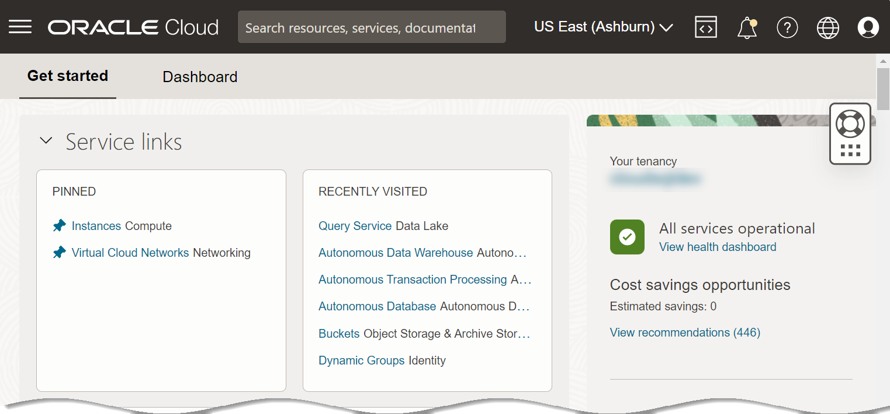
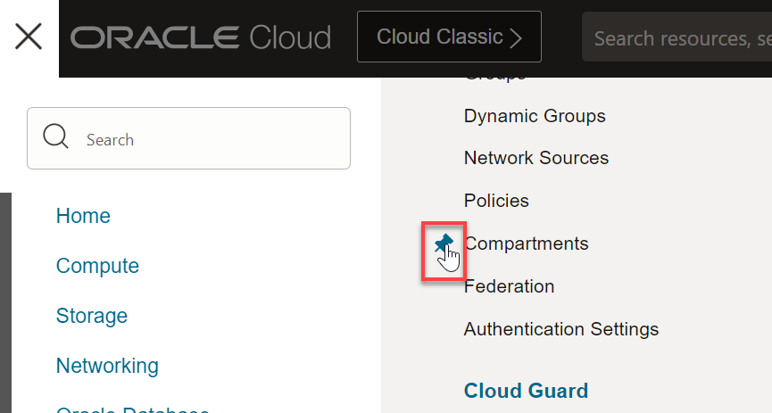
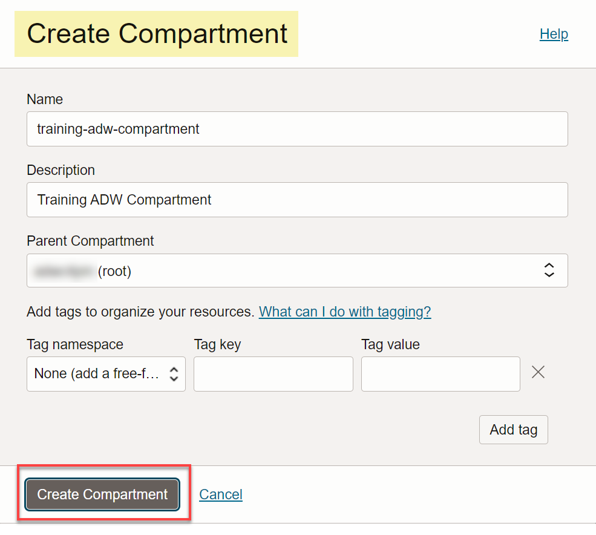
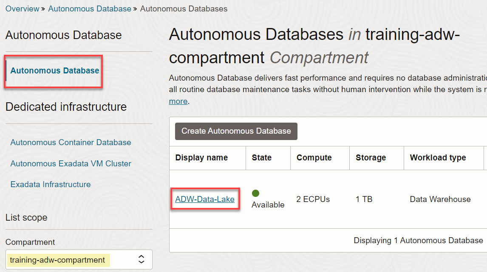

<!--- This is a comment. --->

<if type="livelabs">
# Review the Workshop Environment Setup (Optional)

## Introduction

_Since you are using the LiveLabs environment, you **don't** have administrative privileges to create any OCI resources; therefore, all of the OCI resources that you need in this workshop such as a compartment and an Autonomous AI Database instance are already created for you with your LiveLabs reservation._

If you want to review the detailed steps on how to set up the workshop environment when you are using either the **freetier** version or your own paid tenancy, see **Lab 1: Set Up the Workshop Environment** in the freetier version of the workshop on LiveLabs titled **Build a Data Lake with Autonomous Warehouse**. Your LiveLabs reservation includes an OCI Data Catalog instance.

To learn about getting started with OCI Data Catalog and integrating OCI Data Catalog with ADB, see the [Get started with Oracle Cloud Infrastructure Data Catalog](https://livelabs.oracle.com/pls/apex/dbpm/r/livelabs/view-workshop?wid=919) and [Access the Data Lake using Autonomous Database and Data Catalog](https://bit.ly/adb-dcat-datalake) LiveLabs workshops.

> **Note:** This lab is directed at administrator users because they are granted the required access permissions. In real life scenarios, you would create a new ADW administrator user and a ADW administrator group, and then add the new administrator user to the new group. Next, you create the Oracle Cloud Infrastructure Identity and Access Management (IAM) policies that are required to create and manage an Autonomous AI Database instance.

Estimated Time: 5 minutes

</if>

<if type="freetier">
# Set Up the Workshop Environment

## Introduction

This lab walks you through the steps to set up the workshop environment.

> **Note:** This workshop is directed at administrator users because they are granted the required access permissions. In real life scenarios, you would create a new Data Catalog administrator user and a Data Catalog administrator group, and then add the new administrator user to the new group. Next, you create the Oracle Cloud Infrastructure Identity and Access Management (IAM) policies that are required to create and manage a Data Catalog and Autonomous Database instances.

Estimated Time: 10 minutes

### Objectives

In this lab, you will:

* (Optional) Create a compartment for your Data Catalog resources.
* Create an Autonomous Warehouse instance.
* (Optional) Create an OCI Data Catalog Instance

### Prerequisites

* An Oracle Cloud Account - Please view this workshop's LiveLabs landing page to see which environments are supported.
* At least one user in your tenancy who wants to work with Data Catalog.

> **Note:** If you have a **Free Trial** account, when your Free Trial expires your account will be converted to an **Always Free** account. You will not be able to conduct Free Tier workshops unless the Always Free environment is available. [Click here for the Free Tier FAQ page.](https://www.oracle.com/cloud/free/faq.html)

## Task 1: Log in to the Oracle Cloud Console

1. Log in to the **Oracle Cloud Console** as the Cloud Administrator using the steps described in the **Get Started** lab in the Navigation menu on the left. You will complete all the labs in this workshop using this Cloud Administrator.
See [Signing In to the Console](https://docs.cloud.oracle.com/en-us/iaas/Content/GSG/Tasks/signingin.htm) in the _Oracle Cloud Infrastructure_ documentation.

   The **Oracle Cloud Console** Home page is displayed.

   

    >**Note:** To zoom in (magnify) a displayed image in this workshop, hover over the image to display the magnifying glass icon, and then then click the image.

   

## Task 2: (Optional) Create a Compartment

A Cloud Administrator can optionally create a compartment in your tenancy to help organize the Data Catalog resources. In this lab, as a Cloud Administrator, you will create a new compartment that will group all of your Data Catalog resources that you will use in the workshop.

1. Open the **Navigation** menu and click **Identity & Security**. Under **Identity**, click **Compartments**.

       

    For faster navigation, you can pin items that you use frequently. To pin an item, hover over the menu item and then click pin to the left of the item name.

    

    The pinned item is displayed in the **Pinned** section of the **Home** tab the next time you use the Navigation menu.

    

    The **Recently visited** section of the **Home** tab shows recently used navigation items.

    To quickly find navigation menu items, use the **Search** box.

2. On the **Compartments** page, click **Create Compartment**.

   

3. In the **Create Compartment** dialog box, enter **`training-adw-compartment`** in the **Name** field and **`Training ADW Compartment`** in the **Description** field.

4. In the **Parent Compartment** drop-down list, select your parent compartment, and then click **Create Compartment**.

   

   The **Compartments** page is re-displayed and the newly created compartment is displayed in the list of available compartments.

   

## Task 3: Create an Autonomous Data Warehouse Instance

1. Log in to the **Oracle Cloud Console** as the Cloud Administrator, if you are not already logged in. On the **Sign In** page, select your tenancy, enter your username and password, and then click **Sign In**. The **Oracle Cloud Console** Home page is displayed.

2. Open the **Navigation** menu and click **Oracle Database**. Under **Oracle Database**, click **Autonomous Data Warehouse**.

3. On the **Autonomous Databases** page, select your compartment from the **Compartment** drop-down list in the **List Scope** section. In this example, we selected our **`training-adw-compartment`**. Click **Create Autonomous Database**. The **Create Autonomous Database** page is displayed.

4. In the **Provide basic information for the Autonomous Database** section, specify the following:
       * **Compartment:** Select your own compartment.
       * **Display Name:** **`ADW-Data-Lake`**.
       * **Database Name:** **`TrainingADW`**.

       

5. In the **Choose a workload type** section, accept the **Data Warehouse** default selection.

       

6. In the **Choose a deployment type** section, accept the **Serverless** default selection.

       

<!--- This is a comment. --->

<!---7. In the **Configure the database** section, specify the following:

       * **Always Free:** An Always Free database is especially useful for development and trying new features. You can deploy an Always Free instance in an Always Free account or a paid account. The only option you can specify in an Always Free database is the database version.  For this lab, we recommend that you leave the **Always Free** option disabled unless you are in an Always Free account.
       * **Choose database version:** Accept the default selection.
       * **ECPU count:** **`2`**.
       * **Complete auto scaling:** Leave the checkbox checked (default).
       * **Storage (TB):** **`1`** (TB).
       * **Storage auto scaling:** Leave the checkbox unchecked (default).

       

       >**Note:** If you are using a Free Trial or Always Free account, and you want to use Always Free Resources, you need to be in a region where Always Free Resources are available. You can see your current default **region** in the top, right hand corner of the page. --->

7. In the **Configure the database** section, accept the default selections as follows:

       * **Always Free:** An Always Free database is especially useful for development and trying new features. You can deploy an Always Free instance in an Always Free account or a paid account. The only option you can specify in an Always Free database is the database version.  For this lab, we recommend that you leave the **Always Free** option disabled unless you are in an Always Free account.
       * **Choose database version:** Accept the default selection.
       * **ECPU count:** **`2`**.
       * **Compute auto scaling:** Leave the checkbox checked (default).
       * **Storage (TB):** **`1`** (TB).
       * **Storage auto scaling:** Leave the checkbox unchecked (default).

       

8. In the **Backup retention** section, you can either accept the default value or specify your own preferred backup retention days value. Accept the default **60** days default value.

       

9. In the **Create administrator credentials** section, specify the following:

       * **Username:** This read-only field displays the default administrator username, **`ADMIN`**.
       **Important:** Make a note of this _username_ as you will need it to perform later tasks.
       * **Password:** Enter a password for the **`ADMIN`** user of your choice such as **`Training4ADW`**.
       **Important:** Make a note of this _password_ as you will need it to perform later tasks.
       * **Confirm password:** Confirm your password.

       

10. In the **Choose network access** section, select the **Secure access from everywhere** option as the access type.

       

11. In the **Choose a license and Oracle Database edition** section, accept the default selection, **This Database is provisioned with License included license type**.

       

12. Click __Create Autonomous Database__.

       

13. The **Autonomous Database details** page is displayed. The status of your ADB instance is **PROVISIONING**.

    

    A **Check database lifecycle state** informational box is displayed. You can navigate through this tour or choose to skip it. Click **Skip tour**. A **Skip guided tour** dialog box is displayed. Click **Skip**.

    In a few minutes, the instance status changes to **AVAILABLE**. At this point, your Autonomous Data Warehouse database instance is ready to use! Review your instance's details including its name, database version, ECPU count, and storage size.

    

14. Click the **Autonomous Database** link in the breadcrumbs. The **Autonomous Database** page is displayed. The new Autonomous Database instance is displayed.

    

</if>

You may now proceed to the next lab.

## Learn More

* [Oracle Cloud Infrastructure Documentation](https://docs.cloud.oracle.com/en-us/iaas/Content/GSG/Concepts/baremetalintro.htm)
* [Using Oracle Autonomous Database Serverless](https://docs.oracle.com/en/cloud/paas/autonomous-database/adbsa/index.html)

## Acknowledgements

* **Author:** Lauran K. Serhal, Consulting User Assistance Developer
* **Last Updated By/Date:** Lauran K. Serhal, June 2025

Data about movies in this workshop were sourced from Wikipedia.

Copyright (C) 2025 Oracle Corporation.

Permission is granted to copy, distribute and/or modify this document under the terms of the GNU Free Documentation License, Version 1.3 or any later version published by the Free Software Foundation; with no Invariant Sections, no Front-Cover Texts, and no Back-Cover Texts. A copy of the license is included in the section entitled [GNU Free Documentation License](https://oracle-livelabs.github.io/adb/shared/adb-15-minutes/introduction/files/gnu-free-documentation-license.txt)
