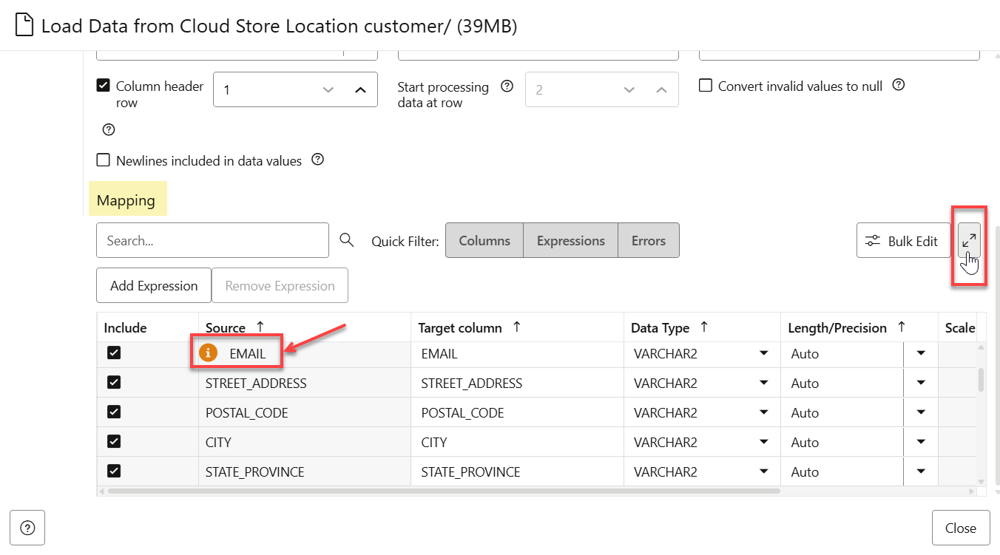
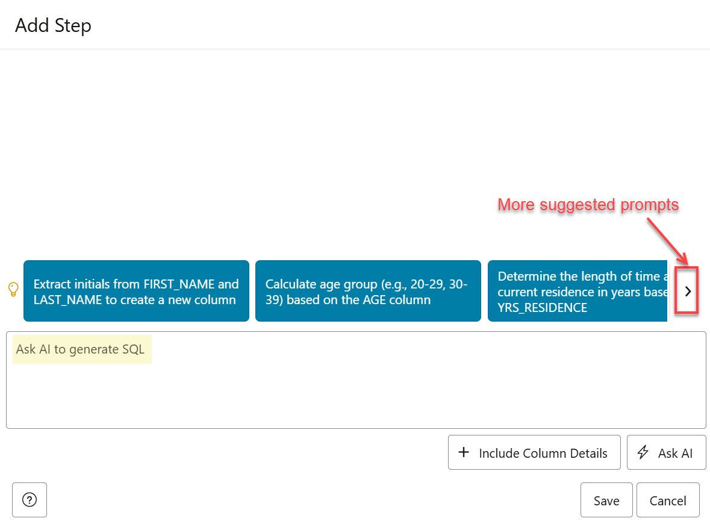
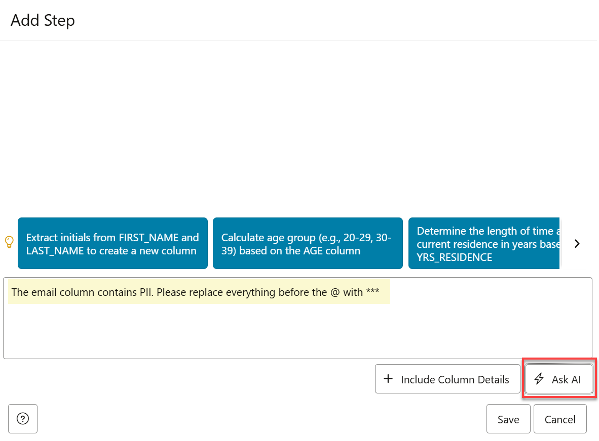
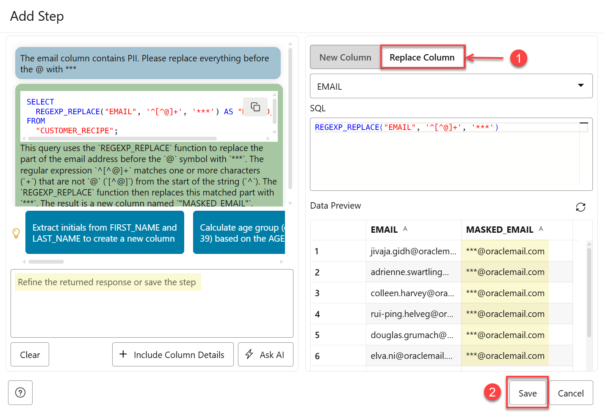
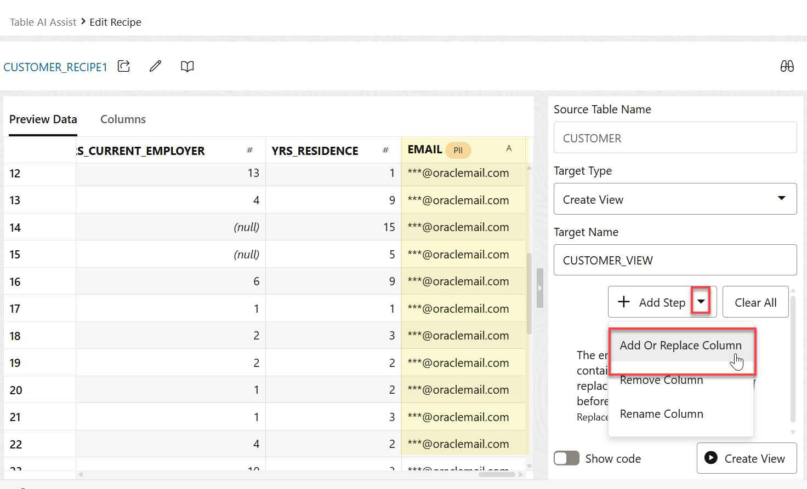
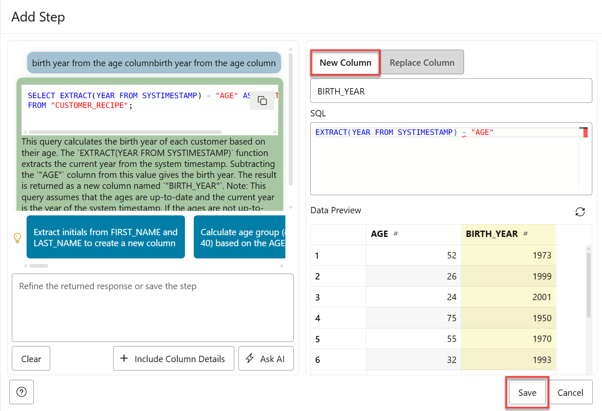
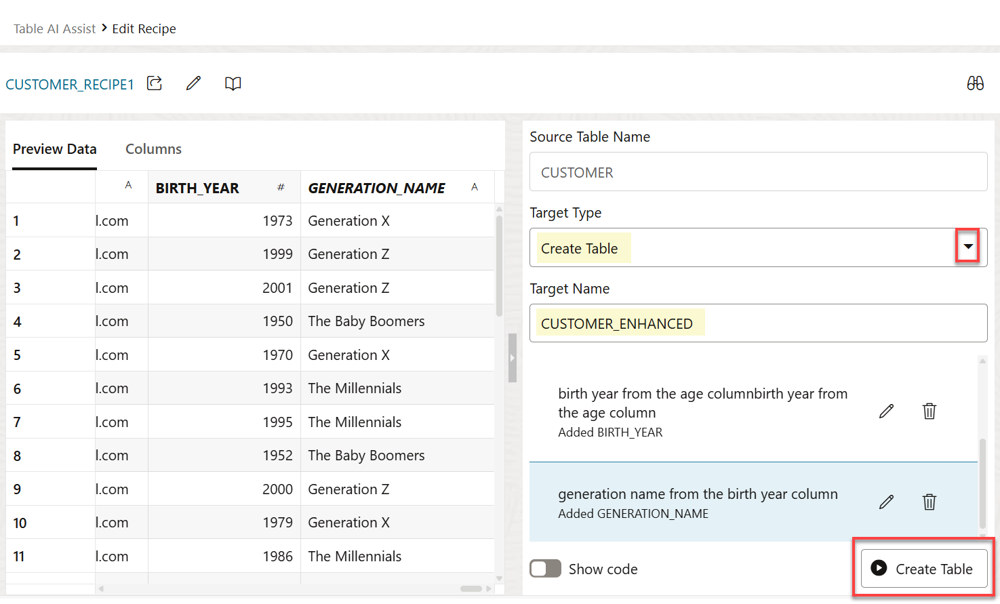
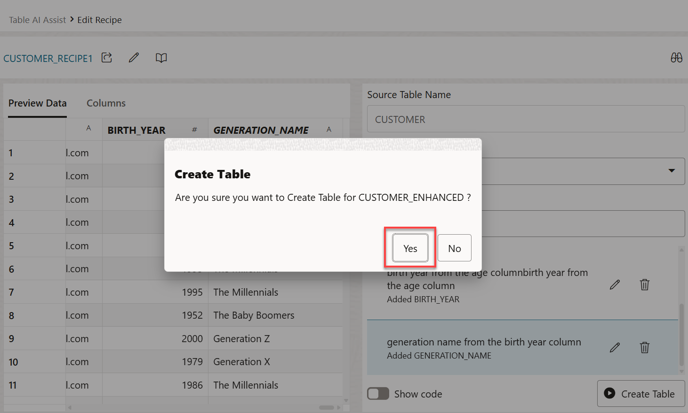
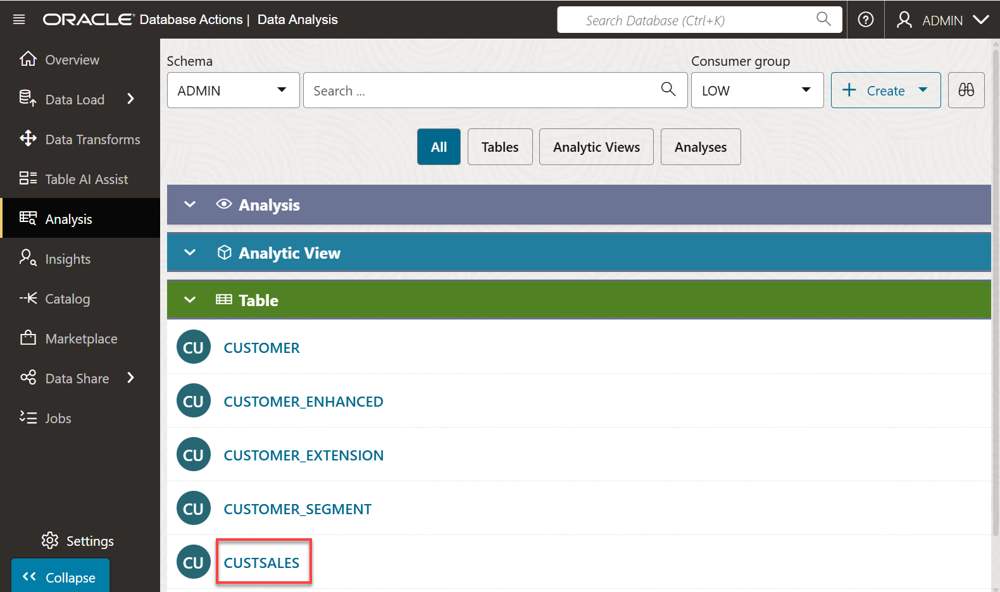
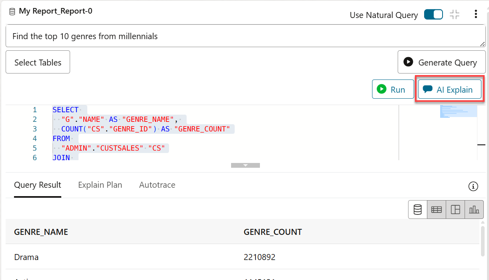

# Analyze Data with Table AI Assist

>_**Important: Due to some restrictions in the LiveLabs reservation environment, you can't run the OCI Cloud Shell script that we use in this lab to create an OCI credential and an AI profile. In addition, a reservation can't guarantee a region where OCI GenAI is deployed; therefore, this lab is not a hands-on task; instead, it is a demo. You can still run this lab successfully in your own tenancy.**_

## Introduction

In this lab, you will use the **Table AI Assist** tool to prepare and enhance data for analytics. You can use this tool to add, remove, and rename columns in a table using AI assistance. This enables you to augment or correct data found in tables in your local schema using natural language AI prompts. You can add columns for day, month, quarter and year using data in a date column or add a distance column from two columns with geographical co-ordinates.

For example you can derive separate columns from a single date column for time-based reporting, or calculate the distance between two geographical co-ordinates and add that as a new column. The Table AI Assist tool works by using your configured AI profile to generate SQL to prepare your data. The output of the tool can then be a new view on top of your source table, or a new table.

You can prepare data using the Table AI Assist Tool by performing the following:

* Add, replace, remove, and rename a column
* View Statistical Details about the Table you Load after you Create a Recipe
* View Table Entity Details

You will use the Table AI Assist tool to create recipes. A recipe is a set of steps. Each step lets you add, replace, remove, or rename columns without making any changes to your source table. You add as many steps as you want to a recipe. You can save a recipe to your schema or export it as JSON to a file. You can return back to your saved recipe and keep working on it.

Estimated Time: 10 minutes

### Objectives

In this lab, you will:

* Navigate to the **Table AI Assist** page.
* Create an OCI credential.
* Create an AI profile.
* Create tables and load data from public object storage buckets using Data Tools built-in to Oracle Autonomous AI Database.
* Analyze data using the Analysis tool.

### Prerequisites

This lab requires completion of [Lab 1: Set Up the Workshop Environment](https://oracle-livelabs.github.io/adb/shared/adw-data-lake/build-data-lake/workshops/freetier/index.html?lab=setup-workshop-environment) from the **Contents** menu on the left.

## Task 1: Configure Your AI Profile

In this task, you will use the Data Studio **Settings** on the Data Studio tool to create your OCI credential and AI profile to provide access to Cloud Services. For more information about creating AI Profiles, see the [Manage AI Profiles](https://docs.oracle.com/en/cloud/paas/autonomous-database/serverless/adbsb/select-ai-manage-profiles.html#GUID-842C70F5-A3BE-42A1-B189-64341A9BAAED) documentation.

**Note:** You can access the **Table Assist AI** feature from the **Database Actions** page. Click the **Data Studio** tab, and then click **Table AI Assist**.


**Create the OCI Credential**

1. On your **Data Load** page from the previous lab, click **Settings** in the navigation pane on the left. Initially, a **No Credential and AI Profile Found** message is displayed if you have not closed that section in an earlier lab. You will define an OCI credential and a new AI profile in this task.

    

    The **Data Studio Settings** wizard is displayed.

2. On the **General** tab of the wizard, specify an email address.

    

3. Click the **Cloud Services** tab. In the **Cloud Object Store Access** section, you can click **OCI Credential** drop-down list and select a credential. In our example, we don't have any defined credentials yet. You will create a new credential. Click the **+** icon.

    

4. In the **Create Credential** panel, specify the following:

    * **Credential Name:** Enter `table_ai_assist_cred`.
    * **Cloud Service:** Accept the default value, `Oracle`.
    * **OCI Create Credential Method:** Accept the default selection, `Create using OCI Cloud Shell`.

5. The **Run the script as shown in the OCI Cloud Shell via the launch button below** field contains the script that you will run in OCI Cloud Shell to create your OCI credential. This script already has all of your information such as your chosen credential name, region, compartment's OCID, and your database name. Click **Copy Script to Clipboard and Launch Cloud Shell** to launch the OCI Cloud Shell where you will paste and run the script.

    

6. The **Cloud Shell** window is displayed. It could take a minute or so for it to set up your Cloud Shell home machine and directory and connect to the directory. When the set up is complete, the **Cloud Shell** home directory is displayed.

    

7. Right-click the mouse and paste the script that you copied from the earlier step on the command line prompt, and then press [Enter].

    

8. Read the displayed informational messages. Next, you are prompted whether or not you want you want to reuse your existing API key and fingerprint, if any. In this example, we entered **no**. Read the warning. When you are prompted to confirm your selection, enter **yes**.

    

9. Your public API key, fingerprint, native credential SQL, and JSON files are created. 

    

10. Next, you are prompted if you want to generate the AI profile script. Enter **yes**. In our example, we chose option **6**, **`Meta Llama 3.1-405b-instruct`**.

    

11. A verification required prompt is displayed. Enter **yes**.

    

12. Since we chose option 6, `Meta Llama 3.1`, an acceptable use policy prompt is displayed. Enter **yes** for the Submit to accept the terms of the License Agreement. Your Generative AI SQL file is created. 

    >**Note:** If you chose another option, follow the prompts.

    

13. A proceed to generate the Spreadsheet add-ins IAM connection is displayed. Enter **no**.

14. Next, you are prompted if you want to run the created credential scripts on your Oracle Autonomous AI Database. Enter **yes**. We chose not to reuse our existing wallet file. Confirm your choice to replace the Wallet file, enter **yes**. 

15. When prompted, enter (and confirm, if prompted) your **`admin`** user password. The following are created for you:
    - **`table_ai_assist_cred`** OCI credential
    - **`AI_PROFILE_META`** Generative AI profile

 The script exits. The command prompt is displayed.

    

15. Click the **X** control to close the Cloud Shell window, and then click **Exit** when prompted.

    

16. The **Create Credential** page is re-displayed. Click **Close**.

    

    The **Data Studio Settings** wizard is re-displayed. Notice that the newly created OCI credential is not displayed or selected yet. Click **Close** to exit the wizard.

    

17. On the Data Load page, click **Settings**.

    

18. In the Wizard, click the **Cloud Services** tab. The newly created OCI credential is displayed (if not, select it from the drop-down list). Click **Check Object Store Access** to check if you have access to the object store.

    

19. The **Policy Check** dialog box is displayed which displays whether or not you have access to the OCI, AWS, and Azure buckets. In this example, you have access to only OCI buckets since you only created an OCI credential. Click **Close**.

    

20. Click **Check Cloud Service Access** to check on the cloud services policy.

    

    The **Policy Check** dialog box is displayed. The Data Studio tool checks if the Data you load follows and can access the policies listed and that there are no errors. For more information about the Cloud Services Access, see the [Data Studio Settings](https://docs.oracle.com/en/database/oracle/sql-developer-web/sdwad/data-preferences.html#GUID-7FCF3C9A-1889-4476-85C0-A55550CF5692) documentation. Click **Close**.

    

21. Click the **AI Profile** wizard tab. The **AI Profile** page is displayed. The **`AI_PROFILE_META`** Generative AI profile that was created by the Cloud Shell script is displayed. Click **Close**.

    

22. The **Table AI Assist** page is re-displayed. Notice the earlier message about `No AI Profile Found` is no longer displayed since you just created one.

    

**(Optional) Create an AI Profile Using the AI Profile Wizard Tab** 

> **Note:** This section is informational only and is not required as we already have a new **`AI_PROFILE_META`** Generative AI profile that we will use in this workshop.

Now that you have created an OCI credential, you can create more AI profiles.

1. Click the **AI Profile** wizard tab. The **AI Profile** page is displayed.

    

2. Specify the following:

    * **Profile Option:** Select the **Create Profile** option.
    * **Profile name:** Enter `Table_AI_Profile`.
    * **AI Provider:** Select `OCI` from the drop-down list.

    

    * **AI Model:** Select `meta.llama-3.1-405b-instruct` from the drop-down list.

    

    * **Credential:** Select the `table_ai_assist_cred` credential that you created from the drop-down list.

    

3. Click **Create AI Profile**. A `Successfully created a new AI Profile` message is displayed.

    

4. Click **Check AI Access** to confirm that you have access to the selected AI Provider. Click **Close**.

    

    The **Table AI Assist** page is re-displayed. Notice the earlier message about `No AI Profile Found` is no longer displayed since you just created one.

    

## Task 2: Load Data from a Public Object Storage Bucket and Create Tables

In this task, you will load data into your ADB instance from the **MovieStream** data lake on [Oracle Cloud Infrastructure Object Storage](https://www.oracle.com/cloud/storage/object-storage.html) in preparation for data analysis.

You can load data into your Oracle Autonomous AI Database (either Oracle Autonomous AI Lakehouse or Oracle Autonomous AI Transaction Processing) using the ADB built-in tools. In this task, you will load data from a public object storage bucket and create the following tables in your Oracle Autonomous AI Database instance: **`customer`**, **`custsales`**, and **`genre`**. You will use the new tables in the next two tasks.

1. On the **Data Load Dashboard**, click the **Load Data** tile.

    

2. On the **Load Data** page, click the **Cloud Store** tab to select objects from URLs or cloud store links.

    

3. Copy the following object storage URL and paste it in the **Select Cloud Store Location or enter public URL** field. The **`moviestream_landing`** Oracle Object Storage bucket that contains the data is located in a different tenancy than yours, **c4u04**; therefore, you will use the following URL.

    ```
    <copy>
    https://objectstorage.us-ashburn-1.oraclecloud.com/n/c4u04/b/moviestream_landing/o
    </copy>
    ```

4. A list of the folders in the selected Object Storage bucket is displayed on left side section of the page. You can drag and drop the desired folders from this public bucket from this section to the data linking job section on the right.

    

5. Drag the **`customer`** folder and drop it onto the data loading job canvas.

    

6. A **Load to Single Target Table** dialog box is displayed to prompt you whether or not you want to load all objects in this folder matching **.csv** to a single target table. This folder contains a single file, `customer.csv`. In general, data lake folders contain many files of the same type, as you will see with sales data. Click **Yes**.

    

    The **`customer`** target table to be created for the selected `.csv` file is displayed in the data loading job section.

    

7. The **Analyze File Warnings** found one Personally Identifiable Information (PII). Click the **customer** file name link.

    

8. The **Load Data from Cloud Store Location customer** dialog box is displayed. The **EMAIL** field contains the PII information. In the **Mapping section**, click the **Expand or Collapse Mapping Panel** icon.

    

9. Let's preview the data. Click the **Preview** tab, and then click **Load Preview**. The **EMAIL** column contains PII. We will correct that in the **Create a Recipe** task. Click **Close**.

    

10. Click **Start** to create the **customer** table and load it with data from the **customer.csv** file.

    

11. A **Start Load from Cloud Store** message is displayed. Click **Run**. The **customer** table is created.

    

12. Create the **`custsales`** table. Click the **Load Data** tile. Drag the **`custsales`** folder and and drop it onto the data loading job section. When the **Load to Single Target Table** dialog box is displayed, click **Yes**.

13. Create the **`genre`** table that we will use in the next task. Drag the **`genre`** folder and drop it onto the data loading job section. Click **Yes** when prompted.

    

14. Click **Start** to create the **`genre`** and **`custsales`** tables. When prompted to run, click **Run**.

    The two tables are created.

    

## Task 3: Create a Recipe

**What is a Recipe?**

In this task, you will work with the data preparation tool to create recipes. A recipe is a set of steps. You can use a step to add, replace, remove, and rename columns without making any changes to your base (source) table. You can add as many steps as you want to a recipe. You can then save a recipe to your schema or export it as JSON to a file. You can then return back to your saved recipe and keep working on it as needed.

The following are the different modes of a recipe:

* Create or Replace View
* Create a new table
* Alter table

Once you are satisfied with a recipe you can use it to create or replace a view, create a new table, or alter the table.

1. In the Navigation menu on the left, click **Table AI Assist**.

    

    The **Table AI Assist SQL Recipes** page is displayed. The tables that you have created so far are displayed.

    

2. For the **customer** table, click **+ New Recipe**. The **Edit Recipe** page is displayed. Note the **EMAIL** column that contains PII that we will correct now. Click the **Add Step** drop-down menu, and then select **Add or Replace Column**.

    
    
    The **Add Step** panel is displayed.

    

3. You can choose any one of the prompts suggested by the tool. In the **Ask AI to generate SQL** text field, provide some natural language prompt of what you want to do such as **`The email column contains PII. Please replace everything before the @ with ***`**. Next, click **Ask AI**.

    

    A new generated **MASKED_MAIL** column is displayed in the **Data Preview** section. The new column shows the masked PII in the email addresses. Note the generated SQL that performs this operation which you can also edit and run if you are familiar with SQL. Since you are masking the PII from the `email` column, click **Replace Column**. Click **Save**.

    

4. The **Edit Recipe** page is re-displayed. Scroll to the right of the table to display the newly added masked email column.

    

5. Let's perform some demographics operations such as getting the birth year from the **age** column. Click the **Add Step** drop-down menu, and then select **Add or Replace Column**. In the **Ask AI to generate SQL** text field, provide some natural language prompt of what you want to do such as **`birth year from the age column`**. Next, click **Ask AI**.

    

    The new **`BIRTH_YEAR`** column is displayed in the **Data Preview** section. The SQL expression that was used to create this column is displayed in the **SQL** field. Make sure that the **New Column** button is selected.

6. Click **Save**. The **Edit Recipe** page is re-displayed. Scroll to the right of the table to display the newly added **`BIRTH_YEAR`** column.

    

7. Let's perform one more data preparation. Click the **Add Step** drop-down menu, and then select **Add or Replace Column**. In the **Ask AI to generate SQL** text field, provide some natural language prompt of what you want to do such as **`generation name from the birth year column`**. Next, click **Ask AI**. The new **generation_name** column is displayed in the **Data Preview** section. Make sure that the **New Column** button is selected.

    

8. Click **Save**. The **Edit Recipe** page is re-displayed. Scroll to the right of the table to display the newly added **`GENERATION_NAME`** column.

    

9. Finally, let's save the modified **`customer`** table as a new table named **`customer_enhanced`**. Click the **Target Type** drop-down list and select **Create Table**. Change the table name in the **Target Name** field to **`customer_enhanced`**, and then click **Create Table**.

    

10. A **Create Table** dialog box is displayed. Click **Yes**.

    

    A **Confirmation** message box is displayed. The table is created.

    

## Task 4: Analyze Data

In this task, you will analyze data using the Analysis tool which enables you to create Analytic Views with multidimensional metadata. You create Analytic Views on top of a fact table with several dimensions and hierarchies. Analytic views refer to tables in the database and allow users to create hierarchies for dimensions. You can also create Analyses and reports using information from the Analytic Views.

You can access the Data Analysis page from the Database Actions Launchpad. Click the **Data Studio** tab and then the **Data Analysis** tab.


1. You can also access the Data Analysis page from the Navigation menu. Click **Analysis**. We will work with the **`custsales`** data. Click **All** to display all the tables if not already selected.

    

2. Click **`custsales`**.

    

    A **Select Schema** informational box is displayed. Close it.

3. The **custsales** query returns **`The given query has returned large data. Unable to process.`** error in the **Query Result** section. There is a limit on displaying only one million rows in this window.

    

    The **custsales** table contains around 2.5 million rows.

    

4. Add the `Fetch` clause to the `SELECT` statement, and then click **Run**. This will only show the first 10 rows in the table.

    ```sql
    <copy>
    FETCH FIRST 10 ROWS ONLY;
    </copy>
    ```

    

5. Enable the **Use Natural Query** slider.

    

6. Click **Select Tables** and select the **`customer_enhanced`**, **`custsales`**, and **`genre`** tables. Click anywhere in the SQL Editor to dismiss the list of tables.

    

7. Let's ask a natural question. Enter **`Find the top 10 genres from millennials`** as a prompt in the **Enter Natural Query** text field, and then click **Generate Query**.

    

    The **`customer_enhanced`**, **`custsales`**, and **`genre`** tables were joined to generate the result. You can review the generated SQL query. You can also edit and run the query.

    

8. If you are not very familiar with SQL, you can click **AI Explain** to review the steps used to obtain the result in an easy-to-understand format.

    

    The query explanation is displayed. Review the steps, and then click **Close**.

    

9. Click the **Save** drop-down list, and then select **Save Analysis As**.

    

10. In the **Create New Analysis** dialog box, enter a meaningful name and then click **Save Analysis**.

    

    The named analysis is displayed.

    

11. You can access your saved analyses from the **Analysis** page. Click **Customer Analysis**

    

    The saved analysis is displayed.

    

12. Click the **Expand Report** icon. The saved analysis original format is displayed.

    

## Learn more

* [Table AI Assist Tool](https://docs.oracle.com/en/database/oracle/sql-developer-web/sdwad/table-ai-assist-tool.html)
* [Oracle Cloud Infrastructure Documentation](https://docs.cloud.oracle.com/en-us/iaas/Content/GSG/Concepts/baremetalintro.htm)
* [Using Oracle Autonomous AI Database Serverless](https://docs.oracle.com/en/cloud/paas/autonomous-database/adbsa/index.html)
* [Manage Credentials](https://docs.oracle.com/en/cloud/paas/autonomous-database/serverless/adbsb/autonomous-manage-credentials.html#GUID-863FAF80-AED,B-4128-89E7-3B93FED550ED)
* [Manage AI Profiles](https://docs.oracle.com/en/cloud/paas/autonomous-database/serverless/adbsb/select-ai-manage-profiles.html#GUID-842C70F5-A3BE-42A1-B189-64341A9BAAED)
* [Manage Policies](https://docs.oracle.com/en-us/iaas/language/using/policies.htm)

## Acknowledgements

* **Author:** Lauran K. Serhal, Consulting User Assistance Developer
* **Contributors:**
    * Ekrem Soylemez, Vice President
    * Manisha Mati, Principal User Assistance Developer
    * Yossi Cohen, Principal Software Engineer
* **Last Updated By/Date:** Lauran K. Serhal, November 2025

Data about movies in this workshop were sourced from Wikipedia.

Copyright (C) 2025 Oracle Corporation.

Permission is granted to copy, distribute and/or modify this document
under the terms of the GNU Free Documentation License, Version 1.3
or any later version published by the Free Software Foundation;
with no Invariant Sections, no Front-Cover Texts, and no Back-Cover Texts.
A copy of the license is included in the section entitled [GNU Free Documentation License](https://oracle-livelabs.github.io/adb/shared/adb-15-minutes/introduction/files/gnu-free-documentation-license.txt)
