# Create External Tables Using the Delta Sharing Protocol

## Introduction

Delta Sharing is an open protocol for secure real-time data sharing across multiple platforms. It allows sharing both static and dynamic data and is designed to be easy for both providers and consumers to use with their existing data and workflows. The Delta Sharing protocol is based on Parquet, which most tools already support. The protocol design goals are:

* Share live data directly without copying it.
* Support a wide range of clients. Recipients can directly consume data from their tools of choice without installing a new platform.
* Provide strong security, auditing, and governance. It enables you to grant, track, and audit access to shared data from a single point of enforcement.
* Scale to terabyte-scale datasets.

Oracle Autonomous AI Database supports the Delta Sharing protocol.

Estimated Time: 10 minutes

<!-- Probably outdated video
Watch the video below for a quick walk-through of the lab.
[](youtube:YH7pPGEaxNI)
-->

### Objectives

In this lab, you will:

* Access the Delta Sharing public examples on GitHub
* Download the profile file that you will use to access the data share
* Navigate to Data Share in Oracle Autonomous AI Database
* Consume the data share and create an external table based on one of the share's files

### Prerequisites

This lab requires the completion of **Lab 1**: Set up the Workshop Environment > **Task 2**: Provision the Autonomous AI Database Instance from the **Contents** menu on the left.

## Task 1: Access the Delta Sharing Public Examples on GitHub

1. Log in to your GitHub account. If you don't have one, create a free GitHub using https://github.com/.

2. Navigate to the Public Delta Sharing Examples using the following URL:

    ```
    <copy>
    https://github.com/delta-io/delta-sharing/tree/main/examples
    </copy>
    ```

    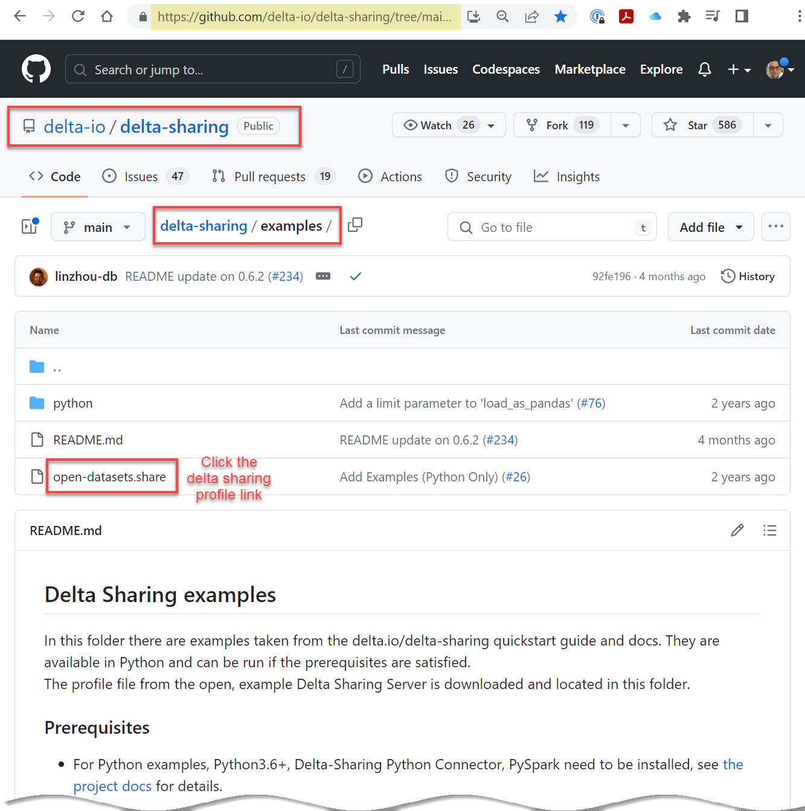

3. Click the **open-datasets-share** Delta Sharing profile link that is included with this example. The profile details are displayed. For a client to consume this Delta Share, it needs a profile. This profile contains the **`endpoint`** and **`bearerToken`** (the password) that you will need in order to access the delta sharing dataset.

    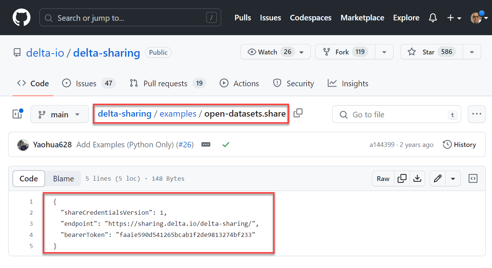

4. Click the **Download** icon to download the Delta Sharing profile for this example to your local **Downloads** folder.

    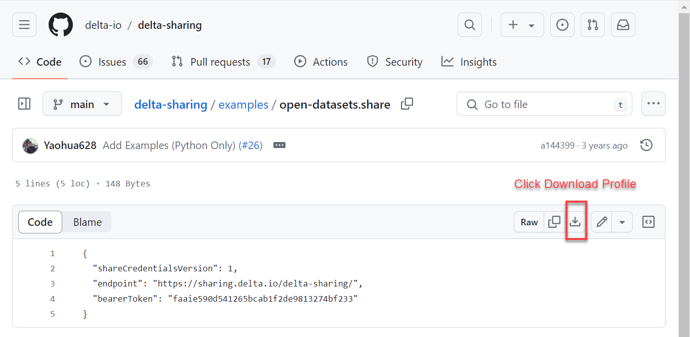

    The **`open-dataset.share`** file is downloaded.

    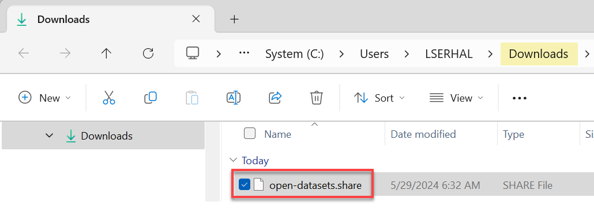

## Task 2: Navigate to Data Share

1. Navigate to the **Launchpad** page to access Data Sharing. Click the **Data Studio** tab, and then click the **Data Share** tab.

    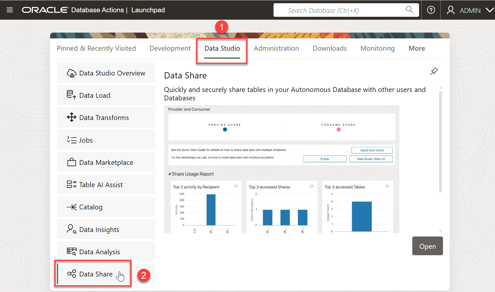

2. On the **Data Share** page, click **Enable Sharing**.

    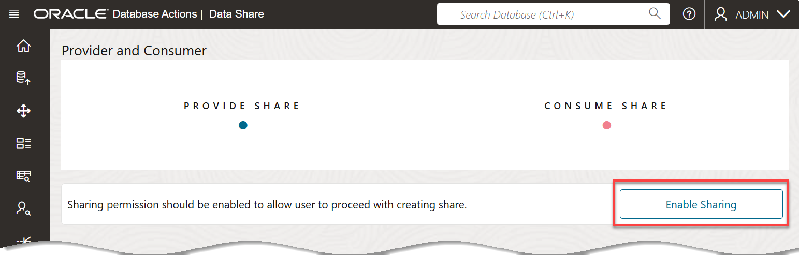

3. In the **Enable Sharing** dialog box, click the **`ADMIN`** schema in the **Available Schemas** section, and then click the **>** (Select) button to add the selected schema to the **Selected Schemas** section. Click **Save**.

    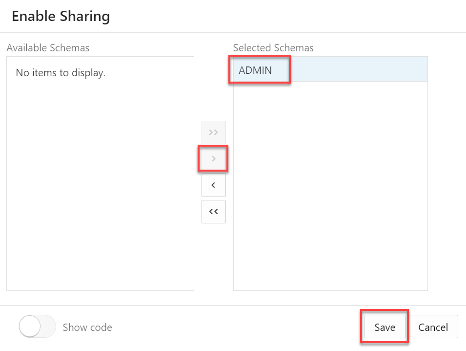

4. If you get a message about the privileges being changed. Log out of the admin user and then log back in. The **Data Share** Home page is displayed.

    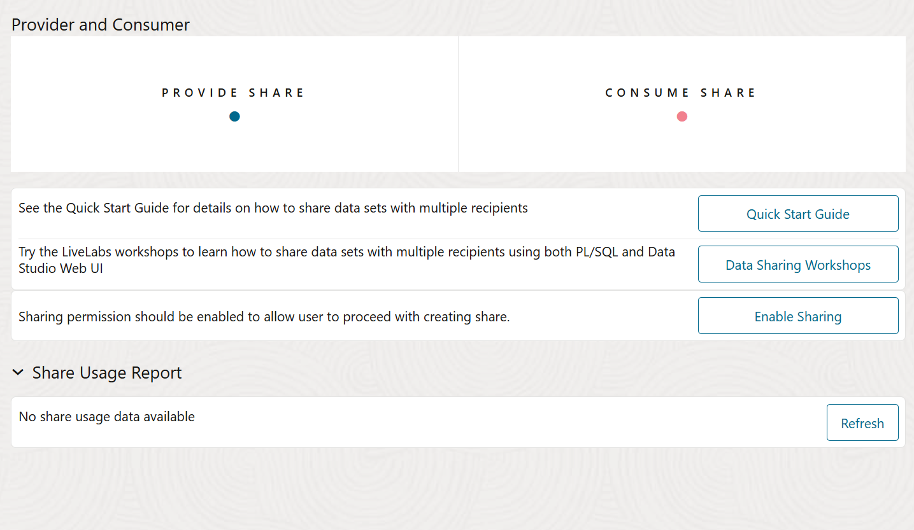

## Task 3: Consume the Data Share

1. Click the **CONSUME SHARE** tile.

    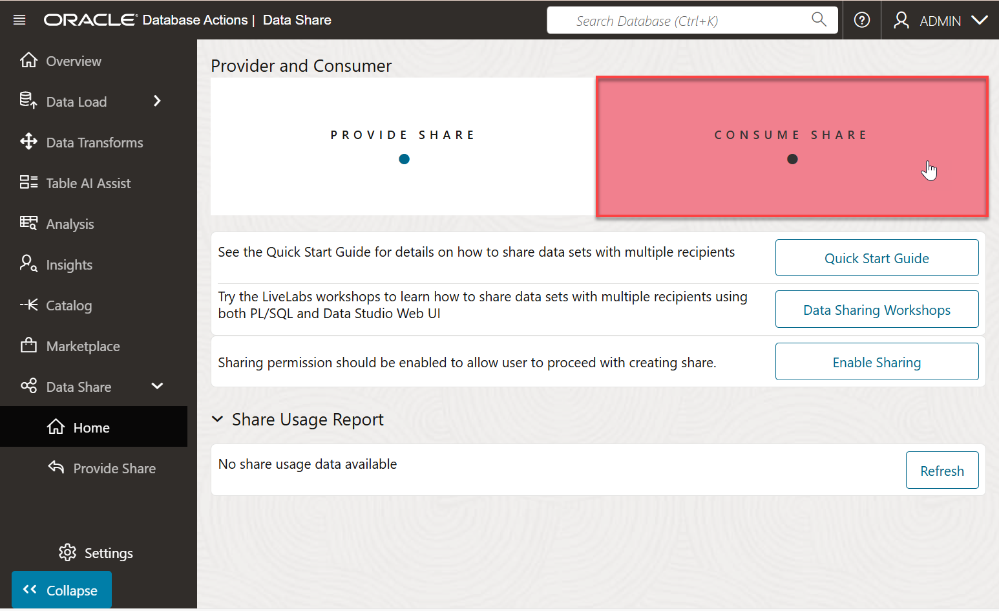

2. On the **Consume Share** page, click the **Subscribe to Share Provider** drop-down list, and then select **Subscribe to Delta Share Provider**.

    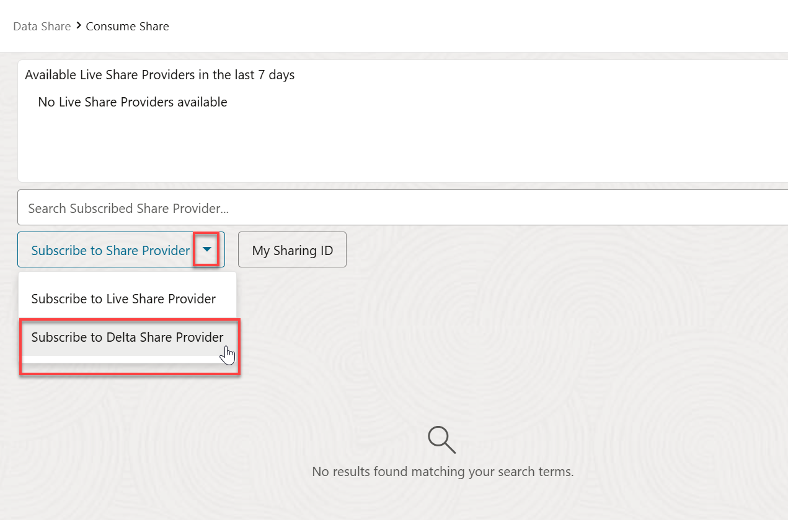

    The **Subscribe to Share Provider** wizard is displayed.

3. On the **Share provider settings** page 1 of the wizard, specify the following:

    * **Share Source:** Accept the default selection, **`Create Share Provider`**.
    * **Share Provider JSON:** Accept the default selection, **`From File`**.
    * **Delta Share Profile JSON:** Click this box. In the **Open** dialog box, navigate to the location where you downloaded the `open-datasets.share` profile, select it, and then click **Open**.
    * **Provider Name:** Enter **`trainingshare`**.

      

4. Click **Next**. The **Add Shares** page 2 of the wizard is displayed. In the **Select shares** section, click **DELTA_SHARING**, and then click the **>** (Select) button.

    

    The **DELTA_SHARING** share is added to the **Selected Shares** section.

    

5. Click **Next**.

6. On the **Catalog details** page, click **Subscribe**.

    

    Two informational messages are displayed.

    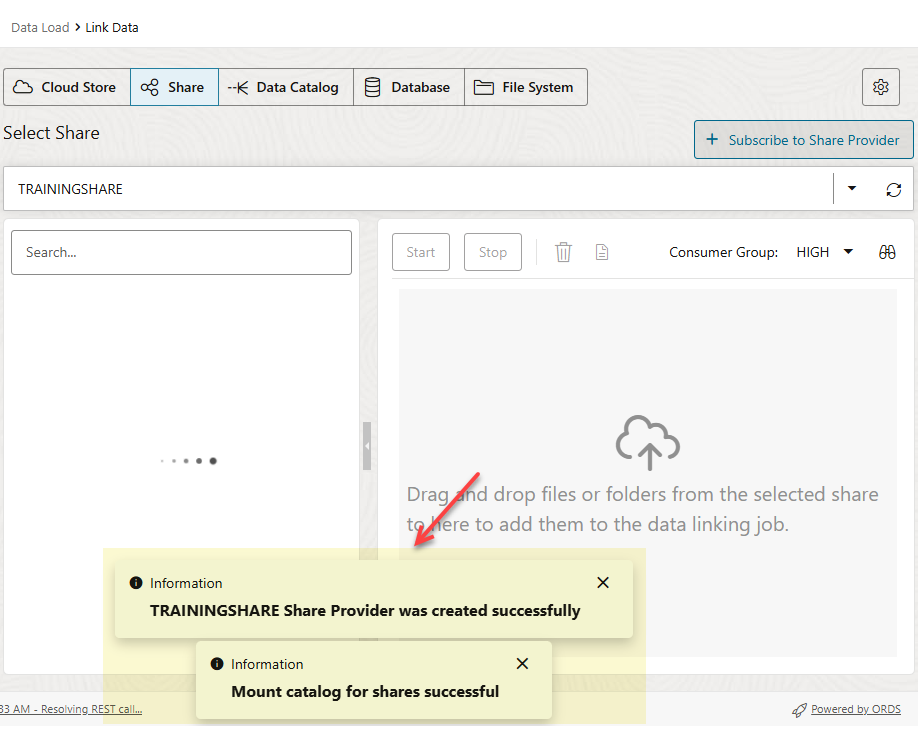

7. On the **Link Data** page, the **Share** tab is selected by default. Click the **Select Share Provider** drop-down list, and then select  **`TRAININGSHARE`**. If it's already selected and you don't see **DELTA_SHARING** displayed, click **Refresh** button.

    

8. The **DELTA_SHARING** data share to which you subscribed is now displayed. You can drill down on this data share to display the available data. Let's create an external table based on the **`DEFAULT.BOSTON-HOUSING`** file.

    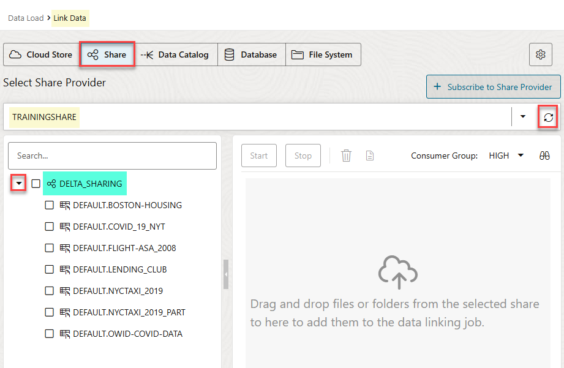

9. Drag and drop **`DEFAULT.BOSTON-HOUSING`** onto the data linking job section.

    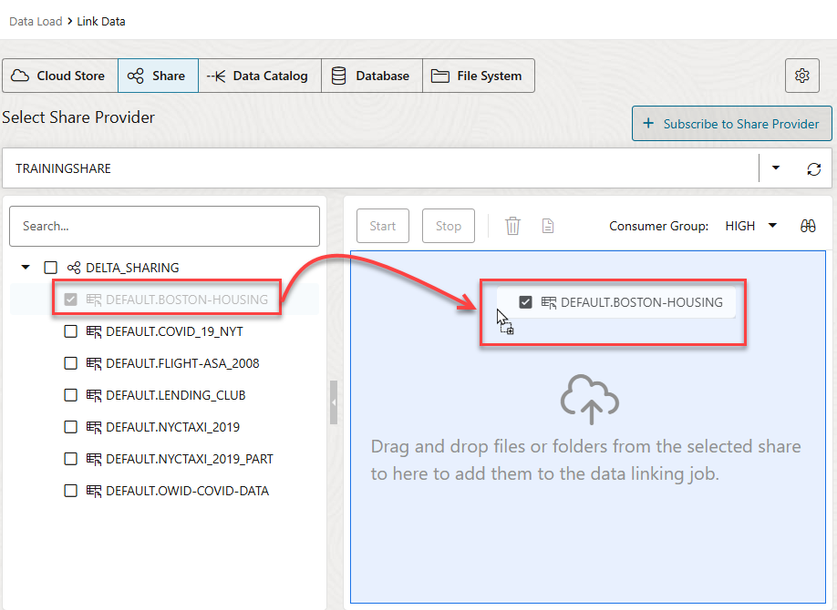

    The external table to be created is displayed in the data linking job section.

    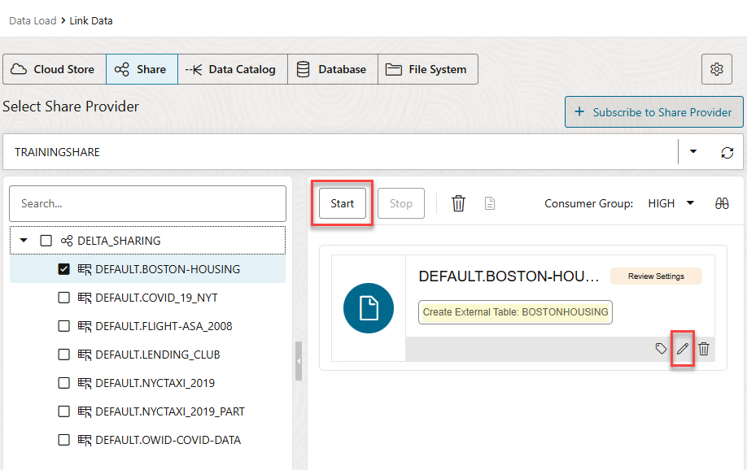

    You can click the **Settings** icon to display the **Link Data from Cloud Store Location** panel. You can use the various tabs to change the name of the external table name to be created, view the table's properties, view the table's data, view the SQL code used to create the table and more. Click **Close** when you're done.

    

10. Click **Start**. 

    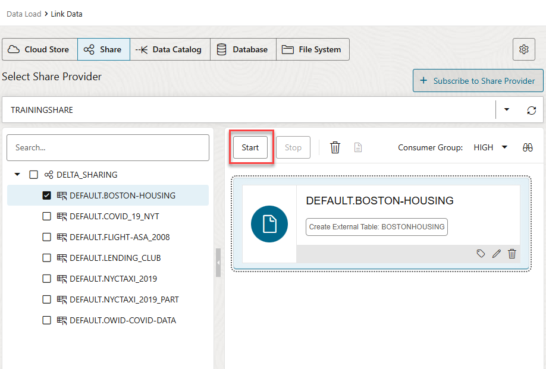

    A **Start Link From Cloud Store** message box is displayed. Click **Run**.

    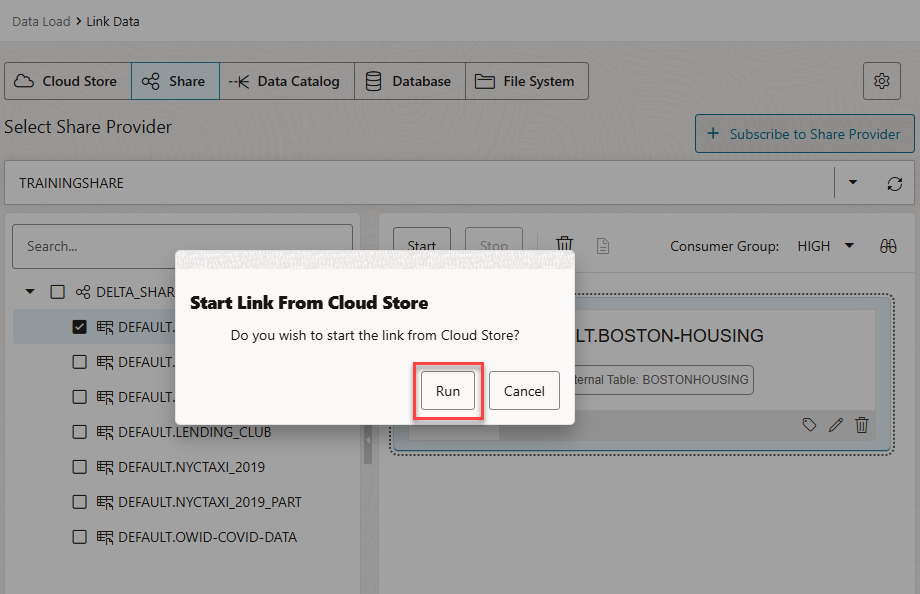

11. After the link job is completed, make sure that the data link card has the link icon next to it. You can click the **Report** button for this link job to view a report of the total rows processed successfully and failed for the selected table.

    

12. Click the **`BOSTONHOUSING`** external table link to preview its data. Remember, the source data for this external table is the **`BOSTON-HOUSING`** data share. The **`BOSTONHOUSING`** panel is displayed with the **Preview** tab selected by default that displays the external table's data.

    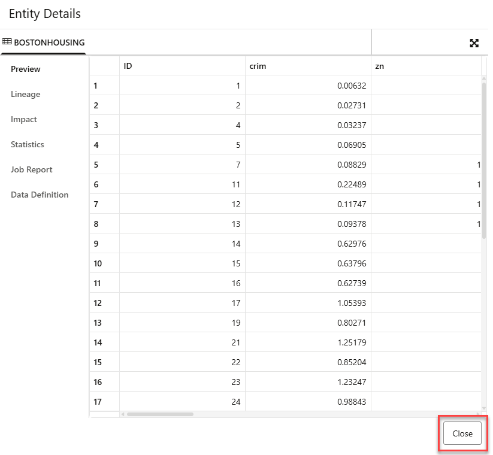

12. Click **Close** to exit the panel and to return to the Data Load Dashboard.

## Learn more

* [DBMS_CLOUD Package](https://docs.oracle.com/en/cloud/paas/autonomous-database/adbsa/dbms-cloud-package.html#GUID-CE359BEA-51EA-4DE2-88DB-F21A9FC10721)
* [File Naming for Text Output (CSV, JSON, Parquet, or XML)](https://docs.oracle.com/en/cloud/paas/autonomous-database/adbsa/export-data-file-namingl.html#GUID-1A52F59C-2797-48A5-A058-950318DBE9AF)

You may now proceed to the next lab.

## Acknowledgements

* **Author:** Lauran K. Serhal, Consulting User Assistance Developer, Oracle Autonomous AI Database and Multicloud
* **Contributors:** 
    * Alexey Filanovskiy, Senior Principal Product Manager
    * Mike Matthews, Product Management, Oracle Autonomous AI Lakehouse
* **Last Updated By/Date:** Lauran K. Serhal, March 2026

Data about movies in this workshop were sourced from Wikipedia.

Copyright (C) 2026 Oracle Corporation.

Permission is granted to copy, distribute and/or modify this document
under the terms of the GNU Free Documentation License, Version 1.3
or any later version published by the Free Software Foundation;
with no Invariant Sections, no Front-Cover Texts, and no Back-Cover Texts.
A copy of the license is included in the section entitled [GNU Free Documentation License](files/https://oracle-livelabs.github.io/adb/shared/adb-15-minutes/introduction/files/gnu-free-documentation-license.txt)