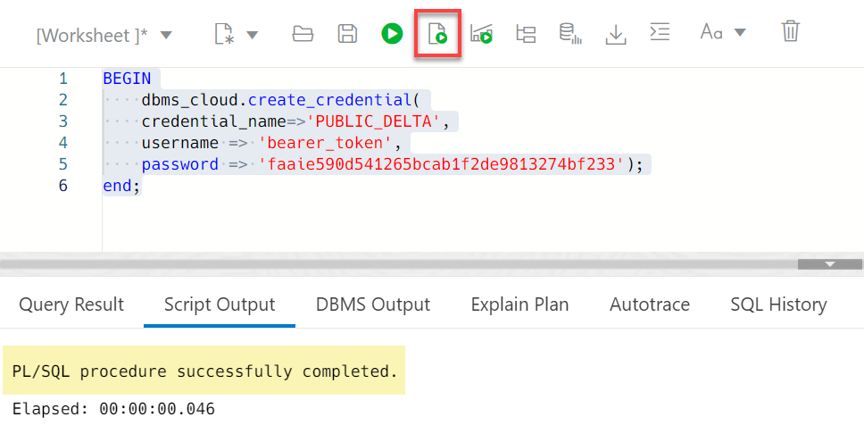
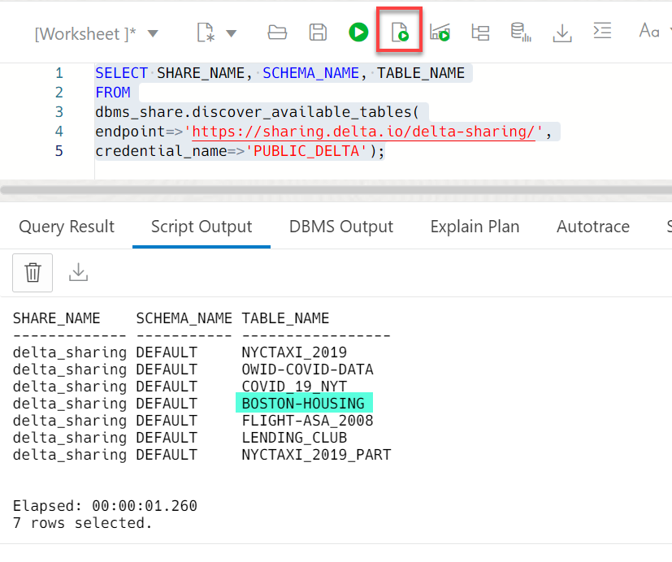

# Create External Tables Using the Delta Sharing Protocol

## Introduction

Delta Sharing is an open protocol for secure real-time data sharing across multiple platforms. It allows sharing both static and dynamic data and is designed to be easy for both providers and consumers to use with their existing data and workflows. The Delta Sharing protocol is based on Parquet, which most tools already support. The protocol design goals are:

* Share live data directly without copying it.
* Support a wide range of clients. Recipients can directly consume data from their tools of choice without installing a new platform.
* Provide strong security, auditing, and governance. It enables you to grant, track, and audit access to shared data from a single point of enforcement.
* Scale to terabyte-scale datasets.

Autonomous Database supports the Delta Sharing protocol.

Estimated Time: 10 minutes

### Objectives

In this lab, you will:

* Access the Delta Sharing public examples on GitHub
* Navigate to the SQL Worksheet
* Create a database credential and list the available schemas and tables in the Delta Share
* Create a Parquet external table based on a table in the Delta Share and query the table

### Prerequisites

This lab requires the completion of **Lab 1**: Set up the Workshop Environment > **Task 3**: Create an Autonomous Data Warehouse Instance from the **Contents** menu on the left.

## Task 1: Access the Delta Sharing Public Examples on GitHub

1. Log in to your GitHub account. If you don't have one, create a free GitHub using https://github.com/.

2. Navigate to the Public Delta Sharing Examples using the following URL:

    ```
    <copy>
    https://github.com/delta-io/delta-sharing/tree/main/examples
    </copy>
    ```

    

3. Click the **open-datasets-share** Delta Sharing profile link that is included with this example. The profile details are displayed. For a client to consume this Delta Share, it needs a profile. This profile contains the **`endpoint`** and **`bearerToken`** (the password) that you will need in order to access the delta sharing dataset.

    

## Task 2: Navigate to the SQL Worksheet

If you already accessed the SQL Worksheet from the previous lab, you can skip over to **Task 3**; otherwise, navigate to SQL Worksheet as follows:

1. Log in to the **Oracle Cloud Console**.

2. Open the **Navigation** menu and click **Oracle Database**. Under **Oracle Database**, click **Autonomous Database**.

<if type="livelabs">
3. On the **Autonomous Databases** page, click your **DB-DCAT** ADB instance.
</if>

<if type="freetier">
3. On the **Autonomous Databases** page, click your **ADW-Data-Lake** ADB instance.
</if>

4. On the **Autonomous Database details** page, click the **Database actions** drop-down list, and then click **SQL**. The SQL Worksheet is displayed.

## Task 3: Create a Database Credential and List the Available Schemas and Tables

Create a new database credential that you will use in this task as follows:

1. Use the **`CREATE_CREDENTIAL`** procedure in the **`DBMS_CLOUD`** PL/SQL package to create and store the cloud service credentials in the Autonomous Database. For additional information, see the [CREATE_CREDENTIAL procedure](https://docs.oracle.com/en/cloud/paas/autonomous-database/adbsa/dbms-cloud-subprograms.html#GUID-742FC365-AA09-48A8-922C-1987795CF36A) documentation. Copy and paste the following code into your SQL Worksheet. You can substitute the `credential_name` with your own value. Click the **Run Script** icon in the Worksheet toolbar.

    >**Note:** It is a requirement to use **`bearer_token`** as the **`username`**.

    ```
    <copy>
    BEGIN
        dbms_cloud.create_credential(
        credential_name=>'PUBLIC_DELTA',
        username => 'bearer_token',
        password => 'faaie590d541265bcab1f2de9813274bf233');
    end;
    </copy>
    ```

    

2. To identify the available schemas and tables in this Delta Sharing example, copy and paste the following code into your SQL worksheet, and then click the **Run Script** icon in the Worksheet toolbar.

     ```
    <copy>
    SELECT SHARE_NAME, SCHEMA_NAME, TABLE_NAME
    FROM
    dbms_share.discover_available_tables(
    endpoint=>'https://sharing.delta.io/delta-sharing/',
    credential_name=>'PUBLIC_DELTA');
    </copy>
    ```

     

## Task 4: Create a Parquet External Table Based on a Table in the Delta Share

Create an external table and load it with data from the **`boston-housing`** table in the Delta Public share. Use the **`EXTERNAL_TABLE`** procedure in the **`DBMS_CLOUD`** package to create and populate the external table.

1. Copy and paste the following code into your SQL Worksheet, and then click the **Run Script** icon in the Worksheet toolbar.

    ```
    <copy>
    DECLARE
  l_TABLE_NAME        DBMS_QUOTED_ID := '"BOSTONHOUSING"';
  l_CREDENTIAL_NAME   DBMS_QUOTED_ID := '"PUBLIC_DELTA"';
  l_FILE_URI_LIST     CLOB :=
    q'[https://sharing.delta.io/delta-sharing/#DELTA_SHARING.DEFAULT.BOSTON-HOUSING]';
  l_COLUMN_LIST       CLOB :=
    q'[
     "ID"       NUMBER
    ,"crim"     BINARY_DOUBLE
    ,"zn"       BINARY_DOUBLE
    ,"indus"    BINARY_DOUBLE
    ,"chas"     NUMBER
    ,"nox"      BINARY_DOUBLE
    ,"rm"       BINARY_DOUBLE
    ,"age"      BINARY_DOUBLE
    ,"dis"      BINARY_DOUBLE
    ,"rad"      NUMBER
    ,"tax"      NUMBER
    ,"ptratio"  BINARY_DOUBLE
    ,"black"    BINARY_DOUBLE
    ,"lstat"    BINARY_DOUBLE
    ,"medv"     BINARY_DOUBLE]';
  l_FIELD_LIST        CLOB := null;
  l_FORMAT            CLOB :=
    '{
       "type" : "parquet",
       "access_protocol" : "delta_sharing"
     }';
BEGIN
  DBMS_CLOUD.CREATE_EXTERNAL_TABLE
  ( TABLE_NAME        => l_TABLE_NAME
   ,CREDENTIAL_NAME   => l_CREDENTIAL_NAME
   ,FILE_URI_LIST     => l_FILE_URI_LIST
   ,COLUMN_LIST       => l_COLUMN_LIST
   ,FIELD_LIST        => l_FIELD_LIST
   ,FORMAT            => l_FORMAT
  );
END;
/
    </copy>
    ```
The PL/SQL block is executed successfully and the new **`BOSTONHOUSING`** external table is created and populated.

  

2. Query the **`BOSTONHOUSING`** external table. Copy and paste the following code into your SQL Worksheet, and then click the **Run Script** icon in the Worksheet toolbar.

    ```
    <copy>
    select *
    from BOSTONHOUSING;
    </copy>
    ```

    

## Learn more

* [DBMS_CLOUD Package](https://docs.oracle.com/en/cloud/paas/autonomous-database/adbsa/dbms-cloud-package.html#GUID-CE359BEA-51EA-4DE2-88DB-F21A9FC10721)
* [File Naming for Text Output (CSV, JSON, Parquet, or XML)](https://docs.oracle.com/en/cloud/paas/autonomous-database/adbsa/export-data-file-namingl.html#GUID-1A52F59C-2797-48A5-A058-950318DBE9AF)

You may now proceed to the next lab.

## Acknowledgements

* **Author:**
    * Lauran Serhal, Consulting User Assistance Developer
* **Contributor:**
    + Alexey Filanovskiy, Senior Principal Product Manager
* **Last Updated By/Date:** Lauran Serhal, September 2023

Data about movies in this workshop were sourced from Wikipedia.

Copyright (C) Oracle Corporation.

Permission is granted to copy, distribute and/or modify this document
under the terms of the GNU Free Documentation License, Version 1.3
or any later version published by the Free Software Foundation;
with no Invariant Sections, no Front-Cover Texts, and no Back-Cover Texts.
A copy of the license is included in the section entitled [GNU Free Documentation License](files/gnu-free-documentation-license.txt)