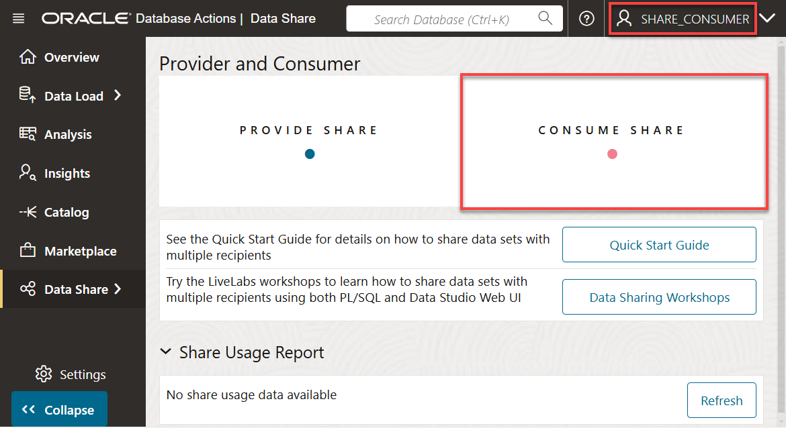
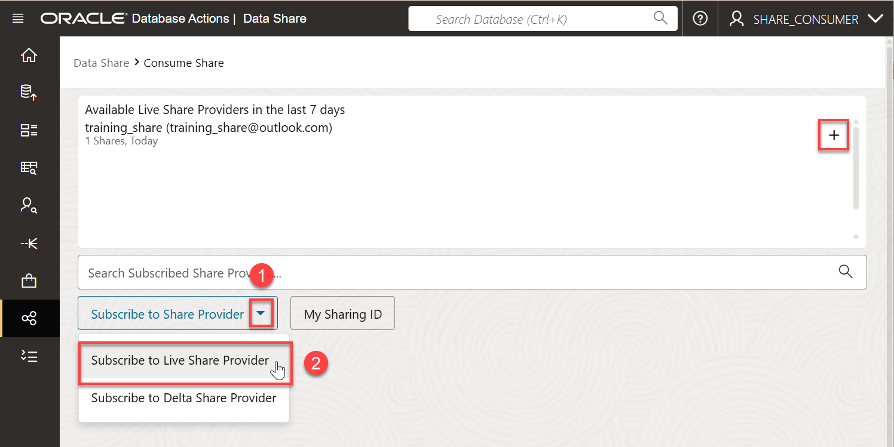
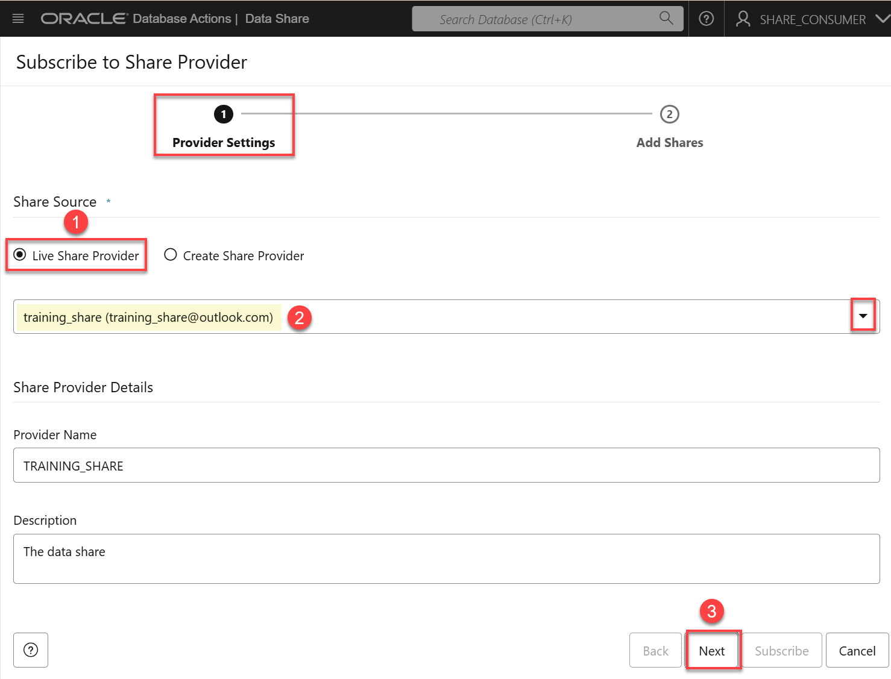
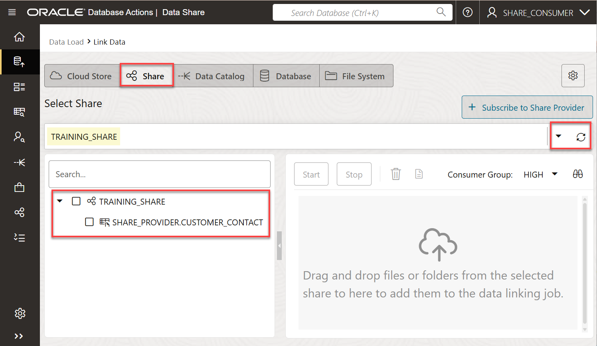
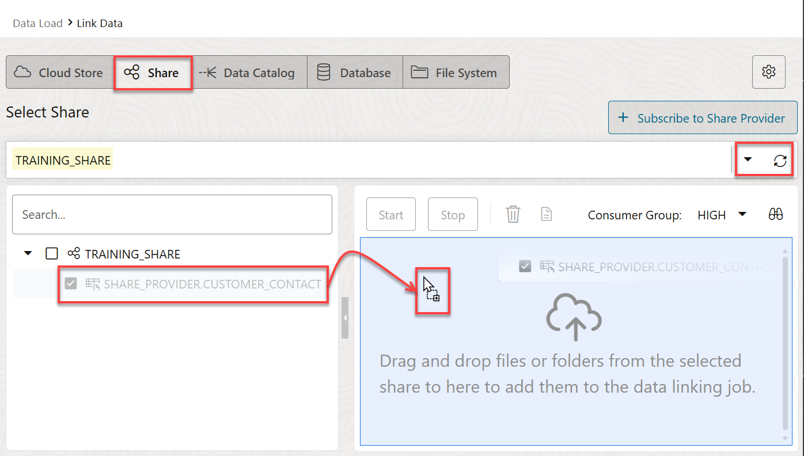
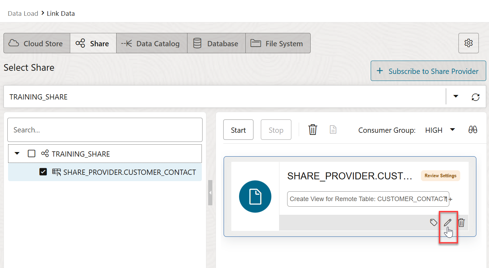
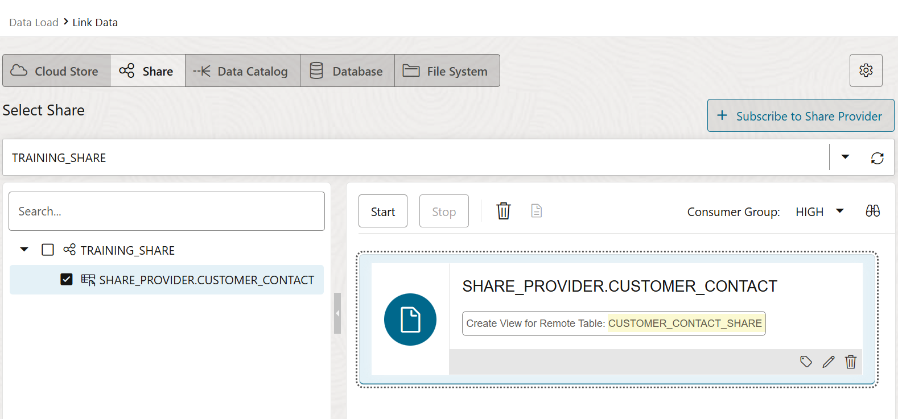
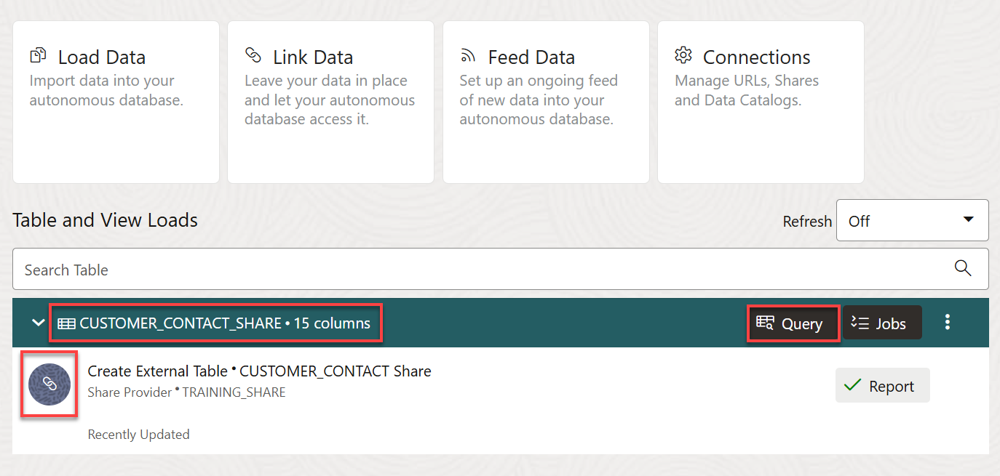

# Consume the Data Share by the Recipient

## Introduction

In this lab you will learn how to consume the data in your available data share as a recipient.

Estimated Time: 10 minutes

### Objectives

In this lab, you will:

* Subscribe to the data share provider.
* Access the data in your authorized data share.

### Prerequisites

* This lab assumes that you have successfully completed all of the preceding labs in the **Contents** menu on the left.

Live data shared with you through data sharing is not automatically available for consumption. To consume data shares, you as a recipient need to subscribe to them and create views of the tables included in the live share. This enables the recipient to consume live data from the database.

## Task 1: Log in as the share_consumer User

1. Log in as the **`share_consumer`** user. On the **Sign-in** page, enter **`share_consumer`** as the username and **`DataShare4ADW`** as the password, and then click **Sign in**.

2. On the **Database Actions Launchpad** page, click the **Data Studio** tab, and then click the **Data Share** tab.

    

    The **Provider and Consumer** Home page is displayed.

    

## Task 2: Subscribe to Share Provider

1. On the **Provider and Consumer** page, click the **CONSUME SHARE** tile to display the **Consume Share** page.

    

2. Click the **Subscribe to Share Provider** drop-down list, and then click the **Subscribe to Live Share Provider** option.

    

    The **Subscribe to Share Provider** wizard is displayed.

    >**Note:** The **Available Live Share Providers in the last 7 Days** section displays the list of available Live Share Providers in the last 7 days. You can click the **+** sign to subscribe to a Live Share. It might take some time before you can see the published data share. You can use the **Refresh** icon to refresh the view.

3. On the **Provider Settings** page 1 of the wizard, provide the following information:

    * **Share Source:** Accept the default **Live Share Provider** option.
    * **Share Provider:** Select the **`training-share`** from the drop-down list.

        

    >**Important:** If the **Share Provider** drop-down list doesn't show **`training-share`**, click the **+** sign in the **Available Live Share Providers in the last 7 Days** section to subscribe to the Live Share. It might take some time before you can see the published data share. You can use the **Refresh** icon to refresh the view.

4. Click **Next**.

5. On the **Add Shares** wizard page, click the **`TRAINING_SHARE`** in the **Available Shares** section, and then click the **Select** (>) icon.

    

    The share is added to the **Selected Shares** section. Click **Subscribe**.

    

    A **`CUSTOMER_CONTACT_SHARE` share provider was created successfully**  informational message is displayed. You are directed to the **Link Data** page with the **Share** tab selected. The **`share_consumer`** user now has access to the **`training_share`** data share that was created by the **`share_provider`** user. Drill-down on **`training_share`** to see the **`CUSTOMER_CONTACT`** table in this share.

    >**Note:** You might need to click the drop-down list and select the **`TRAINING_SHARE`**, if needed and/or click the **Refresh** icon to display the **`TRAINING_SHARE`** and the **`CUSTOMER_CONTACT`** shared table.

    

## Task 3: Create a View over the Shared Table

In this task, you create a view based on the **`CUSTOMER_CONTACT`** table that was included in the live data share. A view is a logical table based on one or more tables or views. A view contains no data itself. The tables upon which a view is based are called base tables.

1. Click the drop-down list and select the **`TRAINING_SHARE`**, if needed. You might need to click the **Refresh** icon to display the **`TRAINING_SHARE`**. Drill-down on the **`TRAINING_SHARE`** data share node to display the objects in it. Drag and drop the **`CUSTOMER_CONTACT`** shared table to add it to the data link job.

    

2. The shared table is added to the data link job. When you run this job, a new **`CUSTOMER_CONTACT`** view will be created on top of the **`CUSTOMER_CONTACT`** table that was shared with you. Before you create the view, change its name from **`CUSTOMER_CONTACT`** to **`CUSTOMER_CONTACT_SHARE`**. Click the **Settings** icon (pencil).

    

3. In the **Link Data from Cloud Store Location SHARE_PROVIDER.CUSTOMER\_CONTACT** dialog box, change the name of the view that will be generated to **`CUSTOMER_CONTACT_SHARE`**, and then click **Close**.

    

    The **Link Data** page is re-displayed.

    

4. Click **Start**. A **Start Link from Cloud Store** dialog box is displayed. Click **Run**. When the job completes successfully, a link icon is displayed. The **`CUSTOMER_CONTACT_SHARE`** view is created. If the link icon is not displayed, click the **Refresh** drop-down list (off by default), and then select 30 seconds.

    

5. Let's query the newly created view. Click **Query**. You can also use the SQL Worksheet. An informational box is displayed. Close it.

6. The query result is already displayed; however, you can click **Run** to run it again. The query result is displayed in the **Query Result** tab.

    

7. To return to the data load dashboard, in the navigator pane on the left, drill down on **Data Load**, and then click **Home**.

You may now proceed to the next lab.

## Learn More

* [The Share Tool](https://docs.oracle.com/en/cloud/paas/autonomous-database/adbsa/adp-data-share-tool.html#GUID-7EECE78B-336D-4853-BFC3-E78A7B8398DB)
* [Oracle Cloud Infrastructure Documentation](https://docs.cloud.oracle.com/en-us/iaas/Content/GSG/Concepts/baremetalintro.htm)
* [Using Oracle Autonomous AI Database Serverless](https://docs.oracle.com/en/cloud/paas/autonomous-database/adbsa/index.html)

## Acknowledgements

* **Author:** Lauran K. Serhal, Consulting User Assistance Developer
* **Contributor:** Alexey Filanovskiy, Senior Principal Product Manager
* **Last Updated By/Date:** Lauran K. Serhal, November 2025

Data about movies in this workshop were sourced from Wikipedia.

Copyright (C) 2025, Oracle Corporation.

Permission is granted to copy, distribute and/or modify this document
under the terms of the GNU Free Documentation License, Version 1.3
or any later version published by the Free Software Foundation;
with no Invariant Sections, no Front-Cover Texts, and no Back-Cover Texts.
A copy of the license is included in the section entitled [GNU Free Documentation License](https://oracle-livelabs.github.io/adb/shared/adb-15-minutes/introduction/files/gnu-free-documentation-license.txt)