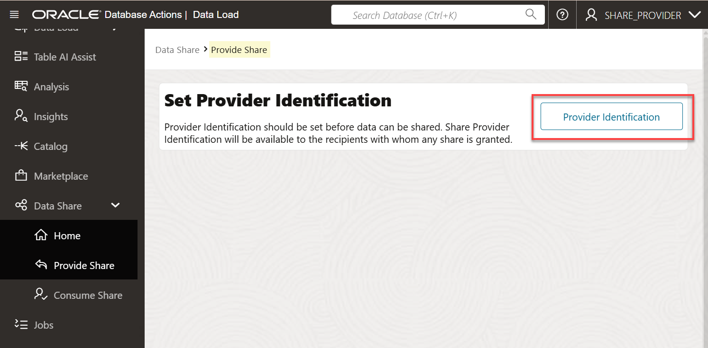
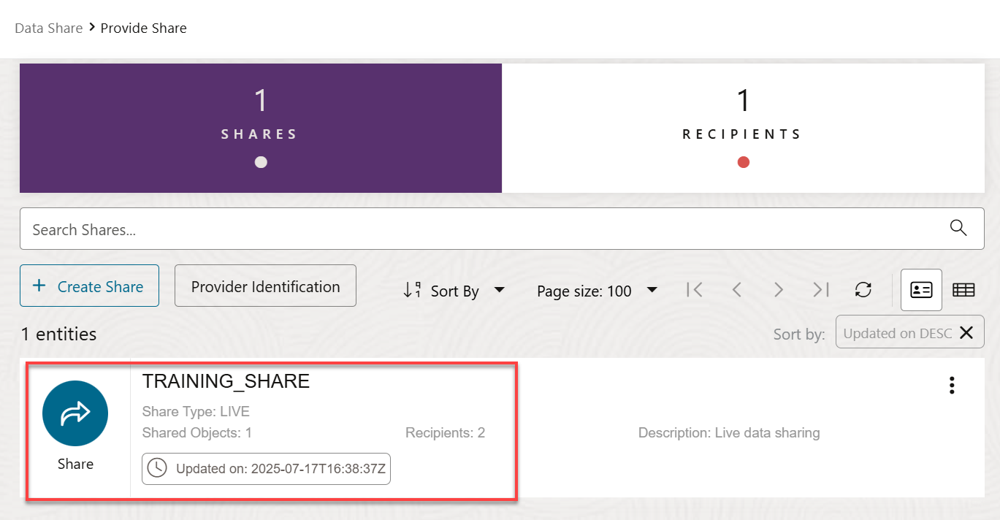

# Create, Populate, and Publish a Data Share

## Introduction

A data share is a named entity in the provider’s instance. It can be a group of datasets shared as a single entity. The share is the logical container that contains objects such as tables that you will share with recipients. An authorized data share recipient can  access the share and all the tables in it.

In this lab, as a share provider user, you will create a data share and add a table to it. Next, you will create a new recipient that will have access to this data share.

Estimated Time: 15 minutes

### Objectives

In this lab, you will:

* Create a provider id that enables recipients to identify you.
* Create a new data share as the **`share_provider`** user.
* Add the **`customer_contact`** table from the previous lab to the data share.
* Create a new data share recipient named **`training_recipient`**.
* Publish the data share to make it available to authorized recipients.

### Prerequisites

* This lab assumes that you have successfully completed all of the preceding labs in the **Contents** menu on the left.

## Task 1: Create a Provider ID

In this task, you will create a Provider ID. This provides information to the recipient on how to identify you.

You should be on the **Data Load** home page from the last lab. In the navigation pane on the left, drill-down on the **Data Share** node. The **PROVIDE SHARE** and the **CONSUME SHARE** tools enable you to create a data share as a share provider and to subscribe and consume a data share as a recipient respectively. You can click the [Quick Start Guide](https://docs.oracle.com/en/database/oracle/sql-developer-web/sdwfd/index.html) button to view step by step instructions on how to use Oracle Autonomous AI Database as a data share provider and as a data share recipient. For the complete Data Share documentation, see [The Data Share Tool](https://docs.oracle.com/en/cloud/paas/autonomous-database/adbsa/adp-data-share-tool.html#GUID-7EECE78B-336D-4853-BFC3-E78A7B8398DB). You can also try one of the available Data Sharing LiveLabs workshops.

1. Make sure you are still logged in as the **share_provider** user. In the navigation pane on the left, drill-down on **Data Share** if needed, and then click **Provide Share**.

   

    _**Important:**_    
    _If you are using an **Always Free** ADB instance, you must run the following script in your SQL Worksheet as the **`share_provider`** user <u>before</u> you proceed with **step 2** below:_

    ```
    <copy>
    BEGIN
        DBMS_SHARE.UPDATE_DEFAULT_SHARE_PROPERTY('job_type', 'DBMS_CLOUD');
    END;
    /
    </copy>
    ```

2. As the **`share_provider`** user, create a new data share named **`training_share`**. On the **Provide Share** page, you must provide the details of the provider before you share the data. The share provider identification will be available to recipients with whom you grant the share. click **Provider Identification** to create a Provider ID to provide information to the recipient on how to identify you.

    

    The **Data Studio Settings** panel is displayed and the **Share Provider Identity** tab is selected by default.

3. Specify the following:

    * **Name:** Enter **`training_share`**.
    * **Email:** Enter the email address for the provider such as **`training_share@outlook.com`**.
    * **Description:** Enter a meaningful description of the provider (required).

        

4. Click **Save**, and then click **Close**. The **Provide Share** page is re-displayed. Initially, there are no data shares or recipients.

    

## Task 2: Create and Publish a Data Share

When you create the data share using the share live data using direct connection method, you'll need the **Sharing ID**. A Sharing ID is a unique provider for your Autonomous AI Database. The Data Share tool uses it to share data with you. You can find the Sharing ID on the **Consume Share** page.

>**Note:** In this workshop, both the **`share_provider`** and **`share_consumer`** are using the same Autonomous AI Database instance.

1. Let's get the Sharing ID. In the navigation panel on the left, click **Consume Share**.

    

2. On the **Consume Share** page, click **My Sharing ID**.

    

3. In the **Sharing ID** dialog box, click **Copy to Clipboard**. Svae this sharing id value as you will need it when you create a data share next. Next, click **Close**.

    

4. In the navigation panel on the left, click **Provide Share**, and then click **Create Share**. 

    

    The **Create Share** wizard is displayed.

5. On the **General** page, enter **`training_share`** as the name for the new share, an optional description, and then click **Next**.

    

6. On the **Publish Details** page, select the **SHARE LIVE DATA USING DIRECT CONNECTION** tile, and then click **Next**.

    

7. On the **Select Tables** page, add the **`CUSTOMER_CONTACT`** table that you created in the previous lab to the **`training_share`** data share. In the **Available Tables** section, click the table name, and then click the **Select** (>) icon.

    The **`CUSTOMER_CONTACT`** table is added to the **Shared Tables** section. Click **Next**.

    

8. On the **Recipients** page, there are no recipients available initially. Click the **Select Recipient** drop-down list, and then select **MY_TENANCY** from the list. Next, create a new recipient that will consume this data share. Click **New Recipient**.

    

9. In the **Create Share Recipient** panel, enter **`training_recipient`** as the name of the recipient, an optional description, an email address, and paste the sharing id that you copied to your clipboard in the **Sharing ID** field.

    

10. Click **Create**. The **Recipients** wizard's page is re-displayed. The newly created **TRAINING_RECIPIENT** is displayed on the page.

    

11. Click **Create** to create the data share. The **Provide Share** page is displayed. The new data share is displayed in the entities section. An informational message is displayed about the publishing process of the data share has started.

    

12. You can click the **Actions** icon (ellipsis) to view the data share details.

    

13. Log out of the **`SHARE_PROVIDER`** user. On the **Oracle Database Actions | Data Share** banner, click the drop-down list next to the `SHARE_PROVIDER` user, and then select **Sign Out** from the drop-down menu.

You may now proceed to the next lab.

## Learn More

* [The Share Tool](https://docs.oracle.com/en/cloud/paas/autonomous-database/adbsa/adp-data-share-tool.html#GUID-7EECE78B-336D-4853-BFC3-E78A7B8398DB)
* [Oracle Cloud Infrastructure Documentation](https://docs.cloud.oracle.com/en-us/iaas/Content/GSG/Concepts/baremetalintro.htm)
* [Using Oracle Autonomous AI Database Serverless](https://docs.oracle.com/en/cloud/paas/autonomous-database/adbsa/index.html)

## Acknowledgements

* **Author:** Lauran K. Serhal, Consulting User Assistance Developer
* **Contributor:** Alexey Filanovskiy, Senior Principal Product Manager
* **Last Updated By/Date:** Lauran K. Serhal, November 2025

Data about movies in this workshop were sourced from Wikipedia.

Copyright (C) 2025, Oracle Corporation.

Permission is granted to copy, distribute and/or modify this document
under the terms of the GNU Free Documentation License, Version 1.3
or any later version published by the Free Software Foundation;
with no Invariant Sections, no Front-Cover Texts, and no Back-Cover Texts.
A copy of the license is included in the section entitled [GNU Free Documentation License](https://oracle-livelabs.github.io/adb/shared/adb-15-minutes/introduction/files/gnu-free-documentation-license.txt)
