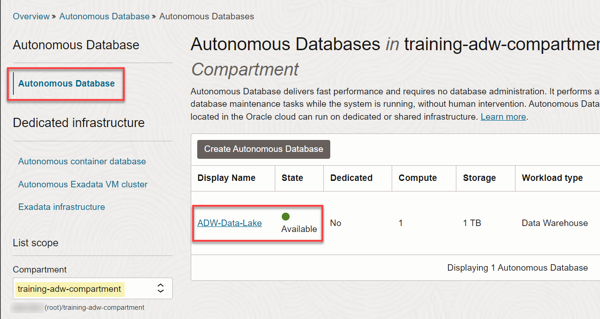
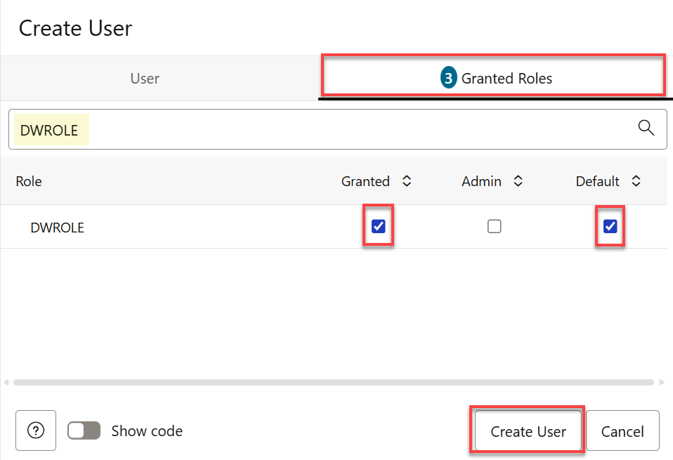
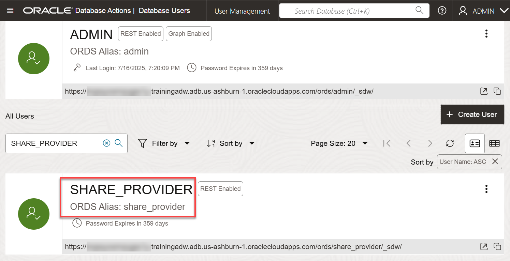
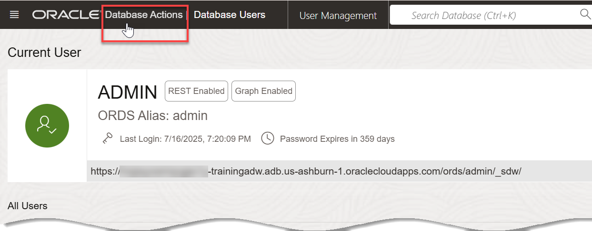
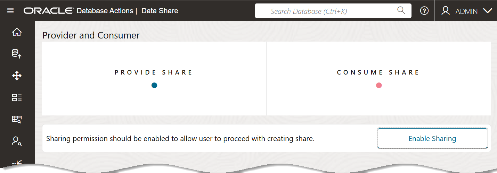
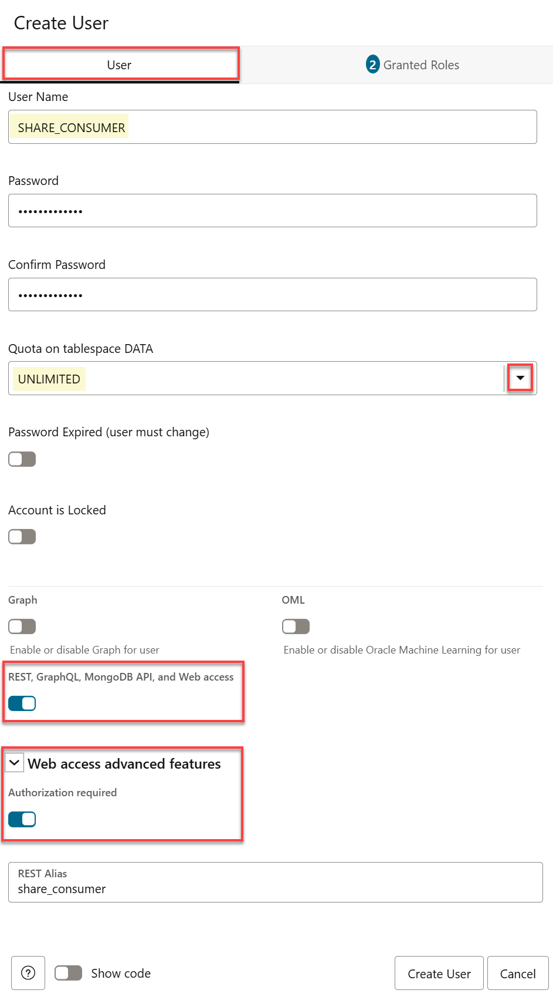
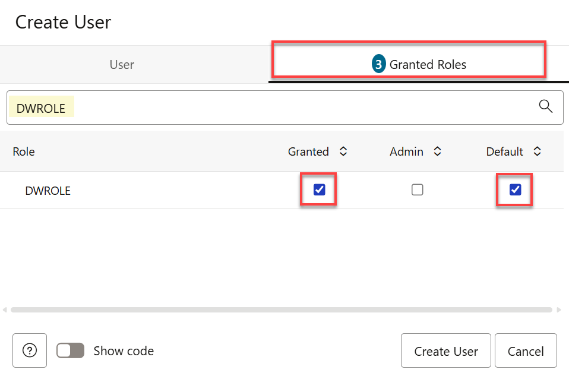

# Create a Share Provider User and an OCI Credential

## Introduction

In this lab, as the **`admin`** user, you will create a **data share provider** and a **data share consumer** users and grant the two users the necessary role and privileges. You will optionally create an RSA key pair, if you don't have one. This will provide you with the private key, the user's and tenancy's OCIDs, and the fingerprint which you will need to create the OCI credential. Finally, you'll create an OCI credential.

Estimated Time: 15 minutes

### Objectives

In this lab, you will:

As an **`admin`** user, you will do the following:
* Create a data share provider user and grant this user the necessary role and privileges.
* Create a data share consumer user and grant this user the necessary role and privileges.

### Prerequisites

* This lab assumes that you have successfully completed all of the preceding labs in the **Contents** menu on the left.

## Task 1: Navigate to the Database Actions Launchpad

After you provisioned an ADB instance in the **Set up the Workshop Environment** lab, the **Autonomous Database details** page was displayed. If the page is active, start with **step 4** below. If the page had timed out, start with **step 1** below.

1. Log in to the **Oracle Cloud Console**, if you are not already logged in.

2. Open the **Navigation** menu and click **Oracle Database**. Under **Oracle Database**, click **Autonomous Database**.

3. On the **Autonomous Databases** page, click your **ADW-Data-Lake** ADB instance.
    

    >**Note:** If you get a _Forbidden_ message on the **Autonomous Databases** page, that indicates that you are in the wrong compartment. Refer to the **Reservation Information** panel for your reservation and make a note of your assigned compartment. Next, on the same page, click the **Compartment** drop-down list in the **Scope** section, and selected your assigned compartment.

4. On the **Autonomous Database details** page, click the **Database actions** drop-down list, and then click **View all database actions**.

    

    The **Database Actions Launchpad** page is displayed.

## Task 2: Create the Share Provider User and Grant the User Privileges

As the **`admin`** user, create a **`share_provider`** user and grant this user the required role and privileges and enable REST and data sharing.

### **The Data Share Provider**

Oracle Autonomous Database Serverless enables the data share provider to share existing objects such as tables with authorized recipients. The share can contain a single table, a set of related tables, a set of tables with some logical grouping. The provider could be a person, an institution, or a software system that shares the objects.

Autonomous Database comes with a predefined database role named `DWROLE`. This role provides the privileges necessary for most database users;however, The `DWROLE` role does not allocate any tablespace quota to the user. If the user is going to be adding data or other objects, you need to grant the user tablespace quota. For more information about this role, see [Manage Database User Privileges](https://docs.oracle.com/en-us/iaas/autonomous-database/doc/managing-database-users.html).

1. Click **Database Actions Launchpad** in the banner to display the **Launchpad** page.

2. Click the **Administration** tab, and then click the **Database Users** tab.

    

    The **User Management** page is displayed.

    

3. Click **Create User**. In the **Create User** panel, provide the following information in the **User** tab.

    * **User Name:** `SHARE_PROVIDER`
    * **Password:** `DataShare4ADW`
    * **Web Access:** Enable this field
    * **Quota on tablespace data:** `UNLIMITED`

        

4. Click the **Granted Roles** tab. In the **Filter by role** field, enter **`dwrole`**. The **DWROLE** row is displayed. Select the **Granted** and **Default** checkboxes.

    

5. Click **Create User**. The new `SHARE_PROVIDER` user is displayed in the **User Management** page.

    

6. Click **Database Actions** in the banner to display the **Launchpad** page.

    

## Task 3: Enable Data Sharing for the SHARE_PROVIDER User

1. On the **Database Actions Launchpad** page, click the **Data Studio** tab, and then click the **Data Share** tab.

    

2. On the **Provider and Consumer** page, click **Enable Sharing**.

    

3. On the **Enable Sharing** panel, in the **Available Schemas** section. click the **`SHARE_PROVIDER`** user to highlight it. Next, click the **Select** button (**>**) to add this user to the **Selected Schemas** section.

    

4. Click **Save**. An information message indicates that the schema privileges are updated successfully. The **Provider and Consumer** page is re-displayed.

    

<!--

5. Sign out of the **`ADMIN`** user.

    

6. Sign back in as the **`ADMIN`** user and enter the admin's password, **`Training4ADW`**. On the **Database Actions Launchpad** page, click the **Data Studio** tab, and then click the **Data Sharing** tab. The **Provider and Consumer** page is re-displayed.

    

-->

<!--

5. The first time you open the SQL Worksheet, a series of pop-up informational boxes may appear, providing you with a tour that introduces the main features. If not, click the **Tour** icon (binoculars) in the upper right corner of the toolbar. To take the tour through the informational boxes, click **Next**. To exit the tour, click the **X** control.

    

6. Click the **X** control to exit the tour. The SQL Worksheet is displayed.

    
-->


<!--
Copy and paste the following script into your SQL Worksheet, and then click the **Run Script (F5)** icon in the Worksheet toolbar.

    ```
    <copy>
    -- Create a new user that will provide the shared data.

    CREATE USER share_provider IDENTIFIED BY DataShare4ADW;

    -- Grant the new user the required role and privileges.

    GRANT CONNECT TO share_provider;
    GRANT DWROLE TO share_provider;
    GRANT RESOURCE TO share_provider;
    GRANT UNLIMITED TABLESPACE TO share_provider;

    -- Enable REST.

    BEGIN
        ORDS_ADMIN.ENABLE_SCHEMA(
            p_enabled => TRUE,
            p_schema => 'SHARE_PROVIDER',
            p_url_mapping_type => 'BASE_PATH',
            p_url_mapping_pattern => 'share_provider',
            p_auto_rest_auth=> TRUE
        );

    -- Enable data sharing.
        DBMS_SHARE.ENABLE_SCHEMA(
        SCHEMA_NAME => 'SHARE_PROVIDER',
        ENABLED => TRUE
        );
       commit;
    END;
    /
    </copy>
    ```

    

    The results are displayed in the **Script Output** tab.

    

    >**Note:** If you can't see the newly created **share\_provider** user in the first drop-down list in the **Navigator** tab, log out of the **`admin`** user. On the **Oracle Database Actions | SQL** banner, click the drop-down list next to the **`ADMIN`** user, and then select **Sign Out** from the drop-down menu. Next, log back in as the **`ADMIN`** user. On the **Sign-in** page, enter **`ADMIN`** as the username and **`DataShare4ADW`** as the password, and then click **Sign in**. Click the the first drop-down menu and select the **share_provider** user.

    

-->

## Task 3: (Optional) Create a Share Consumer User and Grant Privileges to the User

Create a new consumer user named **`share_consumer`**.

1. Click **Database Actions Launchpad** in the banner to display the **Launchpad** page.

2. Click the **Administration** tab, and then click the **Database Users** tab. The **User Management** page is displayed.

    

3. Click **Create User**. In the **Create User** panel, provide the following information in the **User** tab.

    * **User Name:** `SHARE_CONSUMER`
    * **Password:** `DataShare4ADW`
    * **Web Access:** Enable this field
    * **Quota on tablespace data:** `UNLIMITED`

        

4. Click the **Granted Roles** tab. In the **Filter by role** field, enter **`dwrole`**. The **DWROLE** row is displayed. Select the **Granted** and **Default** checkboxes.

    

5. Click **Create User**. The new `SHARE_CONSUMER` user is displayed in the **User Management** page.

    

6. Log out of the **`admin`** user. On the **Oracle Database Actions | SQL** banner, click the drop-down list next to the **`ADMIN`** user, and then select **Sign Out** from the drop-down menu.

    

7. Log in as the newly created user, **`share_provider`**. On the **Sign-in** page, enter **`share_provider`** as the username and **`DataShare4ADW`** as the password, and then click **Sign in**. The Database Actions Launchpad page is displayed.

    

    You are now logged in as the newly created **`share_provider`** user.

You may now proceed to the next lab.

## Learn More

* [The Share Tool](https://docs.oracle.com/en/cloud/paas/autonomous-database/adbsa/adp-data-share-tool.html#GUID-7EECE78B-336D-4853-BFC3-E78A7B8398DB)
* [Oracle Cloud Infrastructure Documentation](https://docs.cloud.oracle.com/en-us/iaas/Content/GSG/Concepts/baremetalintro.htm)
* [Using Oracle Autonomous Database Serverless](https://docs.oracle.com/en/cloud/paas/autonomous-database/adbsa/index.html)

## Acknowledgements

* **Author:** Lauran K. Serhal, Consulting User Assistance Developer
* **Contributor:** Alexey Filanovskiy, Senior Principal Product Manager
* **Last Updated By/Date:** Lauran K. Serhal, July 2024

Data about movies in this workshop were sourced from Wikipedia.

Copyright (C) 2024, Oracle Corporation.

Permission is granted to copy, distribute and/or modify this document
under the terms of the GNU Free Documentation License, Version 1.3
or any later version published by the Free Software Foundation;
with no Invariant Sections, no Front-Cover Texts, and no Back-Cover Texts.
A copy of the license is included in the section entitled [GNU Free Documentation License](files/gnu-free-documentation-license.txt)
