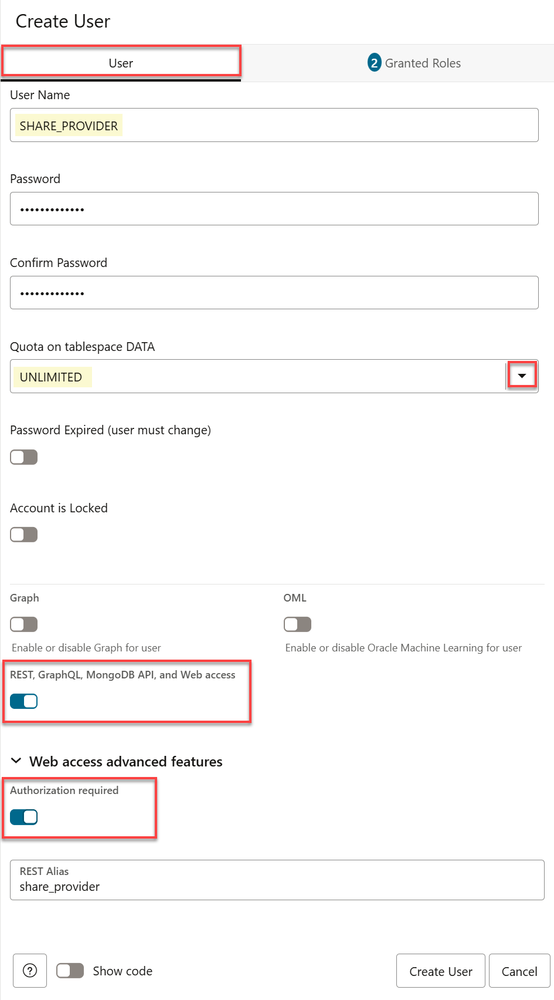
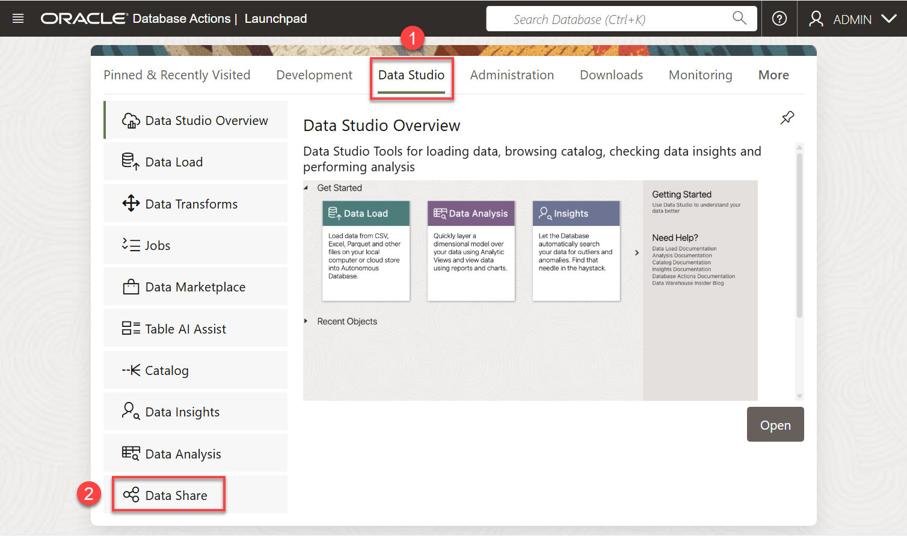
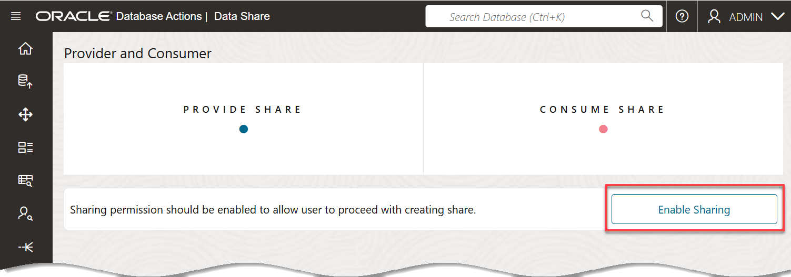
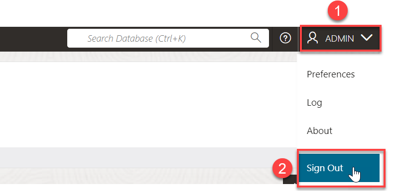

# Create Users and an OCI Credential

## Introduction

In this lab, as the **`admin`** user, you will create a **data share provider** and a **data share consumer** users and grant the two users the necessary role and privileges. You will optionally create an RSA key pair, if you don't have one. This will provide you with the private key, the user's and tenancy's OCIDs, and the fingerprint which you will need to create the OCI credential. Finally, you'll create an OCI credential.

Estimated Time: 15 minutes

### Objectives

In this lab, you will:

As an **`admin`** user, you will do the following:
* Create a data share provider user and grant this user the necessary role and privileges.
* Create a data share consumer user and grant this user the necessary role and privileges.

### Prerequisites

* This lab assumes that you have successfully completed all of the preceding labs in the **Contents** menu on the left.

## Task 1: Navigate to the Database Actions Launchpad

<if type="freetier">
After you provisioned an ADB instance in the **Set up the Workshop Environment** lab, the **Autonomous AI Database** details page was displayed. If the page is active, start with **step 4** below. If the page had timed out, start with **step 1** below.
</if>

<if type="livelabs">
Your green button reservation includes an ADB instance. You can find the required credentials in the **Reservation Information** dialog box for your reservation. To log in to the Console, click the **Launch OCI** button in the **Reservation Information** dialog box, and then follow the prompts to reset your assigned password. 

 
</if>

1. Log in to the **Oracle Cloud Console**, if you are not already logged in; otherwise, skip to step 4.

2. Open the **Navigation** menu and click **Oracle AI Database**. Under **Oracle AI Database**, click **Autonomous AI Database**.

<if type="livelabs">
    > **_Important: At the time of updating this workshop (July 17, 2025), there is a known issue with OCI and using the sandbox environment reservations (the green button). The old Autonomous Databases UI page is displayed instead of the new Redwood UI page._**

    

    To correct this issue, simply click **Reload this page** icon in your browser. The newly designed **Autonomous Databases** page is displayed. 
    
    >**Note:** The **Couldn't load data** error on the page is due to being in the wrong compartment. You will learn how to navigate to your assigned compartment next. 

    

    OCI resources are organized into compartments. To navigate to your assigned sandbox reservation compartment, click the **Compartment** field. Next, enter your assigned compartment name (or partial name) from the **Reservation Information** page in the **Compartment** text box. Once your assigned compartment is displayed in the drop-down list under the **`Livelabs`** node, click it.
    
    

    >**Note:** For more details on finding your assigned resources in your reservation such as the username, password, compartment and so on, review the **Get Started with LiveLabs** lab in the Navigation menu on the left.
</if>

3. On the **Autonomous AI Databases** page, click your **ADW-Data-Lake** ADB instance.
    
    <if type="freetier">
    
    </if>

    <if type="livelabs">
    

    </if>

4. On the **Autonomous AI Database** details page, click the **Database actions** drop-down list, and then click **View all database actions**.

    

    The **Database Actions Launchpad** page is displayed.

## Task 2: Create the Share Provider User and Grant the User Privileges

As the **`admin`** user, create a **`share_provider`** user and grant this user the required role and privileges and enable REST and data sharing.

### **The Data Share Provider**

Oracle Autonomous AI Database Serverless enables the data share provider to share existing objects such as tables with authorized recipients. The share can contain a single table, a set of related tables, a set of tables with some logical grouping. The provider could be a person, an institution, or a software system that shares the objects.

Autonomous AI Database comes with a predefined database role named `DWROLE`. This role provides the privileges necessary for most database users;however, The `DWROLE` role does not allocate any tablespace quota to the user. If the user is going to be adding data or other objects, you need to grant the user tablespace quota. For more information about this role, see [Manage Database User Privileges](https://docs.oracle.com/en-us/iaas/autonomous-database/doc/managing-database-users.html).

1. On the **Database Actions Launchpad** page, click the **Administration** tab, and then click the **Database Users** tab.

    

    The **User Management** page is displayed.

    

2. Click **Create User**. In the **Create User** panel, provide the following information in the **User** tab.

    * **User Name:** `SHARE_PROVIDER`
    * **Password:** `DataShare4ADW`
    * **Quota on tablespace data:** `UNLIMITED`
    * **REST, GraphQL, MongoDB API, and Web access:** Enable this slider.
    * **Web access advanced features:** Drill-down on this field and make sure the **Authorization required** slider is enabled.
    
        

3. Click the **Granted Roles** tab. In the **Search for role** field, enter **`dwrole`**. The **DWROLE** row is displayed. Select the **Granted** and **Default** checkboxes.

    

4. Click **Create User**. The new `SHARE_PROVIDER` user is displayed in the **User Management** page.

    

5. Click **Database Actions** in the banner to display the **Launchpad** page.

    

## Task 3: Enable Data Sharing for the SHARE_PROVIDER User

1. On the **Database Actions Launchpad** page, click the **Data Studio** tab, and then click the **Data Share** tab.

    

2. On the **Provider and Consumer** page, click **Enable Sharing**.

    

3. On the **Enable Sharing** panel, in the **Selected Schemas** section, make sure that the **`SHARE_PROVIDER`** user is already listed. If not, in the **Available Schemas** section, click the **`SHARE_PROVIDER`** user to highlight it. Next, click the **Select** button (**>**) to add this user to the **Selected Schemas** section.

    

4. Click **Cancel** to exit the **Enable Sharing** panel. The **Provider and Consumer** page is re-displayed.

    

## Task 4: (Optional) Create a Share Consumer User and Grant Privileges to the User

Create a new consumer user named **`share_consumer`**.

1. Click **Database Actions Launchpad** in the banner to display the **Launchpad** page.

2. Click the **Administration** tab, and then click the **Database Users** tab. The **User Management** page is displayed.

    

3. Click **Create User**. In the **Create User** panel, provide the following information in the **User** tab.

    * **User Name:** `SHARE_CONSUMER`
    * **Password:** `DataShare4ADW`
     * **Quota on tablespace data:** `UNLIMITED`
    * **REST, GraphQL, MongoDB API, and Web access:** Enable this slider.
    * **Web access advanced features:** Drill-down on this field and make sure the **Authorization required** slider is enabled.
   
        

4. Click the **Granted Roles** tab. In the **Search for role** field, enter **`DWROLE`**. The **DWROLE** row is displayed. Select the **Granted** and **Default** checkboxes.

    

5. Click **Create User**. The new `SHARE_CONSUMER` user is displayed in the **User Management** page.

    

6. Log out of the **`admin`** user. On the **Oracle Database Actions | SQL** banner, click the drop-down list next to the **`ADMIN`** user, and then select **Sign Out** from the drop-down menu.

    

7. Log in as the newly created user, **`share_provider`**. On the **Sign-in** page, enter **`share_provider`** as the username and **`DataShare4ADW`** as the password, and then click **Sign in**. The **Database Actions Launchpad** page is displayed.

    

    You are now logged in as the newly created **`share_provider`** user.

You may now proceed to the next lab.

## Learn More

* [The Share Tool](https://docs.oracle.com/en/cloud/paas/autonomous-database/adbsa/adp-data-share-tool.html#GUID-7EECE78B-336D-4853-BFC3-E78A7B8398DB)
* [Oracle Cloud Infrastructure Documentation](https://docs.cloud.oracle.com/en-us/iaas/Content/GSG/Concepts/baremetalintro.htm)
* [Using Oracle Autonomous AI Database Serverless](https://docs.oracle.com/en/cloud/paas/autonomous-database/adbsa/index.html)

## Acknowledgements

* **Author:** Lauran K. Serhal, Consulting User Assistance Developer
* **Contributor:** Alexey Filanovskiy, Senior Principal Product Manager
* **Last Updated By/Date:** Lauran K. Serhal, November 2025

Data about movies in this workshop were sourced from Wikipedia.

Copyright (C) 2025, Oracle Corporation.

Permission is granted to copy, distribute and/or modify this document
under the terms of the GNU Free Documentation License, Version 1.3
or any later version published by the Free Software Foundation;
with no Invariant Sections, no Front-Cover Texts, and no Back-Cover Texts.
A copy of the license is included in the section entitled [GNU Free Documentation License](https://oracle-livelabs.github.io/adb/shared/adb-15-minutes/introduction/files/gnu-free-documentation-license.txt)
