# Load Data from a Public Object Storage Bucket into ADB

## Introduction

In this lab, you will load data into your ADB instance from a public bucket using the ADB Data Load built-in tool. You will then create a new table based on this data. You will add this table to the new data share that you will create as the **`share_provider`** user in the next lab.

### Objectives

In this lab, you will:

* Navigate to the Data Load page.
* Create tables and load data from public object storage buckets using Data Tools built-in to Oracle Autonomous AI Database.

### Prerequisites

* This lab assumes that you have successfully completed all of the preceding labs in the **Contents** menu on the left.

## Task 1: Navigate to the Data Load Page

>**Important:** Make sure you're still logged in as the **`share_provider`** user. You should be already on the **Database Actions Launchpad** page from the previous lab.

1. Click the **Data Studio** tab, and then click the **Data Load** tab.

    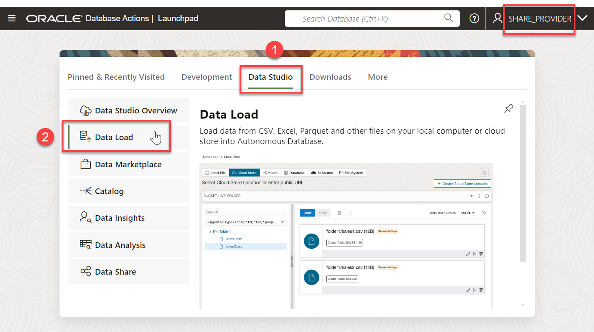

    The **Data Load** page is displayed.

    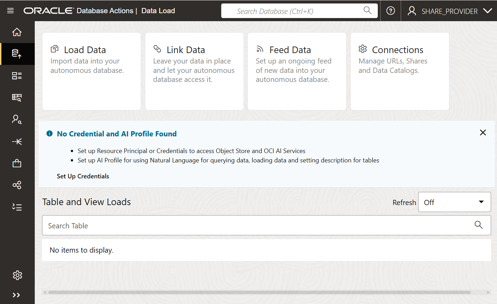

## Task 2: Load Data from a Public Object Storage Bucket and Create a Table

In this task, you will load the **customer\_contact** data into your Autonomous AI Database instance and then create a table.

1. On the **Data Load** page, click the **Load Data** card.

    

    >**Note:** Close the **X** control to close the **No Credential and AI Profile Found** section.

2. On the **Load Data** page, click the **Cloud Store** tab.

    

3. Copy the following object storage URL and paste it in the **Select Cloud Store Location or enter public URL** field. The **moviestream\_landing** Oracle Object Storage bucket that contains the data is located in a different tenancy than yours, **c4u04**; therefore, you will use the following URL. Press [Enter] if needed.

    ```
    <copy>
    https://objectstorage.us-ashburn-1.oraclecloud.com/n/c4u04/b/moviestream_landing/o
    </copy>
    ```

    

4. A list of the folders in the selected Object Storage bucket is displayed on left side section of the page. You can drag and drop the desired folders from this public bucket from this section to the data loading job section on the right.

    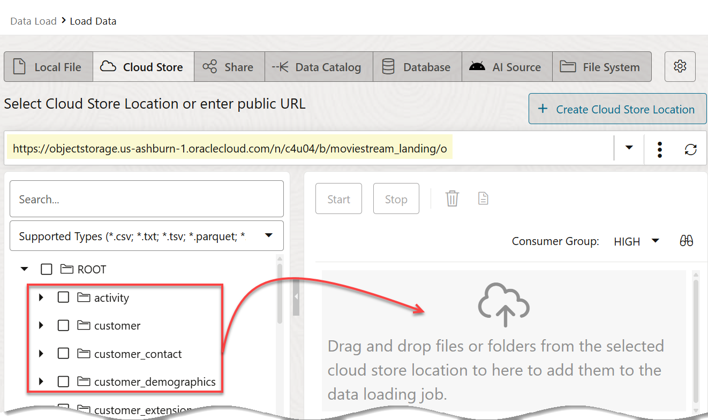

5. Drag the **`customer_contact`** folder and drop it onto the data loading job section.

    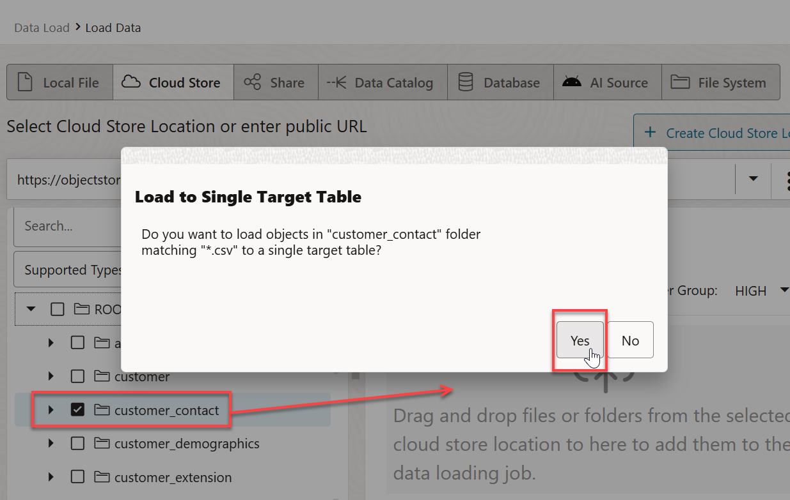

6. A **Load to Single Target Table** dialog box is displayed to prompt you whether or not you want to link all objects in this folder matching **.csv** to a single target table. This folder contains a single file, `customer-contact.csv`. In general, data lake folders contain many files of the same type, as you will see with sales data. Click **Yes**. If you receive a warning, close the message box.

    The **`customer_contact`** target table to be created for the selected `.csv` file is displayed in the data loading job section.

    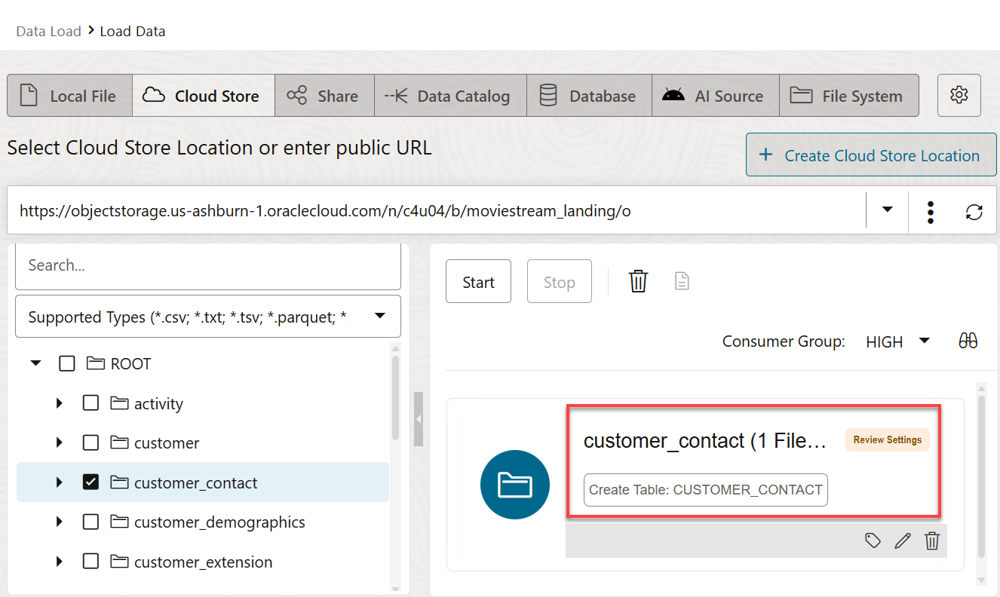

7. Click the **Settings** icon (pencil) for the **`customer_contact`** load task to view its settings. The **Load Data from Cloud Store Location customer_contact** settings panel is displayed.

    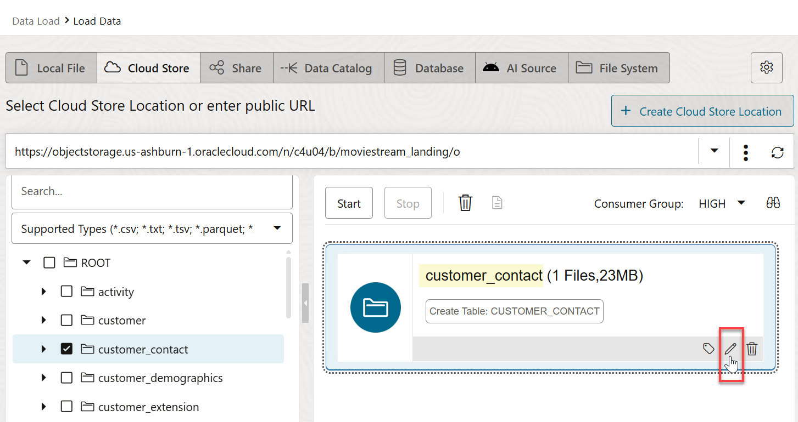

8. The **Database Actions** load job will create a **`CUSTOMER_CONTACT`** table with the listed columns and data types that are based on the selected **`.csv`** file. Review the information and the loading options. In the **Mapping** section, notice that you can change the target column names, data types, and length/precision. Click **Close** to close the settings viewer panel.

    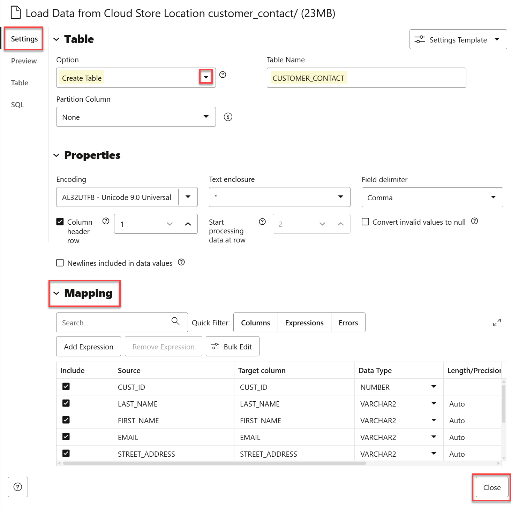

    The Load tool makes intelligent choices for the target table name and properties. Since this is an initial load, accept the default option of **Create Table**, which conveniently creates the target table in the Autonomous AI Database instance, without the need to predefine the table in SQL.

9. Click **Start** to run the data load job. In the **Start Load from Cloud Store** dialog box, click **Run**.

    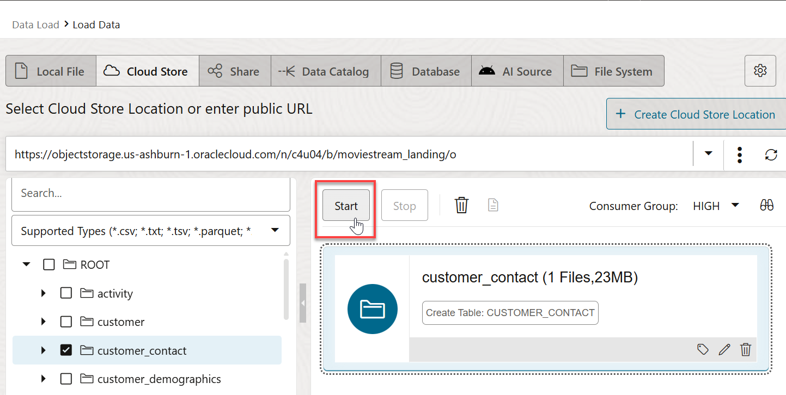

    

10. After the load job is completed, make sure that the data load card has the copy icon next to it. You can click the **Report** button for the load job to view a report of total rows processed successfully and failed for the selected table.

    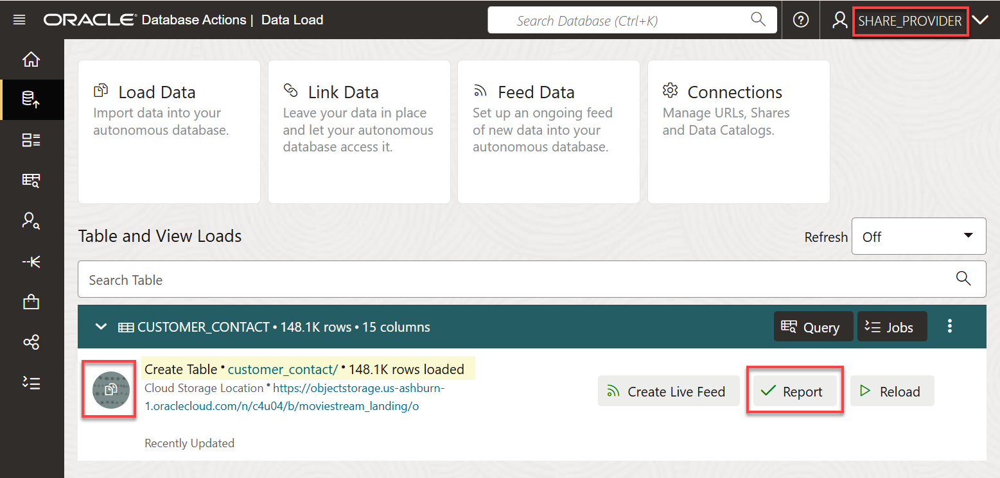

11. Click the **Report** button for the **`customer_contact`** load job. The details about the successful load job is displayed. Click **Close**.

    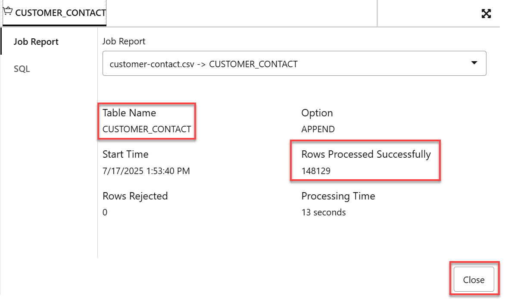

12. Click the **ellipsis** icon for the **`customer_contact`** load task to view its settings. Next, click **Table > View Details** from the context menu.

    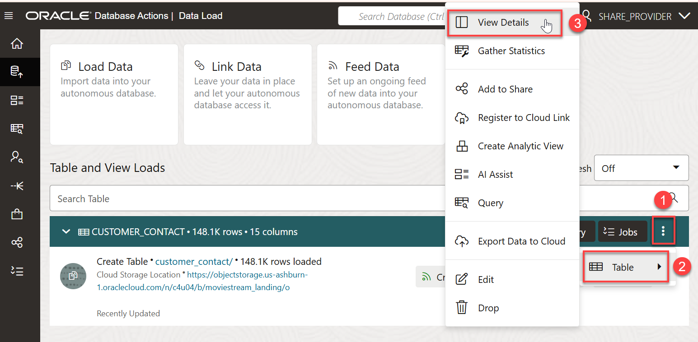

13. The **Preview** tab is selected by default. This shows the **`customer_contact`** data.

    

14. Click **Close** to exit the **`customer_contact`** task preview and return to the load data dashboard.

     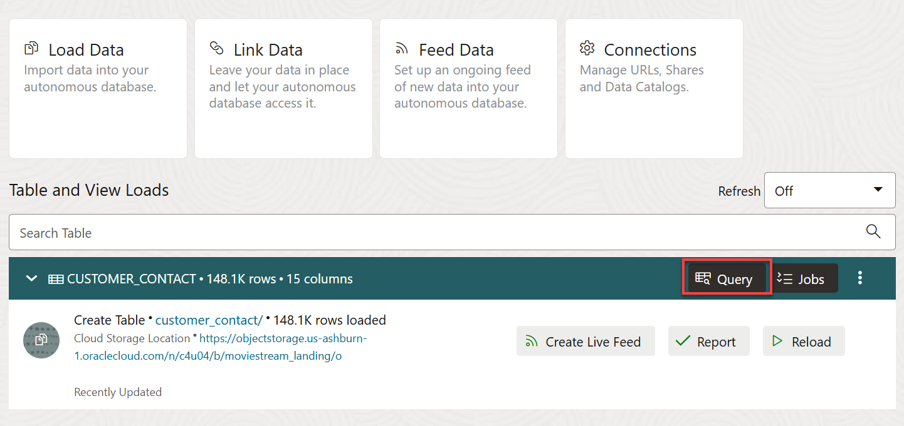

15. Click **Query** to query the newly created **`CUSTOMER_CONTACT`** table.

16. Close any informational boxes that are displayed, and then click **Run**. The query result is displayed. Click **Save** to save the query if you like.

    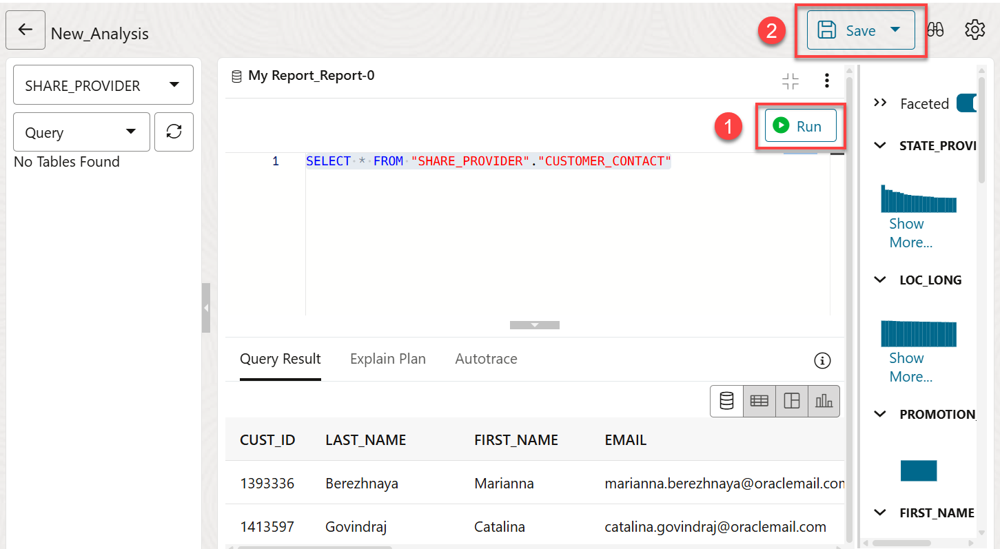

17. Return to the data load dashboard. In the left navigation menu, drill down on **Data Load**, and then click **Home**.

You may now proceed to the next lab.

## Learn more

* [Load Data from Files in the Cloud](https://www.oracle.com/pls/topic/lookup?ctx=en/cloud/paas/autonomous-data-warehouse-cloud&id=CSWHU-GUID-07900054-CB65-490A-AF3C-39EF45505802).
* [Load Data with Autonomous AI Database](https://docs.oracle.com/en/cloud/paas/autonomous-data-warehouse-cloud/user/load-data.html#GUID-1351807C-E3F7-4C6D-AF83-2AEEADE2F83E)
* [The Share Tool](https://docs.oracle.com/en/cloud/paas/autonomous-database/adbsa/adp-data-share-tool.html#GUID-7EECE78B-336D-4853-BFC3-E78A7B8398DB)

You may now proceed to the next lab.

## Acknowledgements

* **Author:** Lauran Serhal, Consulting User Assistance Developer
* **Contributors:** Alexey Filanovskiy, Senior Principal Product Manager
* **Last Updated By/Date:** Lauran Serhal, November 2025

Data about movies in this workshop were sourced from Wikipedia.

Copyright (C) 2025, Oracle Corporation.

Permission is granted to copy, distribute and/or modify this document
under the terms of the GNU Free Documentation License, Version 1.3
or any later version published by the Free Software Foundation;
with no Invariant Sections, no Front-Cover Texts, and no Back-Cover Texts.
A copy of the license is included in the section entitled [GNU Free Documentation License](https://oracle-livelabs.github.io/adb/shared/adb-15-minutes/introduction/files/gnu-free-documentation-license.txt)
