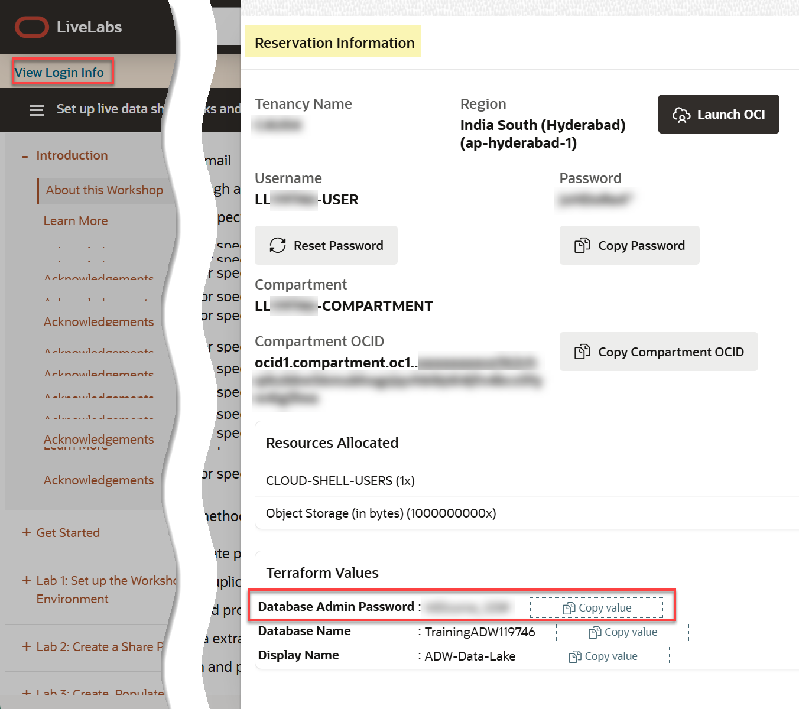

# Consume the Data Share by the Recipient

## Introduction

In this lab you will learn how to consume the data in your available data share as a recipient.


Estimated Time: 10 minutes

### Objectives

In this lab, you will:

* Create a share consumer user.
* Grant the share consumer privileges to the share provider.
* Discover the available data shares and tables.
* Create a share link and a view using the data share table.

### Prerequisites

This lab assumes that you have successfully completed all of the preceding labs in the **Contents** menu on the left.

## Task 1: (Optional) Create a Share Consumer User

In this lab, you will log in as the `admin` user to create a database user (schema) that will be used to consume the data share that the `share_provider` user created and shared with the `live_share_oracle_user` recipient. If you already have an existing schema with the appropriate privileges, you can use it. We chose to separate the share\_provider user (schema) from the share\_consumer user (schema) to simulate a real use case of data sharing between a provider and a consumer.

1. Log out of the `share_provider` user. On the **Oracle Database Actions | SQL** banner, click the drop-down list next to the `SHARE_PROVIDER` user, and then select **Sign Out** from the drop-down menu.

<if type="freetier">
2. Log in as the **`admin`** user. On the **Sign-in** page, enter **`admin`** as the username and **`Training4ADW`** as the password, and then click **Sign in**.
</if>

<if type="livelabs">
2. Log in as the **`admin`** user. On the **Sign-in** page, enter **`admin`** as the username. You can find your assigned **`admin`** user password at the bottom of your **Reservation Information** dialog box in the **Database Admin Password** field (redacted for security). Next, click **Sign in**.

    
</if>

3. You are now logged in as the **`admin`** user. On the Launchpad, click the **Development** tab, and then click the **SQL** tab to display the SQL Worksheet.

    

4. Create a new consumer user named **`share_consumer`**. Copy and paste the following script into your SQL Worksheet, and then click the **Run Script (F5)** icon.

    ```
    <copy>
    -- Create a new user that will consume the shared data.

    CREATE USER share_consumer IDENTIFIED BY DataShare4ADW;

    -- Grant the new user the required roles.

    GRANT CONNECT TO share_consumer;
    GRANT DWROLE TO share_consumer;
    GRANT RESOURCE TO share_consumer;
    GRANT UNLIMITED TABLESPACE TO share_consumer;

    BEGIN
    ORDS_ADMIN.ENABLE_SCHEMA
        (p_enabled => TRUE,
         p_schema => 'share_consumer',
         p_url_mapping_type => 'BASE_PATH',
         p_auto_rest_auth=> TRUE );
    END;
    /
    </copy>
    ```

    

    The results are displayed in the **Script Output** tab.

    

    At this point, the **`share_consumer`** user doesn't have the required privileges to read cloud links yet.

## Task 2:  Grant the Share Consumer Privileges to the Share Provider

1. To consume a live share, a recipient user must have the required privileges to access the live share. The **`PRIV_CONSUME_ORACLE_SHARE`** privilege allows the specified user to consume Oracle-to-Oracle live shares. Copy and paste the following script into your SQL Worksheet, and then click the **Run Script** icon.

    ```
    <copy>
    BEGIN
    DBMS_SHARE.ENABLE_SCHEMA(
        'share_consumer',
        enabled=>TRUE,
        privileges=>dbms_share.PRIV_CONSUME_ORACLE_SHARE);
    END;
    /
    </copy>
    ```

    

2. Log out of the **`admin`** user. On the **Oracle Database Actions | SQL** banner, click the drop-down list next to the `ADMIN` user, and then select **Sign Out** from the drop-down menu.

3. Log in as the newly created user, **`share_consumer`**. On the **Sign-in** page, enter **`share_consumer`** as the username and **`DataShare4ADW`** as the password, and then click **Sign in**.

4. You are now logged in as the **`share_consumer`** user. On the Launchpad, click the **Development** tab, and then click the **SQL** tab to display the SQL Worksheet.

5. Verify that you as the `share_consumer` have the privilege to read the data share. You can use the following query to check if the current session user is enabled for `READ` access to a data set.

    ```
    <copy>
    SELECT SYS_CONTEXT('USERENV','CLOUD_LINK_READ_ENABLED')
    FROM dual;
    </copy>
    ```

    

    The **`YES`** indicates that the **`share_consumer`** user is enabled for **`READ`** access to a data set.

5. Query the share providers that are available to the `share_consumer` user.

    ```
    <copy>
    SELECT provider_name, description, contact
    FROM all_available_oracle_share_providers
    </copy>
    ```

    

    >**Note:** If the above query doesn't show the published data share, wait for a few more minutes until the publishing process is completed, and then run the query again.

6. Copy the value for the **`provider_name`** entry that starts with **`live_share_provider`**. You will need this value in the next task. Right-click the cell and then select **Copy** from the context menu.

    

7. Paste the copied value into your text editor file.

    

## Task 3: Discover Available Data Shares and Tables

1. Obtain the share provider's ID. _**Important:** Copy and paste the following script into your SQL Worksheet; **however, don't run it yet**. Replace the text place holder in the script for the **`provider_name`** argument with your own **`provider_name`** value that you obtained (and saved in a text editor file) in the previous task._ Next, click the **Run Script** icon.

    ```
    <copy>
    declare
    oracle_provider_id VARCHAR2(64);
    BEGIN
        SELECT oracle_provider_id INTO oracle_provider_id
        FROM all_available_oracle_share_providers
        WHERE provider_name = 'enter the share provider name here';
        SYS.DBMS_OUTPUT.PUT_LINE('provider id = ' || oracle_provider_id);
    END;
    /
    </copy>
    ```

    

    Copy the value of the returned **provider id** as you will need it in the next step.

2. Subscribe to the data share provider by creating a new share provider name that we called **`demo_live_provider`** in our example. _**Important:** Copy and paste the following script into your SQL Worksheet; **however, don't run it yet**. Replace the text place holder in the script for the **`oracle_provider_id`** argument with your own **`provider_id`** value that you obtained in the previous step._ Next, click the **Run Script** icon.

    ```
    <copy>
    BEGIN
        dbms_share.create_oracle_share_provider
        (oracle_provider_id=> 'Enter the provider id here',
        provider_name=> 'DEMO_LIVE_PROVIDER');
    END;
    /
    </copy>
    ```

    

3. Query the available providers to confirm the creation of the new share provider name.

    ```
    <copy>
    SELECT provider_name share_provider_name
    FROM user_share_providers
    ORDER BY 1;
    </copy>
    ```

    

4. Query the available shares from the newly created share provider. Copy and paste the following script into your SQL Worksheet, and then click the **Run Script** icon.

    ```
    <copy>
    SELECT available_share_name share_name
    FROM dbms_share.discover_available_shares('DEMO_LIVE_PROVIDER');
    </copy>
    ```

    

5. Query the available tables in the share. Copy and paste the following script into your SQL Worksheet, and then click the **Run Statement** icon.

    ```
    <copy>
    SELECT schema_name, table_name
    FROM dbms_share.discover_available_tables(
        share_provider=>'DEMO_LIVE_PROVIDER',
        share_name=>'DEMO_LIVE_SHARE')
    ORDER BY 1, 2;
    </copy>
    ```

    

## Task 4: Create a Share Link and a View Using the Data Share Table

1. Create a new share link to subscribe to a data share from a registered share provider. Copy and paste the following query into your SQL Worksheet, and then click the **Run Script** icon.

    ```
    <copy>
    BEGIN
        dbms_share.create_share_link
        (
        share_link_name => 'SALES_DATA',
        share_provider => 'DEMO_LIVE_PROVIDER',
        share_name => 'DEMO_LIVE_SHARE'
        );
    END;
    /
    </copy>
    ```

    

2. Verify the share link. Copy and paste the following query into your SQL Worksheet, and then click the **Run Statement** icon.

    ```
    <copy>
    SELECT share_provider_name, link_name, share_name
    FROM user_share_links
    ORDER BY 1, 2;
    </copy>
    ```

    


2. Use the new share link to create a view over the shared table. Copy and paste the following query into your SQL Worksheet, and then click the **Run Script** icon.

    ```
    <copy>
    BEGIN
    dbms_share.create_share_link_view(
        view_name=>'CUSTSALES_SHARE_V',
        share_link_name=>'SALES_DATA',
        share_schema_name=>'share_provider',
        share_table_name=>'CUSTSALES');
    END;
    </copy>
    ```

    

3. Describe the view.

    ```
    <copy>
    SELECT dbms_metadata.get_ddl('VIEW', 'CUSTSALES_SHARE_V') view_definition
    FROM dual;
    </copy>
    ```

    

4. Query the view. Copy and paste the following query into your SQL Worksheet, and then click the **Run Statement** icon.

    ```
    <copy>
    SELECT app, count(*)
    FROM custsales_share_v
    GROUP BY app
    ORDER BY 1;
    </copy>
    ```

    

You may now proceed to the next lab.

## Learn More

* [Oracle Cloud Infrastructure Documentation](https://docs.cloud.oracle.com/en-us/iaas/Content/GSG/Concepts/baremetalintro.htm)
* [Using Oracle Autonomous AI Database Serverless](https://docs.oracle.com/en/cloud/paas/autonomous-database/adbsa/index.html)

## Acknowledgements

* **Author:** Lauran K. Serhal, Consulting User Assistance Developer
* **Contributor:** Alexey Filanovskiy, Senior Principal Product Manager
* **Last Updated By/Date:** Lauran K. Serhal, December 2025

Data about movies in this workshop were sourced from Wikipedia.

Copyright (c) 2025, Oracle Corporation.

Permission is granted to copy, distribute and/or modify this document
under the terms of the GNU Free Documentation License, Version 1.3
or any later version published by the Free Software Foundation;
with no Invariant Sections, no Front-Cover Texts, and no Back-Cover Texts.
A copy of the license is included in the section entitled [GNU Free Documentation License](https://oracle-livelabs.github.io/adb/shared/adb-15-minutes/introduction/files/gnu-free-documentation-license.txt)