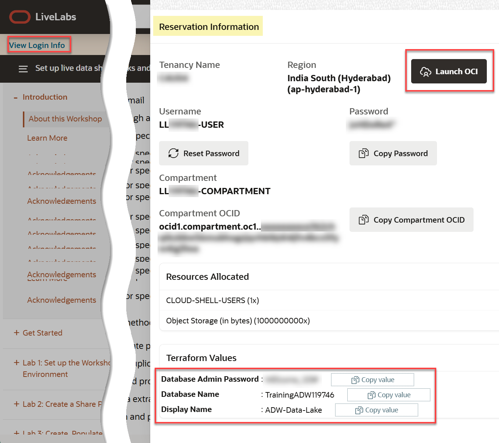
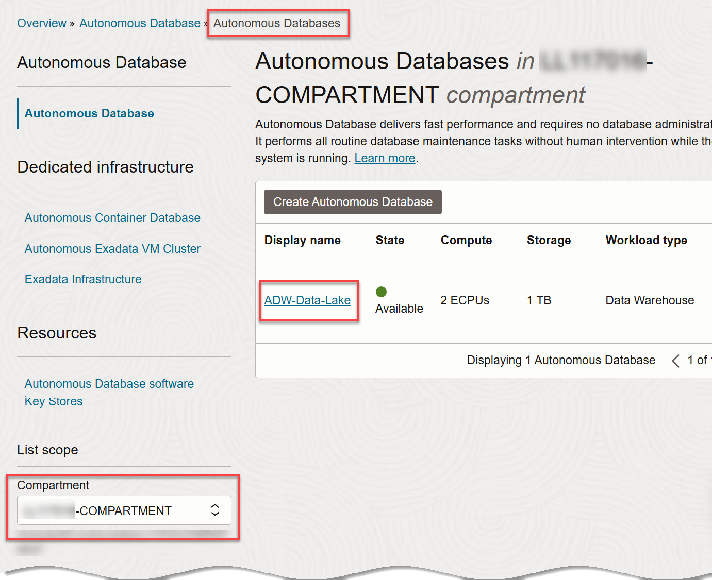
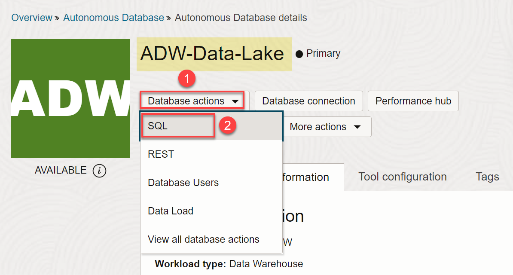
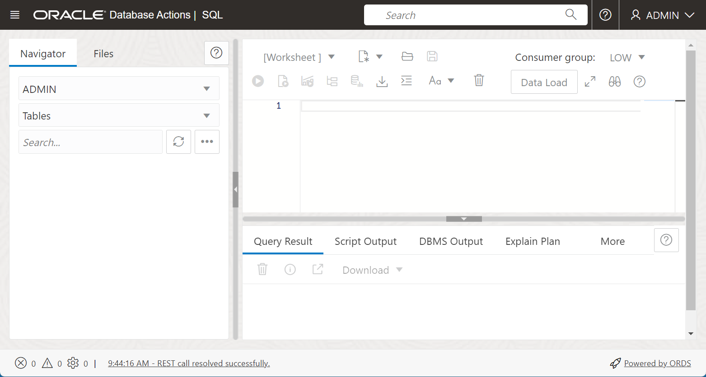
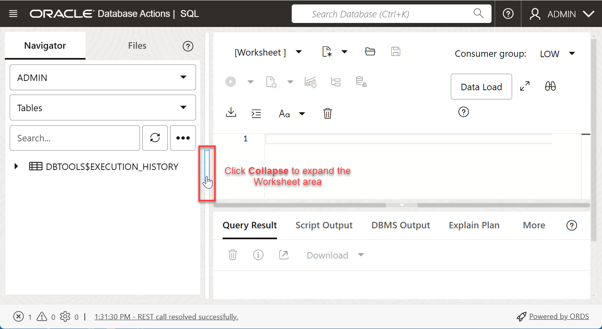
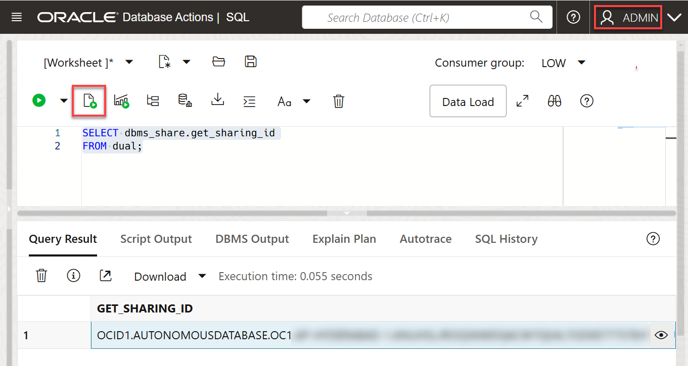
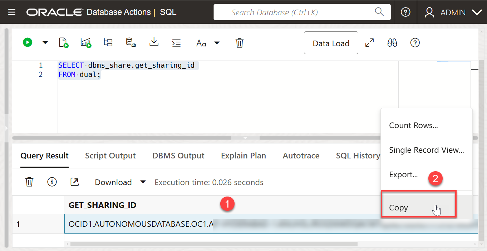
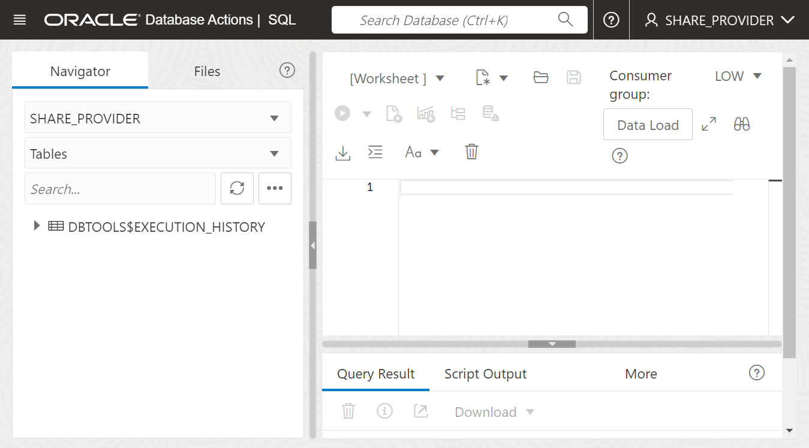

# Create a Share Provider User and Grant the User Privileges

## Introduction

In this lab, you as the **`admin`**, you will create a **data share provider** user and grant this user the necessary role and privileges, and enable data sharing.


Estimated Time: 15 minutes

### Objectives

In this lab, you will:

* Create a user that will be the data share provider.
* Grant the data share provider the necessary role and privileges.
* Enable data sharing for the schema.

### Prerequisites

This lab assumes that you have successfully completed all of the preceding labs in the **Contents** menu on the left.

## Task 1: Navigate to the SQL Worksheet

<if type="livelabs">
Your green button reservation includes an ADB instance. You can find the required credentials in the **Reservation Information** dialog box for your reservation. To log in to the Console, click the **Launch OCI** button in the **Reservation Information** dialog box, and then follow the prompts to reset your assigned password. If you get a **_Forbidden_** error, make sure you select your assigned compartment from the **Compartment** drop-down list in the **List Scope** section. Your assigned compartment is listed in the **Reservation Information** dialog box.

 

</if>

1. Log in to the **Oracle Cloud Console**, if you are not already logged in.

2. Open the **Navigation** menu and click **Oracle Database**. Under **Oracle Database**, click **Autonomous Database**.

3. On the **Autonomous Databases** page, click your **ADW-Data-Lake** ADB instance.
    

4. On the **Autonomous Database details** page, click the **Database actions** drop-down list, and then click **SQL**.

    

5. The SQL Worksheet is displayed. If some informational boxes are displayed, close them.

    

6. To display more of the Worksheet area and hide the Navigation pane, click the **Collapse** icon.

    


## Task 2: Create a Share Provider User and Grant Privileges to the User

As the **`admin`** user, create a **share_provider** user and grant this user the required role and privileges and enable REST and data sharing.

### **The Data Share Provider**

Oracle Autonomous Database Serverless enables the data share provider to share existing objects such as tables with authorized recipients. The share can contain a single table, a set of related tables, a set of tables with some logical grouping. The provider could be a person, an institution, or a software system that shares the objects.

Autonomous Database comes with a predefined database role named `DWROLE`. This role provides the privileges necessary for most database users;however, The DWROLE role does not allocate any tablespace quota to the user. If the user is going to be adding data or other objects, you need to grant the user tablespace quota. For more information about this role, see [Manage Database User Privileges](https://docs.oracle.com/en-us/iaas/autonomous-database/doc/managing-database-users.html).

1. Create a **share_provider** user and grant this user the required role and privileges and enable REST and data sharing. Copy and paste the following script into your SQL Worksheet, and then click the **Run Script (F5)** icon in the Worksheet toolbar.

    ```
    <copy>
    -- Create a new user that will provide the shared data.

    CREATE USER share_provider IDENTIFIED BY DataShare4ADW;

    -- Grant the new user the required role and privileges.

    GRANT CONNECT TO share_provider;
    GRANT DWROLE TO share_provider;
    GRANT RESOURCE TO share_provider;
    GRANT UNLIMITED TABLESPACE TO share_provider;

    -- Enable REST.

    BEGIN
        ORDS_ADMIN.ENABLE_SCHEMA(
            p_enabled => TRUE,
            p_schema => 'SHARE_PROVIDER',
            p_url_mapping_type => 'BASE_PATH',
            p_url_mapping_pattern => 'share_provider',
            p_auto_rest_auth=> TRUE
        );

    -- Enable data sharing.
        DBMS_SHARE.ENABLE_SCHEMA(
        SCHEMA_NAME => 'SHARE_PROVIDER',
        ENABLED => TRUE
        );
       commit;
    END;
    /
    </copy>
    ```

    

    The results are displayed in the **Script Output** tab.

    

## Task 3: Get the Consumer's Share ID and the Share Provider User Information

1. As the **`ADMIN`** user, get the consumer's Share ID. The Data Provider intends to share data with some Oracle ADB. To identify the data consumer, you need to get the **Sharing ID**. Copy and paste the following script into your SQL Worksheet, and then click the **Run Statement** icon in the Worksheet toolbar.

    ```
    <copy>
    SELECT dbms_share.get_sharing_id
    FROM dual;
    </copy>
    ```

    

2. Copy the **`get_sharing_id`** value to a text editor of your choice. You will need this value later. Right-click the **`get_sharing_id`** value, and then click **Copy** from the context.

    

    Copy the value and paste it into your text editor file.

    

3. Log out of the **`ADMIN`** user. On the **Oracle Database Actions | SQL** banner, click the drop-down list next to the **`ADMIN`** user, and then select **Sign Out** from the drop-down menu. When prompted if you want to leave the site, click **Leave**.

    

4. Log in as the newly created user, **`share_provider`**. On the **Sign-in** page, enter **`share_provider`** as the username and **`DataShare4ADW`** as the password, and then click **Sign in**.

    

    You are now logged in as the newly created **`share_provider`** user. On the Launchpad, click the **Development** tab, and then click the **SQL** tab.

    

    The SQL Worksheet is displayed. If an information box is displayed, close it.

    


5. Provide the share provider user identity information. This enables consumers to see this share provider user and the user's shared data. This is a free form metadata. Provide a meaningful **name**, **description**, and an **email** address. Copy and paste the following script into your SQL Worksheet, and then click the **Run Script (F5)** icon in the Worksheet toolbar.

    ```
    <copy>
    BEGIN
    dbms_share.set_published_identity(SYS.JSON_OBJECT_T(JSON_OBJECT(
        -- A name that will be visible to recipients.
        -- Give enough information to be identifiable
        'name' VALUE 'LIVE_SHARE_PROVIDER_'
        || SYS_CONTEXT('USERENV', 'CON_NAME') || '/' || USER,
        'description' VALUE 'Live Share Provider',
        'contact' VALUE 'provider@example.com')));
    END;
    /
    </copy>
    ```

    

6. Query the share provider user identity information. Copy and paste the following query into your SQL Worksheet, and then click the **Run Script (F5)** icon.

    ```
    <copy>
    SELECT *
    FROM JSON_TABLE(
    dbms_share.get_published_identity, '$'
    COLUMNS (name, description, contact));
    </copy>
    ```

    

You may now proceed to the next lab.

## Learn More

* [Oracle Cloud Infrastructure Documentation](https://docs.cloud.oracle.com/en-us/iaas/Content/GSG/Concepts/baremetalintro.htm)
* [Using Oracle Autonomous Database Serverless](https://docs.oracle.com/en/cloud/paas/autonomous-database/adbsa/index.html)

## Acknowledgements

* **Author:** Lauran K. Serhal, Consulting User Assistance Developer
* **Contributor:** Alexey Filanovskiy, Senior Principal Product Manager
* **Last Updated By/Date:** Lauran K. Serhal, December 2024

Data about movies in this workshop were sourced from Wikipedia.

Copyright (c) 2024, Oracle Corporation.

Permission is granted to copy, distribute and/or modify this document
under the terms of the GNU Free Documentation License, Version 1.3
or any later version published by the Free Software Foundation;
with no Invariant Sections, no Front-Cover Texts, and no Back-Cover Texts.
A copy of the license is included in the section entitled [GNU Free Documentation License](https://oracle-livelabs.github.io/adb/shared/adb-15-minutes/introduction/files/gnu-free-documentation-license.txt)
