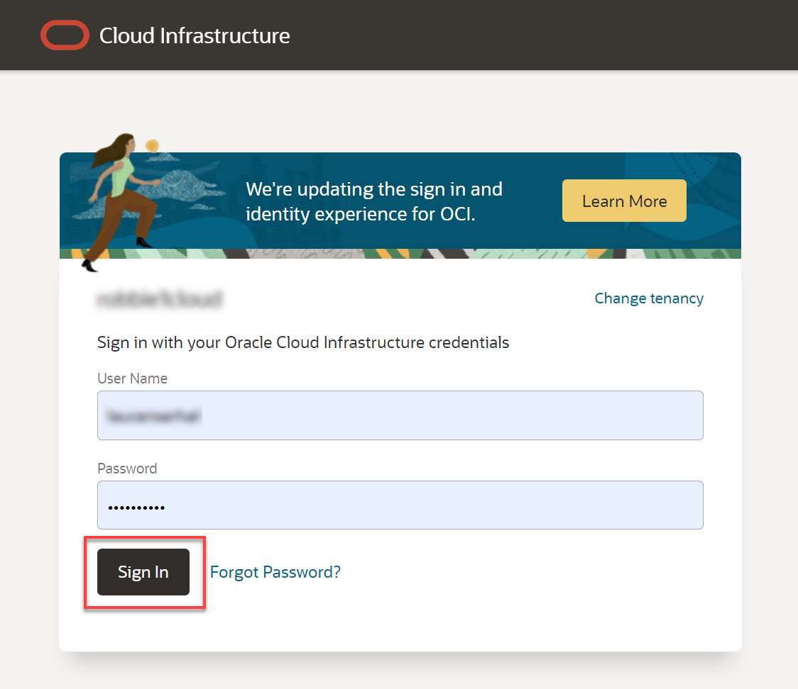
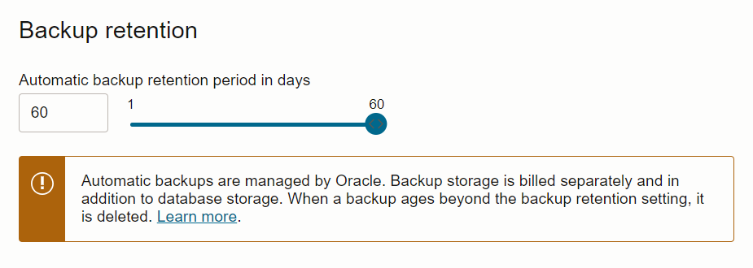
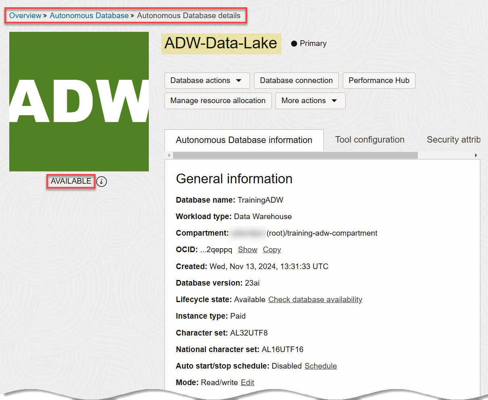

<!--- This is a comment. --->

# Set Up the Workshop Environment

## Introduction

This lab walks you through the steps to set up the workshop environment.

> **Note:** This workshop is directed at administrator users because they are have the required privileges.

Estimated Time: 5 minutes

### Objectives

In this lab, you will:

* Log in to the Oracle Cloud Console.
* (Optional) Create a compartment for your resources.
* Create an Autonomous Warehouse instance.

### Prerequisites

* An Oracle Cloud Account - Please view this workshop's LiveLabs landing page to see which environments are supported.

> **Note:** If you have a **Free Trial** account, when your Free Trial expires your account will be converted to an **Always Free** account. You will not be able to conduct Free Tier workshops unless the Always Free environment is available. [Click here for the Free Tier FAQ page.](https://www.oracle.com/cloud/free/faq.html)

## Task 1: Log in to the Oracle Cloud Console

1. Log in to the **Oracle Cloud Console** as the Cloud Administrator. You will complete all the labs in this workshop using this Cloud Administrator.
See [Signing In to the Console](https://docs.cloud.oracle.com/en-us/iaas/Content/GSG/Tasks/signingin.htm) in the _Oracle Cloud Infrastructure_ documentation.

2. On the **Sign In** page, select your tenancy, enter your username and password, and then click **Sign In**.

   

   The **Oracle Cloud Console** Home page is displayed.

   

    >**Note:** To zoom in (magnify) a displayed image in this workshop, hover over the image to display the magnifying glass icon, and then then click the image.

   

## Task 2: (Optional) Create a Compartment

A Cloud Administrator can optionally create a compartment in your tenancy to help organize your resources. In this lab, as a Cloud Administrator, you will create a new compartment that will group all of your resources that you will use in the workshop.

1. Open the **Navigation** menu and click **Identity & Security**. Under **Identity**, click **Compartments**.

       

    For faster navigation, you can pin items that you use frequently. To pin an item, hover over the menu item and then click pin to the left of the item name.

    

    The pinned item is displayed in the **Pinned** section of the **Home** tab the next time you use the Navigation menu.

    

    The **Recently visited** section of the **Home** tab shows recently used navigation items.

    To quickly find navigation menu items, use the **Search** box.

2. On the **Compartments** page, click **Create Compartment**.

   

3. In the **Create Compartment** dialog box, enter **`training-adw-compartment`** in the **Name** field and **`Training ADW Compartment`** in the **Description** field.

4. In the **Parent Compartment** drop-down list, select your parent compartment, and then click **Create Compartment**.

   

   The **Compartments** page is re-displayed and the newly created compartment is displayed in the list of available compartments.

   

## Task 3: Create an Autonomous Data Warehouse Instance

1. Log in to the **Oracle Cloud Console** as the Cloud Administrator, if you are not already logged in. On the **Sign In** page, select your tenancy, enter your username and password, and then click **Sign In**. The **Oracle Cloud Console** Home page is displayed.

2. Open the **Navigation** menu and click **Oracle Database**. Under **Oracle Database**, click **Autonomous Data Warehouse**.

3. On the **Autonomous Databases** page, select your compartment from the **Compartment** drop-down list in the **List Scope** section. In this example, we selected our **`training-adw-compartment`**. Click **Create Autonomous Database**. The **Create Autonomous Database** page is displayed.

4. In the **Provide basic information for the Autonomous Database** section, specify the following:
       * **Compartment:** Select your own compartment.
       * **Display Name:** **`ADW-Data-Lake`**.
       * **Database Name:** **`TrainingADW`**.

       

5. In the **Choose a workload type** section, accept the **Data Warehouse** default selection.

       

6. In the **Choose a deployment type** section, accept the **Serverless** default selection.

       

7. In the **Configure the database** section, accept the default selections as follows:

       - **Always Free**: An Always Free databases are especially useful for development and trying new features. You can deploy an Always Free instance in an Always Free account or paid account. However, it must be deployed in the home region of your tenancy. The only option you specify in an Always Free database is the database version. For this lab, we recommend you leave **Always Free** unchecked unless you are in an Always Free account.
       - **Developer**: Developer databases provide a great low cost option for developing apps with Autonomous Database. You have similar features to Always Free - but are not limited in terms of region deployments or the number of databases in your tenancy. You can upgrade your Developer Database to a full paid version later and benefit from greater control over resources, backups and more.
       - **Choose database version**: Select your database version from this drop-down list.
       - **ECPU count**: Choose the number of ECPUs for your service. For this lab, specify ****. If you choose an Always Free database, you do not need to specify this option.
       - **Storage (TB)**: Select your storage capacity in terabytes. For this lab, specify **** of storage. Or, if you choose an Always Free database, it comes with 20 GB of storage.
       - **Compute auto scaling**: Accept the default which is enabled. This enables the system to automatically use up to three times more compute and IO resources to meet workload demand.
       - **Storage auto scaling**: For this lab, there is no need to enable storage auto scaling, which would allow the system to expand up to three times the reserved storage.

       > **Note:** You cannot scale up/down an Always Free autonomous database.

       

       >**Note:** You can click the **Show advanced options** link to use your organization's on-premise licenses with **bring your own license** or to take advantage of database consolidation savings with **elastic pools**.

8. In the **Backup retention** section, you can either accept the default value or specify your own preferred backup retention days value. Accept the default **60** days default value.

       

9. In the **Create administrator credentials** section, specify the following:

       * **Username:** This read-only field displays the default administrator username, **`ADMIN`**.
       **Important:** Make a note of this _username_ as you will need it to perform later tasks.
       * **Password:** Enter a password for the **`ADMIN`** user of your choice such as **`Training4ADW`**.
       **Important:** Make a note of this _password_ as you will need it to perform later tasks.
       * **Confirm password:** Confirm your password.

       

10. In the **Choose network access** section, select the **Secure access from everywhere** option as the access type.

       

11. In the **Provide contacts for operational notifications and announcements** section, do not provide a contact email address. The **Contact email** field allows you to list contacts to receive operational notices and announcements as well as unplanned maintenance notifications.

       

12. Click __Create Autonomous Database__.

       

13. The **Autonomous Database details** page is displayed. The status of your ADB instance is **PROVISIONING**.

    

    A **Check database lifecycle state** informational box is displayed. You can navigate through this tour or choose to skip it. Click **Skip tour**. A **Skip guided tour** dialog box is displayed. Click **Skip**.

    In a few minutes, the instance status changes to **AVAILABLE**. At this point, your Autonomous Data Warehouse database instance is ready to use! Review your instance's details including its name, database version, ECPU count, and storage size.

    

13. Click the **Autonomous Database** link in the breadcrumbs. The **Autonomous Database** page is displayed. The new Autonomous Database instance is displayed.

    

You may now proceed to the next lab.

## Learn More

* [Oracle Cloud Infrastructure Documentation](https://docs.cloud.oracle.com/en-us/iaas/Content/GSG/Concepts/baremetalintro.htm)
* [Using Oracle Autonomous Database Serverless](https://docs.oracle.com/en/cloud/paas/autonomous-database/adbsa/index.html)

## Acknowledgements

* **Author:** Lauran K. Serhal, Consulting User Assistance Developer
* **Last Updated By/Date:** Lauran Serhal, December 2024

Data about movies in this workshop were sourced from Wikipedia.

Copyright (c) 2024 Oracle Corporation.

Permission is granted to copy, distribute and/or modify this document under the terms of the GNU Free Documentation License, Version 1.3 or any later version published by the Free Software Foundation; with no Invariant Sections, no Front-Cover Texts, and no Back-Cover Texts. A copy of the license is included in the section entitled [GNU Free Documentation License](https://oracle-livelabs.github.io/adb/shared/adb-15-minutes/introduction/files/gnu-free-documentation-license.txt)
