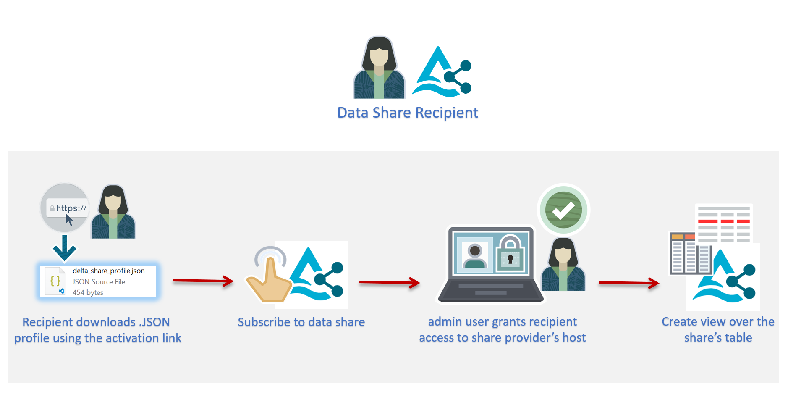
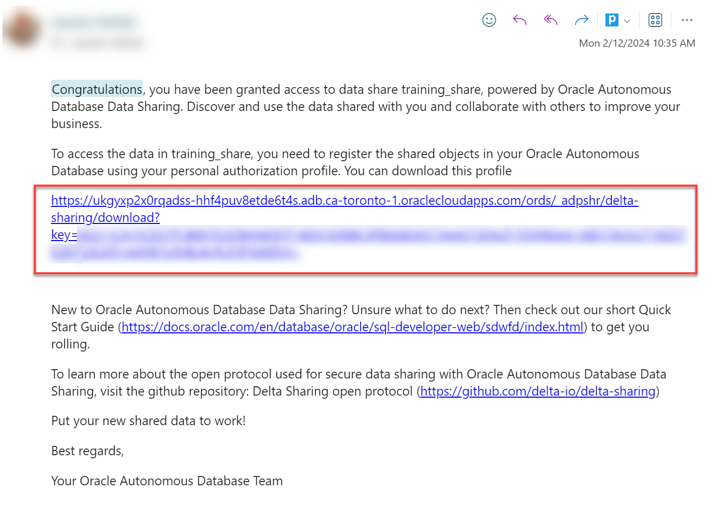
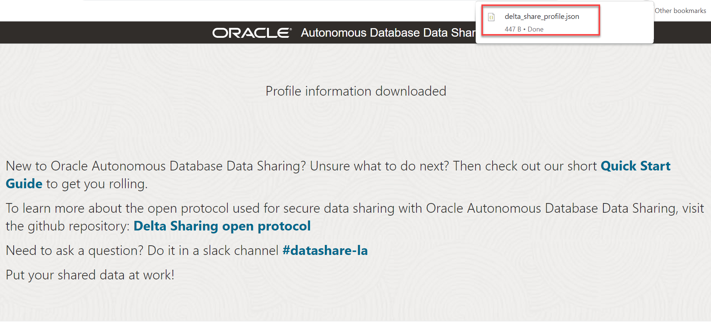
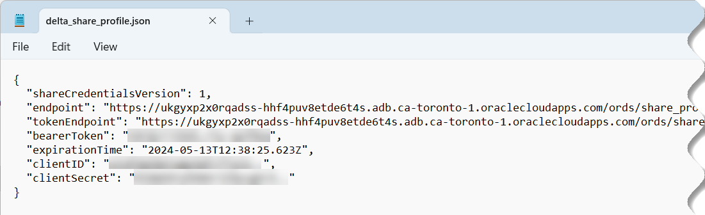
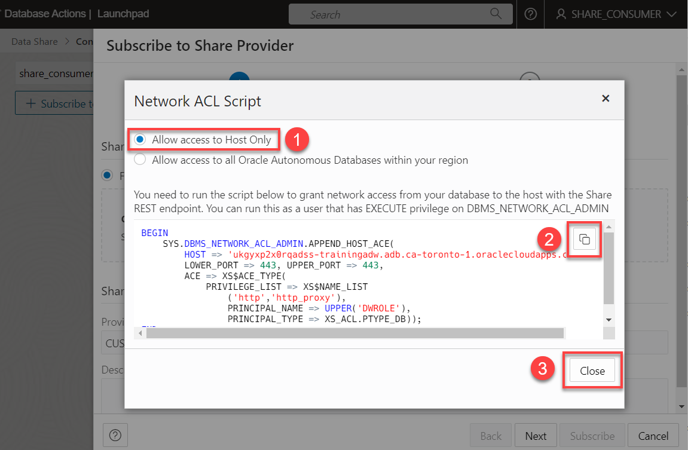
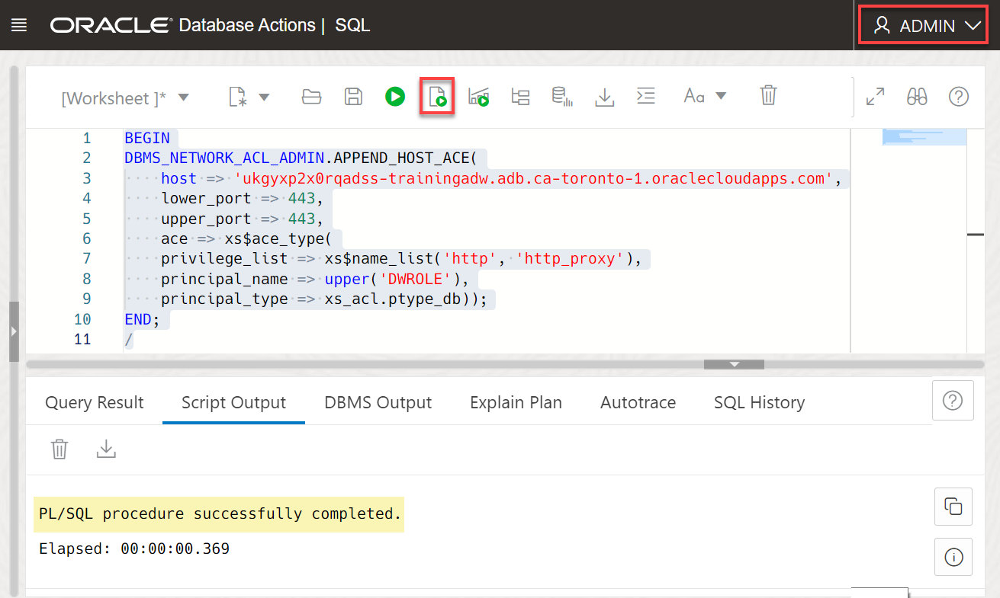
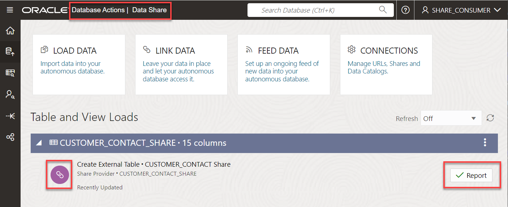

# Consume the Data Share by the Recipient

## Introduction

In this lab you will learn how to consume the data in your available data share as a recipient.



Estimated Time: 10 minutes

### Objectives

In this lab, you will:

* Request ACL privileges to the share provider's host that contains the share.
* Create access credential to the share.
* Subscribe to the data share provider.
* Access the data in your authorized data share.

### Prerequisites

This lab assumes that you have successfully completed all of the preceding labs in the **Contents** menu on the left.

## Task 1: Download the delta_share_profile.json Configuration File

As the **`training_recipient`**, you can use the activation link URL that was sent to you by by the **`share_provider`** via email to download the **`delta_share_profile.json`** configuration file. This file (delta profile) contains the required credentials that you need in order to connect to the data share and access the shared table.

>**Note:** For the recipient to download the `.json` file, it doesn't matter what user you are logged in as. All you need is a Web browser.

1. Open the email that was sent to you which contains the activation link URL.

    

2. Copy the activation link URL that was provided to you by your share provider and paste it in your web browser's address bar.

    

3. Press **[Enter]**. The **Autonomous Database Data Sharing** page is displayed. To download the config file, click **Get Profile Information**.

    

    >**Note:** You can download this profile file only once; therefore, make sure you save it once it's downloaded.

    The **Profile information downloaded** page is displayed and the downloaded file is displayed in a popup window.

    

4. The **`delta_share_profile`.json** file is downloaded to your browser's Downloads directory.

    

5. Open the downloaded file. The file content is displayed. You will need this information to connect and use the data share.

    

<!--- comment
2. Log out of the `admin` user. On the **Oracle Database Actions | SQL** banner, click the drop-down list next to the `ADMIN` user, and then select **Sign Out** from the drop-down menu. Click **Leave**.

3. Log in as the newly created user, `share_consumer`. On the **Sign-in** page, enter **`share_consumer`** as the username and **`DataShare4ADW`** as the password, and then click **Sign in**.

    

    You are now logged in as the `share_consumer` user. In the **Development** section, click the **SQL** card to display the SQL Worksheet.
--->

## Task 2: Log in as the share_consumer User

1. Log in as the **`share_consumer`** user. On the **Sign-in** page, enter **`share_consumer`** as the username and **`TrainingADW`** as the password, and then click **Sign in**.

2. Scroll-down to the **Data Studio** section, and then click the **DATA SHARE** tile.

    

## Task 3: Subscribe to Share Provider

To consume a data share, a recipient must have the required network connection to access the `share_provider` user host machine that contains the data share using `Port 443`. This is a virtual port used for secure internet network traffic and connection purposes using the `HTTPS` secure protocol. In order to set the ACL on the host machine for the recipient, you as the `admin` user (or some other privileged user) will need the host machine **`endpoint`** value which you can find in the downloaded `JSON` profile file from the previous lab.

1. On the **Provider and Consumer** page, click the **CONSUMER SHARE** tile to display the **Consume Share** page.

    

2. Click **+ Subscribe to Share Provider**.

3. The **Network ACL Script** dialog box is displayed. Before you can access the data share to which the `share_provider` user gave you access, you need to be able to access the host machine. Accept the selected **Allow access to Host Only** option. Click the **Copy** icon to copy the script into your clipboard so that you can share it with your **`admin`** (or a privileged) user to run it on your behalf. The code is also available below. For information about the `DBMS_NETWORK_ACL_ADMIN` package, see the [PL/SQL Packages and Types Reference](https://docs.oracle.com/en/database/oracle/oracle-database/19/arpls/DBMS_NETWORK_ACL_ADMIN.html#GUID-254AE700-B355-4EBC-84B2-8EE32011E692) documentation.

    

    > **Note:** Make sure to replace the host value in the following code example with your own share provider's host machine that you can find in the `.JSON profile`.

4. As an `admin` user, copy and paste the following script into your SQL Worksheet, and then click the **Run Script** icon.

    ```
    <copy>
    BEGIN
    DBMS_NETWORK_ACL_ADMIN.APPEND_HOST_ACE(
        host => 'ukgyxp2x0rqadss-trainingadw.adb.ca-toronto-1.oraclecloudapps.com',
        lower_port => 443,
        upper_port => 443,
        ace => xs$ace_type(
        privilege_list => xs$name_list('http', 'http_proxy'),
        principal_name => upper('DWROLE'),
        principal_type => xs_acl.ptype_db));
    END;
    /
    </copy>
    ```

    

5. After your `admin` user runs the above code, you can continue with the steps for **+ Subscribe to Share Provider**. In the **Subscribe to Share Provider** wizard, on the **Provider Settings** page, provide the following information:

    * **Share Provider JSON:** Accept the **From file** option.
    * **Delta Share Profile JSON:** Click this field to display the **Open** dialog box. Navigate to your **Downloads** directory where you downloaded the **`delta_share_profile.json`** file, and then click **Open**.

        
    * **Provider Name:** Enter a name such as **`CUSTOMER_SHARE_PROVIDER`**.
    * **Description:** Enter an optional description.

        

6. Click **Next**. On the **Add Shares** page, click the **TRAINING_SHARE** in the **Available Shares** section, and then click the **Select** (>) icon.

    

    The share is added to the **Selected Shares** section. Click **Subscribe**.

    

    The **Link Cloud Object** page is displayed. The **`CUSTOMER_CONTACT_SHARE`** table in the **TRAINING_SHARE** data share that the `share_provider` user had shared with you as a recipient is added as a link job to the page.

    

7. Click **Start**. A **Run Data Load Job** dialog box is displayed. Click **Run**. When the job completes successfully, a **Complete** icon with a green checkmark is displayed. Click **Done**.

    

8. Click the **Database Actions | Launchpad** banner, and then select the **SQL** tile from the **Development** section to display the SQL Worksheet.

9. From the **Navigator** tab, drag and drop the **CUSTOMER_CONTACT_SHARE** table onto the editor. A **Choose the type of insertion** dialog box is displayed. Click **Select** and then click **Apply**.

    

    The query is displayed in the Worksheet.

10. Click the **Run Statement** icon in the toolbar. The query result is displayed in the **Query Result** tab.

    

You may now proceed to the next lab.

## Learn More

* [Oracle Cloud Infrastructure Documentation](https://docs.cloud.oracle.com/en-us/iaas/Content/GSG/Concepts/baremetalintro.htm)
* [Using Oracle Autonomous Database Serverless](https://docs.oracle.com/en/cloud/paas/autonomous-database/adbsa/index.html)

## Acknowledgements

* **Author:** Lauran K. Serhal, Consulting User Assistance Developer
* **Contributor:** Alexey Filanovskiy, Senior Principal Product Manager
* **Last Updated By/Date:** Lauran K. Serhal, August 2023

Data about movies in this workshop were sourced from Wikipedia.

Copyright (C) Oracle Corporation.

Permission is granted to copy, distribute and/or modify this document
under the terms of the GNU Free Documentation License, Version 1.3
or any later version published by the Free Software Foundation;
with no Invariant Sections, no Front-Cover Texts, and no Back-Cover Texts.
A copy of the license is included in the section entitled [GNU Free Documentation License](files/gnu-free-documentation-license.txt)