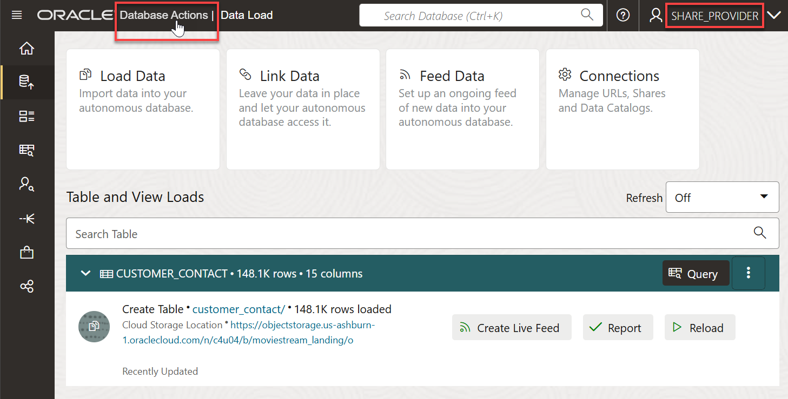
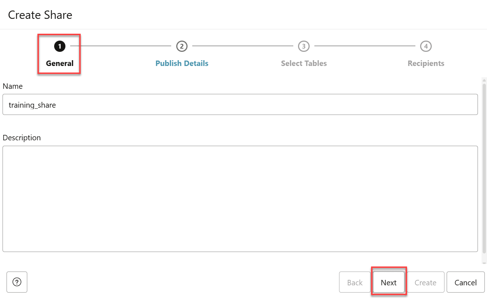
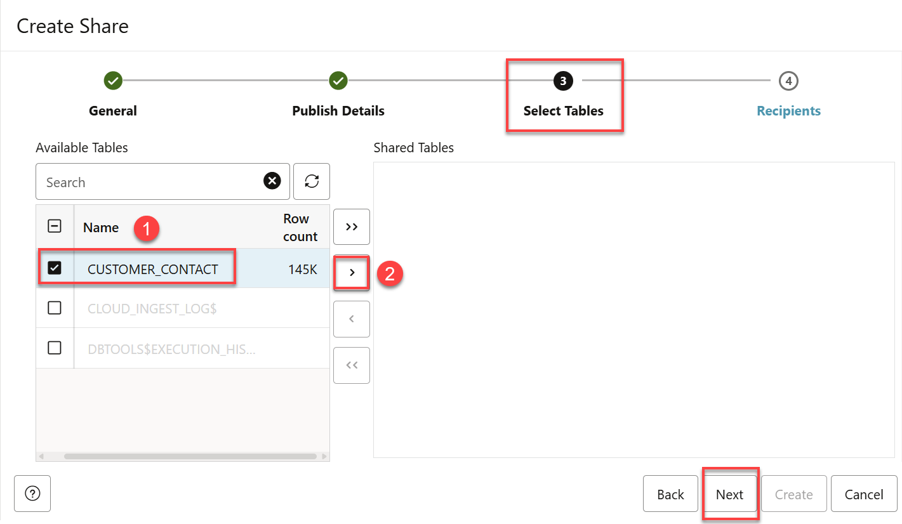
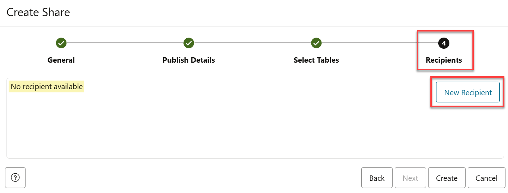
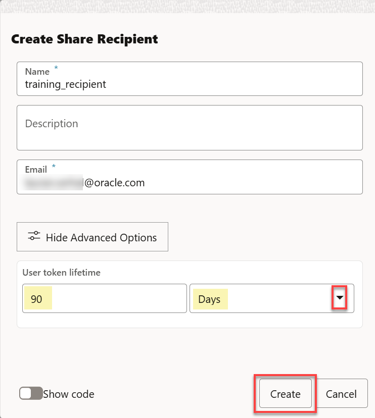
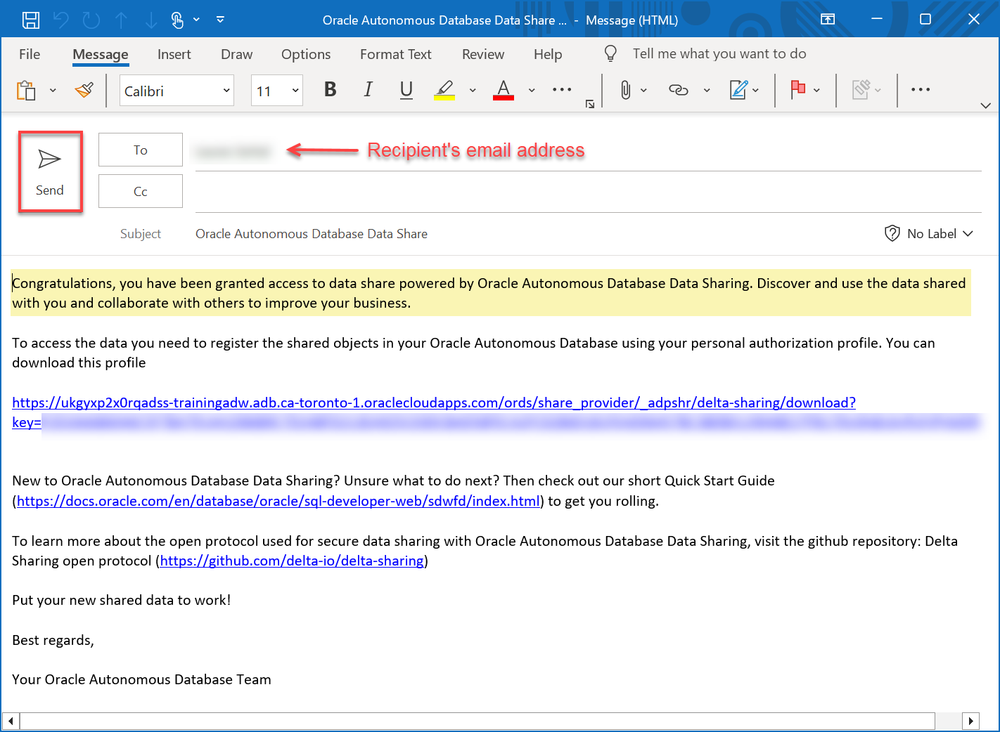
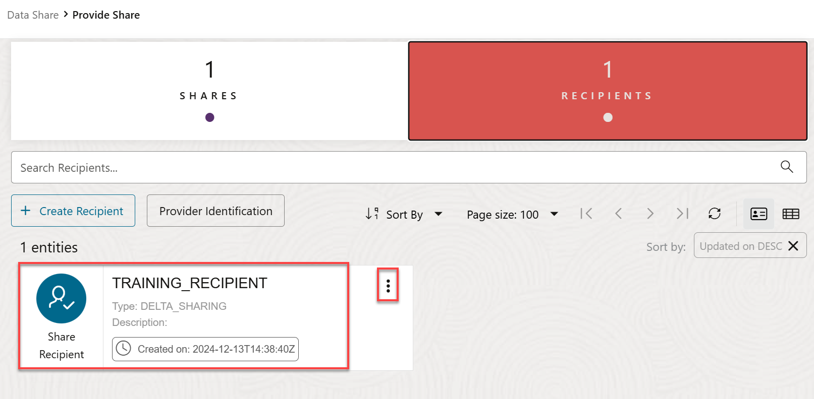

# Create, Populate, and Publish a Data Share

## Introduction

A data share is a named entity in the provider’s instance. It can be a group of datasets shared as a single entity. The share is the logical container that contains objects such as tables that you will share with recipients. An authorized data share recipient can  access the share and all the tables in it.

In this lab, as a share provider user, you will create a data share and add a table to it. Next, you will create a new recipient that will have access to this data share. Finally, you will publish the data share and send the recipient the activation link needed to access the data share.

 

Estimated Time: 15 minutes

### Objectives

In this lab, you will:

* Create a new data share as the **`share_provider`** user.
* Add the **`customer_contact`** table from the previous lab to the data share.
* Create a new data share recipient named **`training_recipient`**.
* Publish the data share to make it available to authorized recipients.
* Share the data share activation link with the recipient to download the `delta_share_profile.json` configuration file.

### Prerequisites

* This lab assumes that you have successfully completed all of the preceding labs in the **Contents** menu on the left.

## Task 1: Navigate to Data Share

1. Make sure you are still logged in as the **share_provider** user. Click **Oracle Database Actions | Launchpad** in the banner to display the Launchpad.

    

2. Scroll-down to the **Data Studio** section, and then click the **DATA SHARE** tile.

     

     >**Note:** If you do not see the **DATA SHARE** card in the **Data Studio** section, it indicates that your database user is missing the required **`DWROLE`** role.

     The **Provider and Consumer** page is displayed. The **PROVIDE SHARE** and the **CONSUME SHARE** tools enable you to create a data share as a share provider and to subscribe and consume a data share as a recipient respectively. You can click the [Quick Start Guide](https://docs.oracle.com/en/database/oracle/sql-developer-web/sdwfd/index.html) button to view step by step instructions on how to use Oracle Autonomous Database as a data share provider and as a data share recipient. For the complete Data Share documentation, see [The Data Share Tool](https://docs.oracle.com/en/cloud/paas/autonomous-database/adbsa/adp-data-share-tool.html#GUID-7EECE78B-336D-4853-BFC3-E78A7B8398DB).

    

## Task 2: Create and Publish a Data Share

As the **`share_provider`** user, create a new data share named **`training_share`**.

1. To create a new data share, click the **PROVIDE SHARE** tool on the Home page. Alternatively,in the Navigation pane on the left, drill-down on the **Data Share** node, and then click **Provide Share**.

    

2. On the **Provide Share** page, there are no data shares or recipients initially. Click **Create Share**.

    

    The **Create Share** wizard is displayed.

3. On the **General** page, enter **`training_share`** as the name for the new share, an optional description, and then click **Next**.

    

4. On the **Publish Details** page, select the **DELTA\_SHARE\_STORAGE** credential that you created in the previous lab from the drop-down list, and then click **Next**.

    

5. On the **Select Tables** page, add the **`CUSTOMER_CONTACT_SHARE`** table that you created in the previous lab to the **`training_share`** data share. In the **Available Tables** section, click the table name, and then click the **Select** (>) icon.

    

    The **`CUSTOMER_CONTACT_SHARE`** table is added to the **Shared Tables** section. Click **Next**.

    

6. On the **Recipients** page, there are no recipients available initially. Create a new recipient that will consume this data share. Click **New Recipient**.

    

7. In the **Create Share Recipient** panel, enter **`training_recipient`** as the name of the recipient, an optional description, and the recipient's email address. Next, click **Create** to create the new recipient.

    

8. The new recipient is displayed in the **Create Share** page.

    

9. Click **Create** to create and publish the data share. The **Provide Share** page is displayed. Two information boxes are displayed briefly to indicate that the share is created and that publishing is in progress. The **training_share** is displayed along with its details such as the entity type, owner, shared objects, and the recipients. Note the status of the share is **Unpublished**. It will take a few minutes to publish it depending on the size of the table in the share.

    

10. An email message that will be sent to the recipient is automatically generated and displayed. This email message contains the _personal authorization profile_ (activation link) URL that the recipient will use to download the **`delta_share_profile.json`** configuration file. This file is required to access the data share in the next lab. In our example, we are using Microsoft Outlook as the email client. Click **Send** to send the email to the recipient.

    

11. After a few minutes, click the **Reload** icon to refresh the page. The status of the **training_share** is now **Published**.

    

12. Click the **RECIPIENTS** tile. The **`training_recipient`** is displayed along with its details.

    

    When you publish a `versioned` share type, the tool generates and stores the data share as `parquet` files in the specified bucket such as `data-share-bucket` in our example. Any authenticated data share recipient can directly access the share in that bucket.

    

13. Log out of the **`SHARE_PROVIDER`** user. On the **Oracle Database Actions | Data Share** banner, click the drop-down list next to the `SHARE_PROVIDER` user, and then select **Sign Out** from the drop-down menu. If you are prompted to leave, click **Leave**.

You may now proceed to the next lab.

## Learn More

* [The Share Tool](https://docs.oracle.com/en/cloud/paas/autonomous-database/adbsa/adp-data-share-tool.html#GUID-7EECE78B-336D-4853-BFC3-E78A7B8398DB)
* [Oracle Cloud Infrastructure Documentation](https://docs.cloud.oracle.com/en-us/iaas/Content/GSG/Concepts/baremetalintro.htm)
* [Using Oracle Autonomous Database Serverless](https://docs.oracle.com/en/cloud/paas/autonomous-database/adbsa/index.html)

## Acknowledgements

* **Author:** Lauran K. Serhal, Consulting User Assistance Developer
* **Contributor:** Alexey Filanovskiy, Senior Principal Product Manager
* **Last Updated By/Date:** Lauran K. Serhal, August 2023

Data about movies in this workshop were sourced from Wikipedia.

Copyright (C) Oracle Corporation.

Permission is granted to copy, distribute and/or modify this document
under the terms of the GNU Free Documentation License, Version 1.3
or any later version published by the Free Software Foundation;
with no Invariant Sections, no Front-Cover Texts, and no Back-Cover Texts.
A copy of the license is included in the section entitled [GNU Free Documentation License](files/gnu-free-documentation-license.txt)
