# Load Data from a Public Object Storage Bucket into ADB

## Introduction

In this lab, you will load data into your ADB instance from a public bucket using the ADB Data Load built-in tool. You will then create a new table based on this data. You will add this table to the new data share that you will create as the **`share_provider`** user in the next lab.

### Objectives

In this lab, you will:

* Navigate to the Data Load page.
* Create tables and load data from public object storage buckets using Data Tools built-in to Oracle Autonomous Database

### Prerequisites

* This lab assumes that you have successfully completed all of the preceding labs in the **Contents** menu on the left.

## Task 1: Navigate to the Data Load Page

Make sure you're still logged in as the **`share_provider`** user. If you already have the **Oracle Database Actions** browser tab open from the previous lab, click the **Database Actions | SQL** banner to display the **Database Actions | Launchpad** Home page. In the **Data Studio** section, click the **DATA LOAD** card. Next, skip to **Task 2**; otherwise, start with **step 1** below.

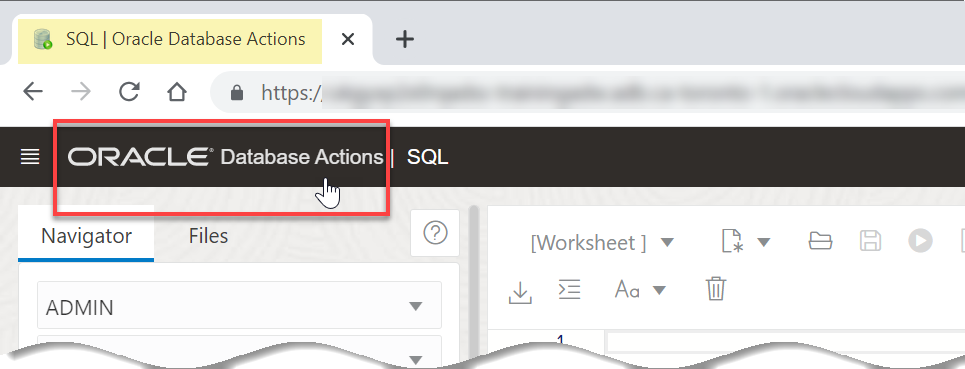

1. Log in to the **Oracle Cloud Console**, if you are not already logged as the Cloud Administrator. You will complete all the labs in this workshop using this Cloud Administrator, `ADMIN`. On the **Sign In** page, select your tenancy, enter your username and password, and then click **Sign In**. The **Oracle Cloud Console** Home page is displayed.

2. Open the **Navigation** menu and click **Oracle Database**. Under **Oracle Database**, click **Autonomous Database**.

3. On the **Autonomous Databases** page, click your **ADW-Data-Lake** ADB instance. The **Autonomous Database details** page is displayed.

4. Click the **Database actions** drop-down list, and then click **Data Load** from the drop-down menu. The **Data Load** page is displayed.

## Task 2: Load Data from a Public Object Storage Bucket and Create a Table

In this task, you will load the **sales\_sample** data into your Autonomous Database instance and then create a table.

1. In the **What do you want to do with your data?** section, click **LOAD DATA**.

2. In the **Where is your data?** section, select **CLOUD STORE**, and then click **Next**.

    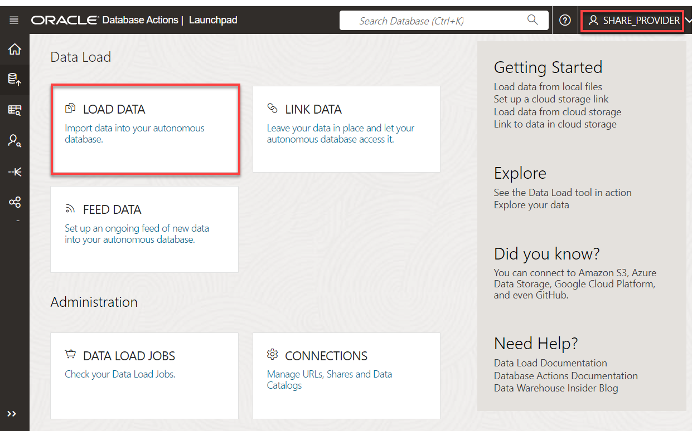

3. The **Load Cloud Object** page is displayed. Use this page to drag and drop tables from the public object storage bucket to the data linking job. The **moviestream\_landing** Oracle Object Storage bucket that contains the data is located in a different tenancy than yours, **c4u04**; therefore, you will use the following public URL.

    Copy the following object storage URL and paste it in the **Select Cloud Store Location or enter public URL** field:

    ```
    <copy>
    https://objectstorage.us-ashburn-1.oraclecloud.com/n/c4u04/b/moviestream_landing/o
    </copy>
    ```

    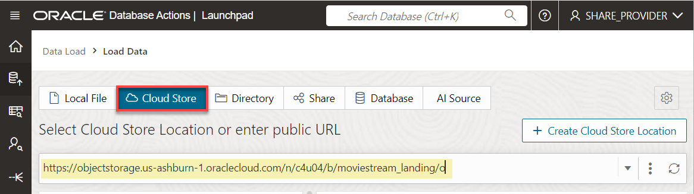

4. Click **[ENTER]** on your keyboard. A list of the folders in the selected Object Storage bucket is displayed on left side section of the page. You can drag and drop the desired folders from this section to the data loading job section.

    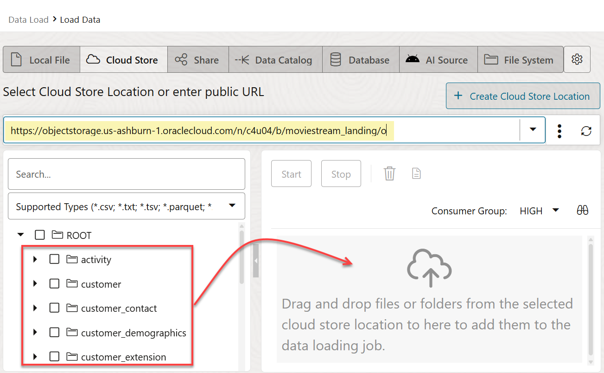

5. Drag the **`customer_contact`** folder and drop it onto the data load job section.

    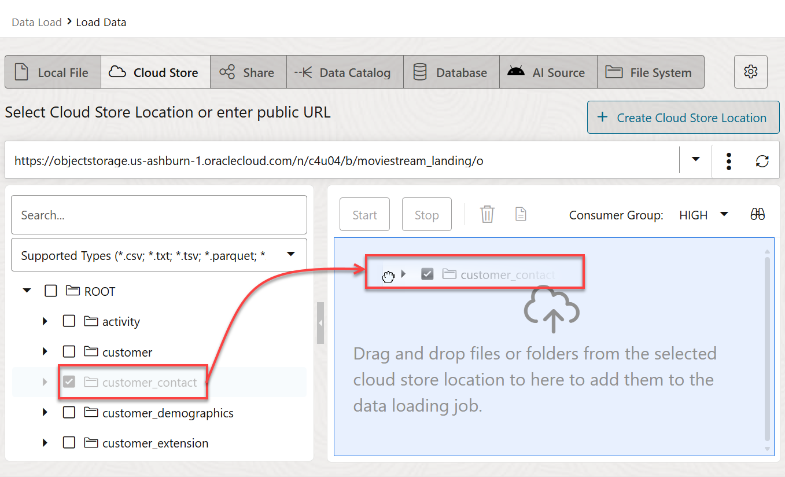

6. A dialog box is displayed to prompt you whether or not if you want to link all objects in this folder matching **.csv** to a single target table. This folder contains a single file, `customer-contact.csv`. In general, data lake folders contain many files of the same type, as you will see with sales data. Click **Yes**.

    The **`customer_contact`** target table to be created for the selected `.csv` file is displayed in the data linking job section.

    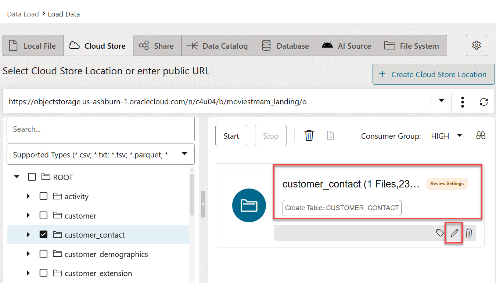

7. Click the **Actions** icon (3-dot vertical ellipsis) for the **customer\_contact** load task, and then select **Settings** from the context menu to view the settings for this task.

    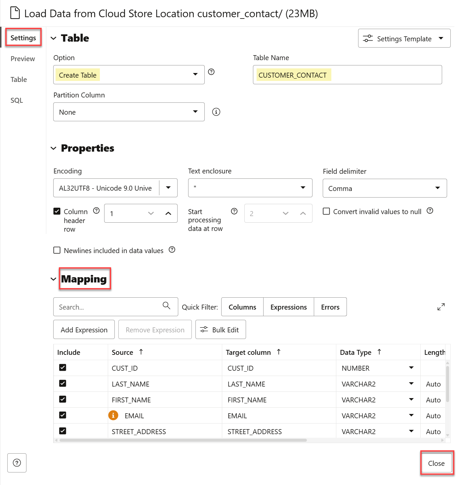

    The **Link Data from Cloud Store Location customer_contact** settings panel is displayed.

8. The **Database Actions** load job will create a **`CUSTOMER_CONTACT`** table with the listed columns and data types that are based on the selected **`.csv`** file. Review the information and the loading options. In the **Mapping** section, notice that you can change the target column names, data types, and length/precision. Click **Close** to close the settings viewer panel.

    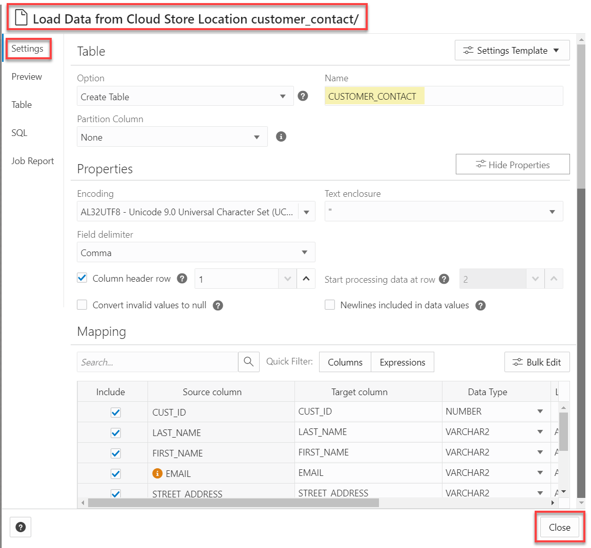

    The Load tool makes intelligent choices for the target table name and properties. Since this is an initial load, accept the default option of **Create Table**, which conveniently creates the target table in the Autonomous Database instance, without the need to predefine the table in SQL.

9. Click **Start** to run the data link job. In the **Run Data Load Job** dialog box, click **Run**.

    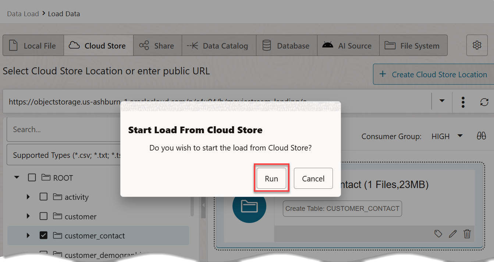

10. After the load job is completed, make sure that the data load card has a green check mark next to it. This indicates that your data load task has completed successfully.

    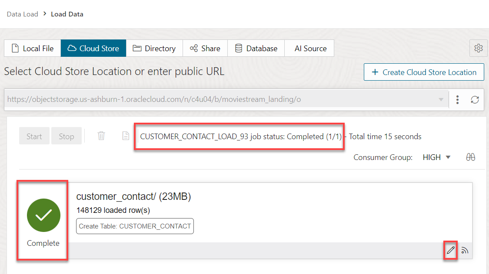

11. Click the **Actions** icon (3-dot vertical ellipsis) for the **`customer_contact`** load task, and then select **Settings** from the context menu to view its settings.

12. Review some of the load data. Click the **Table** tab to view the **`customer_contact`** data.

    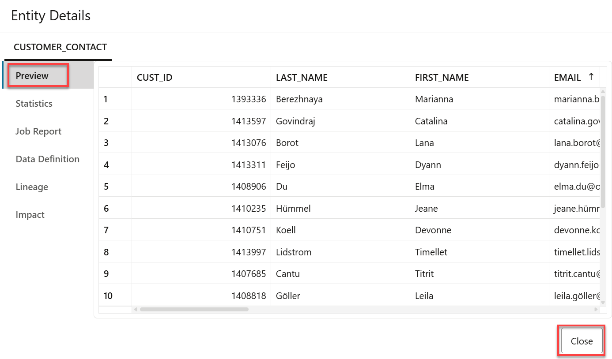

    >**Note:** You can also use the **Navigator** tab in the SQL Worksheet to view the table. You might need to click the **Refresh** icon before you can see the newly created table.

13. Click **Close** to exit the **`customer_contact`** task preview, and then click **Done** to exit the Data Load tool.

     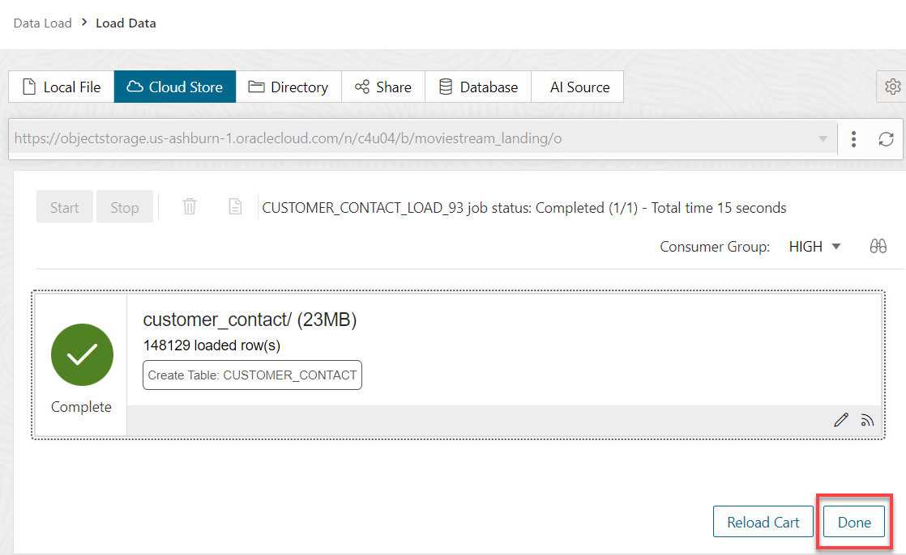

    The **Database Actions Launchpad** is displayed.

     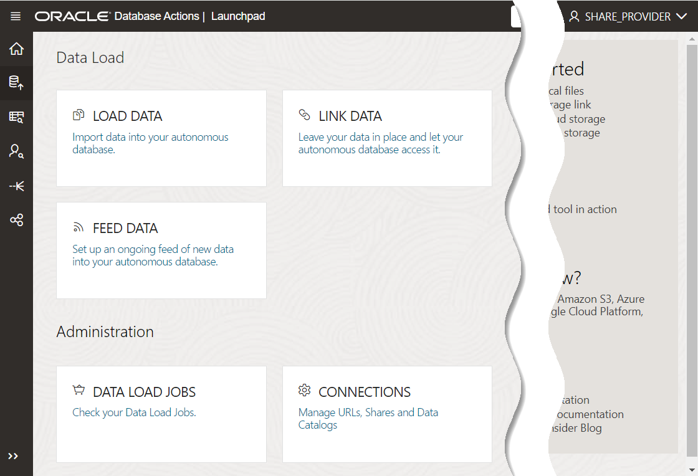

You may now proceed to the next lab.

## Learn more

* [Load Data from Files in the Cloud](https://www.oracle.com/pls/topic/lookup?ctx=en/cloud/paas/autonomous-data-warehouse-cloud&id=CSWHU-GUID-07900054-CB65-490A-AF3C-39EF45505802).
* [Load Data with Autonomous Database](https://docs.oracle.com/en/cloud/paas/autonomous-data-warehouse-cloud/user/load-data.html#GUID-1351807C-E3F7-4C6D-AF83-2AEEADE2F83E)
* [The Share Tool](https://docs.oracle.com/en/cloud/paas/autonomous-database/adbsa/adp-data-share-tool.html#GUID-7EECE78B-336D-4853-BFC3-E78A7B8398DB)

You may now proceed to the next lab.

## Acknowledgements

* **Author:** Lauran Serhal, Consulting User Assistance Developer, Oracle Database and Big Data
* **Contributors:**
    * Alexey Filanovskiy, Senior Principal Product Manager
* **Last Updated By/Date:** Lauran Serhal, August 2023

Data about movies in this workshop were sourced from Wikipedia.

Copyright (C) Oracle Corporation.

Permission is granted to copy, distribute and/or modify this document
under the terms of the GNU Free Documentation License, Version 1.3
or any later version published by the Free Software Foundation;
with no Invariant Sections, no Front-Cover Texts, and no Back-Cover Texts.
A copy of the license is included in the section entitled [GNU Free Documentation License](files/gnu-free-documentation-license.txt)
