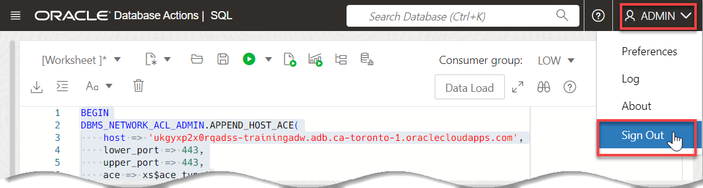
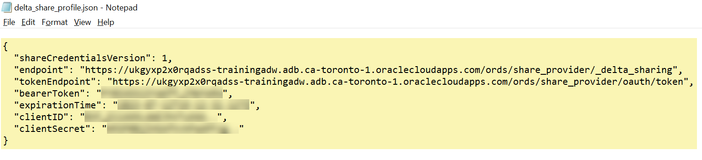
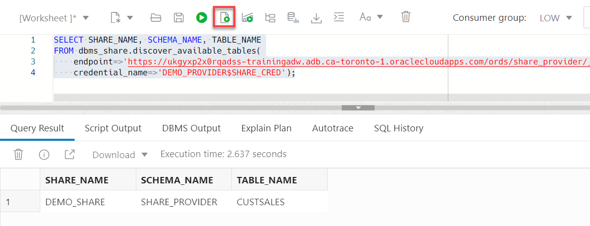
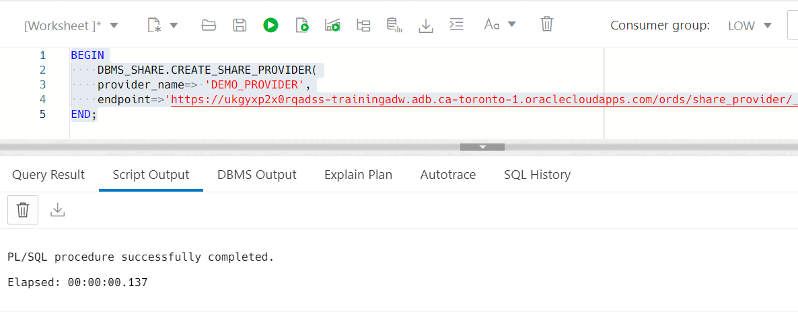

# Consume the Data Share by the Recipient

## Introduction

In this lab you will learn how to consume the data in your available data share as a recipient.


Estimated Time: 10 minutes

### Objectives

In this lab, you will:

* Request ACL privileges to the share provider's host that contains the share.
* Create access credential to the share.
* Subscribe to the data share provider.
* Access the data in your authorized data share.

### Prerequisites

This lab assumes that you have successfully completed all of the preceding labs in the **Contents** menu on the left.

## Task 1: (Optional) Create a Share Consumer User

In this lab, you will log in as the `admin` user to create a database user (schema) that will be used to consume the data share that the `share_provider` user created and shared with the `training_user` recipient. If you already have an existing schema with the appropriate privileges, you can use it. We chose to separate the share\_provider user (schema) from the share\_consumer user (schema) to simulate a real use case of data sharing between a provider and a consumer.

1. Log out of the `share_provider` user. On the **Oracle Database Actions | SQL** banner, click the drop-down list next to the `SHARE_PROVIDER` user, and then select **Sign Out** from the drop-down menu.

    

<if type="freetier">
2. Log in as the **`admin`** user. On the **Sign-in** page, enter **`admin`** as the username and **`Training4ADW`** as the password, and then click **Sign in**.
</if>

<if type="livelabs">
2. Log in as the **`admin`** user. On the **Sign-in** page, enter **`admin`** as the username. To get the password that was assigned to your reservation, click the **View Login Info** link to display the **Reservation Information** dialog box.  Scroll-down to the **Terraform Values** section, and then click **Copy value** next to the **Database Admin Password** field. Paste the value in the password field of the **Sign-in** page, and then click **Sign in**.
</if>

    

    The Database Actions Launchpad is displayed.

3. Click the **Development** tab and then click the **SQL** tab to display the SQL Worksheet.

    

4. Create a new consumer user named **`share_consumer`**. Copy and paste the following script into your SQL Worksheet, and then click the **Run Script (F5)** icon.

    ```
    <copy>
    -- Create a new user that will consume the shared data.

    CREATE USER share_consumer IDENTIFIED BY DataShare4ADW;

    -- Grant the new user the required roles.

    GRANT CONNECT TO share_consumer;
    GRANT DWROLE TO share_consumer;
    GRANT RESOURCE TO share_consumer;
    GRANT UNLIMITED TABLESPACE TO share_consumer;

    -- Enable REST.

    BEGIN
        ORDS_ADMIN.ENABLE_SCHEMA(
            p_enabled => TRUE,
            p_schema => 'SHARE_CONSUMER',
            p_url_mapping_type => 'BASE_PATH',
            p_url_mapping_pattern => 'share_consumer',
            p_auto_rest_auth=> TRUE
        );

    -- Enable data sharing
        DBMS_SHARE.ENABLE_SCHEMA(
        SCHEMA_NAME => 'SHARE_CONSUMER',
        ENABLED => TRUE
        );
       commit;
    END;
    /
    </copy>
    ```

    

    The results are displayed in the **Script Output** tab.

    

<!--- comment
2. Log out of the `admin` user. On the **Oracle Database Actions | SQL** banner, click the drop-down list next to the `ADMIN` user, and then select **Sign Out** from the drop-down menu. Click **Leave**.

3. Log in as the newly created user, `share_consumer`. On the **Sign-in** page, enter **`share_consumer`** as the username and **`DataShare4ADW`** as the password, and then click **Sign in**.

    

    You are now logged in as the `share_consumer` user. In the **Development** section, click the **SQL** card to display the SQL Worksheet.
--->

## Task 2:  Grant Recipient Access Privileges to the Share Provider's Host

To consume a data share, a recipient user must have the required network connection to access the `share_provider` user host machine that contains the data share using `Port 443`. This is a virtual port used for secure internet network traffic and connection purposes using the `HTTPS` secure protocol. In order to set the ACL on the host machine for the recipient, you as the `admin` user (or some other privileged user) will need the host machine **`endpoint`** value which you can find in the downloaded `JSON` profile file from the previous lab.


In our example, the **`endpoint`** value where the data share is located is as follows:

```
https://mqssyowmqvgac1y-trainingadw.adb.us-ashburn-1.oraclecloudapps.com/ords/share_provider/_delta_sharing
```

For the next code that you will run, _copy your own endpoint URL up to only the **`oraclecloudapps.com`** and remove everything after that, namely `/ords/admin/_delta_sharing`. In addition, don't include the `https://` at the beginning of the URL_. Paste the final edited URL in the **host** parameter. So, in our example, this is what we will use for the host value in the next code example:

```
mqssyowmqvgac1y-trainingadw.adb.us-ashburn-1.oraclecloudapps.com
```

1. As the **`admin`** user, grant the `http` and `http_proxy` privileges for the specified host to the `DWROLE` role. Use the `DBMS_NETWORK_ACL_ADMIN` package and the `APPEND_HOST_ACE` procedure. For information about the `DBMS_NETWORK_ACL_ADMIN` package, see the [PL/SQL Packages and Types Reference](https://docs.oracle.com/en/database/oracle/oracle-database/19/arpls/DBMS_NETWORK_ACL_ADMIN.html#GUID-254AE700-B355-4EBC-84B2-8EE32011E692) documentation. Make sure to replace the host in the following code example with your own share provider's host machine that you can find in the `.JSON profile`. Copy and paste the following script into your SQL Worksheet, and then click the **Run Script** icon.

    ```
    <copy>
    BEGIN
    DBMS_NETWORK_ACL_ADMIN.APPEND_HOST_ACE(
        host => 'mqssyowmqvgac1y-trainingadw.adb.us-ashburn-1.oraclecloudapps.com',
        lower_port => 443,
        upper_port => 443,
        ace => xs$ace_type(
        privilege_list => xs$name_list('http', 'http_proxy'),
        principal_name => upper('DWROLE'),
        principal_type => xs_acl.ptype_db));
    END;
    /
    </copy>
    ```

    

    **Note:** You can apply the acls to all ADWs domains as follows:

    ```
    <copy>
    begin
    dbms_network_acl_admin.append_host_ace(
        host => '*.oraclecloudapps.com',
        lower_port => 443,
        upper_port => 443,
        ace => xs$ace_type( privilege_list => xs$name_list('http', 'http_proxy'),
        principal_name => upper('DWROLE'),
        principal_type => xs_acl.ptype_db));
    end;
    /
    </copy>
    ```

    

## Task 3: Create Access Credential to the Data Share

In this task, as the **`share_consumer`** user, you will need the entire content of the **`delta_share_profile.json`** file that you downloaded in the previous lab in order to create the required credential to access the data share.

1. Log out of the `admin` user.

    

2. Log in as the **`share_consumer`** user whose password is **`DataShare4ADW`**. Click the **Development** tab and then click the **SQL** tab to display the SQL Worksheet.

    

3. Copy and paste the following script into your SQL Worksheet. _Don't run the script yet_

    >**Note:** We used place holders in the following code for security.

    ```
    <copy>
    declare
    delta_profile CLOB :=
    '{
  "shareCredentialsVersion": 1,
  "endpoint": "https://mqssyowmqvgac1y-trainingadw.adb.us-ashburn-1.oraclecloudapps.com/ords/share_provider/_delta_sharing",
  "tokenEndpoint": "https://mqssyowmqvgac1y-trainingadw.adb.us-ashburn-1.oraclecloudapps.com/ords/share_provider/oauth/token",
  "bearerToken": "sNlkHjPSj828Djsl0zsIBQ",
  "expirationTime": "2026-02-03T16:04:21.992Z",
  "clientID": "169XohsTcuLoM2yZwAMHhQ..",
  "clientSecret": "o6yDB7urpyIZSlUOjnO9Cg.."
}
    ';

    -- A local name to represent the share provider
    credential_base_name VARCHAR2(4000) := 'DEMO_PROVIDER';

    -- Space for credentials
    credential_names CLOB;
    BEGIN
    -- Create credential object(s)
    credential_names := dbms_share.create_credentials(
    credential_base_name => credential_base_name,
    delta_profile => delta_profile);
    END;
    /
    </copy>
    ```

4. Replace everything from (and including) the opening braces "**`{`**" to the end braces "**`}`**" that are enclosed between the single quotes " **`'`** " with the entire content of your downloaded **`delta_share_profile.json`** file from the previous lab. _Pay attention to not remove the single quotes_.

    

5. Next, click the **Run Script** icon.

    

6. Find the name of the newly created credential. Copy and paste the following script into your SQL Worksheet, and then click the **Run Statement** icon.

    ```
    <copy>
    SELECT credential_name
    FROM all_credentials
    WHERE credential_name LIKE 'DEMO_PROVIDER%';
    </copy>
    ```

    

## Task 4: Discover Available Data Shares and Tables in the Share (Unnamed Option)

To create a table on top of the data share share object, the recipient needs to get the list of the schemas and tables being shared. If this is a single time operation (provider will be used once), then it's easier to run the `discover_available_tables` table function to get this list.

1. Copy and paste the following query into your SQL Worksheet, and then click the **Run Script** icon in the Worksheet toolbar. Substitute the value of the `endpoint` parameter with your own value.

    ```
    <copy>
    SELECT SHARE_NAME, SCHEMA_NAME, TABLE_NAME
    FROM dbms_share.discover_available_tables(
        endpoint=>'https://mqssyowmqvgac1y-trainingadw.adb.us-ashburn-1.oraclecloudapps.com/ords/share_provider/_delta_sharing',
        credential_name=>'DEMO_PROVIDER$SHARE_CRED');
    </copy>
    ```

    

## Task 5: Discover Available Data Shares and Tables in the Share (Named Option)

If the recipient plans to access the table name several times, it would be easier to create a named provider once and use it going forward.

1. Subscribe to the data share provider by creating a new share provider name that we called `demo_provider` in our example. It points to the data share provider's endpoint. Copy and paste the following query into your SQL Worksheet, and then click the **Run Script** icon. _Substitute the value of the `endpoint` parameter with your own value_.

    ```
    <copy>
    BEGIN
        DBMS_SHARE.CREATE_SHARE_PROVIDER(
        provider_name=> 'DEMO_PROVIDER',
        endpoint=>'https://mqssyowmqvgac1y-trainingadw.adb.us-ashburn-1.oraclecloudapps.com/ords/share_provider/_delta_sharing');
    END;
    </copy>
    ```

    

2. Specify the credential needed to access the data share endpoint. Set the credential name to be used by the current user when he or she attempts to access the given share provider. Copy and paste the following query into your SQL Worksheet, and then click the **Run Script** icon.

    ```
    <copy>
    BEGIN
        DBMS_SHARE.SET_SHARE_PROVIDER_CREDENTIAL(
            provider_name=>'DEMO_PROVIDER',
            share_credential=>'DEMO_PROVIDER$SHARE_CRED');
    END;
    ```
    </copy>

    

3. Query the available data shares for this provider. Copy and paste the following query into your SQL Worksheet, and then click the **Run Statement** icon.

    ```
    <copy>
    SELECT *
    FROM DBMS_SHARE.DISCOVER_AVAILABLE_SHARES('DEMO_PROVIDER');
    </copy>
    ```

    `DEMO_PROVIDER` has access to only the `DEMO_SHARE` data share that was created by the `share_provider` share provider user in our example.

    

4. Query the available tables in the data share. Copy and paste the following query into your SQL Worksheet, and then click the **Run Statement** icon.

    ```
    <copy>
    SELECT schema_name, table_name
    FROM DBMS_SHARE.DISCOVER_AVAILABLE_TABLES(
        share_provider=>'DEMO_PROVIDER',
        share_name=>'DEMO_SHARE');
    </copy>
    ```

    

## Task 6: Create a Share Link and a View Using the Data Share Table

1. Create a new share link. Copy and paste the following query into your SQL Worksheet, and then click the **Run Script** icon.

    ```
    <copy>
    BEGIN
    DBMS_SHARE.CREATE_OR_REPLACE_SHARE_LINK(
        share_link_name => 'SALES_DATA',
        share_provider => 'DEMO_PROVIDER',
        share_name => 'DEMO_SHARE');
    END;
    </copy>
    ```

    

2. Use the new share link to create a view over the shared table. Copy and paste the following query into your SQL Worksheet, and then click the **Run Script** icon.

    ```
    <copy>
    BEGIN
    dbms_share.create_share_link_view(
        view_name=>'CUSTSALES_SHARE_V',
        share_link_name=>'SALES_DATA',
        share_schema_name=>'share_provider',
        share_table_name=>'CUSTSALES');
    END;
    </copy>
    ```

    

3. Query the view. Copy and paste the following query into your SQL Worksheet, and then click the **Run Statement** icon.

    ```
    <copy>
    SELECT *
    FROM CUSTSALES_SHARE_V;
    </copy>
    ```

    

You may now proceed to the next lab.

## Learn More

* [Oracle Cloud Infrastructure Documentation](https://docs.cloud.oracle.com/en-us/iaas/Content/GSG/Concepts/baremetalintro.htm)
* [Using Oracle Autonomous AI Database Serverless](https://docs.oracle.com/en/cloud/paas/autonomous-database/adbsa/index.html)

## Acknowledgements

* **Author:** Lauran K. Serhal, Consulting User Assistance Developer
* **Contributor:** Alexey Filanovskiy, Senior Principal Product Manager
* **Last Updated By/Date:** Lauran K. Serhal, November 2025

Data about movies in this workshop were sourced from Wikipedia.

Copyright (C) 2025, Oracle Corporation.

Permission is granted to copy, distribute and/or modify this document
under the terms of the GNU Free Documentation License, Version 1.3
or any later version published by the Free Software Foundation;
with no Invariant Sections, no Front-Cover Texts, and no Back-Cover Texts.
A copy of the license is included in the section entitled [GNU Free Documentation License](https://oracle-livelabs.github.io/adb/shared/adb-15-minutes/introduction/files/gnu-free-documentation-license.txt)