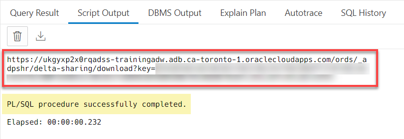
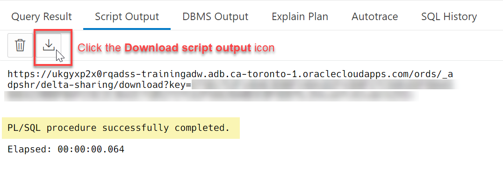
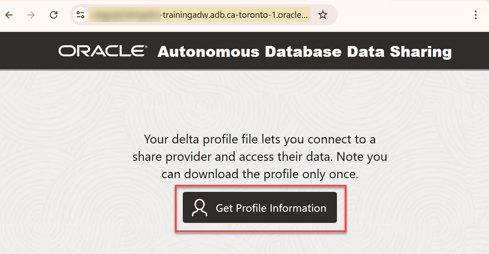
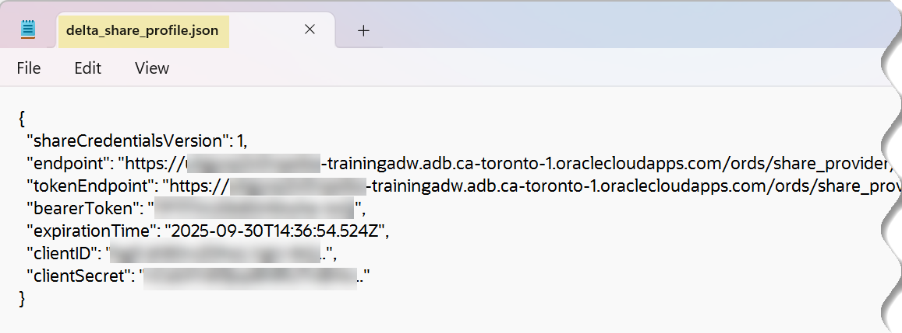

# Create and Authorize the Data Share Recipient

## Introduction

A data share recipient is an entity such as an individual, an institution, or a software system that receives a data share from a data share provider. A recipient can access the data in the share and can have access to multiple shares. If you remove a recipient, that recipient loses access to all shares it could previously access.

In this lab, as a data share provider, you will create and authorize a new recipient that will access the data share and the `custsales` table in the share. You will then provide the new recipient with the activation link or the JSON config file that is needed to create a credential to access the data share.


Estimated Time: 15 minutes

### Objectives

In this lab, you will:

* Create a new share delta share recipient.
* Grant the recipient access privileges to the data share.
* As the share provider user, generate and share the activation link with your recipient.
* As the recipient, use the activation link to download the `delta_share_profile.json` configuration file.

### Prerequisites

This lab assumes that you have successfully completed all of the preceding labs in the **Contents** menu on the left.

## Task 1: Create a Data Share Recipient

1. As the **`share_provider`** user, create a new data share recipient named **`training_user`**. Copy and paste the following script into your SQL Worksheet, and then click the **Run Script** icon.

    ```
    <copy>
    BEGIN
        DBMS_SHARE.CREATE_SHARE_RECIPIENT(
            recipient_name => 'training_user',
            email => 'training_user@oracle.com');
    END;
    </copy>
    ```

    

2. Query the available recipients. Copy and paste the following script into your SQL Worksheet, and then click the **Run Statement** icon.

    ```
    <copy>
    SELECT recipient_name, updated
    FROM user_share_recipients;
    </copy>
    ```

    

3. You can modify properties for a recipient. For example, modify the `TOKEN_LIFETIME` for the **`training_user`** recipient to **90 days**. This property specifies for how long the generated token will be valid after which the recipient loses access to the data share and must request a new token.

    ```
    <copy>
    BEGIN
        DBMS_SHARE.UPDATE_RECIPIENT_PROPERTY (
        recipient_name => 'training_user',
        recipient_property => 'TOKEN_LIFETIME',
        new_value => '90 00:00:00');
    END;
    /
    </copy>
    ```

    

## Task 2: Grant the Recipient Access Privileges to the Data Share

1. As the **`share_provider`** user, grant the new `training_user` recipient access to the `demo_share` data share. Copy and paste the following script into your SQL Worksheet, and then click the **Run Script** icon.

    ```
    <copy>
    BEGIN
        DBMS_SHARE.GRANT_TO_RECIPIENT(
            share_name=>'demo_share',
            recipient_name=> 'training_user',
            AUTO_COMMIT=>true);
    END;
    /
    </copy>
    ```

    

2. Query the data shares access privileges for the `training_user` recipient. Copy and paste the following script into your SQL Worksheet, and then click the **Run Script** icon.

    ```
    <copy>
    SELECT recipient_name, share_name
    FROM user_share_recipient_grants
    WHERE recipient_name = 'TRAINING_USER';
    </copy>
    ```

    

    The `training_user` recipient has access privileges to only one data share, `demo_share`.

## Task 3: Share the Activation Link or the Profile Information with the Recipient

As the **`share_provider`** user, you need to provide the `training_user` recipient with the _activation link_ to download the **`delta_share_profile.json`** configuration file. The recipient will need the `delta_share_profile.json` file to create an access credential in the next lab.

### **The `share_provider` user provides the recipient with the activation link**

1. As the  **`share_provider`** user, generate the activation link's URL that will enable the authorized recipient to download the `delta_share_profile.json` configuration file. Copy and paste the following script into your SQL Worksheet, and then click the **Run Script** icon.

    ```
    <copy>
    BEGIN
  DBMS_OUTPUT.PUT_LINE(
    REPLACE(
      DBMS_SHARE.GET_ACTIVATION_LINK(RECIPIENT_NAME => 'training_user'),
      'ords/_adpshr',
      'ords/' || LOWER(USER) || '/_adpshr'));
END;
/
    </copy>
    ```

    The activation link is generated.

    

2. Save the result of the script so that you can save a copy of the activation link locally. In the **Script Output** tab, click the **Download script output** icon.

    

    The output of the script is downloaded as a **text** file to your **Downloads** folder.

    

3. Open the text file to view its content. Copy the activation link and share it with your authorized `training_user` recipient using email, slack, or any other method. This enables this user to download the **`delta_share_profile.json`** configuration file.

    

### **The recipient downloads the `delta_share_profile.json` configuration file**

As the `training_user` recipient user, you can use the activation link URL that was provided to you by your `share_provider` user to download the **`delta_share_profile.json`** configuration file. This file (delta profile) contains the required credentials that you need in order to  connect to the data share and access its tables.

>**Note:** For the recipient to download the `.json` file, it doesn't matter what user you are logged in as. All you need is a Web browser.

1. Copy the activation link URL that was provided to you by your share provider and paste it in your web browser's address bar, and then press **[Enter]**. The **Autonomous AI Database Data Sharing** page is displayed. To download the config file, click **Get Profile Information**.

    

    >**Note:** You can download this profile file only once; therefore, make sure you save it once it's downloaded.

    The **Profile information downloaded** page is displayed and the downloaded file is displayed in a popup window.

    

2. The **`delta_share_profile`.json** file is downloaded to your browser's **Downloads** directory.

    

3. Open the downloaded file. The file content is displayed. You will need this information in the next lab to connect and use the data share.

    

<!--- July 18, 2023: Hiding the method 2 section until this is fixed since David slacked me that there is no fix yet for this step.

**Method 2: The `share_provider` user generates the `delta_share_profile.json` configuration file and shares it with the Recipient**

As a share provider user, you can use this second method to directly generate the `JSON` config file which you can then share with recipient using any method you desire.

1. For this step, you need to log in to your SQL Worksheet as the **`admin`** user. Log out of the **`share_provider`** user. On the **Oracle Database Actions | SQL** banner, click the drop-down list next to the **`SHARE_PROVIDER`** user, and then select **Sign Out** from the drop-down menu. When prompted if you want to leave the site, click **Leave**.

2. Log in as the **`admin`** user. On the **Sign-in** page, enter **`ADMIN`** as the username and **`Training4ADW`** as the password, and then click **Sign in**. You are now logged in as the **`ADMIN`** user. In the **Development** section, click the **SQL** card to display the SQL Worksheet.

    

3. Grant the `http` and `http_proxy` privileges for the specified host to the `DWROLE` role. Use the `DBMS_NETWORK_ACL_ADMIN` package and the `APPEND_HOST_ACE` procedure. For information about the `DBMS_NETWORK_ACL_ADMIN` package, see the [PL/SQL Packages and Types Reference](https://docs.oracle.com/en/database/oracle/oracle-database/19/arpls/DBMS_NETWORK_ACL_ADMIN.html#GUID-254AE700-B355-4EBC-84B2-8EE32011E692) documentation. This is explained in more detail in the next lab. Copy and paste the following script into your SQL Worksheet, and then click the **Run Script** icon.

    >**Note:** Substitute the host value below with your own host value which you can copy from your browser's address bar.

    

    In our example, the host value is the following portion of the URL shown in the address bar:

    **`ukgyxp2x0rqadss-trainingadw.adb.ca-toronto-1.oraclecloudapps.com`**

    ```
    <copy>
    BEGIN
    DBMS_NETWORK_ACL_ADMIN.APPEND_HOST_ACE(
        host => 'ukgyxp2x0rqadss-trainingadw.adb.ca-toronto-1.oraclecloudapps.com',
        lower_port => 443,
        upper_port => 443,
        ace => xs$ace_type(
        privilege_list => xs$name_list('http', 'http_proxy'),
        principal_name => upper('DWROLE'),
        principal_type => xs_acl.ptype_db));
    END;
    /
    </copy>
    ```

    

4. Log out of the **`admin`** user. On the **Oracle Database Actions | SQL** banner, click the drop-down list next to the `ADMIN` user, and then select **Sign Out** from the drop-down menu. When prompted if you want to leave the site, click **Leave**.

5. Log in as the **`share_provider`** user. On the **Sign-in** page, enter **`share_provider`** as the username and **`DataShare4ADW`** as the password, and then click **Sign in**. In the **Development** section, click the **SQL** card to display the SQL Worksheet.

6. Generate the Delta Share `JSON` config file for your `training_user` recipient. Copy and paste the following script into your SQL Worksheet, and then click the **Run Script** icon.

    ```
    <copy>
    DECLARE
    profile SYS.JSON_OBJECT_T;
    BEGIN
        DBMS_SHARE.POPULATE_SHARE_PROFILE('TRAINING_USER', profile);
        SYS.DBMS_OUTPUT.PUT_LINE(CHR(10)||JSON_QUERY(profile.to_string, '$' PRETTY));
    END;
    /
    </copy>
    ```

7. The **`delta_share_profile.json`** configuration file information is displayed in the **Script Output** tab.

    

8. Save the script output (profile information) to a text editor of your choice on your local machine (using the copy and paste method) so that you can have a record of it. You'll need this file with the recipient.

    

9. As the recipient user, you will need all of the values from the previous step in the next lab to create the required credential to access your authorized data share.--->

You may now proceed to the next lab.

## Learn More

* [Oracle Cloud Infrastructure Documentation](https://docs.cloud.oracle.com/en-us/iaas/Content/GSG/Concepts/baremetalintro.htm)
* [Using Oracle Autonomous AI Database Serverless](https://docs.oracle.com/en/cloud/paas/autonomous-database/adbsa/index.html)

## Acknowledgements

* **Author:** Lauran K. Serhal, Consulting User Assistance Developer
* **Contributors:**
    * Alexey Filanovskiy, Senior Principal Product Manager
    * David Greenfield, Consulting Member Technical Staff
    * Jakub Illner, Lakehouse and Analytics Data Specialist
* **Last Updated By/Date:** Lauran K. Serhal, November 2025

Data about movies in this workshop were sourced from Wikipedia.

Copyright (C), 2025 Oracle Corporation.

Permission is granted to copy, distribute and/or modify this document
under the terms of the GNU Free Documentation License, Version 1.3
or any later version published by the Free Software Foundation;
with no Invariant Sections, no Front-Cover Texts, and no Back-Cover Texts.
A copy of the license is included in the section entitled [GNU Free Documentation License](https://oracle-livelabs.github.io/adb/shared/adb-15-minutes/introduction/files/gnu-free-documentation-license.txt)