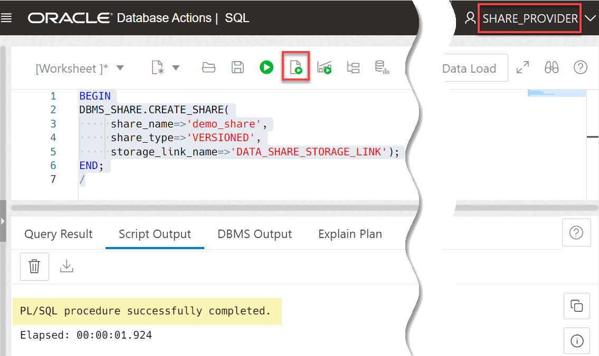
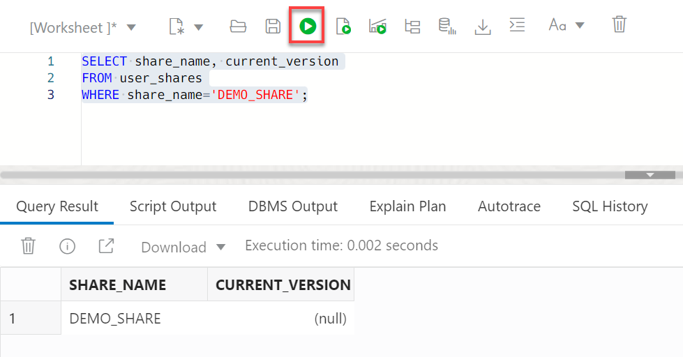
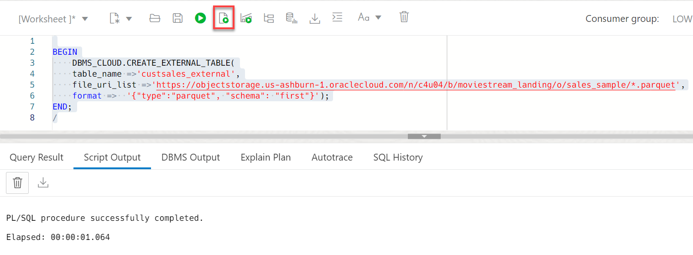
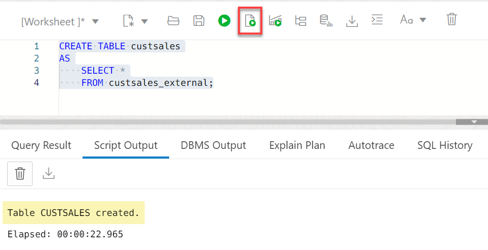
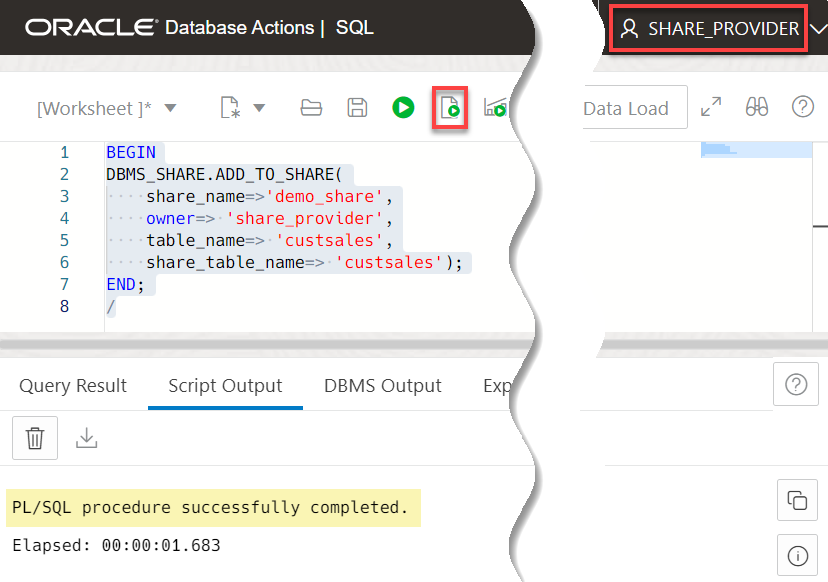
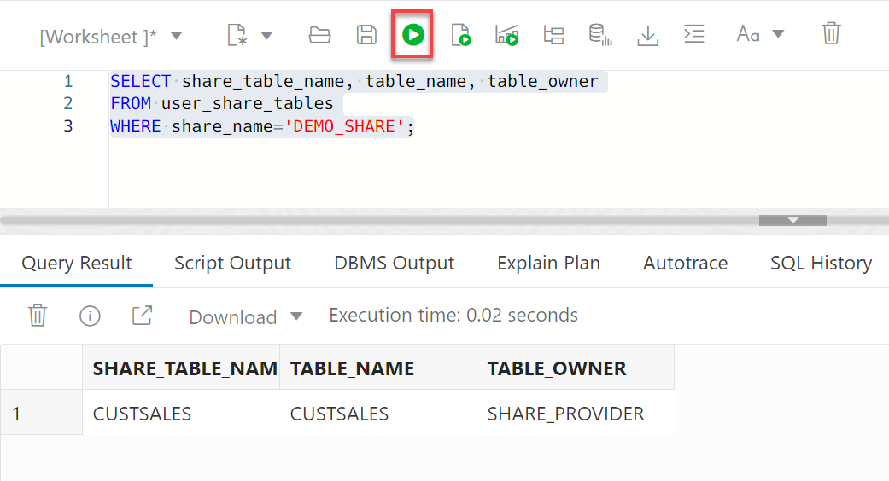
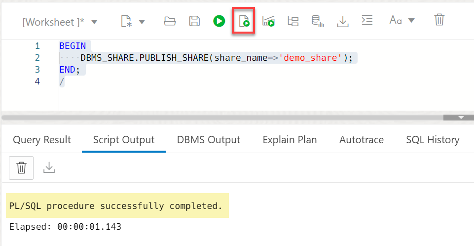
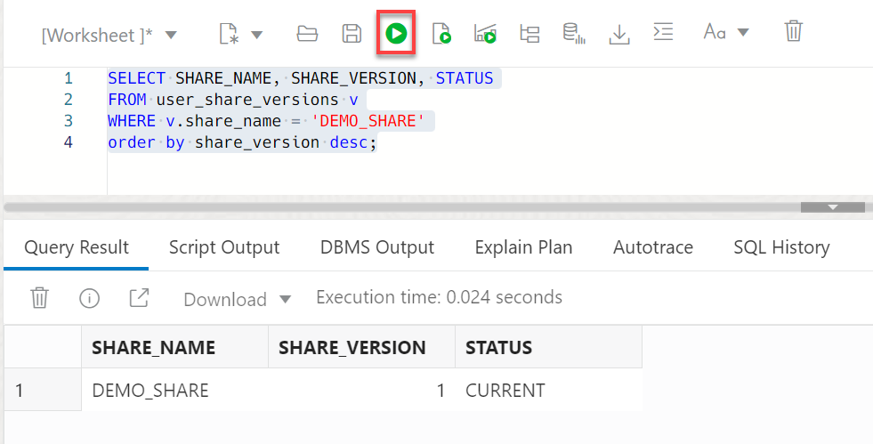
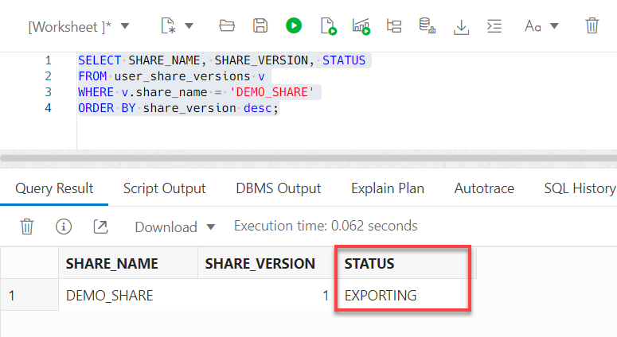
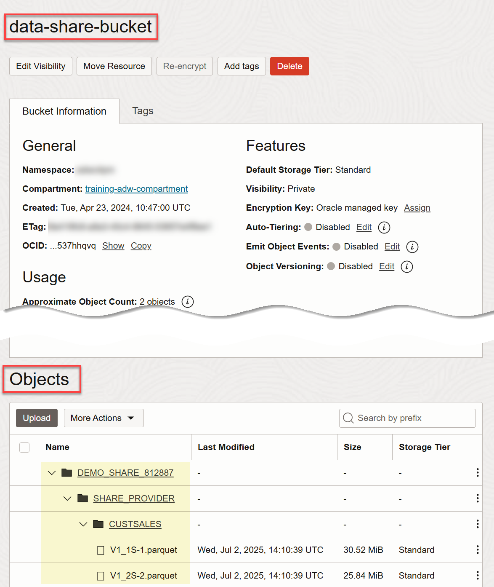

# Create, Populate, and Publish a Data Share

## Introduction

A data share is a named entity in the provider’s instance. It can be a group of datasets shared as a single entity. The share is the logical container that contains objects such as tables that you will share with recipients. An authorized data share recipient can  access the share and all the tables in it.

In this lab, as a share provider user, you will create a data share and add a table to it. Next, you will publish the data share to make it available to the authorized recipient that you will define in the next lab.

 

Estimated Time: 15 minutes

### Objectives

In this lab, you will:

* Create a new data share.
* Create two tables.
* Add one of the newly created tables to the data share.
* Publish the data share to make it available to authorized recipients.

### Prerequisites

This lab assumes that you have successfully completed all of the preceding labs in the **Contents** menu on the left.

## Task 1: Create a Data Share

1. As the **`share_provider`** user, create a new data share named **`demo_share`**. The **`DATA_SHARE_STORAGE_LINK`** value refers to the storage link that you created in **Lab 2** which points to your Object Storage bucket's URI. Copy and paste the following script into your SQL Worksheet, and then click the **Run Script** icon in the Worksheet toolbar.

    ```
    <copy>
    BEGIN
    DBMS_SHARE.CREATE_SHARE(
         share_name=>'demo_share',
         share_type=>'VERSIONED',
         storage_link_name=>'DATA_SHARE_STORAGE_LINK');
    END;
    /
    </copy>
    ```

    

    >**Note:** To drop a share, use the `DBMS_SHARE.DROP_SHARE` procedure as follows:

    ```
    BEGIN
        DBMS_SHARE.DROP_SHARE('demo_share');
    END;
    /
    ```

2. Verify the creation of the data share. Copy and paste the following script into your SQL Worksheet, and then click the **Run Statement** icon in the Worksheet toolbar.

    ```
    <copy>
    SELECT share_name, current_version
    FROM user_shares
    WHERE share_name='DEMO_SHARE';
    </copy>
    ```

    

    Before you publish the data share, the **Current Version** column shows **`(null)`**. After you publish the data share, the value in the **Current Version** column will show **`1`**.

## Task 2: Create Tables to Add to the Data Share

1. Create an external table from a public dataset that you will add to the data share. The **`moviestream_landing`** Oracle Object Storage public bucket that contains some `Parquet` data is located in a different tenancy than yours, **`c4u04`**; therefore, you will use the following public URL. Copy and paste the following script into your SQL Worksheet, and then click the **Run Script** icon in the Worksheet toolbar.

    ```
    <copy>
    BEGIN
        DBMS_CLOUD.CREATE_EXTERNAL_TABLE(
        table_name =>'custsales_external',
        file_uri_list =>'https://objectstorage.us-ashburn-1.oraclecloud.com/n/c4u04/b/moviestream_landing/o/sales_sample/*.parquet',
        format =>  '{"type":"parquet", "schema": "first"}');
    END;
    /
    </copy>
    ```

    

2. Create a table based on the external table which you will add to the data share. Copy and paste the following script into your SQL Worksheet, and then click the **Run Script** icon in the Worksheet toolbar.

    ```
    <copy>
    CREATE TABLE custsales
    AS
        SELECT *
        FROM custsales_external;
    </copy>
    ```

    

## Task 3: Add a Table to the Data Share

1. Add the `custsales` table to the `demo_share` data share. Copy and paste the following script into your SQL Worksheet, and then click the **Run Script** icon in the Worksheet toolbar.

    ```
    <copy>
    BEGIN
    DBMS_SHARE.ADD_TO_SHARE(
        share_name=>'demo_share',
        owner=> 'share_provider',
        table_name=> 'custsales',
        share_table_name=> 'custsales');
    END;
    /
    </copy>
    ```

    

2. Verify the addition of the table to the data share. Copy and paste the following script into your SQL Worksheet, and then click the **Run Statement** icon.

    ```
    <copy>
    SELECT share_table_name, table_name, table_owner
    FROM user_share_tables
    WHERE share_name='DEMO_SHARE';
    </copy>
    ```

    

    >**Note:** To remove a table from a share, use the following script:

    ```
    BEGIN
    DBMS_SHARE.REMOVE_FROM_SHARE(
        share_name=>'demo_share',
        share_table_name => 'custsales'
    );
    END;
    ```

## Task 4: Publish the Data Share

Up to this point, the share and its table are stored in the database and therefore are not yet available to anyone. In this task, you will call the `PUBLISH_SHARE` API which offloads data to the Cloud Store and makes it accessible to recipients that you define and authorize in a later lab.

_**Important:**_    
_If you are using an **Always Free** ADB instance, you must run the following script in your SQL Worksheet as the **`share_provider`** user <u>before</u> you proceed with **step 1** below:_

```
<copy>
BEGIN
    DBMS_SHARE.UPDATE_DEFAULT_SHARE_PROPERTY('job_type', 'DBMS_CLOUD');
END;
/
</copy>
```

1. Publish the `demo_share` data share to make it visible to authorized recipients. Copy and paste the following script into your SQL Worksheet, and then click the **Run Script** icon. It could take few minutes for the publishing process (export) to complete.

    ```
    <copy>
    BEGIN
        DBMS_SHARE.PUBLISH_SHARE(share_name=>'demo_share');
    END;
    /
    </copy>
    ```

    

    >**Note:** To ensure that the publishing job is complete before you move on to the next lab, you can use the `PUBLISH_SHARE_WAIT` procedure. It also makes a share visible to authorized recipients; however, it waits for publishing task to complete.

    ```
    BEGIN
    DBMS_SHARE.PUBLISH_SHARE_WAIT(share_name=>'demo_share');
    END;
    /
    ```

2. Use the `user_share_versions` view to track the state of the export. Copy and paste the following script into your SQL Worksheet, and then click the **Run Statement** icon.

    ```
    <copy>
    SELECT SHARE_NAME, SHARE_VERSION, STATUS
    FROM user_share_versions v
    WHERE v.share_name = 'DEMO_SHARE'
    ORDER BY share_version desc;
    </copy>
    ```

    

    If the **STATUS** shows **EXPORTING**, that indicates the publishing process is not yet complete. You might have to wait for a few minutes for the publishing to finish. _Don't proceed to the next lab until the **STATUS** shows **CURRENT**_.

    

    >**Note:**
    When you publish a `versioned` share type, the tool generates and stores the data share as `parquet` files in the specified bucket such as `data-share-bucket` in our example. Any authenticated data share recipient can directly access the share in that bucket.

    

You may now proceed to the next lab.

## Learn More

* [Oracle Cloud Infrastructure Documentation](https://docs.cloud.oracle.com/en-us/iaas/Content/GSG/Concepts/baremetalintro.htm)
* [Using Oracle Autonomous AI Database Serverless](https://docs.oracle.com/en/cloud/paas/autonomous-database/adbsa/index.html)

## Acknowledgements

* **Author:** Lauran K. Serhal, Consulting User Assistance Developer
* **Contributor:** Alexey Filanovskiy, Senior Principal Product Manager
* **Last Updated By/Date:** Lauran K. Serhal, November 2025

Data about movies in this workshop were sourced from Wikipedia.

Copyright (C), 2025 Oracle Corporation.

Permission is granted to copy, distribute and/or modify this document
under the terms of the GNU Free Documentation License, Version 1.3
or any later version published by the Free Software Foundation;
with no Invariant Sections, no Front-Cover Texts, and no Back-Cover Texts.
A copy of the license is included in the section entitled [GNU Free Documentation License](https://oracle-livelabs.github.io/adb/shared/adb-15-minutes/introduction/files/gnu-free-documentation-license.txt)
