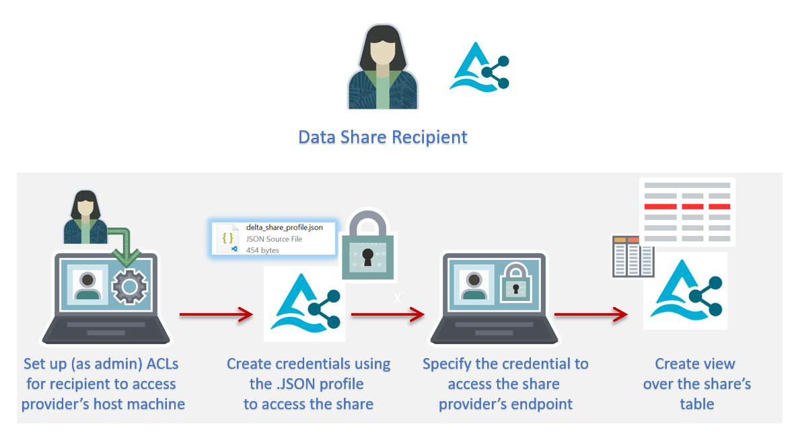
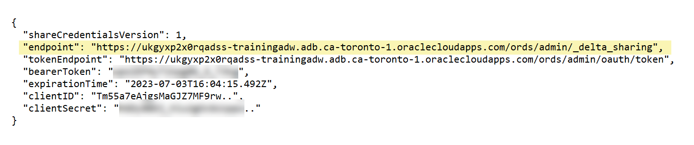
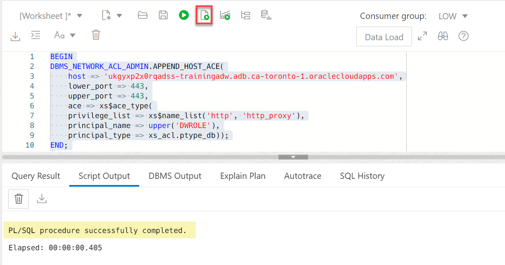
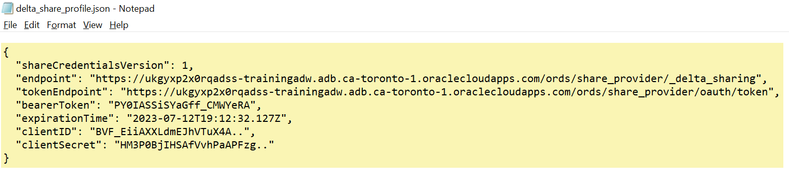
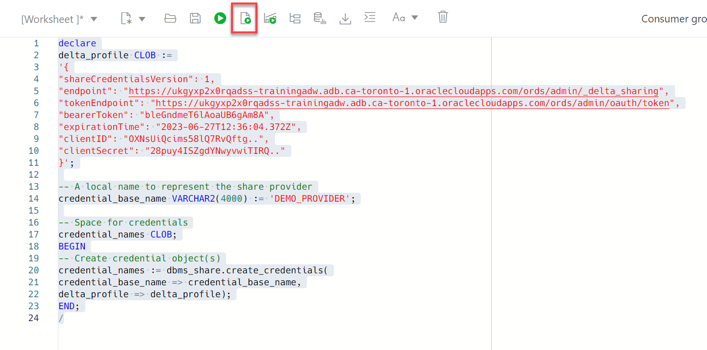
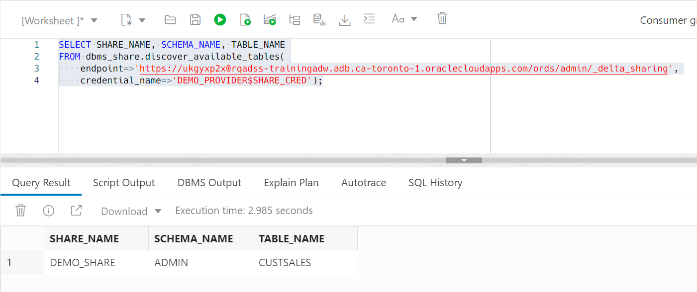
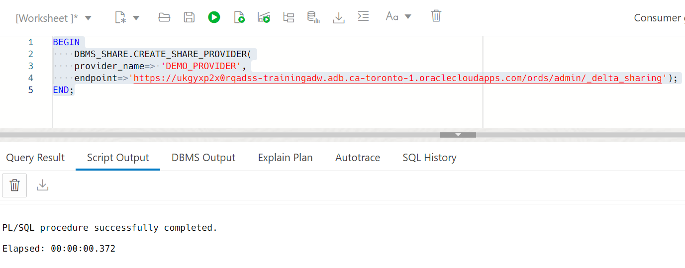
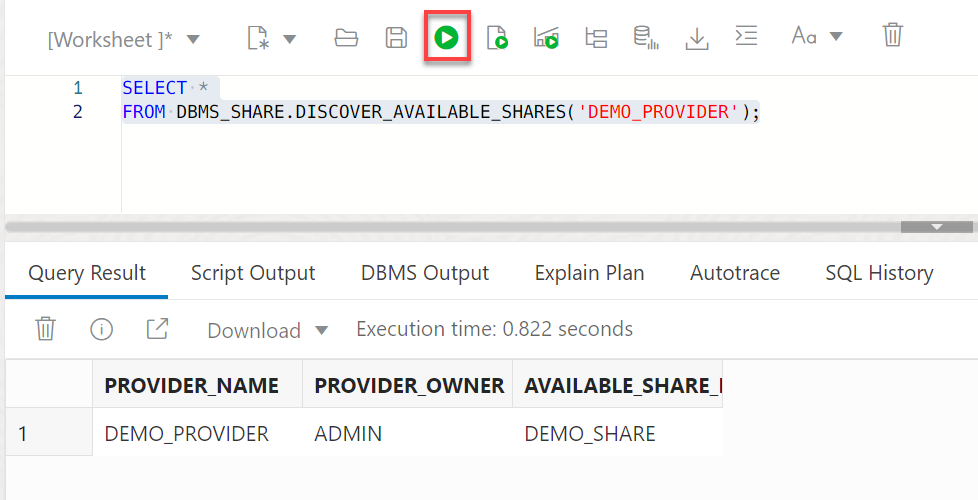
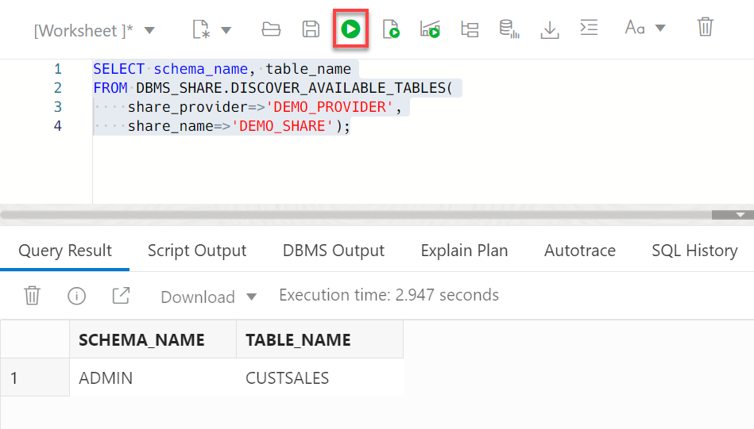

# Consume the Data Share by the Recipient

## Introduction

In this lab you will learn how to consume the data in your available data share as a recipient.



Estimated Time: 10 minutes

### Objectives

In this lab, you will:

* Request ACL privileges to the share provider's host that contains the share.
* Create access credential to the share.
* Subscribe to the data share provider.
* Access the data in your authorized data share.

### Prerequisites

This lab assumes that you have successfully completed all of the preceding labs in the **Contents** menu on the left.

## Task 1:  Grant Required Privileges

To consume a data share, a recipient user must have access control list (ACL) set to the share provider's machine that contains the data share. This enables the recipient to connect to the specified host as user **`ADMIN`** (or some other privileged user or even copy and paste the code and pass it along to your `ADMIN` user) from ADW over the public internet. In order to set the ACL on the host machine, you will need the host machine **`endpoint`** value which you can find in the downloaded `JSON` profile file from the previous lab.



_**Note to Reviewers:** Can an admin user set the acls for the recipient? It will be confusing to have the recipient log in as an admin to perform this step, please advise._

In our example, the **`endpoint`** value where the data share is located is as follows:

```
https://ukgyxp2x0rqadss-trainingadw.adb.ca-toronto-1.oraclecloudapps.com/ords/admin/_delta_sharing
```

For the next code that you will run, _copy your own endpoint URL up to only the **`oraclecloudapps.com`** and remove everything after that, namely `/ords/admin/_delta_sharing`. In addition, don't include the `https://` at the beginning of the URL_. Paste the final edited URL in the **host** parameter. So, in our example, this is what we will use for the host value in the next code example:

```
ukgyxp2x0rqadss-trainingadw.adb.ca-toronto-1.oraclecloudapps.com
```

1. Copy and paste the following script into your SQL Worksheet, and then click the **Run Script** icon.

    ```
    <copy>
    BEGIN
    DBMS_NETWORK_ACL_ADMIN.APPEND_HOST_ACE(
        host => 'ukgyxp2x0rqadss-trainingadw.adb.ca-toronto-1.oraclecloudapps.com',
        lower_port => 443,
        upper_port => 443,
        ace => xs$ace_type(
        privilege_list => xs$name_list('http', 'http_proxy'),
        principal_name => upper('DWROLE'),
        principal_type => xs_acl.ptype_db));
    END;
    /
    </copy>
    ```

    

    **Note:** You can apply the acls to all ADWs domains as follows:

    ```
    <copy>
    begin
    dbms_network_acl_admin.append_host_ace(
        host => '*.oraclecloudapps.com',
        lower_port => 443,
        upper_port => 443,
        ace => xs$ace_type( privilege_list => xs$name_list('http', 'http_proxy'),
        principal_name => upper('DWROLE'),
        principal_type => xs_acl.ptype_db));
    end;
    /
    </copy>
    ```

    

## Task 2: Create Access Credential to the Data Share

In this task, you will need the entire content of the **`delta_share_profile.json`** file that you downloaded in the previous lab in order to create the required credential to access the data share.

1. Copy and paste the following script into your SQL Worksheet. _Don't run the script yet_

    ```
    <copy>
    declare
    delta_profile CLOB :=
    '{"shareCredentialsVersion": 1,
    "endpoint": "https://ukgyxp2x0rqadss-trainingadw.adb.ca-toronto-1.oraclecloudapps.com/ords/admin/_delta_sharing",
    "tokenEndpoint": "https://ukgyxp2x0rqadss-trainingadw.adb.ca-toronto-1.oraclecloudapps.com/ords/admin/oauth/token",
    "bearerToken": "LodEidRMDmnWHTVsSkJaOg",
    "expirationTime": "2023-06-29T18:11:11.150Z",
    "clientID": "VpCtBHNgRReUyxjr1Rc79g..",
    "clientSecret": "IZhuQW5pEiPDBFGkS-2H-A.."
    }';

    -- A local name to represent the share provider
    credential_base_name VARCHAR2(4000) := 'DEMO_PROVIDER';

    -- Space for credentials
    credential_names CLOB;
    BEGIN
    -- Create credential object(s)
    credential_names := dbms_share.create_credentials(
    credential_base_name => credential_base_name,
    delta_profile => delta_profile);
    END;
    /
    </copy>
    ```

2. Replace everything from (and including) the opening braces "**`{`**" to the end braces "**`}`**" that are enclosed between the single quotes " **`'`** " with the entire content of your downloaded **`delta_share_profile.json`** file from the previous lab. Pay attention to not remove the single quotes.

    

2. Next, click the **Run Script** icon.


    

    

2. Find the name of the newly created credential. Copy and paste the following script into your SQL Worksheet, and then click the **Run Statement** icon.

    ```
    <copy>
    SELECT credential_name
    FROM all_credentials
    WHERE credential_name LIKE 'DEMO_PROVIDER%';
    </copy>
    ```

    

## Task 3: Discover Available Data Shares and Tables in the Share (Unnamed Option)

To create a table on top of the data share share object, the recipient needs to get the list of the schemas and tables being shared. If this is a single time operation (provider will be used once), then it's easier to run the `discover_available_tables` table function to get this list.

1. Copy and paste the following query into your SQL Worksheet, and then click the **Run Statement** icon in the Worksheet toolbar. Substitute the value of the `endpoint` parameter with your own value.

    ```
    <copy>
    SELECT SHARE_NAME, SCHEMA_NAME, TABLE_NAME
    FROM dbms_share.discover_available_tables(
        endpoint=>'https://ukgyxp2x0rqadss-trainingadw.adb.ca-toronto-1.oraclecloudapps.com/ords/admin/_delta_sharing',
        credential_name=>'DEMO_PROVIDER$SHARE_CRED');
    </copy>
    ```

    

## Task 4: Discover Available Data Shares and Tables in the Share (Named Option)

If the recipient plans to access the table name several times, it would be easier to create a named provider once and use it going forward.

1. Subscribe to the data share provider by creating a new share provider name that we called `demo_provider` in our example. It points to the data share provider's endpoint. Copy and paste the following query into your SQL Worksheet, and then click the **Run Script** icon.

    ```
    <copy>
    BEGIN
        DBMS_SHARE.CREATE_SHARE_PROVIDER(
        provider_name=> 'DEMO_PROVIDER',
        endpoint=>'https://ukgyxp2x0rqadss-trainingadw.adb.ca-toronto-1.oraclecloudapps.com/ords/admin/_delta_sharing');
    END;
    </copy>
    ```

    

2. Specify the credential needed to access the data share endpoint. Set the credential name to be used by the current user when he or she attempts to access the given share provider.Copy and paste the following query into your SQL Worksheet, and then click the **Run Script** icon.

    ```
    <copy>
    BEGIN
        DBMS_SHARE.SET_SHARE_PROVIDER_CREDENTIAL(
            provider_name=>'DEMO_PROVIDER',
            share_credential=>'DEMO_PROVIDER$SHARE_CRED');
    END;
    ```
    </copy>

    

3. Query the available data shares for this provider. Copy and paste the following query into your SQL Worksheet, and then click the **Run Statement** icon.

    ```
    <copy>
    SELECT *
    FROM DBMS_SHARE.DISCOVER_AVAILABLE_SHARES('DEMO_PROVIDER');
    </copy>
    ```

    `DEMO_PROVIDER` has access to only the `DEMO_SHARE` data share that was created by the `admin` share provider user in our example.

    

4. Query the available tables in the data share. Copy and paste the following query into your SQL Worksheet, and then click the **Run Statement** icon.

    ```
    <copy>
    SELECT schema_name, table_name
    FROM DBMS_SHARE.DISCOVER_AVAILABLE_TABLES(
        share_provider=>'DEMO_PROVIDER',
        share_name=>'DEMO_SHARE');
    </copy>
    ```

    

## Task 5: Create a Share Link and a View Using the Data Share Table

1. Create a new share link. Copy and paste the following query into your SQL Worksheet, and then click the **Run Script** icon.

    ```
    <copy>
    BEGIN
    DBMS_SHARE.CREATE_OR_REPLACE_SHARE_LINK(
        share_link_name => 'SALES_DATA',
        share_provider => 'DEMO_PROVIDER',
        share_name => 'DEMO_SHARE');
    END;
    </copy>
    ```

    

2. Use the new share link to create a view over the shared table. Copy and paste the following query into your SQL Worksheet, and then click the **Run Script** icon.

    ```
    <copy>
    BEGIN
    dbms_share.create_share_link_view(
        view_name=>'CUSTSALES_SHARE_V',
        share_link_name=>'SALES_DATA',
        share_schema_name=>'ADMIN',
        share_table_name=>'CUSTSALES');
    END;
    </copy>
    ```

    

3. Query the view. Copy and paste the following query into your SQL Worksheet, and then click the **Run Statement** icon.

    ```
    <copy>
    SELECT *
    FROM CUSTSALES_SHARE_V;
    </copy>
    ```

    

You may now proceed to the next lab.

## Learn More

* [Oracle Cloud Infrastructure Documentation](https://docs.cloud.oracle.com/en-us/iaas/Content/GSG/Concepts/baremetalintro.htm)
* [Using Oracle Autonomous Database Serverless](https://docs.oracle.com/en/cloud/paas/autonomous-database/adbsa/index.html)

## Acknowledgements

* **Author:** Lauran K. Serhal, Consulting User Assistance Developer
* **Contributor:** Alexey Filanovskiy, Senior Principal Product Manager
* **Last Updated By/Date:** Lauran K. Serhal, July 2023

Data about movies in this workshop were sourced from Wikipedia.

Copyright (C) Oracle Corporation.

Permission is granted to copy, distribute and/or modify this document
under the terms of the GNU Free Documentation License, Version 1.3
or any later version published by the Free Software Foundation;
with no Invariant Sections, no Front-Cover Texts, and no Back-Cover Texts.
A copy of the license is included in the section entitled [GNU Free Documentation License](files/gnu-free-documentation-license.txt)