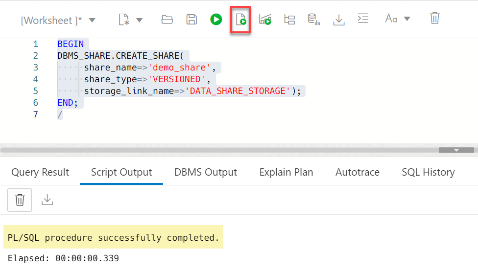
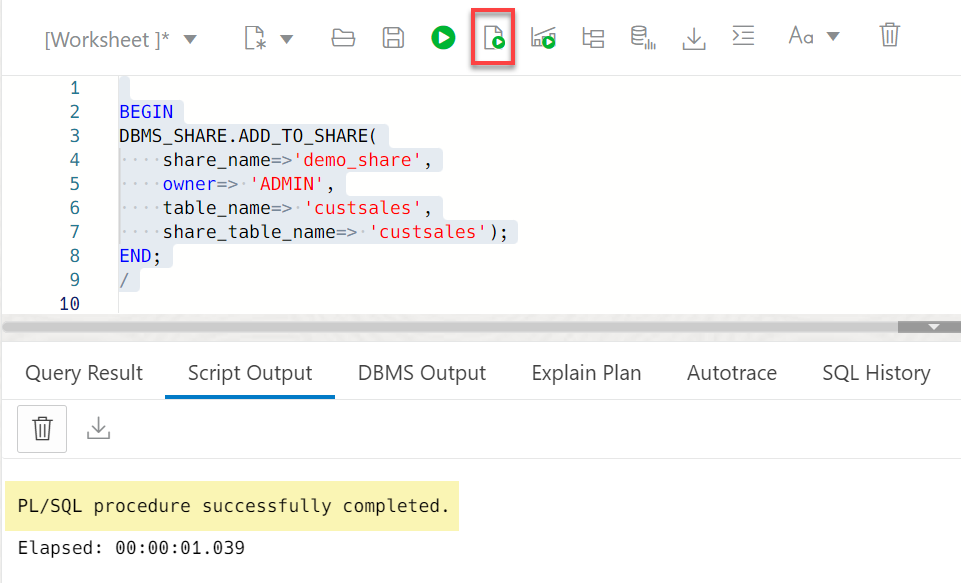
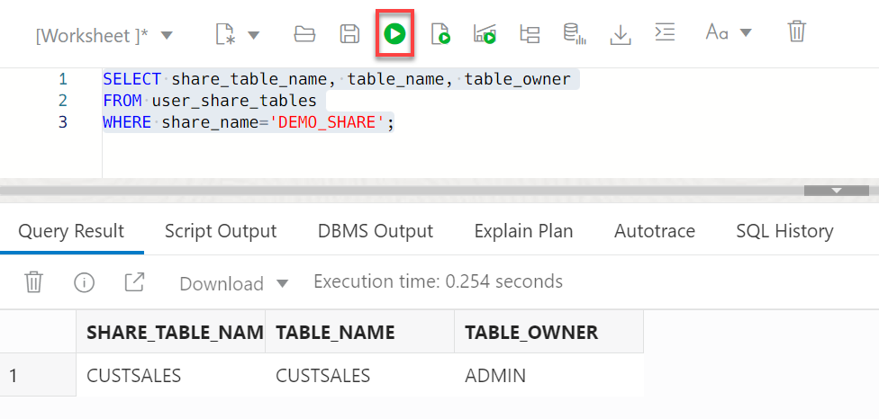

# Create, Populate, and Publish a Data Share

## Introduction

A share is the logical container that will be filled up with objects such as tables. An authorized share recipient will get assess to the share and all the tables in it. A share also implements security mechanism and this is less granular entity to grant security.

In this lab, you will create a share and add a table to it. Next, you will publish the share to make it available to recipients that you will define in the next lab.

> **Note:** While this lab uses Oracle Autonomous Data Warehouse, the steps are identical for loading data into an Oracle Autonomous Transaction Processing database.

Estimated Time: 20 minutes

### Objectives

In this lab, you will:

* Create a new data share.
* Create two tables.
* Add objects (tables) to the data share.
* Publish the data share to make it available to recipients.

### Prerequisites

This lab assumes that you have successfully completed all of the preceding labs in the **Contents** menu on the left.

## Task 1: Navigate to the SQL Worksheet

1. Log in to the **Oracle Cloud Console**, if you are not already logged as the Cloud Administrator. You will complete all the labs in this workshop using this Cloud Administrator. On the **Sign In** page, select your tenancy, enter your username and password, and then click **Sign In**. The **Oracle Cloud Console** Home page is displayed.

2. Open the **Navigation** menu and click **Oracle Database**. Under **Oracle Database**, click **Autonomous Database**.

3. On the **Autonomous Databases** page, click your **ADW-Data-Lake** ADB instance.

4. On the **Autonomous Database details** page, click **Database actions**.

5. A **Launch DB actions** message box with the message **Please wait. Initializing DB Actions** is displayed. Next, the **Database Actions | Launchpad** Home page is displayed in a _**new tab in your browser**_. In the **Data Studio** section, click the **SQL** card to display the SQL Worksheet.

## Task 2: Create a Data Share

1. Create a new data share. Copy and paste the following script into your SQL Worksheet, and then click the **Run Script** icon in the Worksheet toolbar.

    ```
    <copy>
    BEGIN
    DBMS_SHARE.CREATE_SHARE(
         share_name=>'demo_share',
         share_type=>'VERSIONED',
         storage_link_name=>'data_share_storage');
    END;
    /
    </copy>
    ```

    

2. Verify the newly created data share. Copy and paste the following script into your SQL Worksheet, and then click the **Run Statement** icon in the Worksheet toolbar.

    ```
    <copy>
    SELECT share_name, current_version
    FROM user_shares
    WHERE share_name='DEMO_SHARE';
    </copy>
    ```

    

## Task 3: Create Tables to Add to the Data Share

1. Create an external table from a public dataset that you will add to the data share. The **moviestream_landing** Oracle Object Storage public bucket that contains the data is located in a different tenancy than yours, **`c4u04`**; therefore, you will use the following public URL. Copy and paste the following script into your SQL Worksheet, and then click the **Run Script** icon in the Worksheet toolbar.

    ```
    <copy>
    BEGIN
    DBMS_CLOUD.CREATE_EXTERNAL_TABLE(
    table_name =>'custsales_external',
    file_uri_list =>'https://objectstorage.us-ashburn-1.oraclecloud.com/n/c4u04/b/moviestream_landing/o/sales_sample/*.parquet',
    format =>  '{"type":"parquet", "schema": "first"}');
    END;
    /
    </copy>
    ```

    

2. Create a heap Oracle table that you will add to the data share. Copy and paste the following script into your SQL Worksheet, and then click the **Run Script** icon in the Worksheet toolbar.

    ```
    <copy>
    CREATE TABLE custsales
    AS
        SELECT *
        FROM from custsales_external;
    </copy>
    ```

    

## Task 4: Add Objects to the Data Share

1. Add the two newly create external and Oracle heap tables to the data share. Copy and paste the following script into your SQL Worksheet, and then click the **Run Script** icon in the Worksheet toolbar.

    ```
    <copy>
    BEGIN
    DBMS_SHARE.ADD_TO_SHARE(
        share_name=>'demo_share',
        owner=> 'ADMIN',
        table_name=> 'custsales',
        share_table_name=> 'custsales');
    END;
    /
    </copy>
    ```

    

2. Verify the addition of the table to to the share.

    ```
    <copy>
    SELECT share_table_name, table_name, table_owner
    FROM user_share_tables
    WHERE share_name='DEMO_SHARE';
    </copy>
    ```

    

    >**Note:** To remove a table from a share, use the following script:

    ```
    BEGIN
    DBMS_SHARE.REMOVE_FROM_SHARE(
        share_name=>'demo_share',
        share_table_name => 'custsales'
    );
    END;
    ```

## Task 5: Publish the Share

Up to this point, the share and its tables is stored in the database and not yet available to anyone. In this task, you will call the `PUBLISH` API which offloads data to the Cloud Store and make it accessible.

1. Publish the share. Copy and paste the following script into your SQL Worksheet, and then click the **Run Script** icon in the Worksheet toolbar.

    ```
    <copy>
    BEGIN
    DBMS_SHARE.PUBLISH_SHARE(share_name=>'demo_share');
    END;
    /
    </copy>
    ```

    

2. Use the `user_share_versions` view to track the state of the export

    ```
    <copy>
    SELECT SHARE_NAME, SHARE_VERSION, STATUS
    FROM user_share_versions v
    WHERE v.share_name = 'DEMO_SHARE'
    order by share_version desc;
    </copy>
    ```

    

You may now proceed to the next lab.

## Learn More

* [Oracle Cloud Infrastructure Documentation](https://docs.cloud.oracle.com/en-us/iaas/Content/GSG/Concepts/baremetalintro.htm)
* [Using Oracle Autonomous Database Serverless](https://docs.oracle.com/en/cloud/paas/autonomous-database/adbsa/index.html)

## Acknowledgements

* **Author:** Lauran K. Serhal, Consulting User Assistance Developer
* **Contributor:** Alexey Filanovskiy, Senior Principal Product Manager
* **Last Updated By/Date:** Lauran K. Serhal, July 2023

Data about movies in this workshop were sourced from Wikipedia.

Copyright (C) Oracle Corporation.

Permission is granted to copy, distribute and/or modify this document
under the terms of the GNU Free Documentation License, Version 1.3
or any later version published by the Free Software Foundation;
with no Invariant Sections, no Front-Cover Texts, and no Back-Cover Texts.
A copy of the license is included in the section entitled [GNU Free Documentation License](files/gnu-free-documentation-license.txt)
