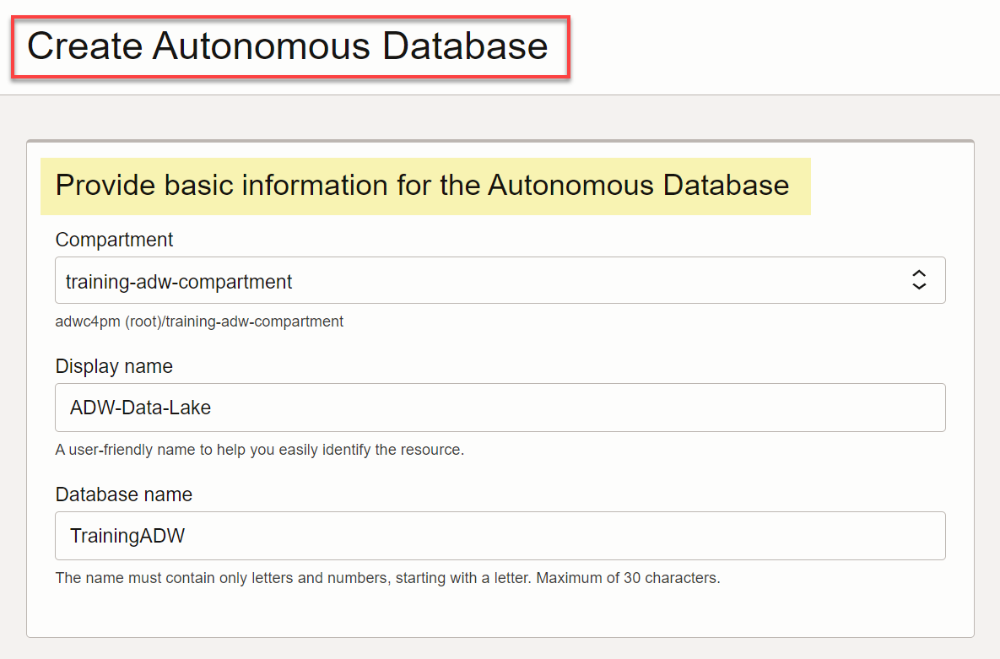
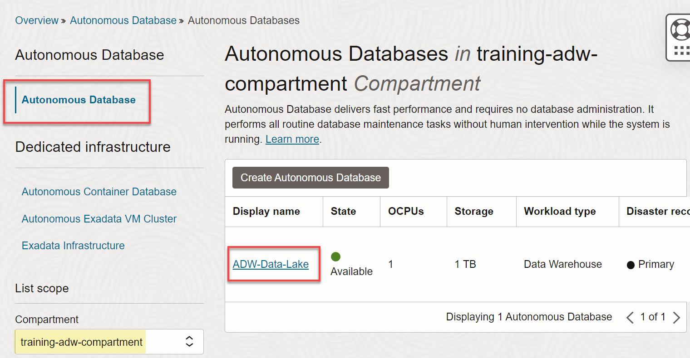
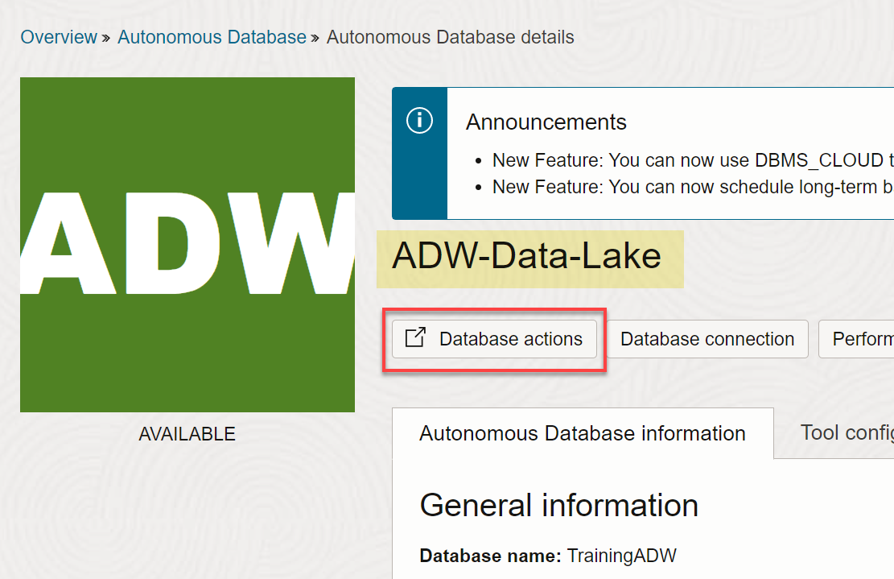

<!--- This is a comment. --->

<if type="livelabs">
# Review the Workshop Environment Setup (Optional)

## Introduction

Since you are using the LiveLabs environment, you **don't** have administrative privileges to create any OCI resources; therefore, all of the OCI resources that you need in this workshop are already created for you with your LiveLabs reservation.

If you want to review the detailed steps on how to set up the workshop environment when you are using either the **freetier** version or your own paid tenancy, see **Lab 1: Set Up the Workshop Environment** in the freetier version of the workshop on LiveLabs titled **Build a Data Lake with Autonomous Warehouse**.

> **Note:** This lab is directed at administrator users because they are granted the required access permissions. In real life scenarios, you would create a new ADW administrator user and a ADW administrator group, and then add the new administrator user to the new group. Next, you create the Oracle Cloud Infrastructure Identity and Access Management (IAM) policies that are required to create and manage an ADW and Data Catalog instances.

Estimated Time: 5 minutes

</if>

<if type="freetier">
# Set Up the Workshop Environment

## Introduction

This lab walks you through the steps to set up the workshop environment.

> **Note:** This workshop is directed at administrator users because they are granted the required access permissions. In real life scenarios, you would create a new Data Catalog administrator user and a Data Catalog administrator group, and then add the new administrator user to the new group. Next, you create the Oracle Cloud Infrastructure Identity and Access Management (IAM)    policies that are required to create and manage a Data Catalog and Autonomous Database instances.

Estimated Time: 10 minutes

### Objectives

In this lab, you will:

* (Optional) Create a compartment for your Data Catalog resources.
* Create an Autonomous Warehouse instance.

### Prerequisites

* An Oracle Cloud Account - Please view this workshop's LiveLabs landing page to see which environments are supported.
* At least one user in your tenancy who wants to work with Data Catalog.

> **Note:** If you have a **Free Trial** account, when your Free Trial expires your account will be converted to an **Always Free** account. You will not be able to conduct Free Tier workshops unless the Always Free environment is available. [Click here for the Free Tier FAQ page.](https://www.oracle.com/cloud/free/faq.html)

## Task 1: Log in to the Oracle Cloud Console

1. Log in to the **Oracle Cloud Console** as the Cloud Administrator. You will complete all the labs in this workshop using this Cloud Administrator.
See [Signing In to the Console](https://docs.cloud.oracle.com/en-us/iaas/Content/GSG/Tasks/signingin.htm) in the _Oracle Cloud Infrastructure_ documentation.

2. On the **Sign In** page, select your tenancy, enter your username and password, and then click **Sign In**.

   

   The **Oracle Cloud Console** Home page is displayed.

   

    >**Note:** To zoom in (magnify) a displayed image in this workshop, hover over the image to display the magnifying glass icon, and then then click the image.

   

## Task 2: (Optional) Create a Compartment

A Cloud Administrator can optionally create a compartment in your tenancy to help organize the Data Catalog resources. In this lab, as a Cloud Administrator, you will create a new compartment that will group all of your Data Catalog resources that you will use in the workshop.

1. Open the **Navigation** menu and click **Identity & Security**. Under **Identity**, click **Compartments**.

       

    For faster navigation, you can pin items that you use frequently. To pin an item, hover over the menu item and then click pin to the left of the item name.

    

    The pinned item is displayed in the **Pinned** section of the **Home** tab the next time you use the Navigation menu.

    

    The **Recently visited** section of the **Home** tab shows recently used navigation items.

    To quickly find navigation menu items, use the **Search** box.

2. On the **Compartments** page, click **Create Compartment**.

   

3. In the **Create Compartment** dialog box, enter **`training-adw-compartment`** in the **Name** field and **`Training ADW Compartment`** in the **Description** field.

4. In the **Parent Compartment** drop-down list, select your parent compartment, and then click **Create Compartment**.

   

   The **Compartments** page is re-displayed and the newly created compartment is displayed in the list of available compartments.

   

## Task 3: Create an Autonomous Data Warehouse Instance

1. Log in to the **Oracle Cloud Console** as the Cloud Administrator, if you are not already logged in. On the **Sign In** page, select your tenancy, enter your username and password, and then click **Sign In**. The **Oracle Cloud Console** Home page is displayed.

2. Open the **Navigation** menu and click **Oracle Database**. Under **Oracle Database**, click **Autonomous Data Warehouse**.

3. On the **Autonomous Databases** page, select your compartment from the **Compartment** drop-down list in the **List Scope** section. In this example, we selected our **`training-adw-compartment`**. Click **Create Autonomous Database**. The **Create Autonomous Database** page is displayed.

4. In the **Provide basic information for the Autonomous Database** section, specify the following:
       * **Compartment:** Select your own compartment.
       * **Display Name:** **`ADW-Data-Lake`**.
       * **Database Name:** **`TrainingADW`**.

       

5. In the **Choose a workload type** section, accept the **Data Warehouse** default selection.

       

6. In the **Choose a deployment type** section, accept the **Serverless** default selection.

       

7. In the **Configure the database** section, specify the following:

       * **Always Free:** Disabled. If your Cloud Account is an Always Free account, you can select this option to create an Always Free autonomous database.
       * **Choose database version:** **`19c`**.
       * **OCPU count:** **`1`**.
       * **OCPU auto scaling:** Select this checkbox. This allows the system to automatically use up to three times more CPU and IO resources to meet the workload demand.
       * **Storage (TB):** **`1`** (TB).
       * **Storage auto scaling:** Leave the checkbox unchecked.

       

       >**Note:** If you are using a Free Trial or Always Free account, and you want to use Always Free Resources, you need to be in a region where Always Free Resources are available. You can see your current default **region** in the top, right hand corner of the page.

8. In the **Create administrator credentials** section, specify the following:

       * **Username:** This read-only field displays the default administrator username, **`ADMIN`**.
       **Important:** Make a note of this _username_ as you will need it to perform later tasks.
       * **Password:** Enter a password for the **`ADMIN`** user of your choice such as **`Training4ADW`**.
       **Important:** Make a note of this _password_ as you will need it to perform later tasks.
       * **Confirm password:** Confirm your password.

       

9. In the **Choose network access** section, select the **Secure access from everywhere** option as the access type.

    

10. In the **Choose a License and Oracle Database Edition** section, select the __Bring your own license (BYOL)__ option as the license type. The **Choose an Oracle Database Edition** section is displayed. Select the __Oracle Database Enterprise Edition (EE)__ option.

       

11. Click __Create Autonomous Database__.

12. The **Autonomous Database Details** page is displayed. The status of your ADB instance is **PROVISIONING**.

    

    In a few minutes, the instance status changes to **AVAILABLE**. At this point, your Autonomous Data Warehouse database instance is ready to use! Review your instance's details including its name, database version, OCPU count, and storage size.

    

13. Click the **Autonomous Database** link in the breadcrumbs. The **Autonomous Database** page is displayed. The new Autonomous Database instance is displayed.

    

## Task 4: Navigate to the SQL Worksheet

1. Log in to the **Oracle Cloud Console**, if you are not already logged as the Cloud Administrator. You will complete all the labs in this workshop using this Cloud Administrator. On the **Sign In** page, select your tenancy, enter your username and password, and then click **Sign In**. The **Oracle Cloud Console** Home page is displayed.

2. Open the **Navigation** menu and click **Oracle Database**. Under **Oracle Database**, click **Autonomous Database**.

3. On the **Autonomous Databases** page, click your **ADW-Data-Lake** ADB instance.
    

4. On the **Autonomous Database details** page, click **Database actions**.

    

5. A **Launch DB actions** message box with the message **Please wait. Initializing DB Actions** is displayed. Next, the **Database Actions | Launchpad** Home page is displayed in a _**new tab in your browser**_. In the **Development** section, click the **SQL** card to display the SQL Worksheet.

    

## Task 5: Add Data Share to the Limited Availability (LA) Version (Remove for GA)

For the LA release only, the stage database must be **whitelisted** as follows:

1. Copy and paste the following script into your SQL Worksheet, and then click the **Run Script (F5)** icon in the Worksheet toolbar.

    ```
    <copy>
    -- create a new role and grant the role to the admin user.

    CREATE ROLE adpbeta;
    GRANT ADPBETA TO admin;
    COMMIT;
    </copy>
    ```

    

2. Query the ADP version and the whitelisting status. Copy and paste the following query into your SQL Worksheet, and then click the **Run Statement** icon in the Worksheet toolbar.

    ```
    <copy>
    -- Check the ADP version and whitelisting status.

    SELECT
    json_value(get_adp_status,'$.ADPVersion') version,
    json_value(get_adp_status,'$.operationalState') operational_state,
    JSON_QUERY(get_adp_status,'$.packageState[*]?(@.sharing=="VALID")' PRETTY) share_status
    FROM dual;
    </copy>
    ```

    

3. Confirm that the Data Sharing tile is now visible in the **Data Studio** section on the **DATA LOAD** page. Click **Oracle Database Actions** in the banner to display the Launchpad landing page. In the **Data Studio** section, the **Data Sharing** tile should be displayed.

    

</if>

You may now proceed to the next lab.

## Learn More

* [Oracle Cloud Infrastructure Documentation](https://docs.cloud.oracle.com/en-us/iaas/Content/GSG/Concepts/baremetalintro.htm)
* [Using Oracle Autonomous Database Serverless](https://docs.oracle.com/en/cloud/paas/autonomous-database/adbsa/index.html)
* [Data Catalog Overview](https://docs.oracle.com/en-us/iaas/data-catalog/using/overview.htm)
* [What Is a Data Catalog and Why Do You Need One?](https://www.oracle.com/big-data/what-is-a-data-catalog/)
* [Get Started with Data Catalog](https://docs.oracle.com/en-us/iaas/data-catalog/using/index.htm)

## Acknowledgements

* **Author:** Lauran K. Serhal, Consulting User Assistance Developer
* **Last Updated By/Date:** Lauran Serhal, July 2023

Data about movies in this workshop were sourced from Wikipedia.

Copyright (C) Oracle Corporation.

Permission is granted to copy, distribute and/or modify this document under the terms of the GNU Free Documentation License, Version 1.3 or any later version published by the Free Software Foundation; with no Invariant Sections, no Front-Cover Texts, and no Back-Cover Texts. A copy of the license is included in the section entitled [GNU Free Documentation License](https://oracle.github.io/learning-library/data-management-library/autonomous-database/shared/adb-15-minutes/introduction/files/gnu-free-documentation-license.txt)
