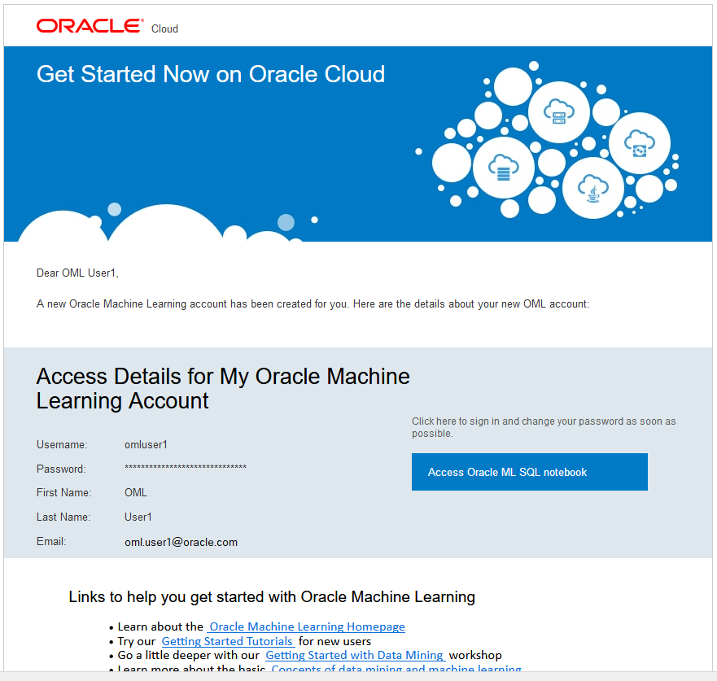
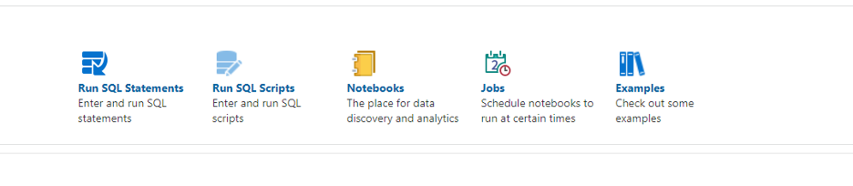
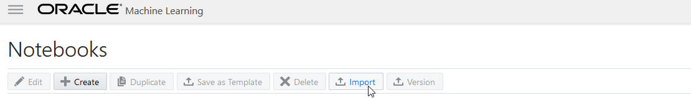
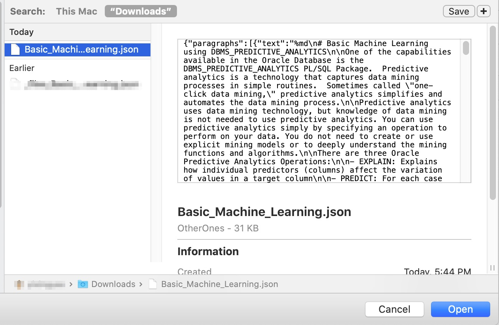
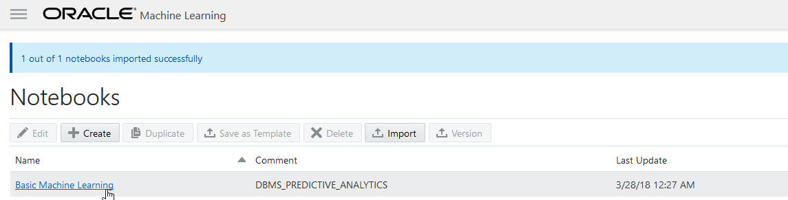
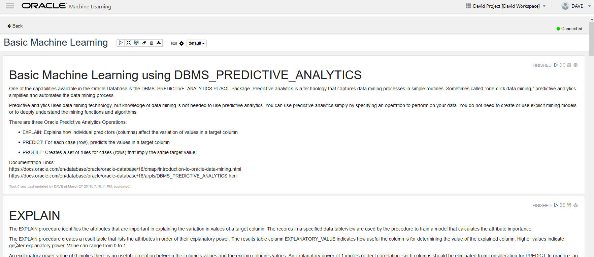
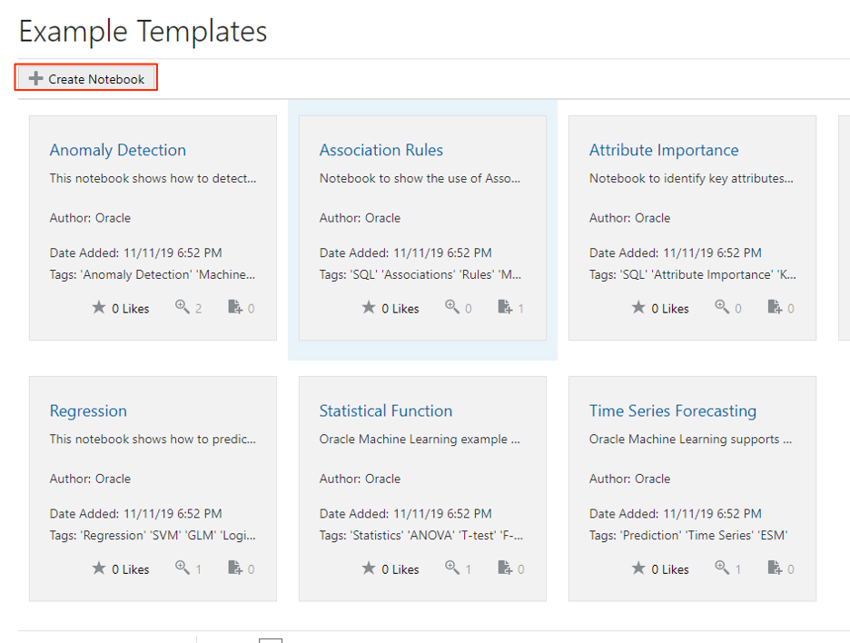
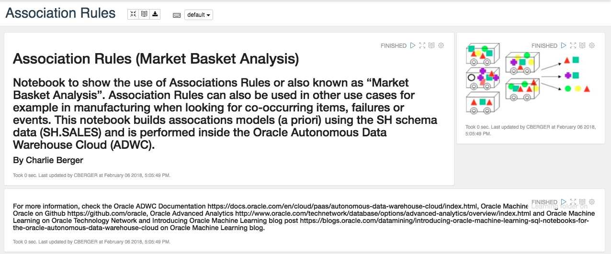

# Simple Introduction to Machine Learning Algorithms (DBMS\_PREDICTIVE\_ANALYTICS)

## Introduction

In this lab, you will be using the Oracle Machine Learning (OML) notebook application provided with Autonomous Data Warehouse Cloud (ADWC) to explore some samples of the *DBMS\_PREDICTIVE\_ANALYTICS* functionality. DBMS\_PREDICTIVE\_ANALYTICS provides a set of easy-to-use machine learning procedures to simplify the machine learning process.

### Objectives

-   Learn how to import notebooks into Oracle ML Notebook
-   Learn how to use DBMS\_PREDICTIVE\_ANALYTICS routines
-   Learn how to use Oracle ML Examples

## Task 1: Download the sample notebook for this lab
The first step is to download the sample notebook and then import it into the Oracle ML notebook application.

1. **Click** <a href="./files/Basic_Machine_Learning.json" download="Basic_Machine_Learning.json" target="\_blank">here</a> to download the sample notebook for this lab, Basic\_Machine\_Learning.json, to a folder on your local computer.

## Task 2: Login to the Oracle ML Notebook as one of your ML Notebook users

1. In the previous lab, you created 2 users for the Oracle ML Notebook (omluser1 and omluser2).  Login to Oracle ML Notebook as one of those users.  Hint: the link to sign in to Oracle ML Notebook was sent to the email address you provided when you created the new users.

    

    

    *Note: If you have not specified an email address or did not receive an email, you can click the Home icon on the top right of the Oracle Machine Learning User Administration page to go to the OML home page.*

## Task 3: Click the Notebooks link

1. Click the **Notebooks** link.

    

## Task 4: Click the Import button

1. Click the **Import** button.

    

## Task 5: Select the lab notebook .json file you downloaded earlier

1. Select the lab notebook **Basic\_Machine\_Learning.json** file you downloaded previously in Task 1.

    

## Task 6: Click the Basic Machine Learning link to open it

1. Click the **Basic Machine Learning** link to open it.

    

## Task 7: Read and Run the Basic Machine Learning notebook, paragraph by paragraph, to learn about using DBMS\_PREDICTIVE\_ANALYTICS

1.  The notebook provides some live examples of DBMS\_PREDICTIVE\_ANALYTICS in action against the sample SALES HISTORY (SH) tables.  There are additional instructions (including troubleshooting) and steps in the notebook itself.

    

## Task 8: Create a machine learning notebook using an OML Example

1. Go back to OML dashboard and click **Examples**. The Examples lists pre-populated Oracle Machine Learning notebook templates, which you can view, like, and use it to create new templates.

    

2. In the Examples page, select a template based on which kind of notebook you want to create.

    

3. Click **Create Notebook**. In the Create Notebook window, enter information for notebook **Name** and **Comment**, and click **OK**. For Association Rules example, it performs analysis based on SH schema. The results of the paragraphs have been shown. You can rerun each paragraph if you would like. You can go through this notebook at your own pace.

    

4. One of the interesting things from this notebook is that it uses `DBMS_DATA_MINING` PL/SQL package, which is an analytical technology that derives actionable information from data in an Oracle Database or Oracle Data Warehouse. This is an out-of-box function in ADW that you can utilize to perform machine learning by just using SQL scripts. Please refer to this for more information: [https://docs.oracle.com/cd/E18283\_01/appdev.112/e16760/d_datmin.htm](https://docs.oracle.com/cd/E18283_01/appdev.112/e16760/d_datmin.htm)

## Next Steps

- Experiment with DBMS\_PREDICTIVE\_ANALYTICS with your data
- Review the Oracle Database Data Mining documentation: [https://docs.oracle.com/en/database/oracle/oracle-database/18/dmapi/introduction-to-oracle-data-mining.html](https://docs.oracle.com/en/database/oracle/oracle-database/18/dmapi/introduction-to-oracle-data-mining.html)
- Look at the DBMS\_DATA\_MINING sample notebooks in the Oracle ML Notebook Examples

## Want to Learn More?

Click [here](https://docs.oracle.com/en/database/oracle/oracle-database/20/dmapi/oml4sql-basics.html#GUID-BFA7FAAE-F5CB-4A42-886A-47B6D502B492) for documentation on Oracle Machine Learning algorithms.

## **Acknowledgements**

- **Author** - Nilay Panchal, ADB Product Management
- **Adapted for Cloud by** - Richard Green, Principal Developer, Database User Assistance
- **Last Updated By/Date** - Arabella Yao, Product Manager Intern, DB Product Management, July 2020
