# Monitor Your Autonomous Database Instance using the Cloud Console

## Introduction

In this lab, you will explore the monitoring capabilities available for your Autonomous Database (ADB).

Oracle provides several facilities for monitoring the performance and activity of your autonomous database. Among them are:
-   **Database Service Console** (targeted towards database administrators, developers, data scientists)
-   **OCI Monitoring Console** (targeted to cloud administrators and business users)
-   **Performance Hub**
-   **Autonomous Database Metrics**

This lab covers using the Database Service Console, OCI Monitoring Console, and the Performance Hub to monitor an ADB.

The ADB Service Console provides dashboards to monitor the real-time and historical CPU and storage utilization, as well as database activity, like the number of running or queued statements. It also provides Real-Time SQL Monitoring to look at current and past long-running SQL statements in your instance and allows you to cancel long-running queries or set thresholds for ADW or ATP to automatically cancel them for you.

### Video Preview
Watch a video demonstration of monitoring ADB cloud service.

## Task 1: Navigate to the Service Console

The first facility that we will look at for monitoring your autonomous database is the Database Service Console.

1. If you are not logged in to Oracle Cloud Console, log in and select Autonomous Database from the hamburger menu and navigate into your ADB Finance Mart instance.

    

    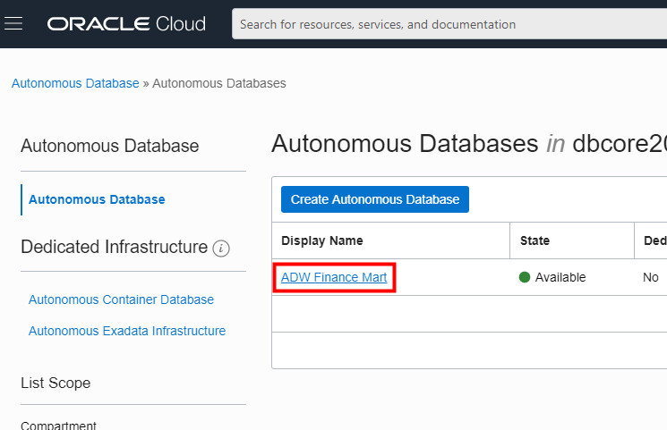

2. In your ADW Finance Mart **Database Details** page, click the **Service Console** button.

    

## Task 2: Examine the Console Overview Page
The **Overview** and **Activity** tabs show real-time and historical information about the service's utilization. The Service Console opens on the Overview tab by default.

1. Examine the components of the Overview page: Storage used, CPU utilization, Running SQL statements, Number of OCPUs allocated, SQL statement response times.

    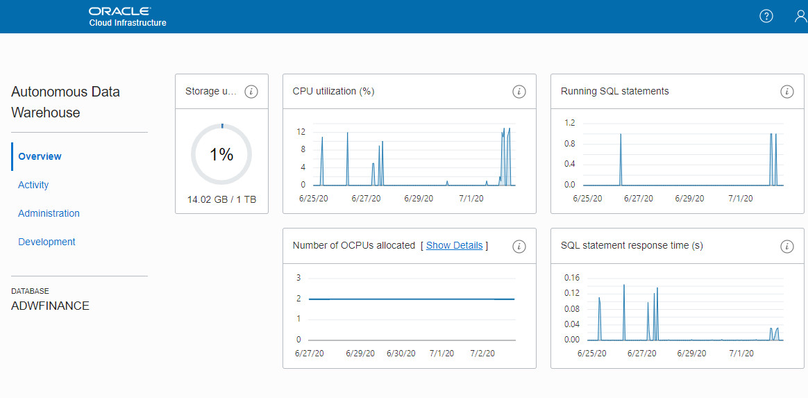

## Task 3: Examine the Console Activity Page

1. To access detailed information about the service's performance, click the **Activity** tab in the Service Console.

    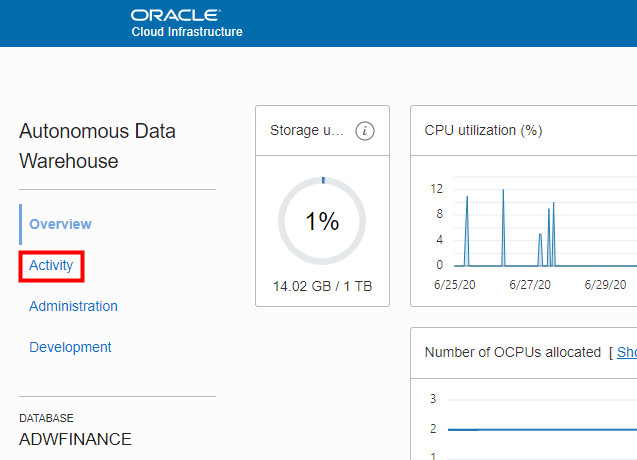

2. Examine the components of the Activity page: Database Activity, CPU Utilization, Running Statements, Queued Statements.

    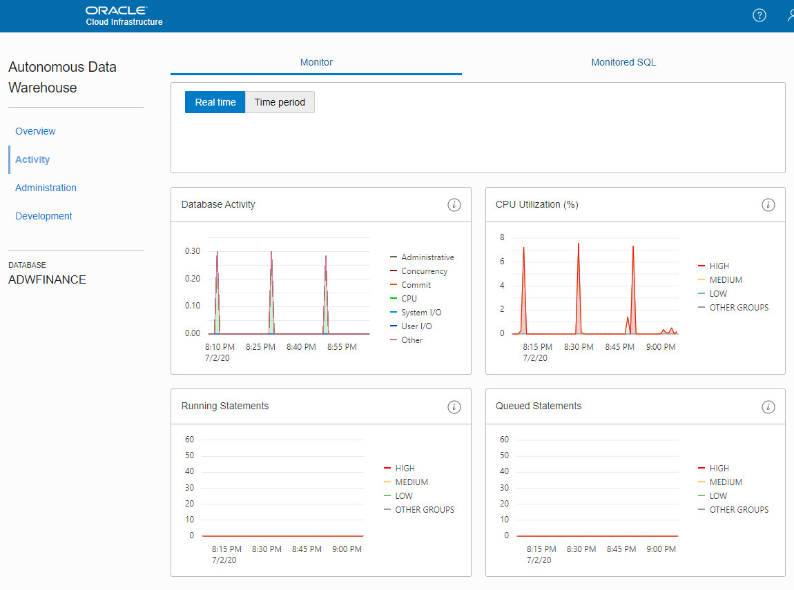

3. To see earlier data, click **Time period**. The default retention period for performance data is eight days. So, this view shows information about the last eight days by default.

    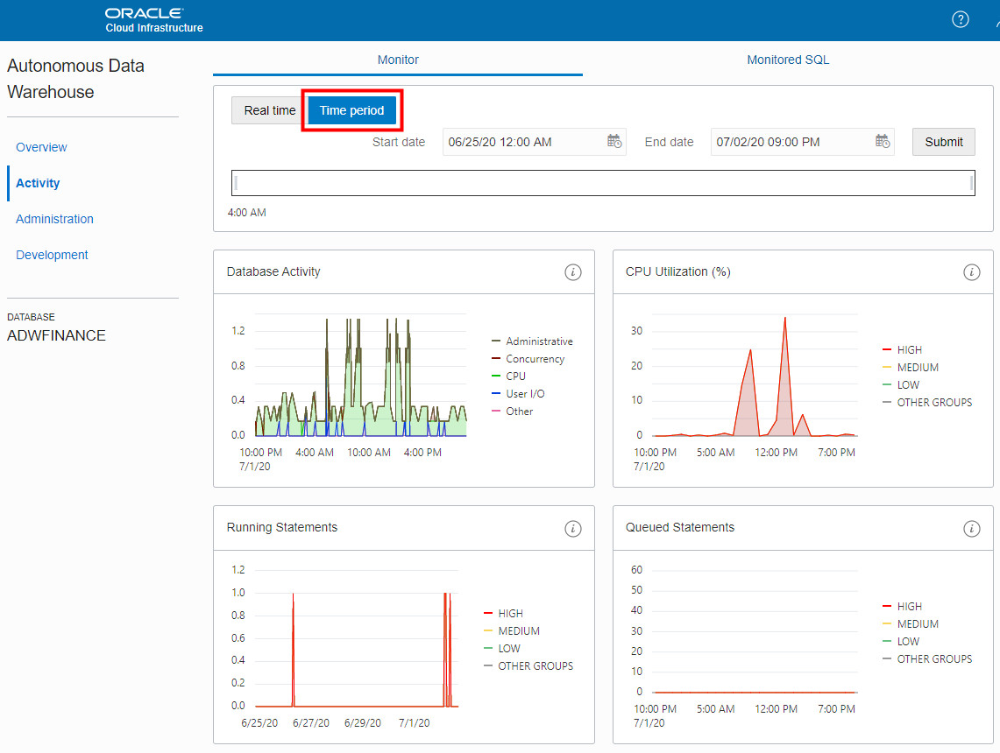

4. In the Time period view, you can use the **calendar** to look at a specific time period in the past eight days. You can also use the **time slider** to change the period for which performance data is shown.

    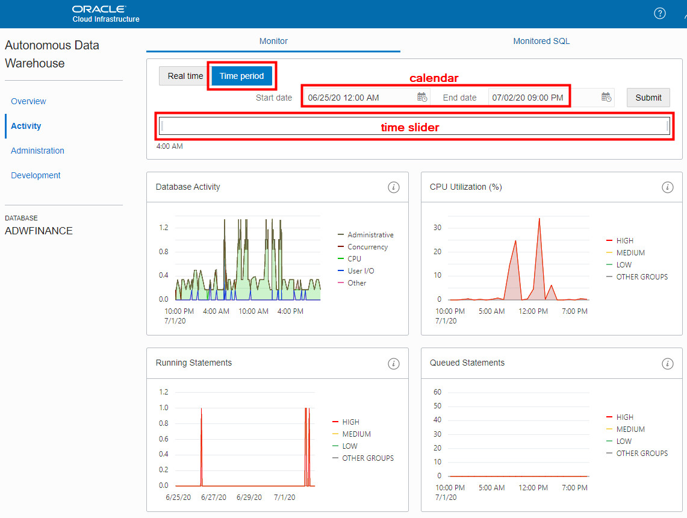

## Task 4: Monitor SQL Statements

1. Click the **Monitored SQL** tab to see information about current and past monitored SQL statements.

    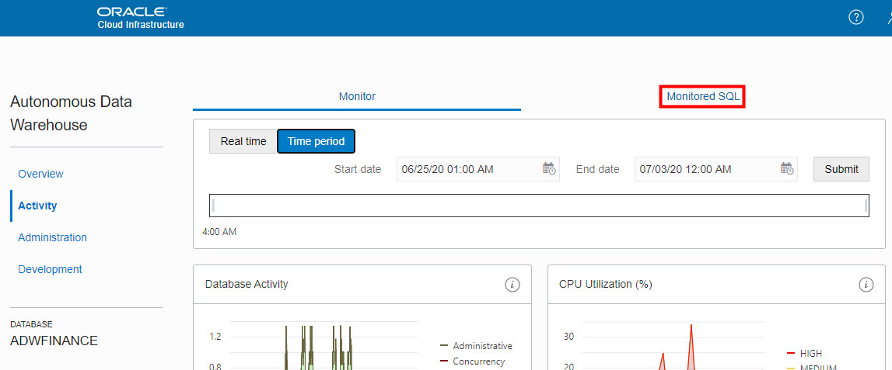

2. To see the detailed SQL Monitor report for a statement, select the statement and click **Show Details**. The **Overview** tab in the pop-up shows General information, Time and Wait Statistics, and IO Statistics for that statement.

    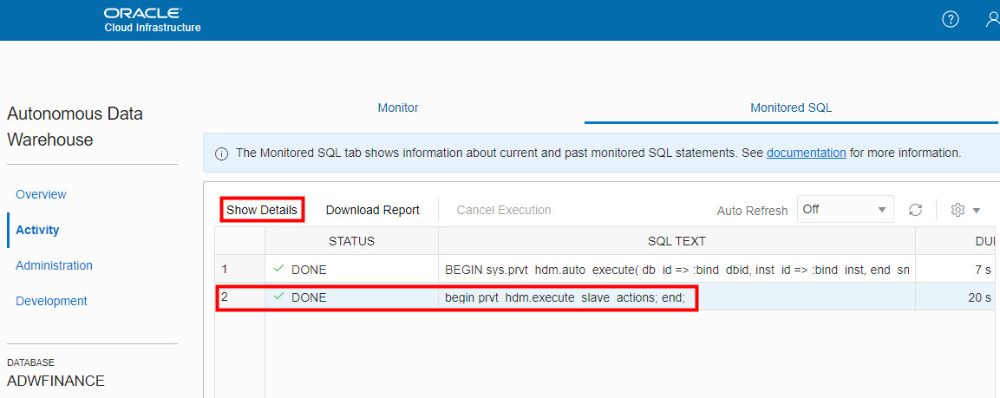

    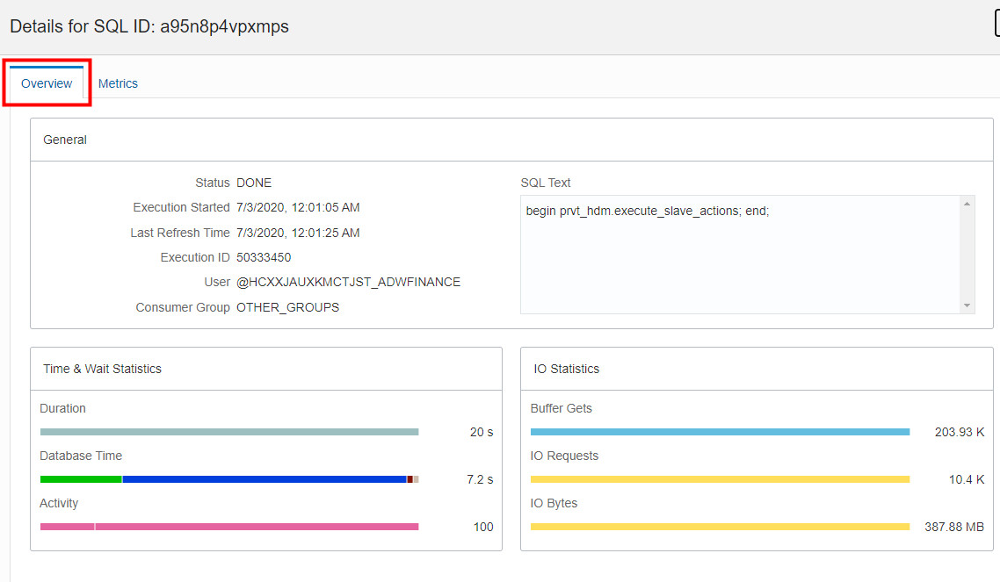

3. The **Metrics** tab in the pop-up shows CPU Used, Memory, IO Throughput, and IO Requests for that statement.

    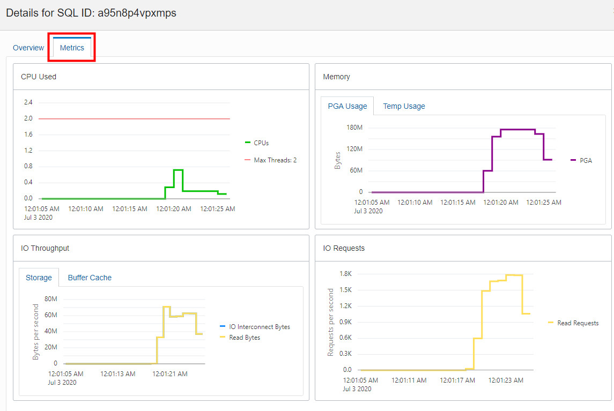

## Task 5: Examine the OCI Monitoring Console

Another facility for monitoring your autonomous database is the OCI Monitoring Console.

1. Go back to the cloud services dashboard where you can see all the services available to you. Click the navigation menu in the upper left to show top level navigation choices.

    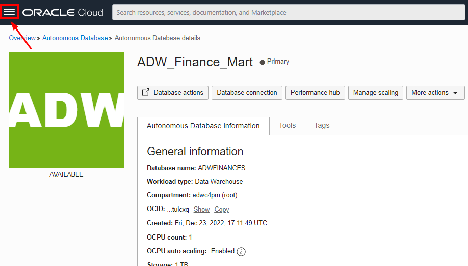

2. Scroll down the navigation menu. Click **Observability & Management**, click **Service Metrics**.

    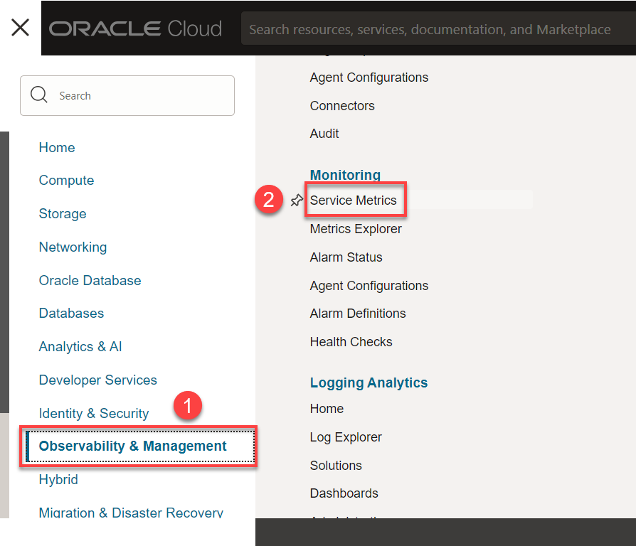

3. Choose a **Compartment** that you have permission to work in. Choose a **Metric Namespace** in the drop-down menu to the right of the compartment. If you're not sure which compartment and namespace to use, contact an administrator. Click the **edit** symbol next to **Dimensions**.

    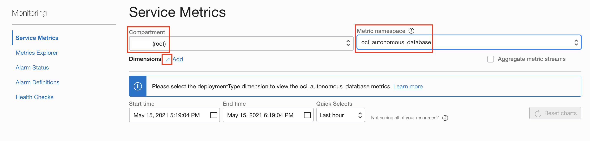

4. In the **Edit dimensions** pop-up dialog, select a **Deployment Type**. Click **Done**.

    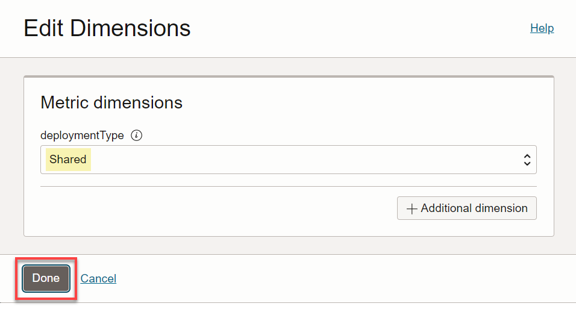

5. The page updates to display only the resources in that compartment and namespace. Scroll down this very long page. It shows the following metrics:
    -   CPU Utilization
    -   Storage utilization
    -   Sessions
    -   Execute Count
    -   Running Statements
    -   Queued Statements
    -   Transaction Count
    -   Current Logons
    -   User Calls
    -   Parse Count
    -   Failed Logons
    -   Failed Connections
    -   Connection Latency
    -   Query Latency
    -   CPU Time

    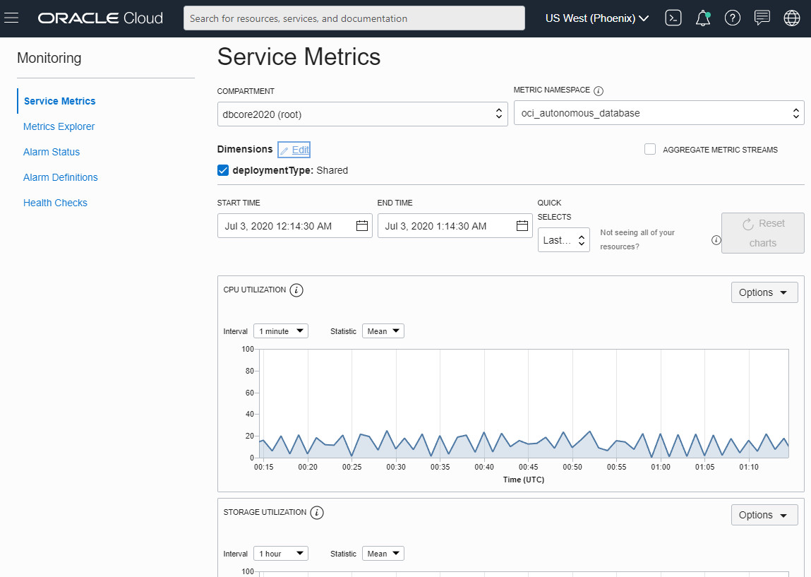

6.  In addition to these service metrics, you can also perform queries on the metrics by using **Metrics Explorer**, creating **Alarms**, and creating **Health Checks**, to ensure that users will become immediately aware of any availability issues.

    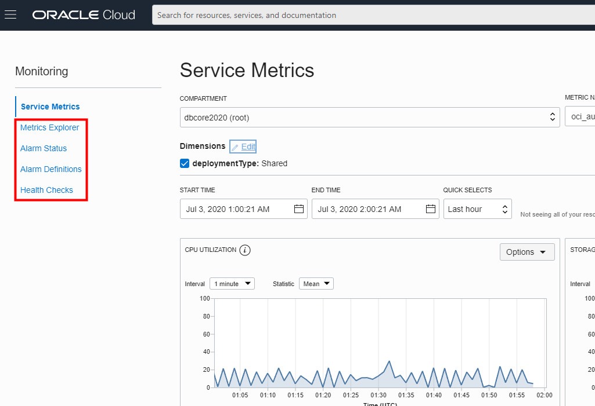

## Task 6: View Performance Data from the Performance Hub
You can view real-time and historical performance data from the Performance Hub. Performance Hub shows information about Active Session History (ASH) analytics, SQL monitoring, and workload.

1. In your ADW Finance Mart **Database Details** page, click **Performance Hub**.

    

2. The Performance Hub page is displayed. This page has the following sections:
    -   The time selector.
    -   The Reports drop-down list, containing the option to create and download an AWR (Automatic Workload Repository) report.
    -   The tabbed data area, with the tabs ASH Analytics, SQL Monitoring, and Workload.

    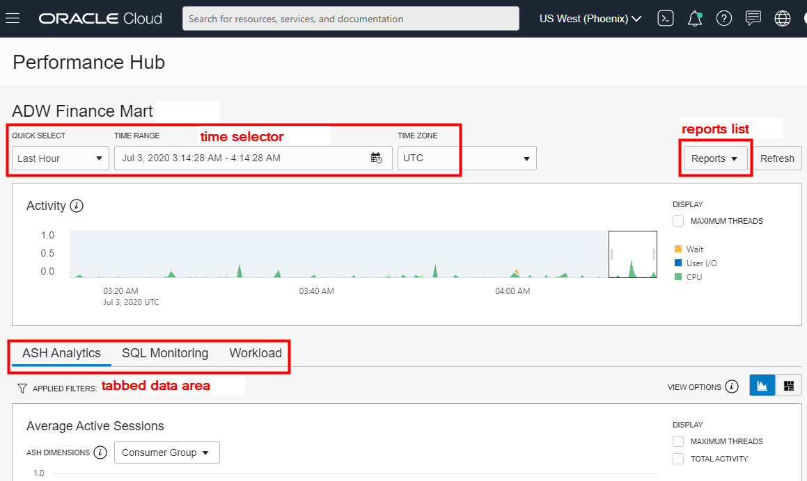

3. The Automatic Workload Repository (AWR) collects, processes, and maintains performance statistics for problem detection and self-tuning purposes. This data is stored in both memory and the database. From the Performance Hub, you can generate and download a report of the gathered data.
From the **Reports** drop-down list, select **AWR**.

    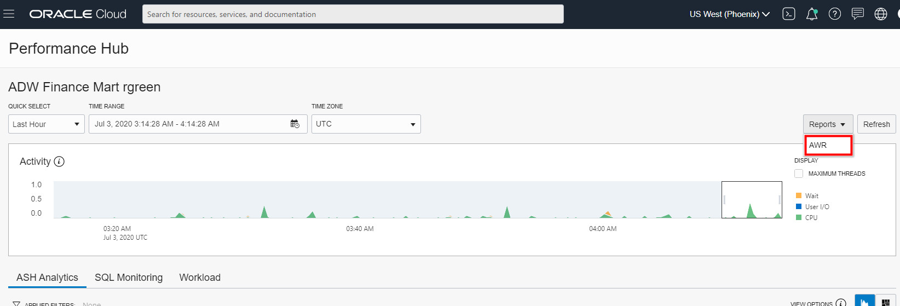

4. In the Generate AWR Report dialog, select the time range. You can either select **the two snapshots closest to** the current time, or you can create a **custom** time range. After you select the time range, click **Download**.

    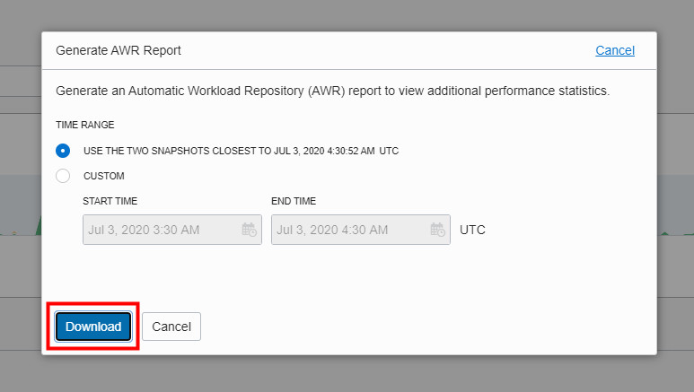

5. Use the **Save As** dialog to specify where to download the report's HTML file to your local computer. Click the downloaded HTML file to view the lengthy, detailed report. The report is arranged with the following sections:
    - Report Summary
    - Time Model Statistics
    - Wait Events Statistics
    - Global Cache and Enqueue Statistics Summary
    - Global CR Server Statistics
    - Global Cache Transfer Statistics
    - SQL Statistics
    - Global Activity Statistics
    - I/O Statistics
    - Library Cache Statistics
    - Memory Statistics
    - Supplemental Information
    - Active Session History(ASH) Report
    - ADDM Reports

    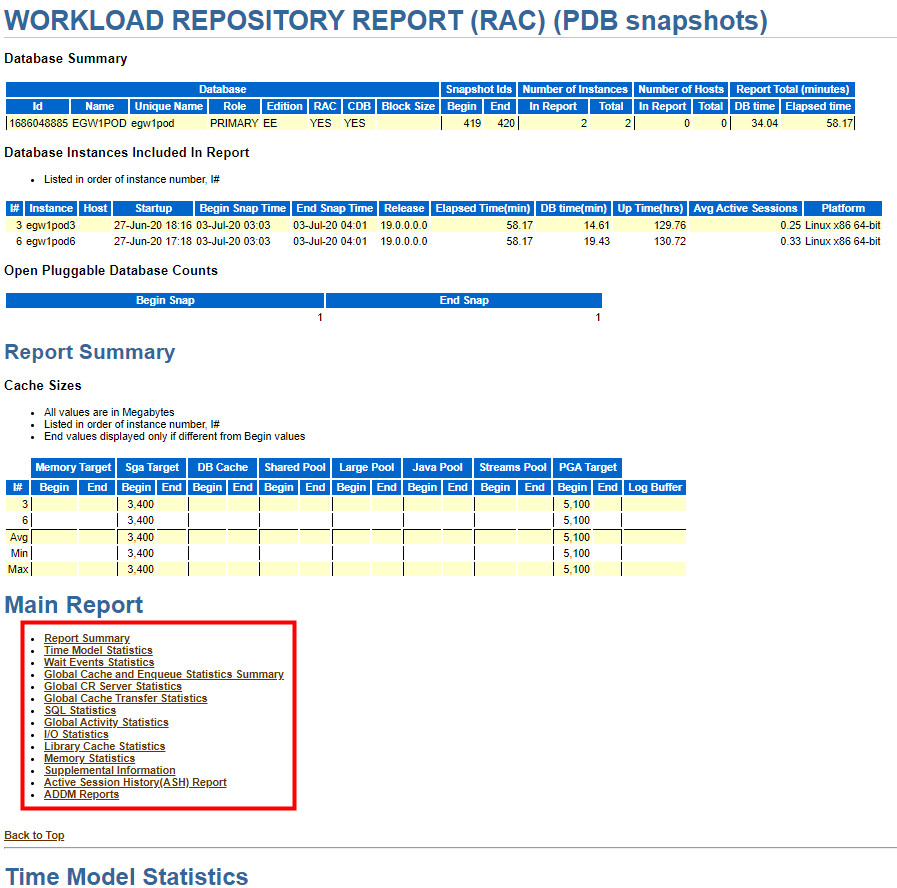

## Want to Learn More?

Click [here](https://docs.oracle.com/en/cloud/paas/autonomous-data-warehouse-cloud/user/manage-service.html#GUID-759EFFFA-9FAC-4439-B47F-281E470E01DE) for documentation on managing and monitoring an autonomous database.

## **Acknowledgements**

- **Author** - Richard Green, Principal Developer, Database User Assistance
- **Last Updated By/Date** - Richard Green, November 2021
