# Monitor Your Autonomous Database Instance using the Cloud Console

## Introduction

In this lab, you will explore the monitoring capabilities available for your Oracle Autonomous Database (ADB).

Oracle provides several facilities for monitoring the performance and activity of your autonomous database. Among them are:
-   **Autonomous Database Metrics** (at bottom of Autonomous Database details page)
-   **Database Actions - Database Dashboard** (accessible from Database Actions Launchpad)
-   **Performance Hub** (accessible on Autonomous Database details page or from Database Actions Launchpad)
-   **OCI Monitoring Console** (accessible from Oracle Cloud Interface (OCI) navigation menu)

The ADB user interface provides dashboards to monitor the real-time and historical CPU and storage utilization, as well as database activity, like the number of running or queued statements. It also provides Real-Time SQL Monitoring to look at current and past long-running SQL statements in your instance and allows you to cancel long-running queries or set thresholds for ADW or ATP to automatically cancel them for you.

Estimated Lab Time: 10 minutes

Watch the video below for a quick walk-through of the lab.

[Monitor Your Autonomous Database Instance using the Cloud Console](videohub:1_q9gd2fnw)

### Video Preview

Watch a video demonstration of monitoring an Oracle Autonomous Database.

### Objectives
In this lab, you'll
-   Examine the charts in the Metrics section of the Autonomous Database details Page
-   Explore the charts in the Database dashboard
-   Explore more charts in the Performance hub
-   Examine the database monitoring charts in the OCI Monitoring Console

### Prerequisites
-   This lab requires completion of the Provision an Autonomous Database lab in the Contents menu on the left.

## Task 1: Navigate to Database Metrics

The first facility that we will look at for monitoring your autonomous database is the Database Metrics display located conveniently at the bottom of the Autonomous Database details page.

1. In your ADW\_Finance\_Mart **Database details** page, scroll down to the **Metrics** section.

    

## Task 2: Examine Database Metrics

The Metrics section displays an initial set of 8 graphs to examine database metrics. There are links to drill down to many additional graphs.

1. Scroll through the 8 initial graphs: CPU Utilization, Storage Utilization, Sessions, Execute Count, Running Statements, Queued Statements, Database Availability, and Failed Connections.

    The time period displayed on the metrics screen can also be easily changed to reflect your desired time period.

    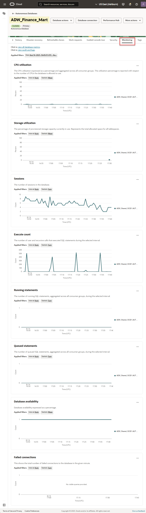

2. Click the **View all database metrics** link to examine many additional graphs of database metrics: Transaction Count, Current Logons, User Calls, Parse Count, Failed Logons, Failed Connections, Connection Latency, Query Latency, CPU Time, User Commits, User Rollbacks, Redo Size, Session Logical Reads, DB Block Changes, Physical Reads, Physical Writes, Physical Read Total Bytes, Physical Write Total Bytes, Parse Count (Hard), Parse Count (Failures), Bytes Received via SQL\*Net from DBLink, Bytes Sent via SQL\*Net to DBLink, Bytes Received via SQL\*Net from Client, Bytes Sent via SQL\*Net to Client, APEX Page Events, and APEX Page Load Time.

    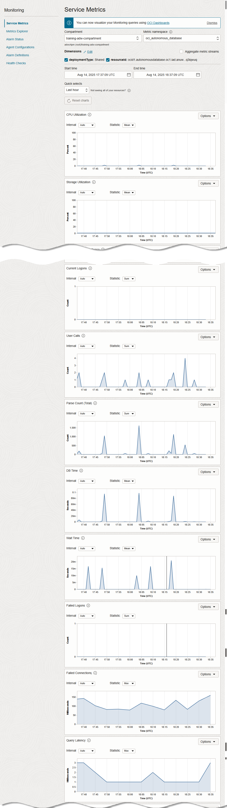

## Task 3: Examine the Database Actions Database Dashboard
You can also view this monitoring information with more detailed tools provided in the Database Actions Launchpad.

1. Go back to your ADW\_Finance\_Mart database's **Autonomous Database details** page, and click the **Database actions** dropdown list. Select **View all database actions**. If you are brought to the sign-in dialog for Database Actions, simply use your database instance's default administrator account, Username - **admin**, and click **Next**. Enter the admin password you specified when creating the database. Click **Sign in**. The **Database Actions Launchpad** opens.

    In the **Monitoring** section, click **Database Dashboard**.

    

2. The Database Dashboard opens in the **Overview** tab. This page gives an overview of the storage allocation and usage, CPU utilization, running SQL statements, the number of allocated ECPUs, and SQL statement response time.

    

3. By selecting the **Monitor** tab at the top of the page, you can also view this information in real time or in a specific time period. The Monitor tab opens initially in the **Real time** view.

    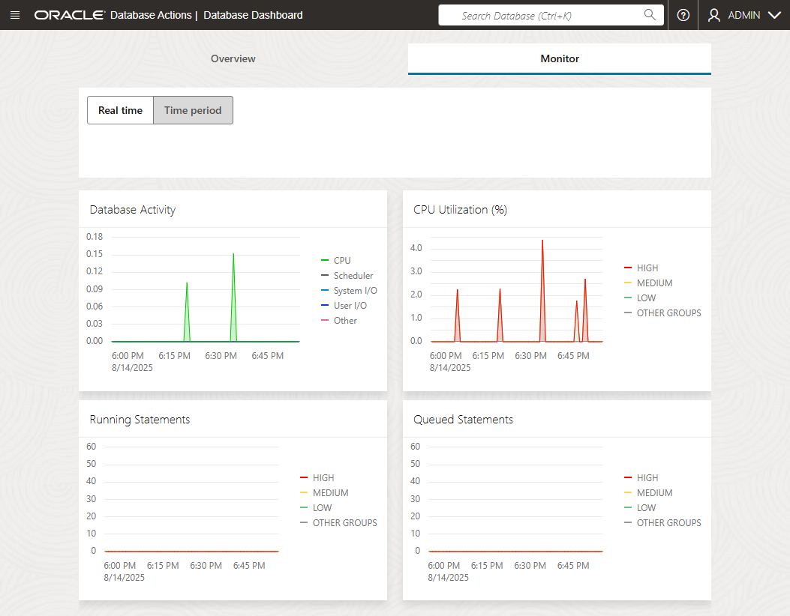

4. When you click the **Time period** view, you can use the **calendar** to look at a specific time period. You can also use the **time slider** to change the period for which performance data is shown.

    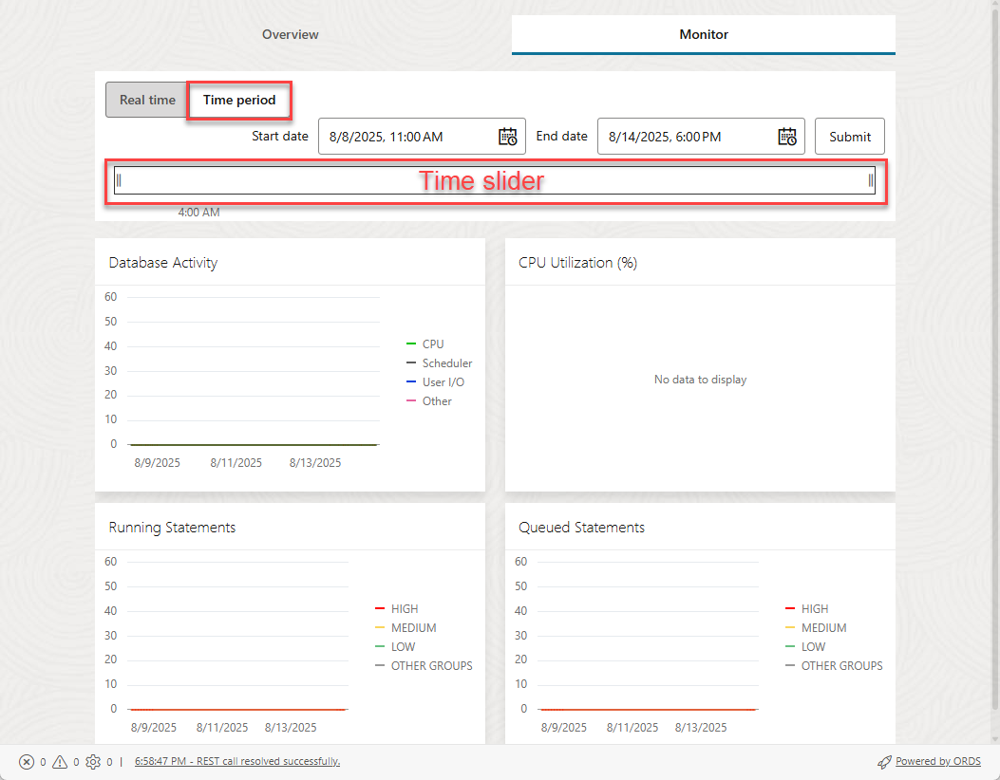

## Task 4: View Performance Data from the Performance Hub
You can view real-time and historical performance data from the Performance Hub. Performance Hub shows information about Active Session History (ASH) analytics and SQL monitoring.

1. On the **Database Actions Launchpad**, in the **Monitoring** section, click **Performance Hub**.

    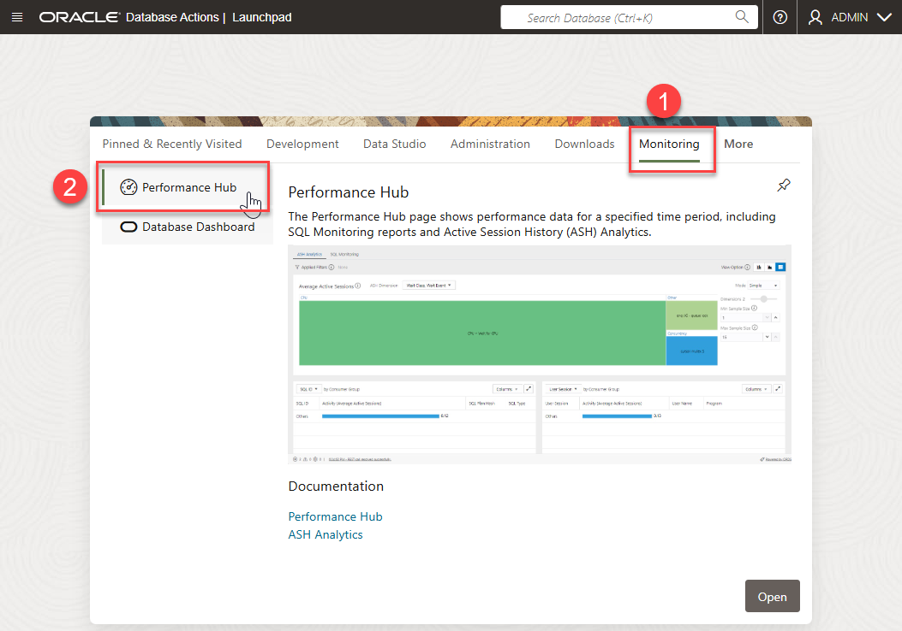

    (Note that you can also access the Performance Hub from you ADW\_Finance\_Mart **Autonomous Database details** page.)

    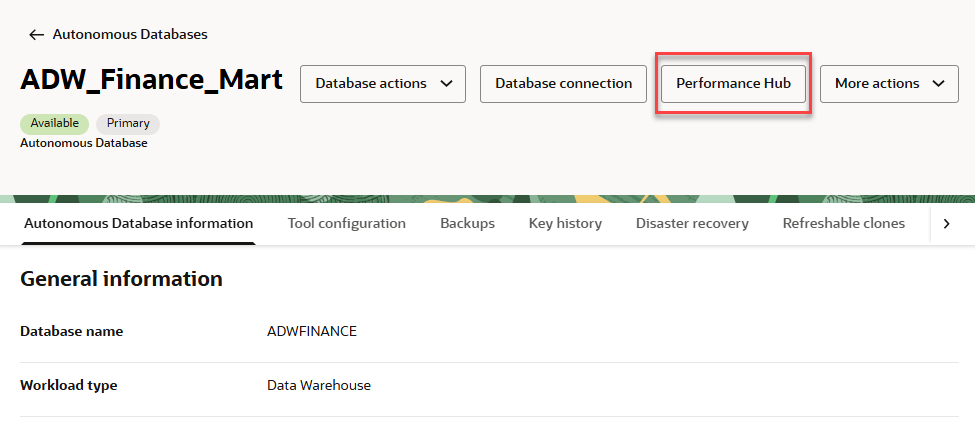

2. The Performance Hub page displays. At the top of the page you can select the time range to display, followed by the Activity Summary, which is displayed in Database Time in units of average active sessions.

    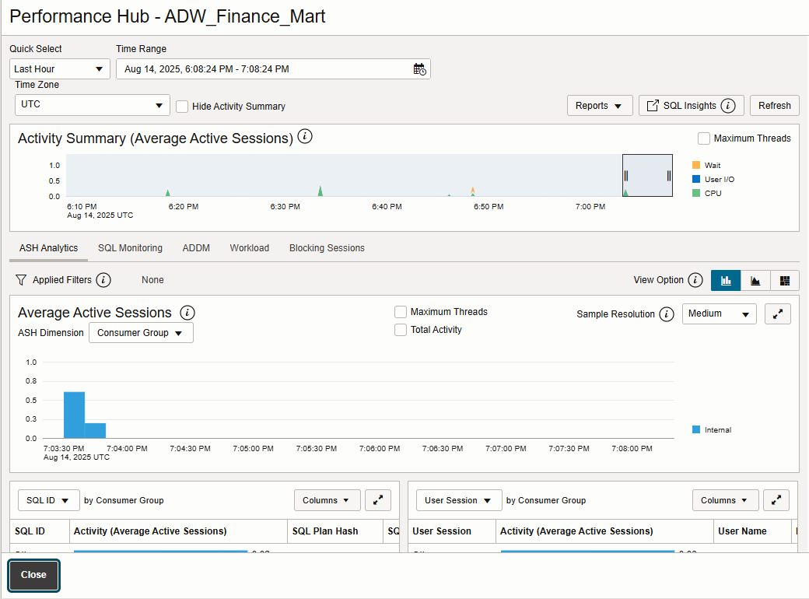

3. Continuing down the page, you can view Active sessions history analytics and SQL monitoring.

    The **ASH Analytics** tab shows average active sessions.

    

4. Click the **SQL Monitoring** tab. Each SQL statement can be inspected for further details. Here you can see the status, duration, SQL ID, SQL Plan Hash, and the user who created the statement. You can also see if parallelism was used, the resources consumed, and the SQL text.

    You can select the link in the **SQL ID** column to go to the corresponding **Real-time SQL Monitoring** page. This page provides additional details to help you tune the selected SQL statement.

    To terminate a running or queued SQL statement, click **Kill Session**.

    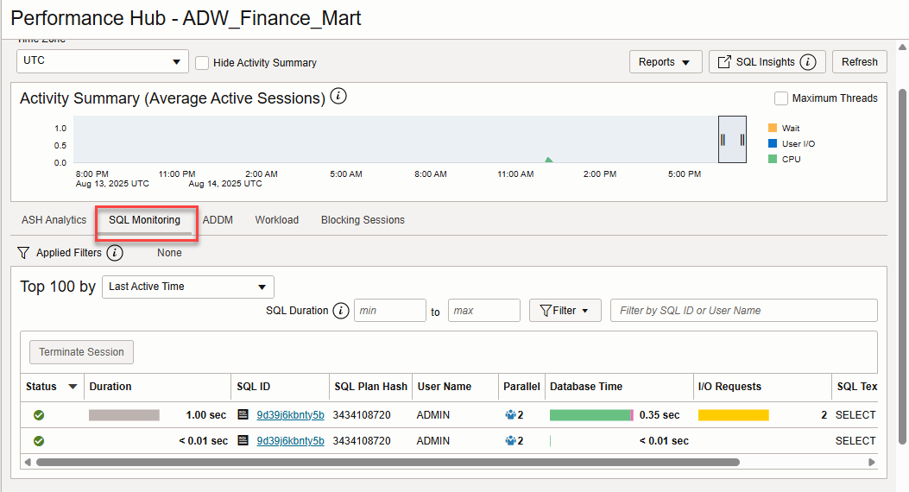

5. If you open the Performance Hub from the **Autonomous Database details** page rather than from the **Database Actions Launchpad**, some additional information is available.

    The Automatic Workload Repository (AWR) collects, processes, and maintains performance statistics for problem detection and self-tuning purposes. This data is stored in both memory and the database. From the Performance Hub, you can generate and download a report of the gathered data.

    From the **Reports** drop-down list, select **Automatic Workload Repository**.

    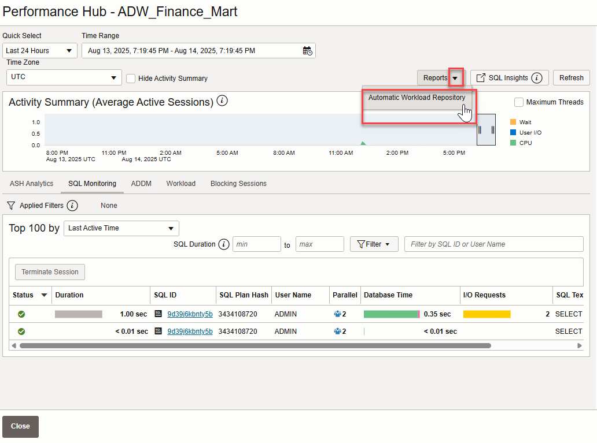

6. In the **Generate Automatic Workload Repository Report** dialog, select the Start Snapshot and End Snapshot time range. After you select the time range, click **Download**.

    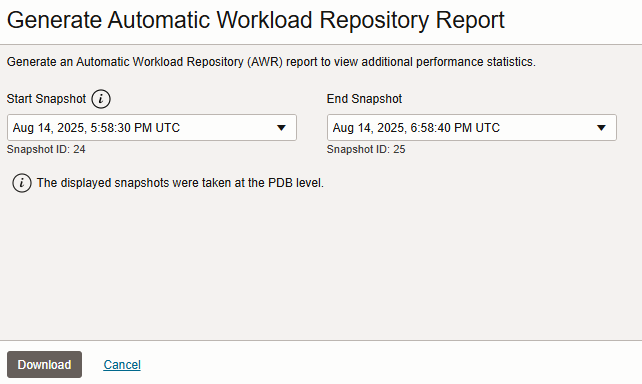

7. Use the **Save As** dialog to specify where to download the report's HTML file to your local computer. Click the downloaded HTML file to view the lengthy, detailed report.

    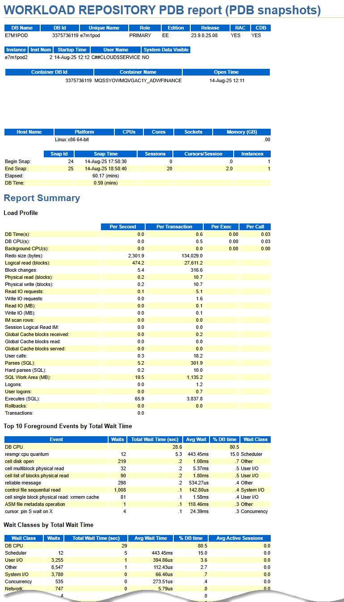

## Task 5: Examine the OCI Monitoring Console

Another facility for monitoring your autonomous database is the OCI Monitoring Console.

1. Go back to the cloud services dashboard where you can see all the services available to you. Click the navigation menu in the upper left to show top level navigation choices.

    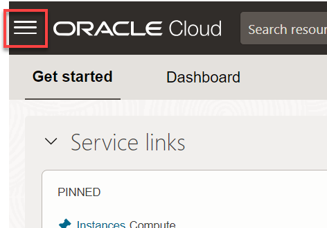

2. Scroll down the navigation menu. Click **Observability & Management**, click **Service Metrics**.

    

3. Choose a **Compartment** that you have permission to work in. Choose a **Metric Namespace** in the drop-down menu to the right of the compartment. If you're not sure which compartment and namespace to use, contact an administrator. Click the **edit** symbol next to **Dimensions**.

    

4. In the **Edit dimensions** pop-up dialog, select a **Deployment Type**. Click **Done**.

    

5. The page updates to display only the resources in that compartment and namespace. Scroll down this very long page. It shows the following metrics:
    -   CPU Utilization
    -   Storage utilization
    -   Sessions
    -   Execute Count
    -   Running Statements
    -   Queued Statements
    -   Transaction Count
    -   Current Logons
    -   User Calls
    -   Parse Count
    -   Failed Logons
    -   Failed Connections
    -   Connection Latency
    -   Query Latency
    -   CPU Time

    

6.  In addition to these service metrics, you can also perform queries on the metrics by using **Metrics Explorer**, creating **Alarms**, and creating **Health Checks**, to ensure that users will become immediately aware of any availability issues.

    

You may now **proceed to the next lab**.

## Want to Learn More?

Click [here for documentation](https://docs.oracle.com/en/cloud/paas/autonomous-data-warehouse-cloud/user/manage-service.html#GUID-759EFFFA-9FAC-4439-B47F-281E470E01DE) on managing and monitoring an autonomous database.

## **Acknowledgements**

- **Author** - Rick Green, Principal Developer, Database User Assistance
- **Last Updated By/Date** - Rick Green, August 2023
