# Use Oracle Machine Learning Notebooks

## Introduction

In this lab, you will use the Oracle Machine Learning (OML) SQL notebook application provided with your Autonomous Data Warehouse. This browser-based application provides a web interface to run SQL queries and scripts, which can be grouped together within a notebook. Notebooks can be used to build single reports, collections of reports, and even dashboards. OML provides a simple way to share workbooks and collections of workbooks with other OML users.

### Understanding Key Concepts

-   **What is a Notebook?**

    A notebook is a web-based interface for building reports and dashboards using a series of pre-built data visualizations, which can then be shared with other OML users. Each notebook can contain one or more SQL queries and/or SQL scripts. Additional non-query information can be displayed using special Markdown tags (an example of these tags will be shown later).

-   **What is a Project?**

    A project is a container for organizing your notebooks. You can create multiple projects.

-   **What is a Workspace?**

    A workspace is an area where you can store your projects. Each workspace can be shared with other users, so that they can collaborate with you. For collaborating with other users, you can provide different levels of permission, such as Viewer, Developer, and Manager – these will be covered in more details later in this lab. You can create multiple workspaces.

### Objectives

-   Learn how to create OML Users
-   Learn how to run a SQL Statement
-   Learn how to share notebooks
-   Learn how to create and run SQL scripts

## Task 1: Creating OML Users

The first step is to create two new users.

1.  If you are not logged in to Oracle Cloud Console, log in and select **Autonomous Data Warehouse** from the hamburger menu and navigate into your **ADW Finance Mart** instance.

    

    

2.  In the Details page for your Autonomous Data Warehouse instance, click **Service Console**.

    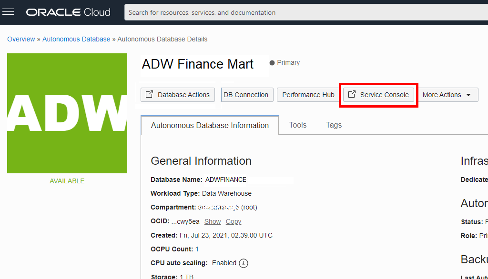

3.  Go to the **Administration** tab and click **Manage Oracle ML Users** to go to the OML user management page. This page allows you to manage OML users.

    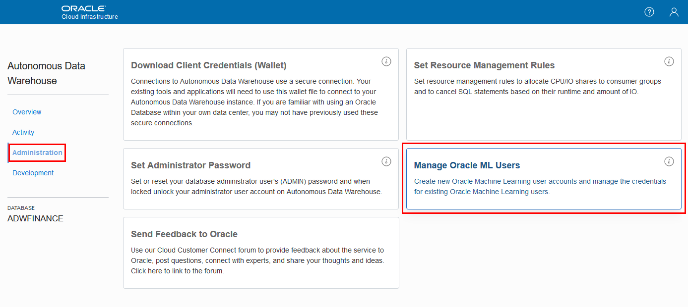

    *Note: You do not have to go to this page using the same steps every time; you can bookmark this Oracle ML User Administration URL and access it directly later.*

4.  Click **Create** to create a new OML user. Note that this will also create a new database user with the same name. This newly created user will be able to use the OML notebook application. Note that you can also enter an email address to send an email confirmation to your user (*for this lab, you can use your own personal email address*) when creating the user.

    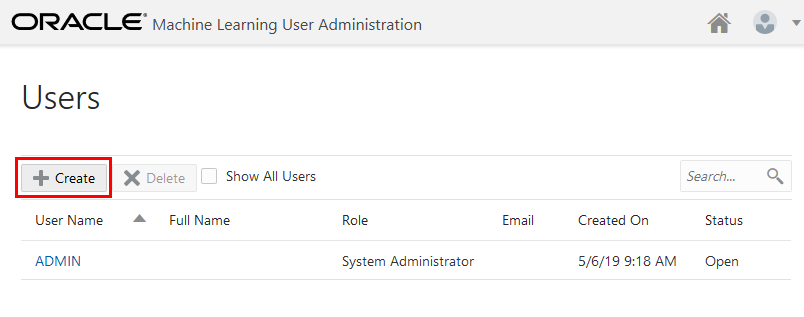

5.  Enter the required information for this user. Name the user  **omluser1**. If you supplied a valid **Email Address**, a welcome email should arrive within a few minutes to your Inbox. Click **Create** in the top-right corner of the page to create the user.

    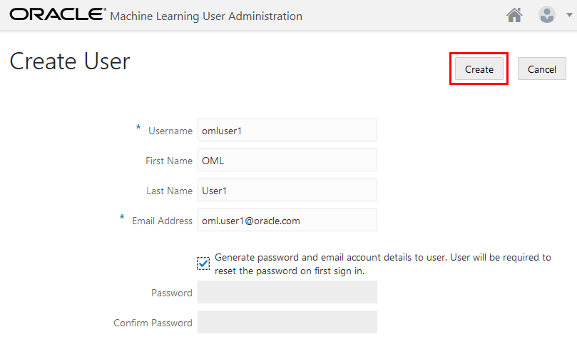

    *Note: If you get an application error, create the user by deselecting the generate password and email account details to the user and provide the password. Then click on **Create** in the top-right corner of the page to create the user. Note that in this case you will not receive an email.*

6.  Below is the email which each user receives welcoming them to the OML application. It includes a direct link to the OML application for that user, which can be bookmarked.

    

7.  After you click **Create**, you will see the new user listed in the Users section.

    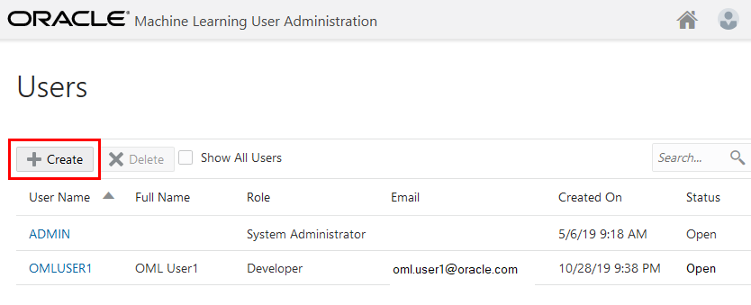

8.  Using the same steps, create another user named **omluser2**.

    

    You will use these two users later in this workshop.

## Task 2: Sign in into OML and Explore Home Page

1.  Using the link from your welcome email, from Oracle Global Accounts, you can now sign in to OML. Copy and paste the **application link** from the email into your browser and sign in to OML.

    *Note: If you have not specified an email address or did not receive an email, you can click the **Home** icon on the top right of the Oracle Machine Learning User Administration page to go to the OML home page.*

    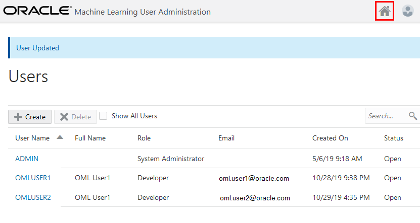

2.  Sign in to OML using your new user account, **omluser1**:

    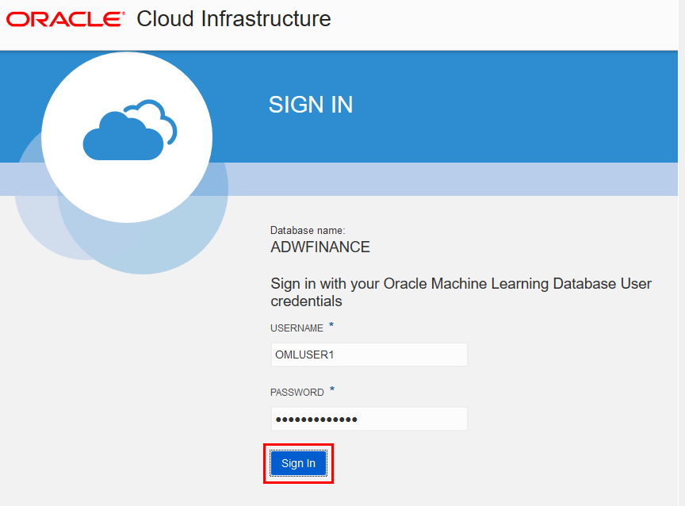

3.  Once you have successfully signed in to OML, the application home page will be displayed. The grey menu bar at the top left corner of the screen provides links to the main OML menus. The project/workspace and user maintenance menus are at the top right corner.

    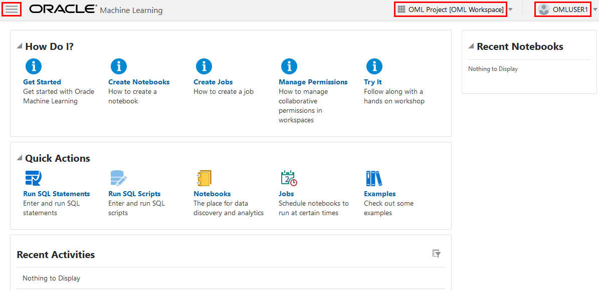

4.  On the home page, the main focus is the “**Quick Actions**” panel. The main icons in this panel provide shortcuts to the main OML pages for running queries and managing your saved queries.

    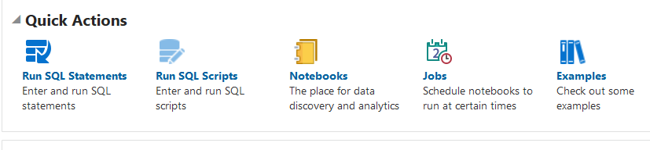

5.  All of your work is automatically saved –  there is no “Save” button when you are writing scripts and/or queries.

## Task 3: Opening a New SQL Query Scratchpad to Run a SQL Statement

1.  From the home page, click the “**Run SQL Statements**” link in the Quick Actions panel to open a new SQL Query Scratchpad.

    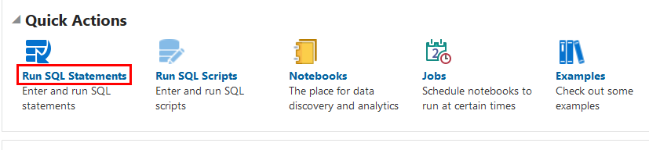

2.  The following screen should appear.

    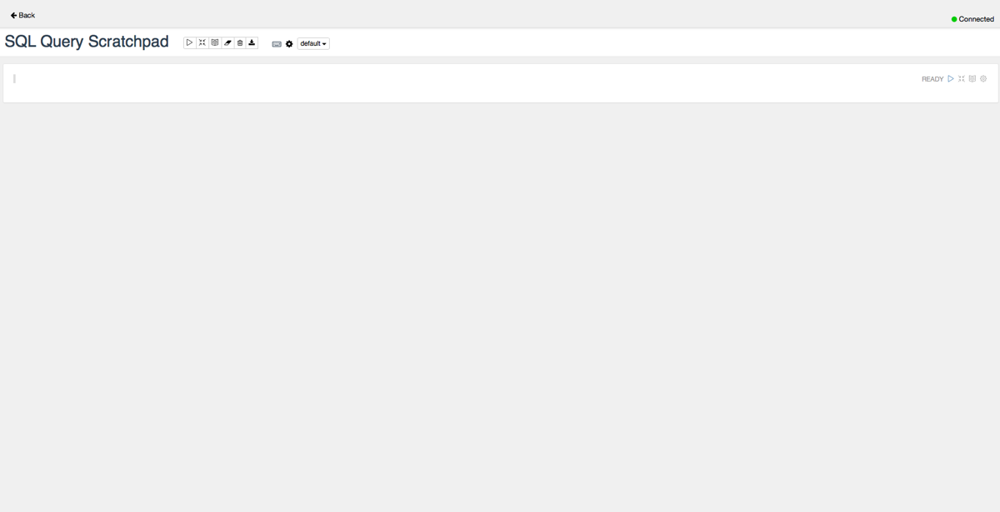

3.  The white panel below the main title (SQL Query Scratchpad – this name is automatically generated) is an area known as “paragraph”. Within a scratchpad, you can have multiple paragraphs. Each paragraph can contain one SQL statement or one SQL script.

    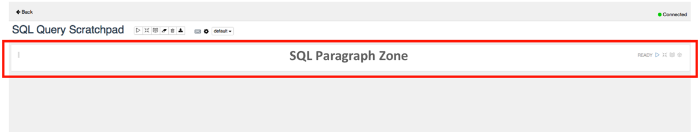

4.  In the SQL paragraph area, copy and paste <a href="./files/new_SQL_query_scratchpad.txt" target="\_blank">this code snippet</a>. Your screen should now look like this:

    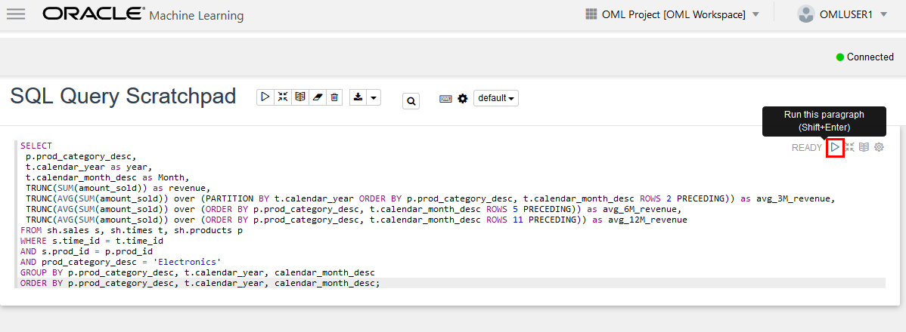

5.  Press the icon shown in the red box to execute the SQL statement and display the results in a tabular format.

    

    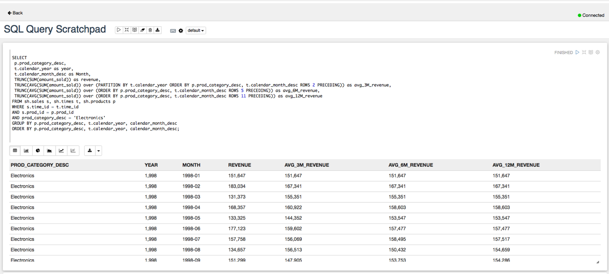

## Task 4: Changing the Report Type

1.  Using the report menu bar, you can change the table to a *graph* and/or export the result report to a CSV or TSV file.

    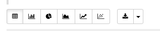

2.  When you change the report type to one of the graphs, then a **settings** link will appear to the right of the menu, which allows you to control the layout of columns within the graph.

3.  Click the **bar graph** icon to change the output to a bar graph (see below).

    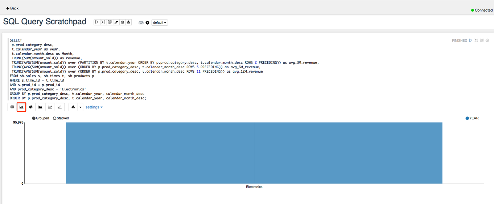

4.  Click the **settings** link to unfold the settings panel for the graph.

    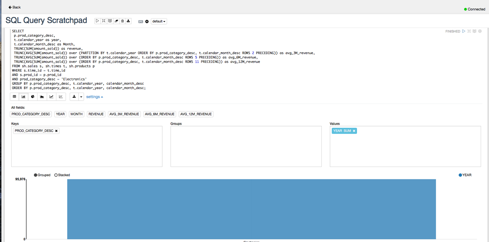

5.  To add a column to one of the **Keys**, **Groups**, and **Values** panels, just drag and drop the column name into the relevant panel.

6.  To remove a column from the **Keys**, **Groups**, or **Values** panel, just click on the **x** next to the column name displayed in the relevant panel.

## Task 5: Changing the Layout of the Graph

1.  With the graph settings panel visible:

    - Remove all columns from both the **Keys** and **Values** panels.
    - Drag and drop **MONTH** into the Keys panel
    - Drag and drop **REVENUE** into the Values panel
    - Drag and drop **AVG\_12M\_REVENUE** into the Values panel

    Now the report should look like the one shown below.

    

## Task 6: Tidying Up the Report

1.  Click the **settings** link to hide the layout controls.

2.  Click the **Hide editor** button to the right of the "Run this paragraph" button.

    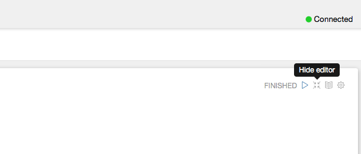

3.  Now only the output is visible.

    

## Task 7: Saving the Scratchpad as a New Notebook

The SQL Scratchpad in the previous section is simply a default type notebook with a system generated name. But we can change the name of the scratchpad we just created, **SQL Query Scratchpad**.

1.  Click on the **Back** link in the top left corner of the Scratchpad window to return to the OML home page.

    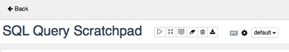

2.  Notice that in the **Recent Activities** panel, there is a potted history of what has happened to your SQL Query Scratchpad “notebook”.

    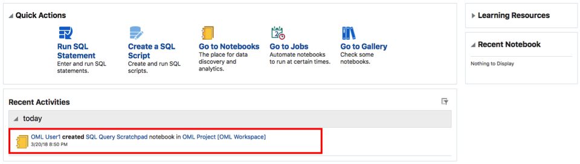

3.  Click **Go to Notebooks** in the **Quick Actions** panel.

    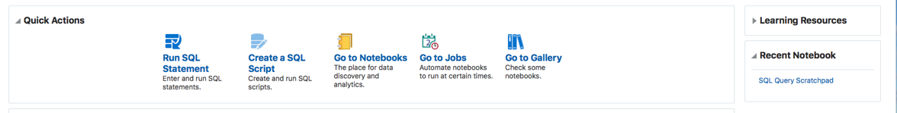

4.  The **Notebooks** page will be displayed:

    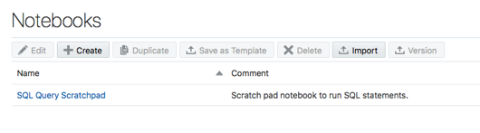

5.  Let’s rename our SQL Query Scratchpad notebook to something more informative. Click on text in the **comments** column to select the scratchpad, so that we can rename it. After you click, the “SQL Query Scratchpad” will become selected, and the menu buttons above will be activated.

  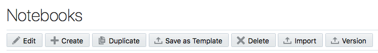

  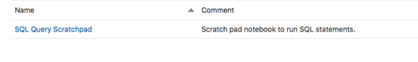

6.  Click the **Edit** button to pop-up the *Edit Notebook* dialog for this notebook, and enter the information as shown in the image below. *Note that the Connection information is read-only, because this is managed by Autonomous Data Warehouse.*

    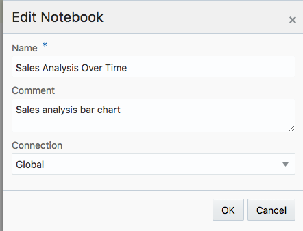

7.  Click **OK** to save your notebook. You will see that your SQL Query Scratchpad notebook is now renamed to the new name you specified.

    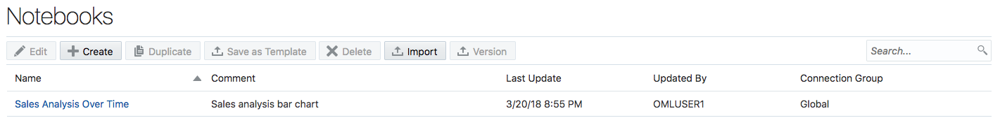

## Task 8: Logging in to OML as the Second OML User (OMLUSER2) and Sharing Notebooks

By default, when you create a notebook, it’s only visible to you. To make it available to other users, you need to share the workspace containing the notebook. You can create new workspaces and projects to organize your notebooks for ease of use and to share with other users. To demonstrate the sharing process, let’s begin by logging in to OML as our second OML user (OMLUSER2) and checking if any notebooks are available.

1.  Click on your user name in the top right corner (**OMLUSER1**) and select “**Sign Out**”.

    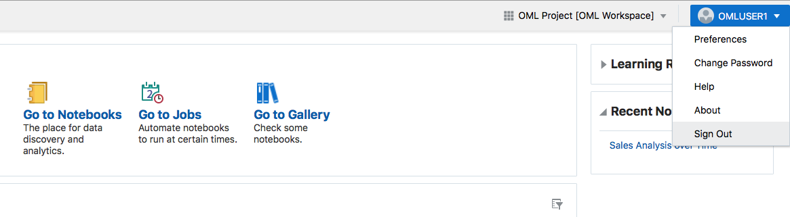

2.  Now sign in as OML user **OMLUSER2**, using the password you entered at the beginning of this workshop:

    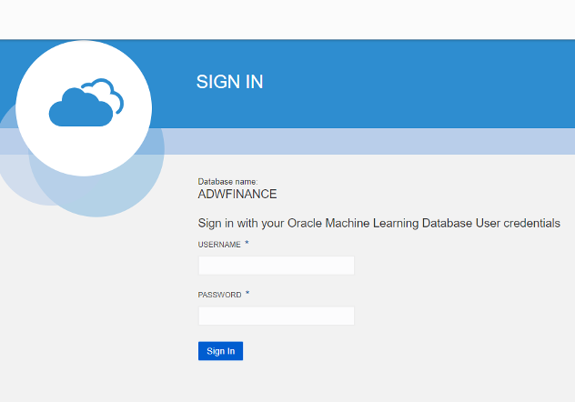

    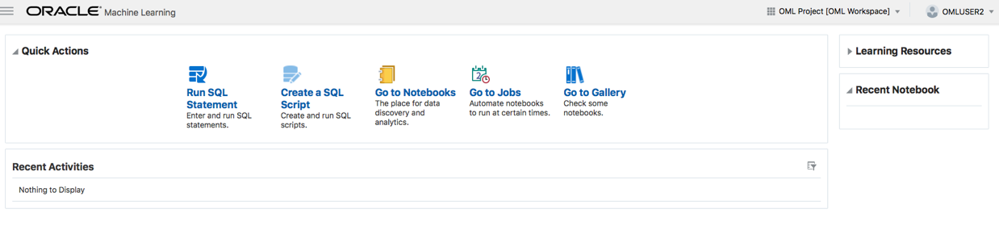

    Notice that you have no activity listed in the **Recent Activities** panel on your OML home page, and you don’t have any notebooks.

3.  Hint: click on the **Go to Notebooks** link in the **Quick Actions** panel:

    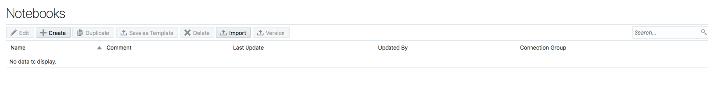

4.  Repeat the previous steps to sign out OML as **OMLUSER2** and sign into OML as **OMLUSER1**.

## Task 9: Changing Workspace Permissions

1.  From the OML home page, click the **OML Project [OML Workspace]** link in the top right corner to display the project-workspace menu. Then select **Workspace Permissions...**.

    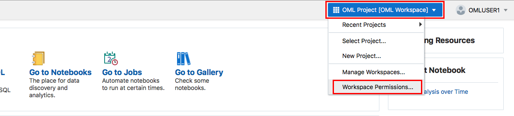

2.  The Permissions dialog box will appear (see below).

3.  In the dialog box, for **Add Permission**, enter **OMLUSER2** (use uppercase).

4.  Set the **Permission Type** to **Viewer** (this means read-only access to the workspace, project, and notebook).

    *Note:*
    - A “Manager” would have read-only access to the workspace, could create, update, and delete projects, add new notebooks, update and delete existing notebooks, and schedule jobs to refresh a notebook.
    - A “Developer” would have read-only access to the workspace and project, but could add new notebooks, update and delete existing notebooks, and schedule jobs to refresh a notebook.

    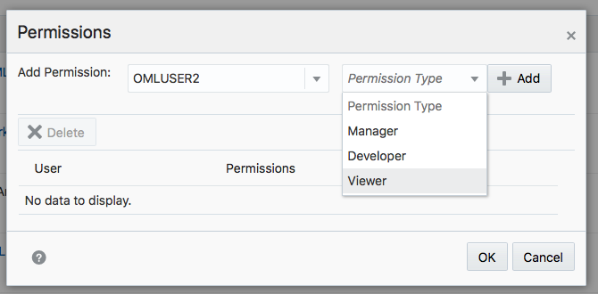

5.  Click the **Add** button to add the user **OMLUSER2** as a read-only viewer of the workspace. Your form should look like this:

    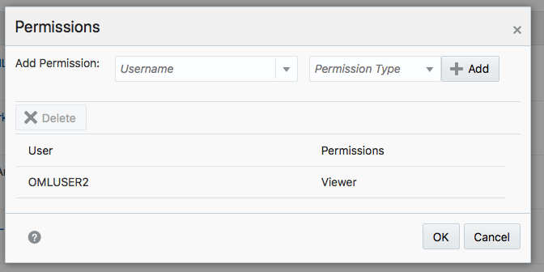

6.  Finally, click the **OK** button.

## Task 10: Accessing shared notebooks

1.  Now, repeat the process you followed at Task 8. Sign out of OML as **OMLUSER1** and sign in to OML again as user **OMLUSER2**.

    First thing to note is that the **Recent Activities** panel below the **Quick Actions** panel now shows all the changes user OMLUSER1 made within the *OML Project [OML Workspace]*.

    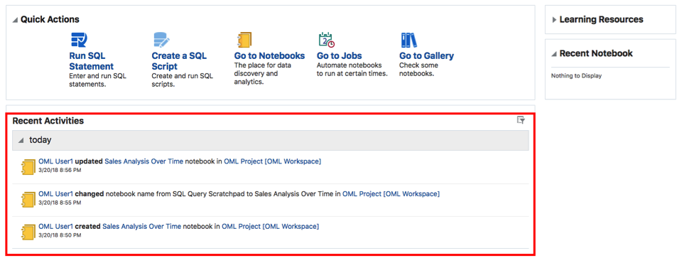

2.  As user **OMLUSER2**, you can now run the **Sales Analysis Over Time** notebook by clicking on **the blue-linked text** in the **Recent Activities** panel. *Note that your recent activity will be logged under the banner labeled “Today”.*

    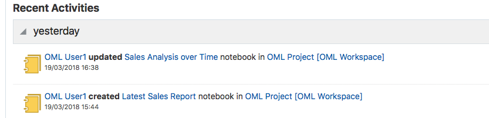

3.  The notebook will now open:

    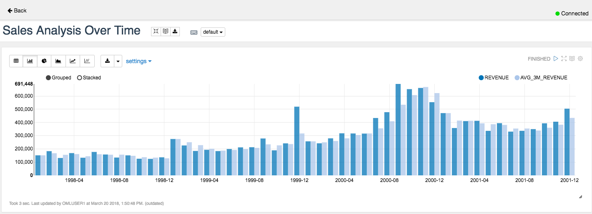

## Task 11: Getting Started with SQL Scripts

1.  Log out from user **OMLUSER2** and log in as **OMLUSER1**.
The “Run SQL Statements” link on the home page allows you to run a single query in a paragraph. To be able to run scripts, you can use the “Run SQL Scripts” link on the home page.

2.  On the OML home page, click **Run SQL Scripts** link within the **Quick Actions** panel.

    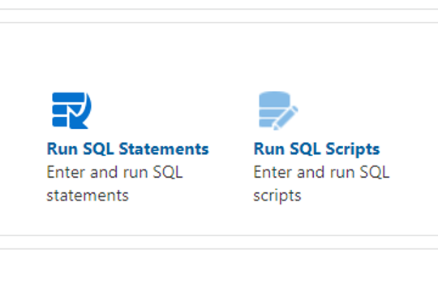

3.  A new **SQL Script Scratchpad** will be created with the **%script** identifier already selected, this identifier allows you to run multiple SQL statements.

    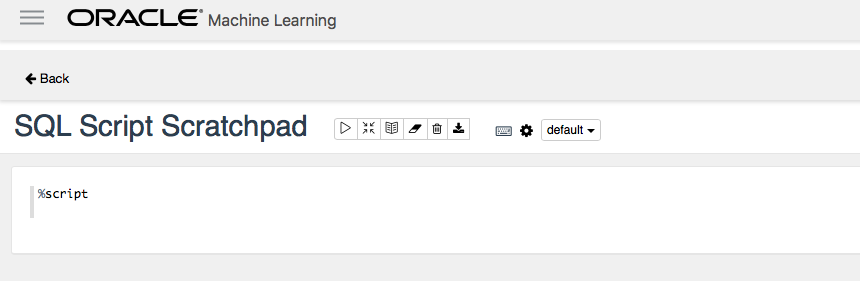

    Notice that the script paragraph does not have any menus to control the display and formatting of the output. You can, however, use SQL *SET* commands to control how data is formatted for display.

## Task 12: Creating and Running a SQL Script

In this section, we are going to use a script from a SQL pattern matching tutorial, <a href="https://livesql.oracle.com/apex/livesql/file/tutorial_EWB8G5JBSHAGM9FB2GL4V5CAQ.html" target="\_blank">Sessionization with MATCH\_RECOGNIZE and JSON</a>, on the free [Oracle Live SQL] (http://livesql.oracle.com) site. This script shows how to use the SQL pattern matching **MATCH\_RECOGNIZE** feature for sessionization analysis based on **JSON** web log files.

1.  Copy and paste <a href="./files/Sessionization_with_MATCH_RECOGNIZE_and_JSON.txt" target="\_blank">this code snippet</a> into the **%script** paragraph. After pasting the above code into the script paragraph, it should look something like this:

    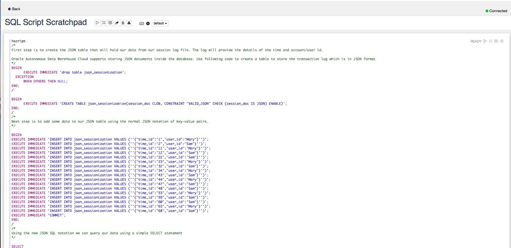

2.  You can then run the script/paragraph. The output will appear below the code that makes up the script.

    

3.  The result should look something like this:

    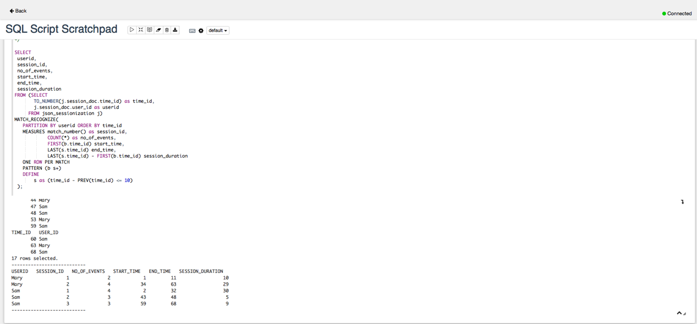

## Want to Learn More?

Click [here](https://docs.oracle.com/en/cloud/paas/autonomous-data-warehouse-cloud/user/create-dashboards.html#GUID-56831078-BBF0-4418-81BB-D03D221B17E9) for documentation on creating dashboards, reports, and notebooks with Autonomous Data Warehouse.

## **Acknowledgements**

- **Author** - Nilay Panchal, ADB Product Management
- **Adapted for Cloud by** - Richard Green, Principal Developer, Database User Assistance
- **Last Updated By/Date** - Richard Green, November 2021
