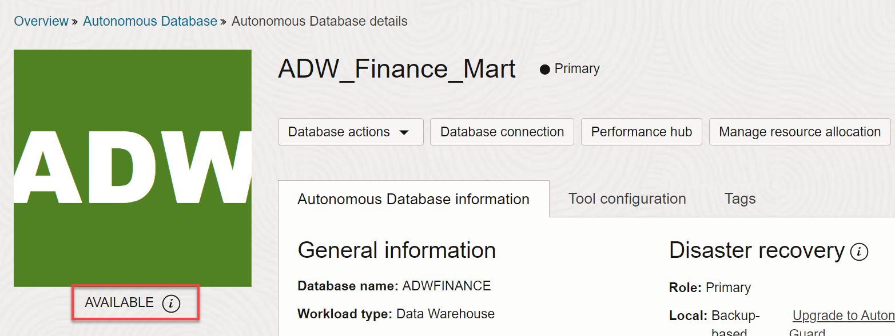
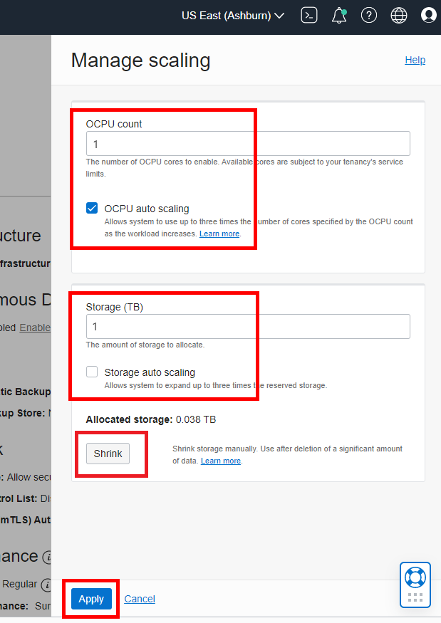

# Scale Your Autonomous Database

## Introduction

In this lab, you will scale up your Oracle Autonomous Data Warehouse (ADW) or Autonomous Transaction Processing (ATP) service to have more CPUs. You will also watch a demo that shows the performance and concurrency impacts of scaling your service online.

Estimated Time: 10 minutes

Watch the video below for a quick walk-through of the lab.

[Scale Your Autonomous Database](videohub:1_ls8fjm2p)

### Objectives

-   Learn how to scale up an ADW or ATP service
-   Understand the performance and concurrency impacts of scaling your autonomous database service online

## Task 1: Scaling your Autonomous Database Instance

1. Go back to the Cloud Console you used during the provisioning exercise and go to the database instance's **Autonomous Database details** page. Click the **Manage scaling** button.

    

2.  Fill in the Manage scaling dialog with the following information:

    -   **OCPU count:** 8
    -   **OCPU auto scaling:** The provisioning lab instructed you to accept the default enablement of auto scaling. Keep the checkmark in this checkbox.
    -   **Storage (TB):** 2
    -   **Storage auto scaling:** Keep this checkbox deselected; by default the checkbox does not have a checkmark.

  *Note: You can scale up/down your autonomous database only if your autonomous database is NOT Always Free.*

3.  Click **Apply** after filling in the Manage scaling dialog.

    

    *Note: Applications can continue running during the scale operation without downtime.*

4.  This will take you to the database instance's Details page. A message will appear indicating **SCALING IN PROGRESS**. Wait a few minutes for the scaling to finish.

    

5.  When scaling finishes, the message will change to **AVAILABLE**. You may need to refresh the page to see the result of the scale operation.

    

## Task 2: Performance and Concurrency Benefits of Dynamic Scaling

1.  Watch a demo of the performance impact of scaling up your instance. It shows how you can dynamically scale up a database while the workload is running, to increase transaction throughput. Scaling up can also provide more concurrency for your users.

    

2.  In this example, scaling up the number of CPUs from 2 to 8 increased the transaction throughput from 2000 to 7500 transactions per second.

    

## Task 3: Scaling down Autonomous Database Instance

As we can scale up the resources we can also scale down the OCUP and Storage allocation when needed. Since our lab environment has limited quota allocated we would scale down the OCUP and storage to minimum to allow us create more ADB instances and do other tasks.

1. Go back to the Cloud Console you used during the provisioning exercise and go to the database instance's **Autonomous Database details** page. Click the **Manage scaling** button.

    

2.  Fill in the Manage scaling dialog with the following information:

    -   **OCPU count:** 1
    -   **OCPU auto scaling:** The provisioning lab instructed you to accept the default enablement of auto scaling. Keep the checkmark in this checkbox.
    -   **Storage (TB):** 1
    -   **Storage auto scaling:** Keep this checkbox deselected; by default the checkbox does not have a checkmark.
    -   **Shrink:** Shrink button is to shrink database.  This option is used to release the unused space from database and save on storage allocated to database, this is generally done after a large volume of data is deleted from database. For this lab we don't need to click on this as our db usage is already less than 1 TB.

  *Note: You can scale up/down your autonomous database only if your autonomous database is NOT Always Free.*

3.  Click **Apply** after filling in the Manage scaling dialog.

    

    *Note: Applications can continue running during the scale operation without downtime.*

4.  This will take you to the database instance's Details page. A message will appear indicating **SCALING IN PROGRESS**. Wait a few minutes for the scaling to finish.

    

5.  When scaling finishes, the message will change to **AVAILABLE**. You may need to refresh the page to see the result of the scale operation.

        

You may now **proceed to the next lab**.

## Want to Learn More?

Click [here](https://docs.oracle.com/en/cloud/paas/autonomous-data-warehouse-cloud/user/autonomous-add-resources.html#GUID-DA72422A-5A70-42FA-A363-AB269600D4B0) for documentation on enabling auto scaling.

## **Acknowledgements**

- **Author** - Nilay Panchal, ADB Product Management
- **Adapted for Cloud by** - Richard Green, Principal Developer, Database User Assistance
- **Contributors** - LiveLabs QA Team (Jeffrey Malcolm Jr, Ayden Smith, Arabella Yao)
- **Last Updated By/Date** - Richard Green, January 2023
