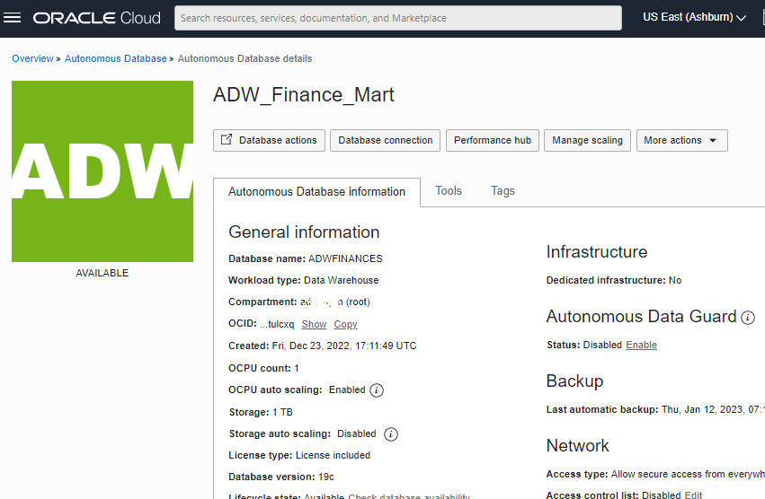
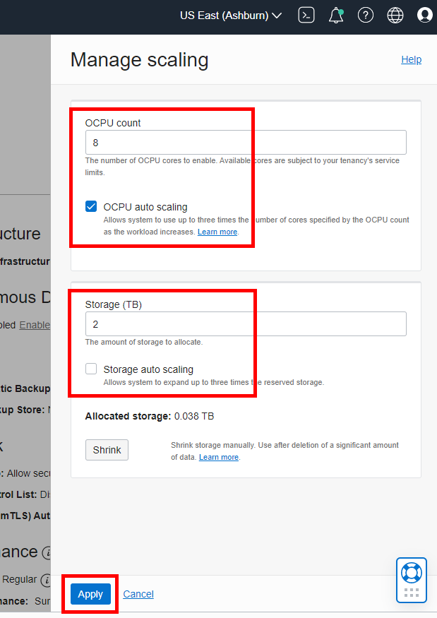
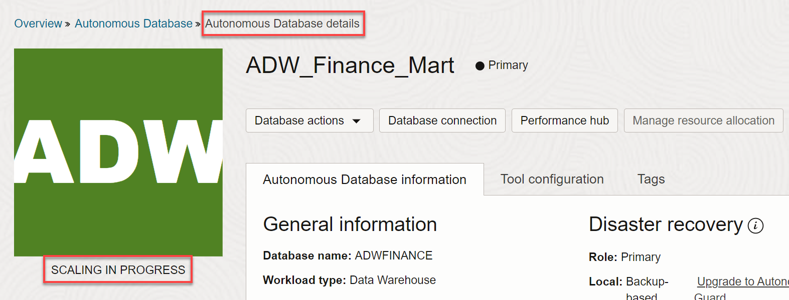
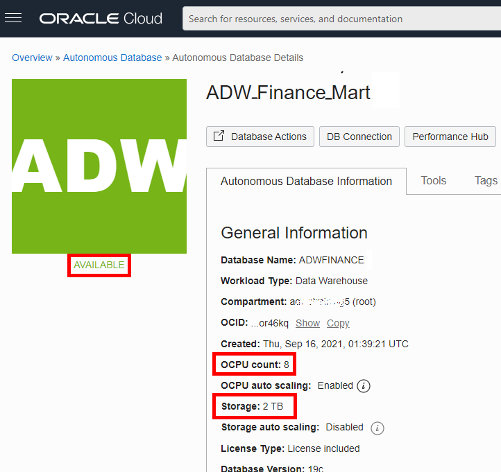
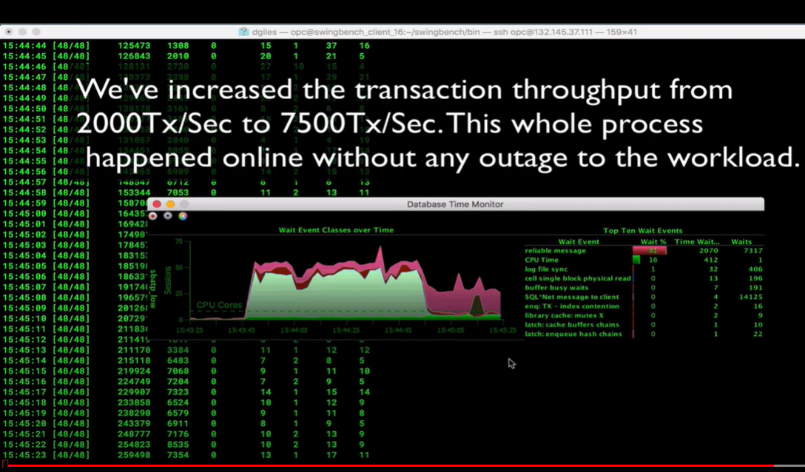

# Scale Your Autonomous Database

## Introduction

In this lab, you will scale up your Oracle Autonomous Data Warehouse (ADW) or Autonomous Transaction Processing (ATP) service to have more CPUs. You will also watch a demo that shows the performance and concurrency impacts of scaling your service online.

### Objectives

-   Learn how to scale up an ADW or ATP service
-   Understand the performance and concurrency impacts of scaling your autonomous database service online

## Task 1: Scaling your Autonomous Database Instance

1. Go back to the Cloud Console you used during the provisioning exercise and open the database instance's Details page. From the **action menu**, click the **More Actions** drop-down menu and select **Manage Scaling**.

    

2.  Fill in the Manage scaling dialog with the following information:

    -   **OCPU count:** 8
    -   **OCPU auto scaling:** The provisioning lab instructed you to accept the default enablement of auto scaling. Keep the checkmark in this checkbox.
    -   **Storage (TB):** 2
    -   **Storage auto scaling:** Keep this checkbox deselected; by default the checkbox does not have a checkmark.

  *Note: You can scale up/down your autonomous database only if your autonomous database is NOT Always Free.*

3.  Click **Apply** after filling in the Manage scaling dialog.

    

    *Note: Applications can continue running during the scale operation without downtime.*

4.  This will take you to the database instance's Details page. A message will appear indicating **SCALING IN PROGRESS**. Wait a few minutes for the scaling to finish.

    

5.  When scaling finishes, the message will change to **AVAILABLE**. You may need to refresh the page to see the result of the scale operation.

    

## Task 2: Performance and Concurrency Benefits of Dynamic Scaling

1.  Watch a demo of the performance impact of scaling up your instance. It shows how you can dynamically scale up a database while the workload is running, to increase transaction throughput. Scaling up can also provide more concurrency for your users.

    

2.  In this example, scaling up the number of CPUs from 2 to 8 increased the transaction throughput from 2000 to 7500 transactions per second.

    

## Want to Learn More?

Click [here](https://docs.oracle.com/en/cloud/paas/autonomous-data-warehouse-cloud/user/autonomous-add-resources.html#GUID-DA72422A-5A70-42FA-A363-AB269600D4B0) for documentation on enabling auto scaling.

## **Acknowledgements**

- **Author** - Nilay Panchal, ADB Product Management
- **Adapted for Cloud by** - Richard Green, Principal Developer, Database User Assistance
- **Contributors** - LiveLabs QA Team (Jeffrey Malcolm Jr, Ayden Smith, Arabella Yao)
- **Last Updated By/Date** - Richard Green, March 2022
