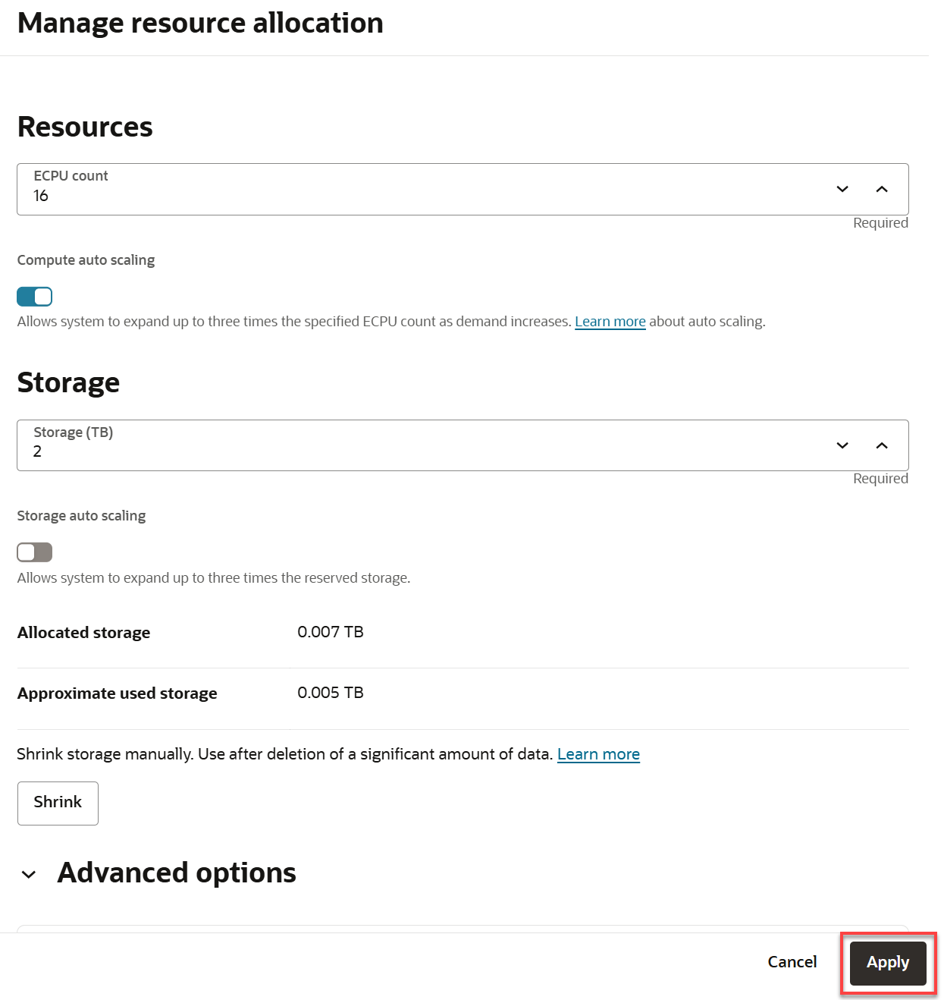
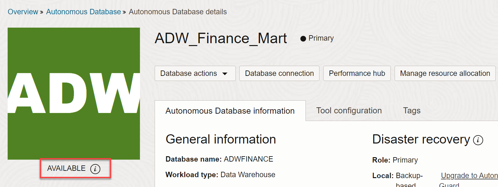

# Scale Your Autonomous AI Database

_**Important:** This lab uses features which are not available on Oracle's Always Free databases or on the Oracle LiveLabs Sandbox hosted environments (the Green button). If you run this lab using an Always Free database or a LiveLabs Sandbox environment, you can only review the steps and later practice the steps using your organization’s own tenancy._

## Introduction

In this lab, you will scale up your Oracle Autonomous Data Warehouse (ADW) or Autonomous Transaction Processing (ATP) service to have more CPUs. You will also watch a demo that shows the performance and concurrency impacts of scaling your service online.

Estimated Time: 10 minutes

Watch the video below for a quick walk-through of the lab.

[Scale Your Autonomous AI Database](videohub:1_ls8fjm2p)

### Objectives

-   Learn how to scale up an ADW or ATP service
-   Understand the performance and concurrency impacts of scaling your autonomous database service online

## Task 1: Scaling your Autonomous AI Database Instance

1. From your **`ADW_Finance_Mart`** database details page, click the **More actions** drop-down list, and then select **Manage resource allocation** from the context menu.

    

2. Specify the following in the **Manage resource allocation** panel.

    - **ECPU count:** 16
    - **Compute auto scaling:** The provisioning lab instructed you to accept the default enablement of auto scaling. Keep the slider enabled.
    - **Storage (TB):** 2
    - **Storage auto scaling:** Keep this slider disabled.

    > **Note:** You can scale up/down your autonomous database only if your autonomous database is NOT Always Free.

3. Click **Apply**.

    

    >**Note:** Applications can continue running during the scale operation without downtime.

4. The **Autonomous AI Database details** page is re-displayed. The instance status is **SCALING IN PROGRESS**. Wait a few minutes for the scaling to finish.

    

5. When scaling finishes, the instance status changes to **AVAILABLE**. You may need to refresh the page to see the result of the scale operation.

   

## Task 2: Performance and Concurrency Benefits of Dynamic Scaling

1.  Watch a demo of the performance impact of scaling up your instance. It shows how you can dynamically scale up a database while the workload is running, to increase transaction throughput. Scaling up can also provide more concurrency for your users.

    

2.  In this example, scaling up the number of CPUs from 2 to 8 increased the transaction throughput from 2000 to 7500 transactions per second.

    

You may now **proceed to the next lab**.

## Want to Learn More?

* [Add CPU or Storage Resources or Enable Auto Scaling](https://docs.oracle.com/en/cloud/paas/autonomous-data-warehouse-cloud/user/autonomous-add-resources.html#GUID-DA72422A-5A70-42FA-A363-AB269600D4B0)

## Acknowledgements

* **Authors:**
    * Lauran K. Serhal, Consulting User Assistance Developer
    * Nilay Panchal, ADB Product Management
- **Last Updated By/Date:** Lauran K. Serhal, October 2025
