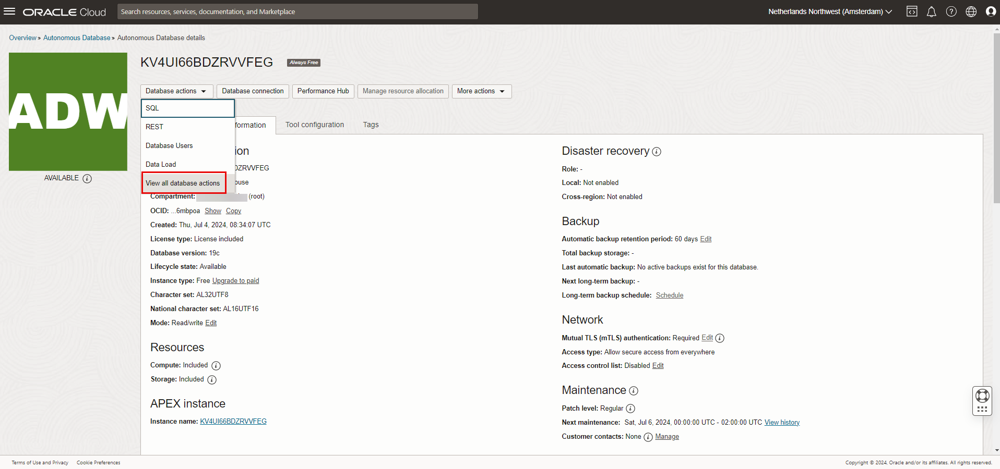

# Create rich data visualizations

## Introduction

This lab will walk you through the steps to connect *Oracle Analytics Desktop* (formerly Oracle Data Visualization Desktop) to an Oracle Autonomous Database, either in Autonomous Data Warehouse (ADW) or Autonomous Transaction Processing (ATP), and create data visualizations. Unlimited Oracle Analytics Desktop licenses are included when connecting to an ADW or ATP data source. Instructions will be provided to connect your previously created Autonomous Database instance (using sample data loaded into the database) to Oracle Analytics Desktop. We will demonstrate how you can immediately gain insights and create beautiful data visualizations.

Estimated Time: 20 minutes

### Objectives
- Learn how to connect a desktop analytics tool to the powerful Autonomous Database
- Learn how to connect to the database from Oracle Analytics Desktop
- Learn how to create a simple data visualization project with Oracle Analytics Desktop
- Learn how to access and gain insights from data in the Autonomous Database

### Prerequisites
- This lab requires completion of the Provision Autonomous Database lab in the Contents menu on the left.

## Task 1: Install Oracle Analytics Desktop on a Windows desktop

1. Download *version 6.3* of *Oracle Analytics Desktop* (formerly Data Visualization Desktop) from <a href="https://edelivery.oracle.com/osdc/faces/SoftwareDelivery" target="\_blank">Oracle Software Delivery Cloud</a>. To download Oracle Analytics Desktop, follow these steps:

    > **Note:** This example shows installing Oracle Analytics Desktop to a Windows desktop. The steps for installing to an Apple Mac computer will be similar.

    Search for **oracle analytics desktop** in the search field. Click **Oracle Analytics Desktop** in the search results list.

    

    Click the icon to the left of **Oracle Analytics Desktop 6.3.0** to put it in your download queue.

    

    Click **Continue** to view the items in your download queue.

    

    In the **Platforms / Languages** column, select your operating system and click **Continue**.

    

    Accept the terms and click **Continue** to download the installer executable file.

    

    In the next screen, click the **zip file** on the left. Do not click the Download button on the right.

    

2. After saving the zip file, unzip the executable file and double-click it to start installation. Follow the guided steps.
> If this is your first-time install of OAD, the installer will show a checkbox to deploy samples and an Install button. If this OAD 6.3 installation is an update of a previous version of OAD, the installer will show a checkbox to upgrade samples and an Upgrade button, as seen here:

   

   

## Task 2: Create a view by executing the provided script in SQL Worksheet

Although you can connect to your autonomous database using local PC desktop tools like Oracle SQL Developer, you can conveniently access the browser-based SQL Worksheet directly from your ADW or ATP console.

For simplicity's sake, in this exercise, we will use the Oracle Sales History (SH) schema provided to create a simple view.

1. In your Database Details page, click the **Database Actions** button.

   

2. The Database Actions page opens. In the **Development** box, click **SQL**.

    

3. In a SQL Worksheet, copy and execute the following script.  

      ```
      <copy>drop view DV_SH_VIEW;

      create or replace view DV_SH_VIEW as select
      P.PROD_NAME,
      P.PROD_DESC,
      P.PROD_CATEGORY,
      P.PROD_SUBCATEGORY,
      P.PROD_LIST_PRICE,
      S.QUANTITY_SOLD,
      S.AMOUNT_SOLD,
      X.CUST_GENDER,
      X.CUST_YEAR_OF_BIRTH,
      X.CUST_MARITAL_STATUS,
      X.CUST_INCOME_LEVEL,
      R.COUNTRY_NAME,
      R.COUNTRY_SUBREGION,
      R.COUNTRY_REGION,
      T.TIME_ID,
      T.DAY_NAME,
      T.CALENDAR_MONTH_NAME,
      T.CALENDAR_YEAR from
      SH.PRODUCTS P,
      SH.SALES S,
      SH.CUSTOMERS X,
      SH.COUNTRIES R,
      SH.TIMES T where
      S.PROD_ID=P.PROD_ID and
      S.CUST_ID=X.CUST_ID and
      S.TIME_ID=T.TIME_ID and
      X.COUNTRY_ID=R.COUNTRY_ID;
      </copy>
      ```

   

## Task 3: Create a connection to your Oracle Autonomous Database from Oracle Analytics Desktop

As ADW and ATP accept only secure connections to the database, you need to download a wallet file containing your credentials first. The wallet can be downloaded either from the instance's Details page, or from the ADW or ATP service console.

1. In your database's instance Details page, click **DB Connection**.

    

2. Use the Database Connection dialog to download client credentials.
    - Select a wallet type. For this lab, select **Instance Wallet**. This wallet type is for a single database only; this provides a database-specific wallet.
    - Click **Download Wallet**.

    

    > **Note:** Oracle recommends that you provide a database-specific wallet, using Instance Wallet, to end users and for application use whenever possible. Regional wallets should only be used for administrative purposes that require potential access to all Autonomous Databases within a region.

3. Specify a password of your choice for the wallet. You will need this password when connecting Oracle Analytics Desktop to the database in the next step. Click **Download** to download the wallet file to your client machine.

    > **Note:** If you are prevented from downloading your Connection Wallet, it may be due to your browser's pop-up window blocker. Please disable it or create an exception for Oracle Cloud domains.

    

    Click **Close** when the download is complete.

4. Start **Oracle Analytics Desktop**. When Oracle Analytics Desktop opens, click **Connect to Oracle Autonomous Data Warehouse**.

   

5. In the **Create Connection** dialog, enter the following information:


   | Connection Info       | Entry                                             |  
   | --------------------- | :--------------------------------------------- |
   | Connection Name:      | Type in '**SALES_HISTORY**'                             |
   | Client Credentials:   | Click '**Select...**' and select the wallet zip file that you downloaded in Task 3.3. A file with .sso extension will appear in the field.   |
   | Username:             | Insert username created in previous labs, likely **ADMIN**. Same username as SQL Worksheet and SQL Developer credentials. |                                            
   | Password              | Insert password created in previous labs. Same password as SQL Worksheet and SQL Developer credentials. |
   |Service Name:         | Scroll the drop-down field and select **adwfinance_high**, or the **high** service level of the database name you specified in Lab 1. |

6. After completing the fields, click **Save**.

   

    > **Note:** If the connection fails to save because you are behind a firewall or on a VPN, you may need to use an alias or shut down the VPN to connect to your ADW database.*

7. Click **Close** when the Save is complete.

8. Upon success of creating a new connection to the Autonomous Data Warehouse, click __Create__ in the upper right-hand corner, and click __Dataset__.  

    

9. You will now choose the sales data you want to analyze and visualize in your first project. Select the connection you just created named __SALES_HISTORY__.

   

10. In the Untitled Dataset page, expand the __ADMIN__ schema in the Data Warehouse. You will see the DV\_SH\_VIEW table that you defined.

    > **Note:** If you do not see schemas because you are behind a firewall or on a VPN, you may need to use an alias or shut down the VPN to connect to your ADW database.*

   

11. Drag and drop or double click the __DV\_SH\_VIEW__ table to add it to the dataset.

   

12. Right-click the blue DV\_SH\_VIEW button and select **Edit Definition** from the menu.

   

13. First click the __Add All__ button in the left column. You may click __Get Preview Data__ at the bottom to see some example records. Click the __OK__ button to add the dataset.

   

14. Click the **Save Dataset** icon in the upper right corner of the toolbar to save the dataset. In the **Save Dataset As** pop-up dialog, name the dataset **SALES\_HISTORY**. Click **OK**.

    > **Note:** It is important to use the new name of __SALES_HISTORY__, as the rest of the lab steps will reference that name.

   

15. Once the __SALES_HISTORY__ dataset has successfully been created, click the **Go back** arrow on the top left.

   

16. You are returned to the OAD home page; this may take a number of seconds. In the Datasets area at the bottom of your screen, click your new __SALES_HISTORY__ dataset to open it up as a **Project**.

   

17. By default, the project opens in the **Visualize** tab. Click the **Data** tab to enable overriding the settings of some columns.

   

18. In the middle of the palette, right-click the SALES_HISTORY dataset and select **Open** from the pop-up menu.

   

19. This opens a new window filled with data for each column. Notice how easy it is to browse the data elements to see what is available for you to further explore. In the upper left corner, hover your mouse over the icons to see that by default you are in the **Preparation Script** tab. Click the **Data** tab.

    

    

20. You are going to override the data types for two columns recognized as measures (i.e. numeric), and correct them to be treated as attributes -- __CALENDAR\_YEAR__ and __CUST\_YEAR\_OF\_BIRTH__. Click the __CALENDAR\_YEAR__ column name in the upper left navigation panel. Details of this column appear in the lower left panel. Change the __‘Treat As’__ field to an __‘Attribute’__. Repeat for the column, __CUST\_YEAR\_OF\_BIRTH__.

   

21. Click the **Save Dataset** button in the upper right corner. Select **Save** from the pop-up menu. After you receive a message that the dataset was successfully saved, close this dataset window. The untitled project window should still be open.

   

## Task 4: Explore the data in your new project in Oracle Analytics Desktop

No matter what your role is in the organization, access to data timely can provide greater insights to improve the performance of your business. Whether you’re creating a data warehouse or a data mart for yourself or others, Autonomous Data Warehouse is making it far simpler than ever before. Easy, fast, and elastic. This small project demonstrates this. This is how business users would interact with the Autonomous Data Warehouse.

*SCENARIO:* You work at an electronics reseller company. The founder started his business by selling camera and photography equipment. He has already diversified his business portfolio, as he already owns many 1-hour photo processing and video rental stores. Over the last few years, his computer reselling business has grown, but he is not convinced that the PC/server business will last. His instincts tell him to continue to focus on growing his photography equipment and supplies business rather than PCs. If you had access to this Oracle technology and solution, what would this data tell him? What insights could you share? How could this data help him focus on the right investments, grow his business, and better target his existing and potential customers?

1. You are back in the project window, with the **Data** tab selected. In the previous task, we saw how easy it was, with the Data tab selected, to open the SALES\_HISTORY dataset in the palette and browse the data elements. You may look at the data again now, by right-clicking the SALES_HISTORY dataset and selecting **Open** from the pop-up menu. Or prepare for the next task by clicking the **Visualize** tab to bring up a blank canvas.

   

## Task 5: Create your first data visualization

1. We will now create a very simple visualization project to finish this part of the lab. Multi-select (ctrl+click) the 5 Data Elements within __SALES\_HISTORY__, including __PROD\_NAME__, __AMOUNT\_SOLD__, __CALENDAR\_YEAR__, __PROD\_CATEGORY__, and __QUANTITY\_SOLD__.  

2. Drag the five selected data elements to the middle of the screen.
   

3. Based upon this data, Oracle Analytics Desktop will choose a default visualization. In this example, Oracle Analytics Desktop chose **Scatter** as the Auto Visualization. You can choose among several dozen other diagram types from the Auto Visualization drop-down menu.

   

4. You may save this project if you need. Click the **Save** button in the upper right corner. Select **Save** from the drop-down menu. In the **Save Project** dialog, provide a project name and click **Save**. You will receive a message that the project was saved.

    

    

 At this point, with very few steps, you now have something that can further bring your data to life and you can begin to make some data-driven decisions. As you share this with others, more people will want to gain access to and benefit from the data. To enable this, the Oracle Autonomous Database in ADW or ATP is easy to use, fast, elastic, and will be able to quickly scale to meet your growing data and user base.

## (Optional) Task 6: Export your project as a DVA file

This task enables you to share your project file with colleagues.

1. Click the **Home** button at the top right corner of the screen.

    

2. Wait for the Oracle Analytics Desktop home page to appear. Your new project will appear under **Projects**. Click the **Actions menu** at the bottom right corner of your project tile and choose **Export**.

     

3. Choose to export as a __File__. Email may work if Oracle Analytics Desktop is able to interact with your local email client. Oracle Cloud provides the mechanism to upload and share your project to <a href="https://cloud.oracle.com/en_US/oac" target="\_blank">Oracle Analytics Cloud</a>.

     

4. Provide a file name. Specify whether you want to include the project's data and connection credentials. Provide a password and click **Save**. In the **Save File** dialog, save the DVA file to a folder in your local computer.

     

## Want to learn more?

See the [documentation](https://docs.oracle.com/en/cloud/paas/autonomous-data-warehouse-cloud/user/create-reports-analytics.html#GUID-30A575A6-2CAD-4A8A-971E-2F751C8E6F90) on working with analytics and visualization of data in your Oracle Autonomous Database.

## **Acknowledgements**

- **Author** - Nilay Panchal, ADB Product Management
- **Adapted for Cloud by** - Richard Green, Principal Developer, Database User Assistance
- **Last Updated By/Date** - Magadan Ramona, Technical Program Manager, July 2024
