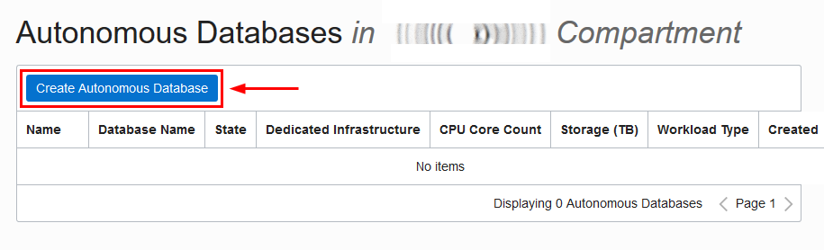
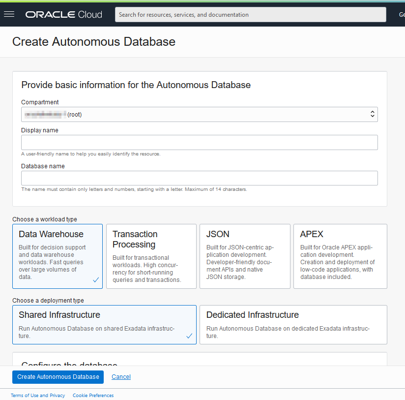
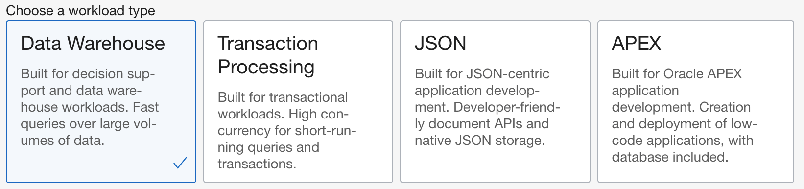
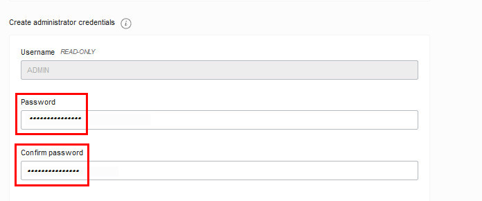
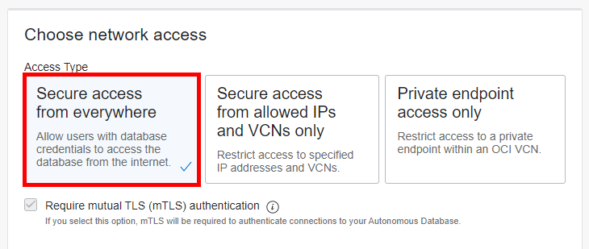
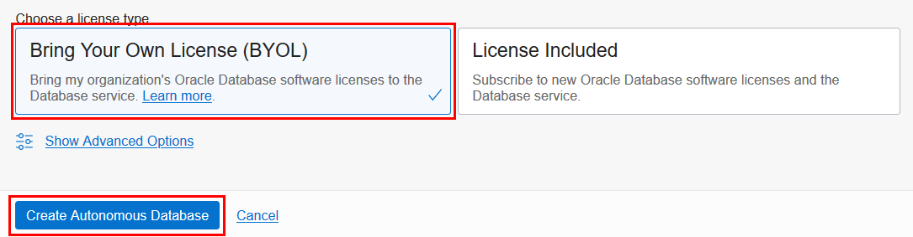

1. Click **Create Autonomous Database** to start the instance creation process.

    

2.  This brings up the **Create Autonomous Database** screen where you will specify the configuration of the instance.

    

3. Give basic information for the autonomous database:

<if type="freetier">
    - **Choose a compartment** - Select the compartment you just created.
    - **Display Name** - Enter a memorable name for the database for display purposes. For this lab, use ****.
    - **Database Name** - Use letters and numbers only, starting with a letter. Maximum length is 14 characters. (Underscores not supported.) For this lab, use ****.

    
</if>
<if type="livelabs">
    - **Choose a compartment** - Use the default compartment created for you.
    - **Display Name** - Enter a memorable name for the database for display purposes. For this lab, use ****.
    - **Database Name** - Use letters and numbers only, starting with a letter. Maximum length is 14 characters. (Underscores not supported.) For this lab, use ****, for example, ****.

    
</if>

4. Choose a workload type. Select the workload type for your database from the choices:

    - **Data Warehouse** - designed to support all standard SQL and business intelligence (BI) tools, and provides all of the performance of the market-leading Oracle Database in an environment that is tuned and optimized for data warehouse workloads
    - **Transaction Processing** - provides all of the performance of the market-leading Oracle Database in an environment that is tuned and optimized to meet the demands of a variety of applications, including: mission-critical transaction processing, mixed transactions and analytics, IoT, and JSON document store
    - **JSON Database** - is Oracle Autonomous Transaction Processing, but designed for developing NoSQL-style applications that use JavaScript Object Notation (JSON) documents. You can store up to 20 GB of data other than JSON document collections. There is no storage limit for JSON collections.
    - **APEX** - is a low cost, Oracle Cloud service offering convenient access to the Oracle APEX platform for rapidly building and deploying low-code applications

    For this workshop, pick ****

    

5. Choose a deployment type. Select the deployment type for your database from the choices:

    - **Shared Infrastructure** - For this lab, choose **Shared Infrastructure** as the deployment type.
    - **Dedicated Infrastructure** - Or, you could have chosen Dedicated Infrastructure as the deployment type.

    

6. Configure the database:

    - **Always Free** - If your Cloud Account is an Always Free account, you can select this option to create an always free autonomous database. An always free database comes with 1 OCPU and 20 GB of storage. For this lab, we recommend you leave Always Free unchecked.
    - **Choose database version** - Select 19c as the database version.
    - **OCPU count** - Number of OCPUs for your service. For this lab, specify ****. If you choose an Always Free database, it comes with 1 OCPU.
    - **Storage (TB)** - Select your storage capacity in terabytes. For this lab, specify **** of storage. Or, if you choose an Always Free database, it comes with 20 GB of storage.
    - **Auto Scaling** - For this lab, keep auto scaling enabled, to enable the system to automatically use up to three times more OCPU and IO resources to meet workload demand.
    - **New Database Preview** - If a checkbox is available to preview a new database version, do NOT select it.

    > **Note:** You cannot scale up/down an Always Free autonomous database.

    

7. Create administrator credentials:

    - **Password and Confirm Password** - Specify the password for ADMIN user of the service instance. The password must meet the following requirements:
    - The password must be between 12 and 30 characters long and must include at least one uppercase letter, one lowercase letter, and one numeric character.
    - The password cannot contain the username.
    - The password cannot contain the double quote (") character.
    - The password must be different from the last 4 passwords used.
    - The password must not be the same password that you set less than 24 hours ago.
    - Re-enter the password to confirm it. Make a note of this password.

    

8. Choose network access:
    - For this lab, accept the default, "Secure access from everywhere."
    - If you want to allow traffic only from the IP addresses and VCNs you specify - where access to the database from all public IPs or VCNs is blocked, select "Secure access from allowed IPs and VCNs only" in the Choose network access area.
    - If you want to restrict access to a private endpoint within an OCI VCN, select "Private endpoint access only" in the Choose network access area.
    - If the "Require mutual TLS (mTLS) authentication" option is selected, mTLS will be required to authenticate connections to your Autonomous Database. TLS connections allow you to connect to your Autonomous Database without a wallet, if you use a JDBC thin driver with JDK8 or above. See the [documentation for network options](https://docs.oracle.com/en/cloud/paas/autonomous-database/adbsa/support-tls-mtls-authentication.html#GUID-3F3F1FA4-DD7D-4211-A1D3-A74ED35C0AF5) for options to allow TLS, or to require only mutual TLS (mTLS) authentication.

    

9. Choose a license type. <if type="freetier">For this lab, choose **License Included**.</if><if type="livelabs">For this lab, choose **Bring Your Own License (BYOL)**.</if> The two license types are:
    - **Bring Your Own License (BYOL)** - Select this type when your organization has existing database licenses.
    - **License Included** - Select this type when you want to subscribe to new database software licenses and the database cloud service.

<if type="freetier">
    
</if>
<if type="livelabs">
    
</if>

10. For this lab, do not provide a contact email address. The "Contact Email" field allows you to list contacts to receive operational notices and announcements as well as unplanned maintenance notifications.

    

11. Click **Create Autonomous Database**.

12.  Your instance will begin provisioning. In a few minutes, the state will turn from Provisioning to Available. At this point, your Autonomous Data Warehouse database is ready to use! Have a look at your instance's details here including its name, database version, OCPU count, and storage size.

    