<if type="livelabs">
# Review the Workshop Environment Setup (Optional)

## Introduction

Since you are using the LiveLabs environment, you **don't** have administrative privileges to create any OCI resources; therefore, all of the OCI resources that you need in this workshop are already created for you with your LiveLabs reservation. We recommend that you at least review the list of OCI resources that you will use in this workshop in the **Objectives** and **Prerequisites** sections.

If you want to review the detailed steps on how to set up the workshop environment when you are using either the **freetier** version or your own paid tenancy, see **Lab 1: Set Up the Workshop Environment** in the freetier version of the workshop on LiveLabs: [Access the Data Lake using Autonomous Database and Data Catalog](https://apexapps.oracle.com/pls/apex/dbpm/r/livelabs/view-workshop?wid=877)

When your workshop reservation is available, the **Launch *workshop-name* Workshop** page is displayed in a new browser tab named **Attend the Workshop**. The **Workshop Details** section contains important information about your allocated resources that you will need throughout this workshop such as the login URL, tenancy name, user name and password, compartment name and OCID, and so on. This is all explained in detail in the next lab.   


> **Note:** This lab is directed at administrator users because they are granted the required access permissions. In real life scenarios, you would create a new Data Catalog administrator user and a Data Catalog administrator group, and then add the new administrator user to the new group. Next, you create the Oracle Cloud Infrastructure Identity and Access Management (IAM) policies that are required to create and manage a Data Catalog and Autonomous Database instances.

Estimated Time: 5 minutes

### Objectives

In this lab, you will review how to do the following:
* (Optional) Create a compartment for your Data Catalog resources.
* Create a dynamic group policy to allow Data Catalog to manage the Data Catalog resources.
* Create the access policy to allow the dynamic group to access Oracle Cloud Infrastructure services such as Data Catalog, ADB, and optionally Oracle Object Storage buckets.
* Create a Data Catalog instance.
* Import a Glossary into your Data Catalog instance.
* Create an Autonomous Database instance.

### Prerequisites

* An Oracle Cloud Account - Please view this workshop's LiveLabs landing page to see which environments are supported.
* At least one user in your tenancy who wants to work with Data Catalog.
* A compartment for your Data Catalog resources.
* A dynamic group policy to allow Data Catalog to manage the Data Catalog resources.
* An access policy to allow the dynamic group to access Oracle Cloud Infrastructure services such as Data Catalog, ADB, and optionally Oracle Object Storage buckets.
* A Data Catalog instance.
* A Glossary that is imported into your Data Catalog instance.
* An Autonomous Database instance.

You may now proceed to the next lab.

</if>
<!--- The freetier version of this lab starts next. --->

<if type="freetier">
# Set Up the Workshop Environment

## Introduction

This lab walks you through the steps to set up the workshop environment.  

> **Note:** This workshop is directed at administrator users because they are granted the required access permissions. In real life scenarios, you would create a new Data Catalog administrator user and a Data Catalog administrator group, and then add the new administrator user to the new group. Next, you create the Oracle Cloud Infrastructure Identity and Access Management (IAM) policies that are required to create and manage a Data Catalog and Autonomous Database instances.

Estimated Time: 30 minutes

### Objectives

In this lab, you will:
* (Optional) Create a compartment for your Data Catalog resources.
* Create a dynamic group policy to allow Data Catalog to manage the Data Catalog resources.
* Create the access policy to allow the dynamic group to access Oracle Cloud Infrastructure services such as Data Catalog, ADB, and optionally Oracle Object Storage buckets.
* Create a Data Catalog instance.
* Import a Glossary into your Data Catalog instance.
* Create an Autonomous Database instance.


### Prerequisites

* An Oracle Cloud Account - Please view this workshop's LiveLabs landing page to see which environments are supported.
* At least one user in your tenancy who wants to work with Data Catalog.

> **Note:** If you have a **Free Trial** account, when your Free Trial expires your account will be converted to an **Always Free** account. You will not be able to conduct Free Tier workshops unless the Always Free environment is available. [Click here for the Free Tier FAQ page.](https://www.oracle.com/cloud/free/faq.html)

## Task 1: Log in to the Oracle Cloud Console

1. Log in to the **Oracle Cloud Console** as the Cloud Administrator. You will complete all the labs in this workshop using this Cloud Administrator.
See [Signing In to the Console](https://docs.cloud.oracle.com/en-us/iaas/Content/GSG/Tasks/signingin.htm) in the _Oracle Cloud Infrastructure_ documentation.

2. On the **Sign In** page, select your tenancy, enter your username and password, and then click **Sign In**.

   

   The **Oracle Cloud Console** Home page is displayed.

   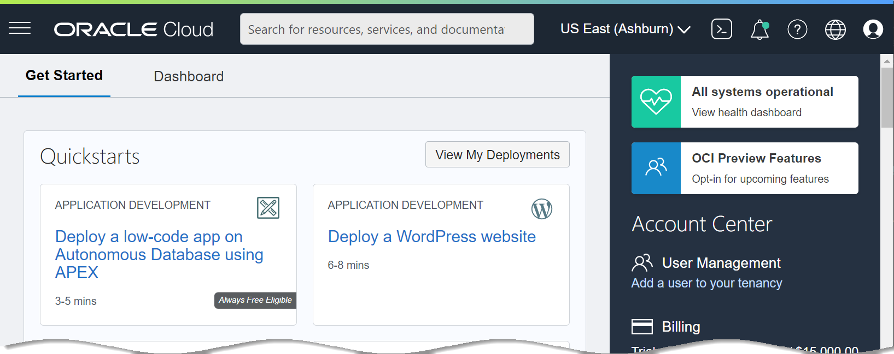

>**Note:** To zoom in (magnify) a displayed image in this workshop, hover over the image to display the magnifying glass icon, and then then click the image.

   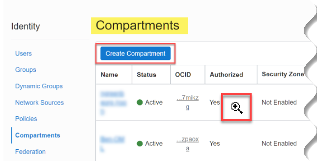


## Task 2: (Optional) Create a Compartment

A Cloud Administrator can optionally create a compartment in your tenancy to help organize the Data Catalog resources. In this lab, as a Cloud Administrator, you will create a new compartment that will group all of your Data Catalog resources that you will use in the workshop.

1. Open the **Navigation** menu and click **Identity & Security**. Under **Identity**, click **Compartments**.

	 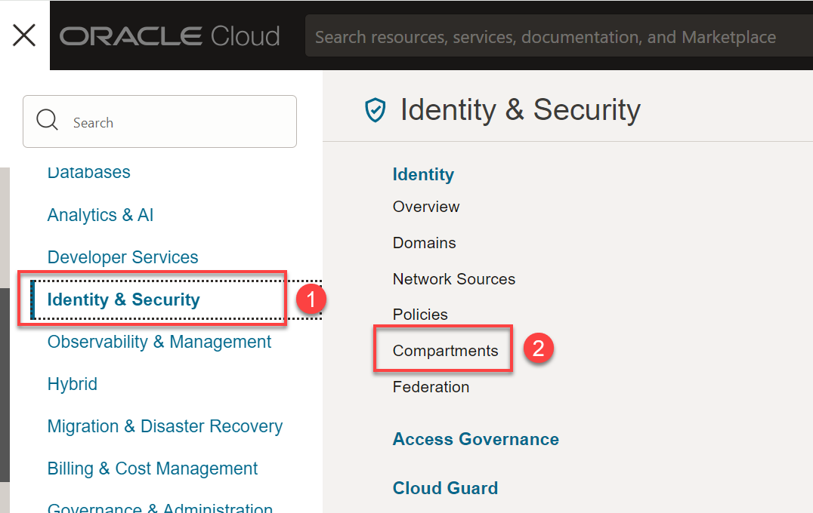

    >**Note:** For faster navigation, you can pin items to make them appear in the **Pinned Links** section of the **Home** tab. To pin an item, hover over the menu item and then click the pin to the left of the item name. The **Recent** section of the **Home** tab shows recently used navigation items. To quickly find navigation menu items, use the **Search** box.

   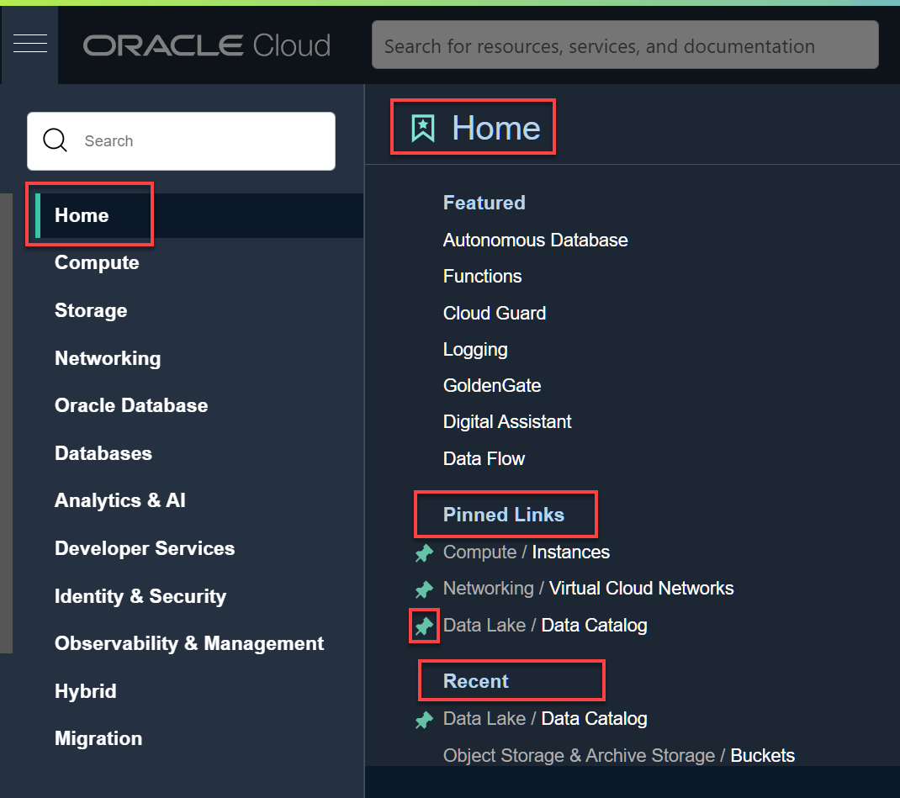

2. On the **Compartments** page, click **Create Compartment**.

   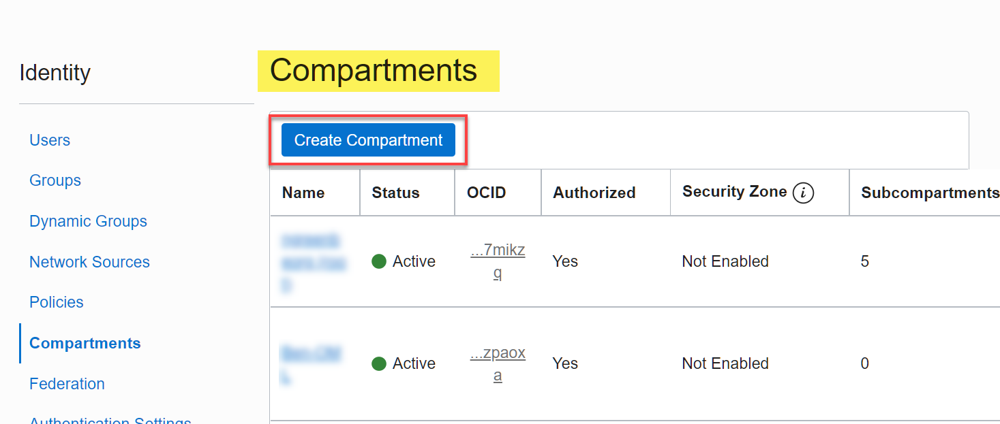

3. In the **Create Compartment** dialog box, enter **`training-dcat-compartment`** in the **Name** field and **`Training Data Catalog Compartment`** in the **Description** field.

4. In the **Parent Compartment** drop-down list, select your parent compartment, and then click **Create Compartment**.

   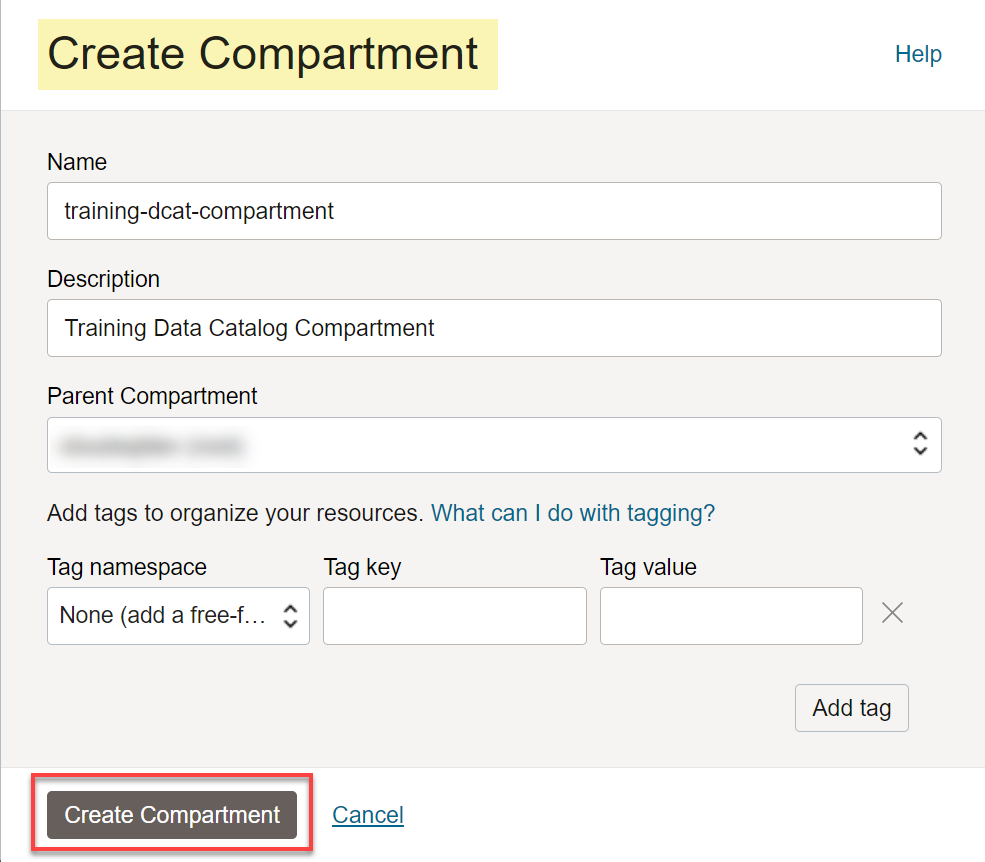

   The **Compartments** page is re-displayed and the newly created compartment is displayed in the list of available compartments.

   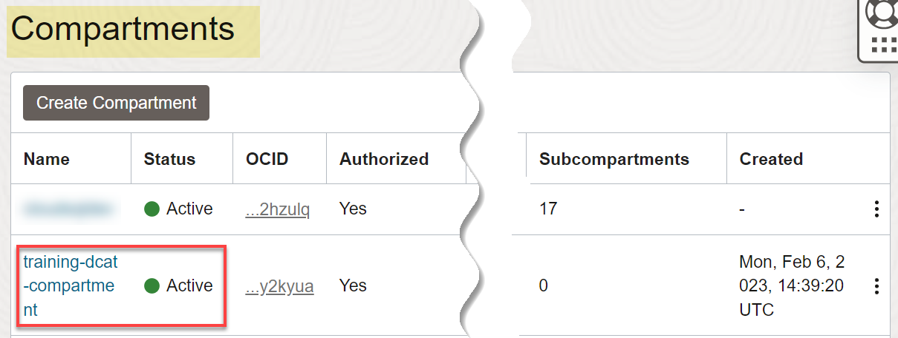

## Task 3: Create a Data Catalog Instance

To control who has access to Data Catalog, and the type of access for each group of users, you must create policies. By default, only the users in the Administrators group have access to all Data Catalog resources. For everyone else who's involved with Data Catalog, you must create policies that give them proper rights to Data Catalog resources. In this workshop, it is assumed that you are an administrator performing the steps in this workshop such as creating the Data Catalog and ADB instances. If you are not an administrator user, then your administrator user must grant you the policies listed below.

Let's say you are not an Administrator but you do need to use and manage Data Catalog. Your Administrator can create a Data Catalog Group and add you and other non-Administrator users to this group. Assume that all of the resources that you will need to perform your job are in compartment named `training-dcat-compartment`. The following policy statements are required for the `training-dcat-users-group` group.

The following statement allows the `training-dcat-users-group` group to perform all operations on all data catalog resources in the `training-dcat-compartment`.

```
allow group training-dcat-users-group to manage data-catalog-family in compartment training-dcat-compartment
```

The following policy statement allows the specified group to access the virtual network resources:

```
allow group training-dcat-users-group to manage virtual-network-family in compartment training-dcat-compartment
```

The following policy statement allows the specified group to view Oracle Cloud Infrastructure users who performed various actions in Data Catalog:

```
allow group training-dcat-users-group to inspect users in compartment training-dcat-compartment
```

>**Note:**
Data Catalog offers both aggregate and individual resource-types for writing policies. You can use aggregate resource-types to write fewer policies. For example, instead of allowing a group to manage **`data-catalogs`** and **`data-catalog-data-assets`**, you can have a policy that allows the group to manage the aggregate resource-type, **`data-catalog-family`**. See [Data Catalog Policies](https://docs.oracle.com/en-us/iaas/data-catalog/using/policies.htm) in the Oracle Cloud Infrastructure documentation.

Create a Data Catalog instance using the following steps.

1. Open the **Navigation** menu and click **Analytics & AI**. Under **Data Lake**, click **Data Catalog**.

   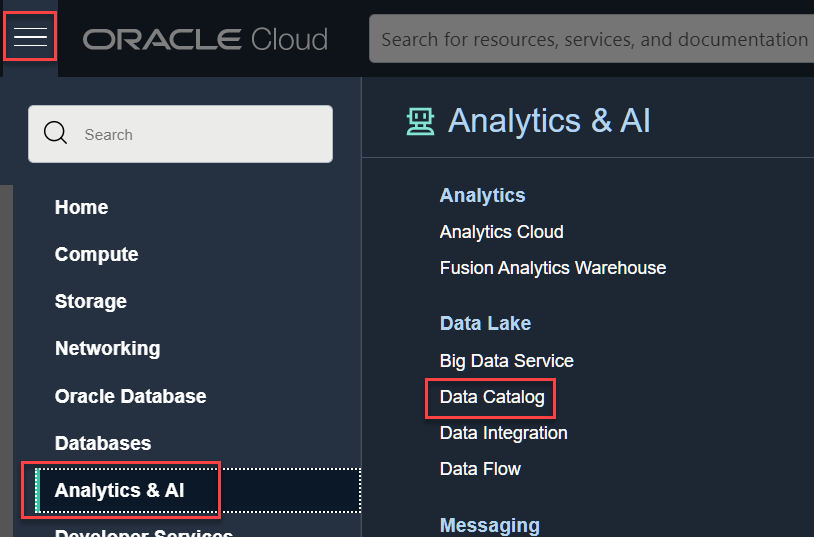

2. On the **Data Catalog Overview** page, click **Go to Data Catalogs**.

   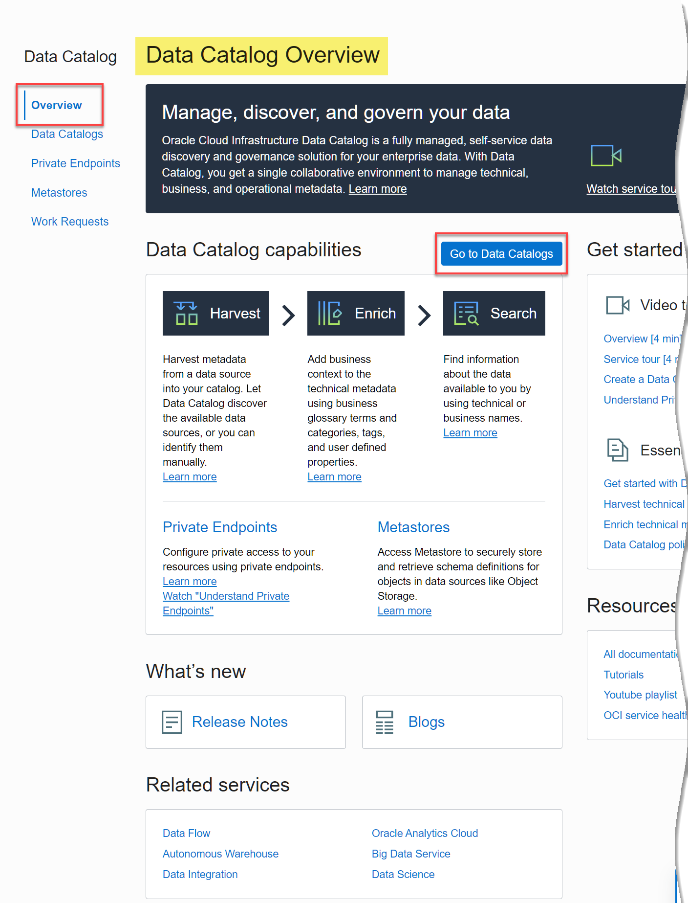    

3. On the **Data Catalogs** page, click **Create Data Catalog**.

   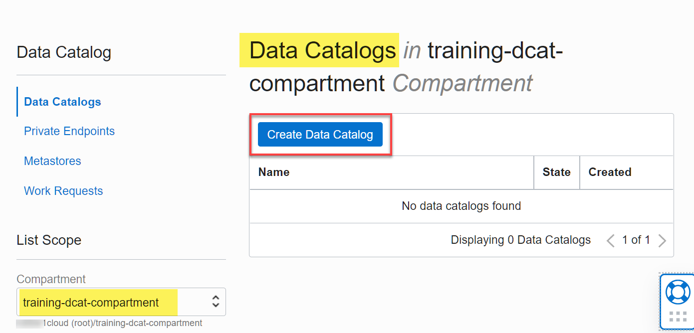

4. Select the **`training-dcat-compartment`** compartment from the **Create In Compartment** drop-down list, if not already selected.

5. Enter **`training-dcat-instance`** in the **Name** field.

   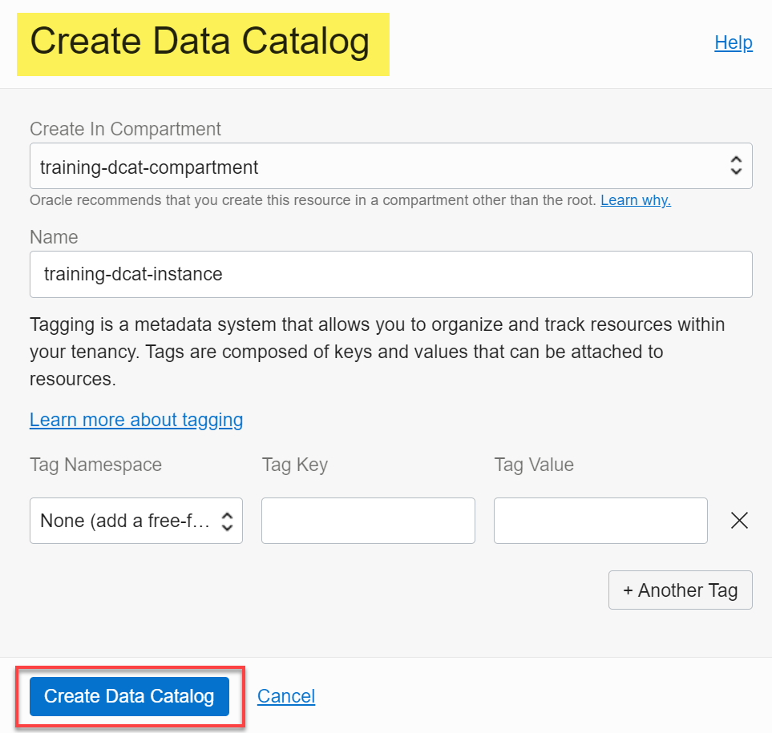

6. Click **Create Data Catalog**. The Data Catalog instance is created and displayed in the **Data Catalogs** page.

   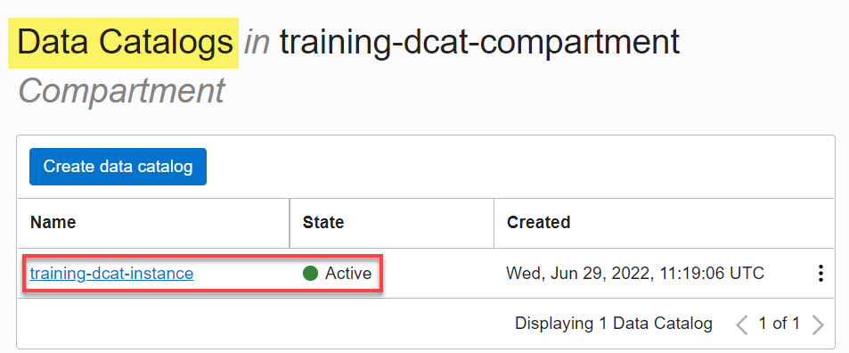

## Task 4: Create and Import a Glossary

In this task, you create a new and empty business glossary in the newly created Data Catalog instance. Next, you  import an existing glossary from your local file system into the new glossary. You use a business glossary to define your concepts across your business domain. Creating a business glossary brings common understanding of the vocabulary used throughout your organization. In Data Catalog, you create categories and terms in a glossary to manage and organize your business concepts. Terms are the actual definitions of business concepts as agreed upon by different business stakeholders in your company. You use terms to organize your data entities and attributes. You can edit a glossary, category, or term to modify their default properties such as name, owner, status, and description, or any custom property that is associated with a glossary, category, or term. For detailed information on managing glossaries, see [Managing a Business Glossary](https://docs.oracle.com/en-us/iaas/data-catalog/using/manage-glossary.htm#create-glossary) in the _Oracle Cloud Infrastructure_ documentation.

1. Open the **Navigation** menu and click **Analytics & AI**. Under **Data Lake**, click **Data Catalog**.

2. On the **Data Catalogs** page, click the **`training-dcat-instance`** Data Catalog in the **Name** column.

   

3. The Data Catalog **Home** page is displayed. Click the **Glossaries** link.

   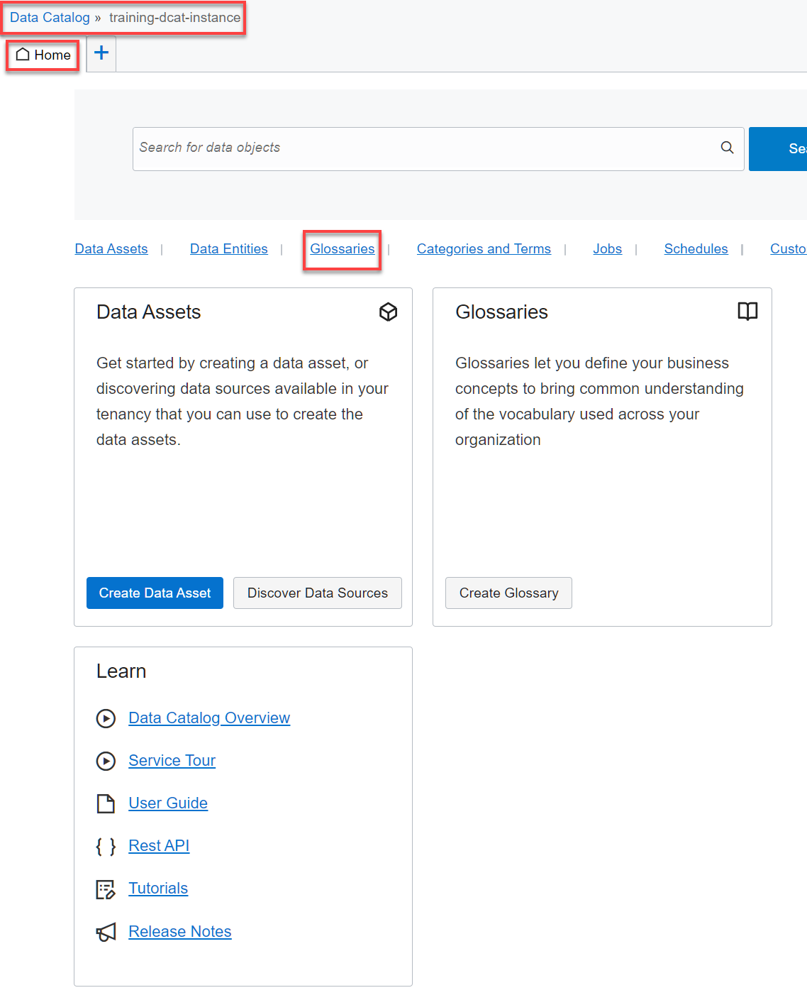

   The **Glossaries** tab is displayed.

   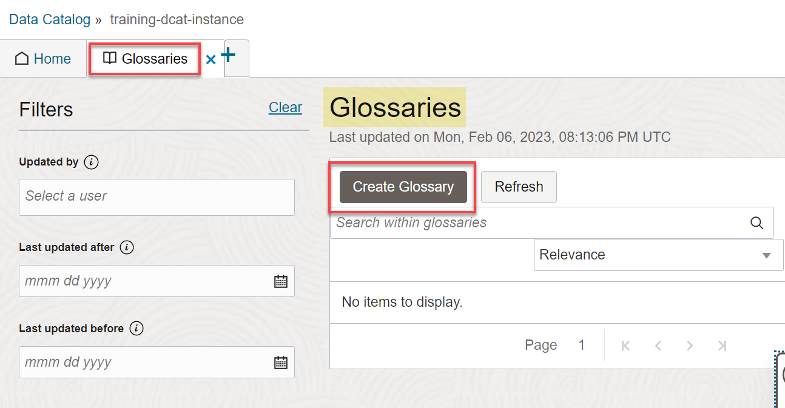


4. Click **Create Glossary**. The **Create Glossary** panel is displayed. Enter **`MovieStream Application`** in the **Name** field and **`Describes the assets related to the MovieStream data`** in the **Description** field, and then click **Create**.

   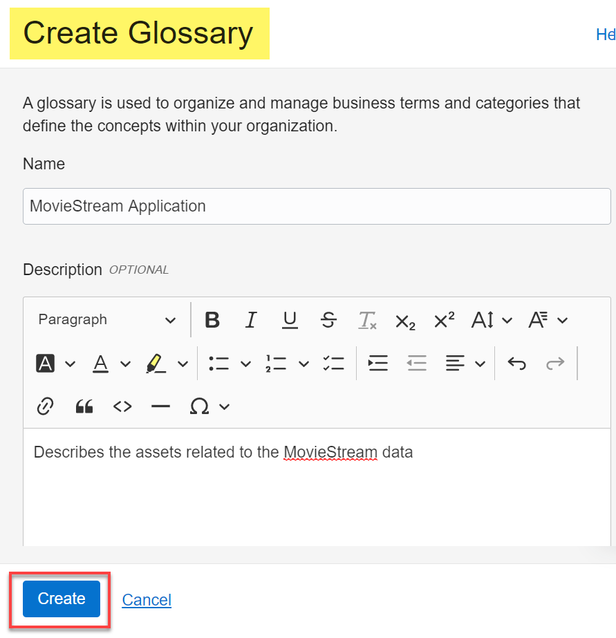

   The **MovieStream Application** glossary tab is displayed.

   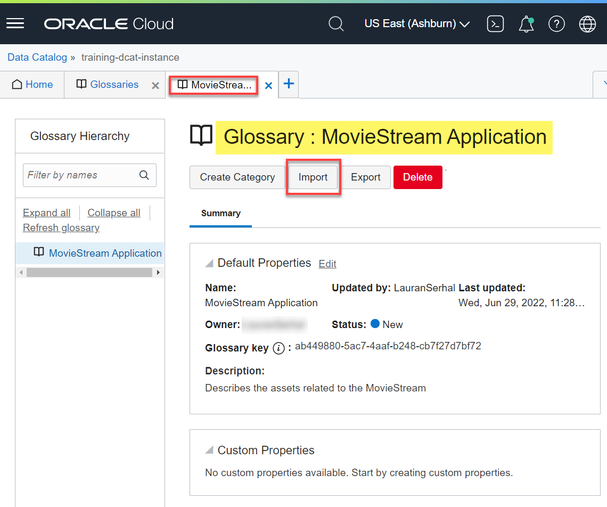

5. Click **Import**. A **Note** message box is displayed indicating that some rich text formatting might be modified or lost on import. Click **Proceed**.

  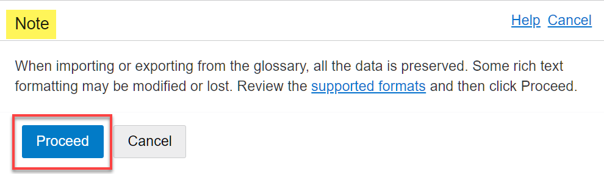

6. In the **Open** dialog box for your local system, copy and enter the following URL that represents a glossary that was exported from a different Data Catalog instance in the **File name** text box. Select **All Files** from the second drop-down list, and then click **Open**.

    ```
    <copy>https://objectstorage.us-ashburn-1.oraclecloud.com/n/c4u04/b/moviestream_scripts/o/dcat/MovieStream%20ApplicationExport.xlsx</copy>
    ```

    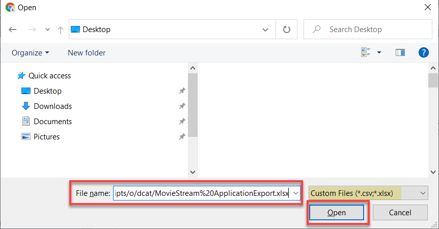

    >**Note:**     
    If you are using an Apple Macintosh computer, you cannot use a URL to import a glossary; instead, download the [moviestream-application.xlsx](files/moviestream-application.xlsx?download=1) glossary file to your local machine first. Next, click **Import**. In the **Open** dialog box, navigate to the folder that contains the glossary file, select it, and then click **Open**.

7. An import job is triggered and a message is displayed. You can click the **View Job** link in the message to view the details of this job.

   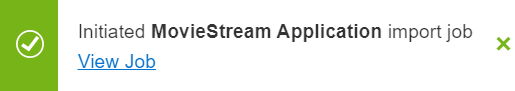

   The import file is small; therefore, the job finishes instantly and the imported glossary is displayed. If the import file is large, you can monitor the status of the job from the Jobs tab. When the job is completed successfully, the contents of the Excel file are imported into your glossary.

   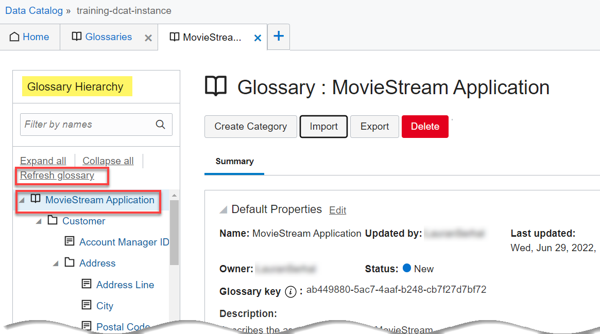

8. The imported glossary is displayed in the **Glossary Hierarchy** pane on the left. You can also click **Expand all** to view all of the details. The children of the **MovieStream Application** glossary are displayed. If the glossary details are not displayed, click **Refresh glossary**.

   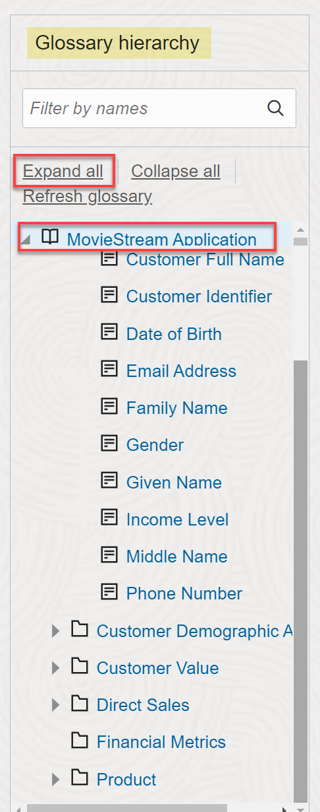

    >**Note:** The categories and terms created within a glossary are displayed in the **Glossary Hierarchy** tree navigation list. Expand each category to view terms created within that category. The summary information changes as you click different nodes in the glossary tree. You can use Expand All or Collapse All to expand or collapse all the nodes available in the glossary respectively. You can also use the search bar to search for categories and terms. If the glossary children are not displayed, click **Refresh glossary**.

9. Close the **Glossaries** and **MovieStream Application** tabs.


## Task 5: Create a Dynamic Group
Dynamic groups allow you to group Oracle Cloud Infrastructure compute instances as "principal" actors (similar to user groups). You can then create policies to permit instances to make API calls against Oracle Cloud Infrastructure services. When you create a dynamic group, rather than adding members explicitly to the group, you instead define a set of matching rules to define the group members. For example, a rule could specify that all instances in a particular compartment are members of the dynamic group. The members can change dynamically as instances are launched and terminated in that compartment.

In this task, you create a dynamic group that includes the specific compartment OCID as a resource in the group.

1. Open the **Navigation** menu and click **Identity & Security**. Under **Identity**, click **Dynamic Groups**.

  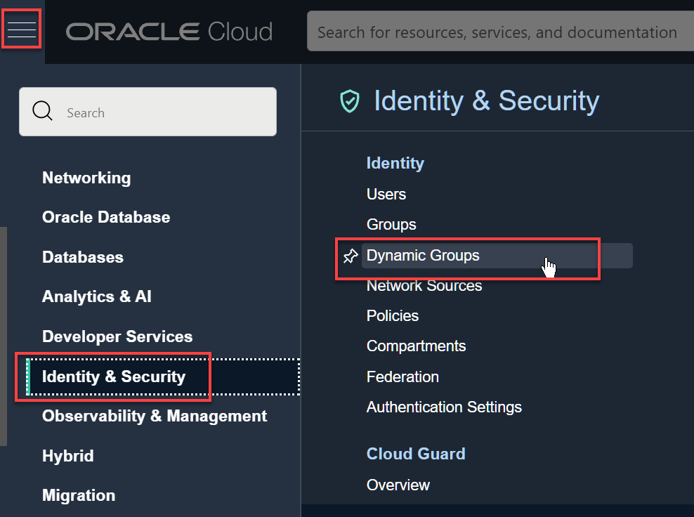

2. On the **Dynamic Groups** page, click **Create Dynamic Group**.

  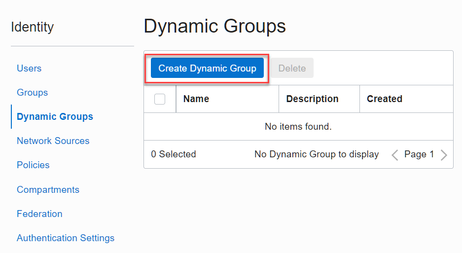

3. In the **Create Dynamic Group** dialog box, specify the following:

    + **Name:** Enter **`moviestream-dynamic-group`**.
    + **Description:** Enter **`Training Compartment Dynamic Group`**.
    + In the **Matching Group** section, accept the default **Match any rules defined below** option.
    + Click the **Copy** button in the following code box to copy the dynamic rule, and then paste it in the **Rule 1** text box. This rule specifies that any _resource defined in this compartment is a member of this dynamic group_. You will substitute the _your-compartment-ocid_ with your own **training-dcat-instance** compartment OCID that you will identify in the next step. Make sure you don't delete the single quotation marks around the OCID value.

        ```
        <copy>resource.compartment.id='your-compartment-ocid'</copy>
        ```

4. To find your _Compartment OCID_, copy the URL in the address bar of your current browser tab where the **Create Dynamic Group** page is displayed. Open a new browser tab. For example, in Chrome, you click the **New tab** icon.

    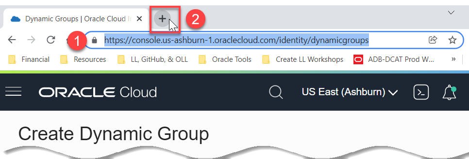

5. Paste the copied URL into the address bar of the new tab.

    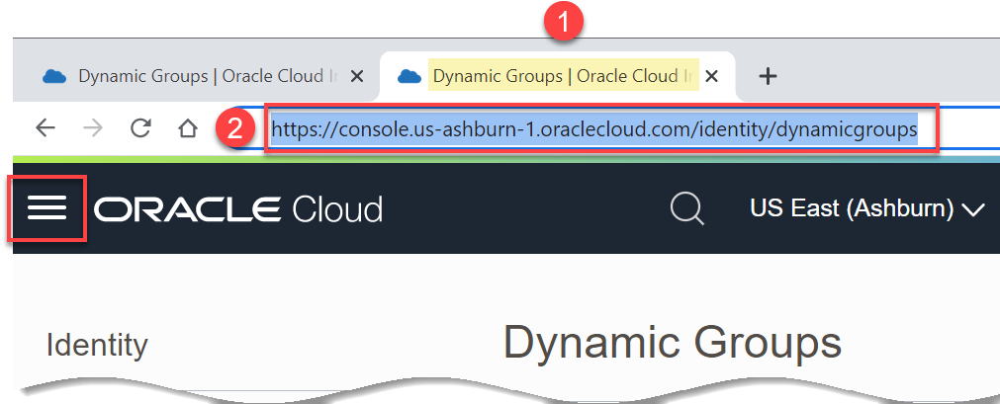

6. In the new tab, open the **Navigation** menu and click **Identity & Security**. Under **Identity**, click **Compartments**. On the **Compartments** page, in the row for your **training-dcat-compartment**, hover over the **OCID link** in the **OCID** column, and then click **Copy** to copy the OCID for the **training-dcat-compartment**.

    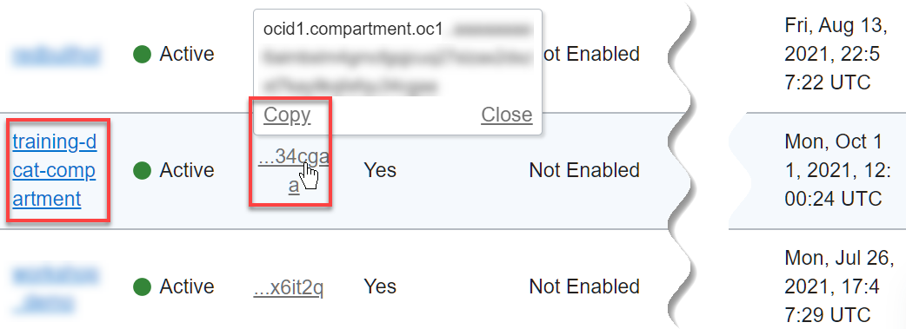

7. Click the original tab where you were creating the dynamic group policy. Paste the copied compartment OCID value to replace the **'your-compartment-ocid'** placeholder in the **Rule 1** text box.

8. Click **Create**.

    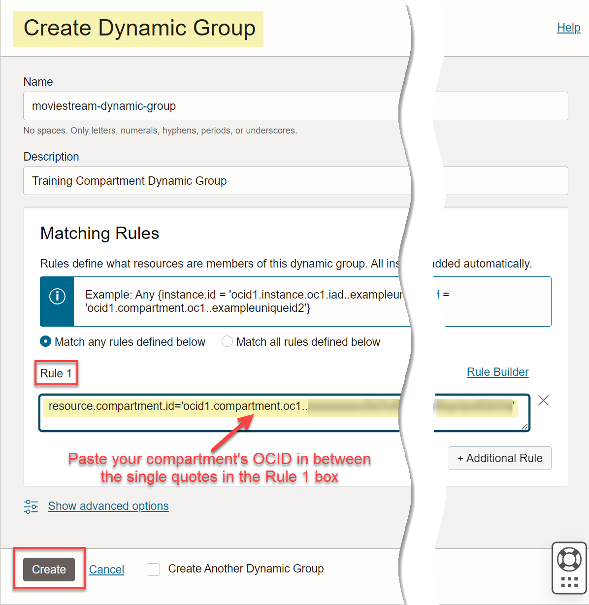


9. The **Dynamic Group Details** page is displayed. Click **Dynamic Groups** in the breadcrumbs to re-display the **Dynamic Groups** page.

    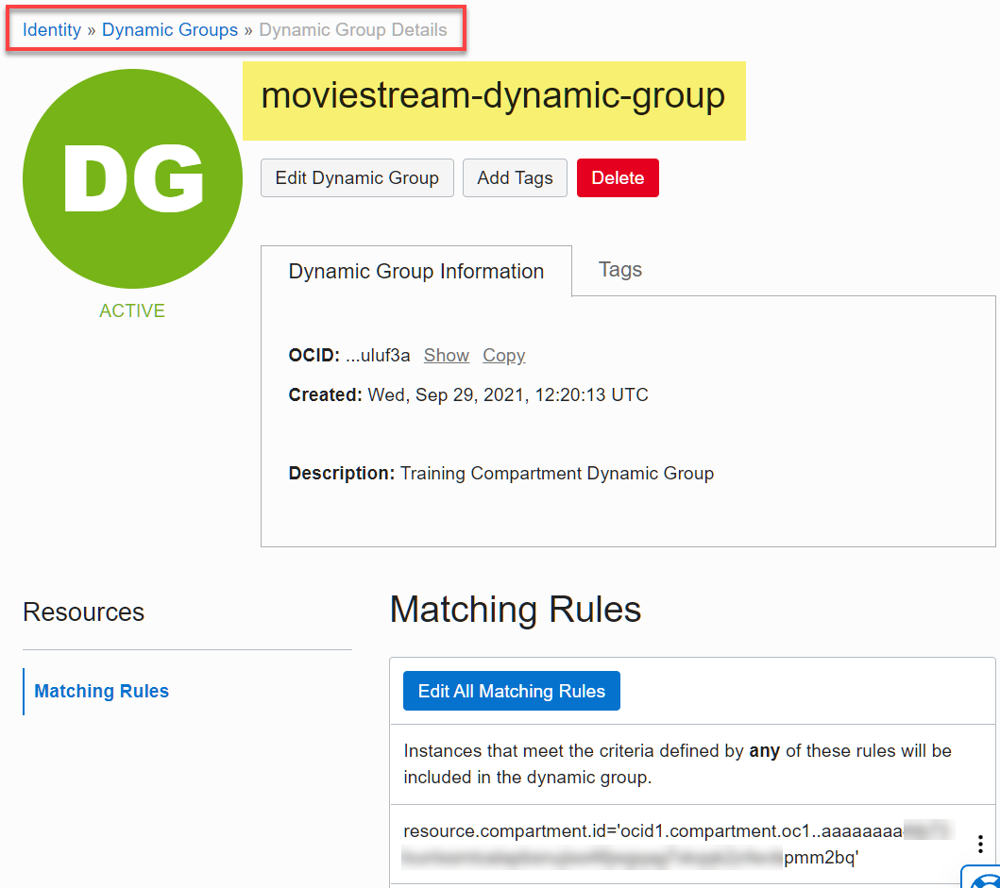

    The newly created dynamic group is displayed.

    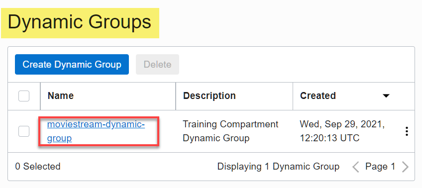


## Task 6: Create Access Policy for Dynamic Group         
After you have created a dynamic group, you need to create a policy to permit the dynamic group to access Oracle Cloud Infrastructure services. In this task, you create a policy to allow any resource in the dynamic group to access and manage your Data Catalog in the `training-dcat-compartment` using the aggregate resource-type **`data-catalog-family`** as follows:

1. If you are still on the **Dynamic Groups** page from the previous task, click **Policies** in the **Identity** section on the left; otherwise, open the **Navigation** menu and click **Identity & Security**. Under **Identity**, select **Policies**.

2. On the **Policies** page, make sure that your **`training-dcat-compartment`** compartment is selected, and then click **Create Policy**.  

    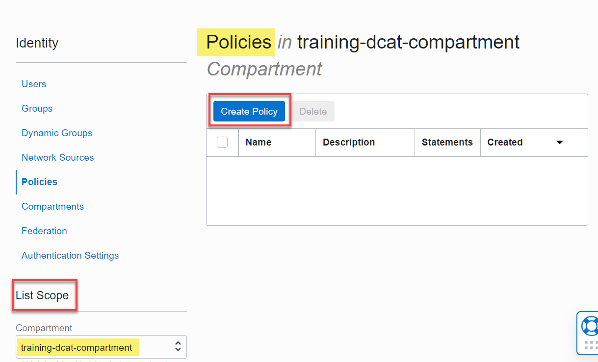

    The **Create Policy** dialog box is displayed.

3. In the **Create Policy** dialog box, provide the following information:
    + Enter **`moviestream-data-catalog-policy`** in the **Name** field.
    + Enter **`Allow any resource in the dynamic group to access and manage the Data Catalog in your compartment`** in the **Description** field.
    + Select **`training-dcat-compartment`** from the **Compartment** drop-down list, if it's not already selected.
    + In the **Policy Builder** section, click and slide the **Show manual editor** slider to enable it. An empty text box is displayed in this section.
    + Allow any resource in the dynamic group such as ADB to access and manage the Data Catalog in the `training-dcat-compartment` compartment. Click the **Copy** button in the following code box, and then paste it in the **Policy Builder** text box. This policy statement allows any resource in the `moveistream-dynamic-group` to access and manage the Data Catalog in the `training-dcat-compartment` compartment.

        ```
        <copy>allow dynamic-group moviestream-dynamic-group to manage data-catalog-family in compartment training-dcat-compartment</copy>
        ```

        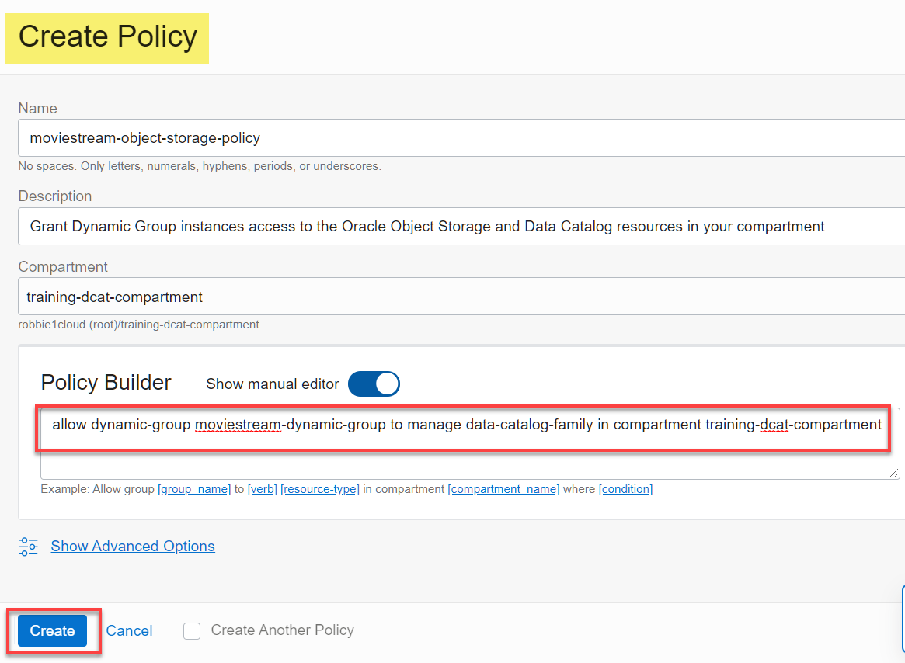

    + Click **Create**. The **Policy Detail** page is displayed Click **Policies** in the breadcrumbs to return to the **Dynamic Groups** page.

          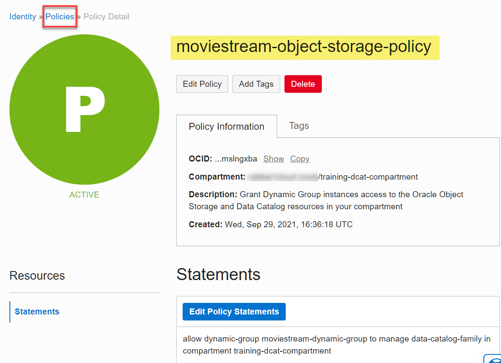

          The newly created policy is displayed in the **Policies** page.

          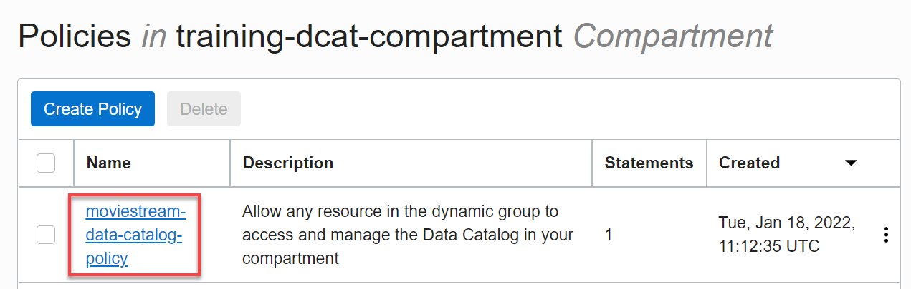

    > **Note:** In this workshop, you will access public Oracle Object Storage buckets using specific public Pre-authenticated requests (PARs); therefore, you don't need to provide a policy statement to allow Data Catalog in your `training-dcat-compartment` to access any object in your **Oracle Object Storage** (since the public pars are not in this compartment); however, if you were not using public PARs, then in order to access your Oracle Object Storage buckets in your compartment (such as the training-dcat-compartment in this example), you would need the following policy statement:

    ```
    allow dynamic-group moviestream-dynamic-group to manage object-family in compartment training-dcat-compartment
    ```

## Task 7: Create an Autonomous Database Instance

1. Log in to the **Oracle Cloud Console** as the Cloud Administrator, if you are not already logged in. On the **Sign In** page, select your tenancy, enter your username and password, and then click **Sign In**. The **Oracle Cloud Console** Home page is displayed.

2. Open the **Navigation** menu and click **Oracle Database**. Under **Oracle Database**, click **Autonomous Database**.

3. On the **Autonomous Databases** page, make sure **`training-dcat-compartment`** is selected in the **Compartment** drop-down list in the **List Scope** section. click **Create Autonomous Database**. The **Create Autonomous Database** page is displayed.

4. In the **Provide basic information for the Autonomous Database** section, specify the following:
       * **Compartment:** **`training-dcat-compartment`**.
       * **Display Name:** **`DB-DCAT Integration`**.
       * **Database Name:** **`TrainingADB`**.

       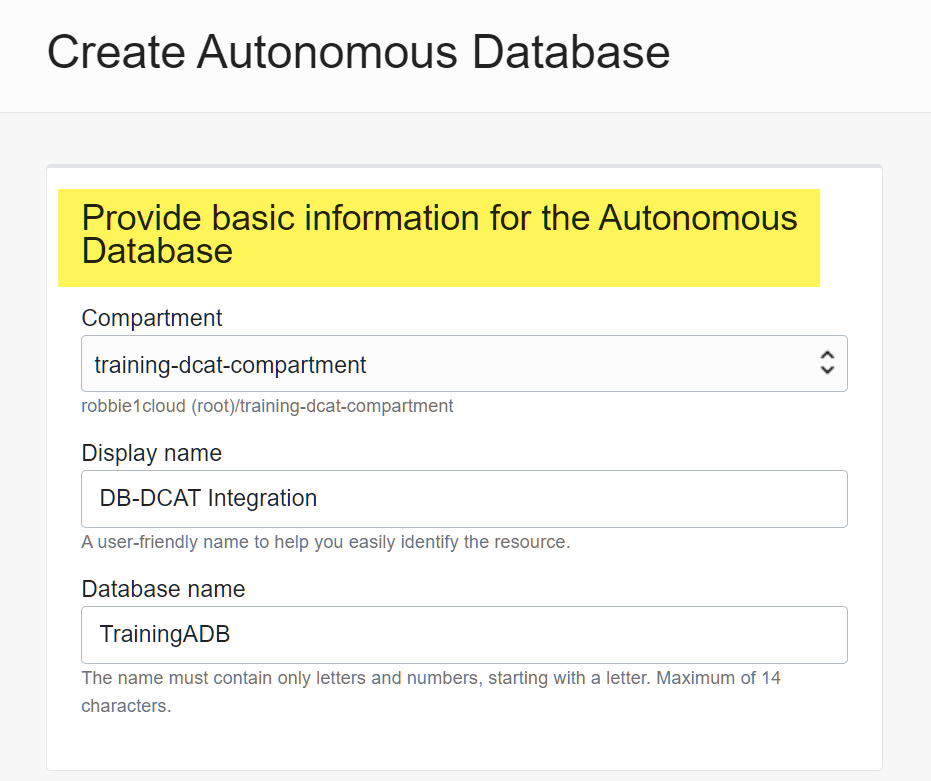

5. In the **Choose a workload type** section, accept the **Data Warehouse** default selection.

       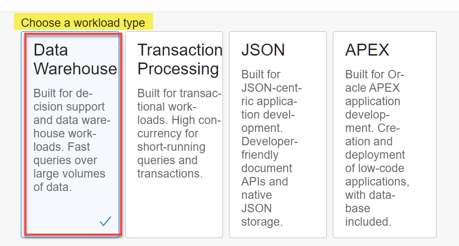

6. In the **Choose a deployment type** section, accept the **Shared Infrastructure** default selection.

       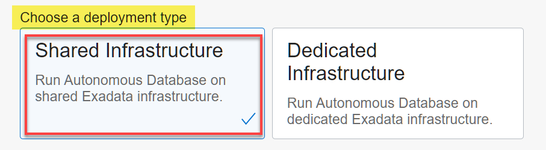

7. In the **Configure the database** section, specify the following:

       * **Always Free:** Disabled. If your Cloud Account is an Always Free account, you can select this option to create an Always Free autonomous database.
       * **Choose Database version:** **`19c`**.
       * **OCPU count:** **`1`**.   
       * **Auto scaling:** Select this checkbox. This allows the system to automatically use up to three times more CPU and IO resources to meet the workload demand.
       * **Storage:** **`1`** (TB).

       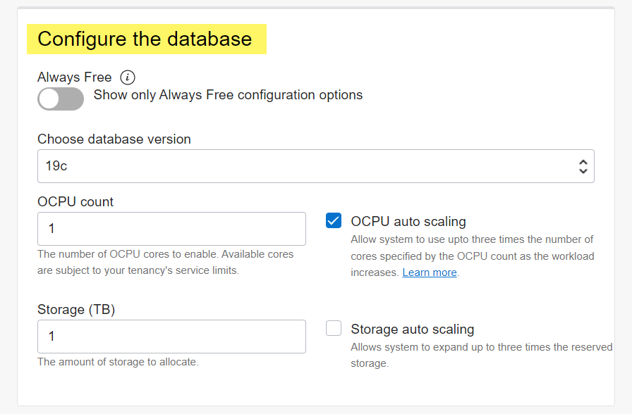

       >**Note:** If you are using a Free Trial or Always Free account, and you want to use Always Free Resources, you need to be in a region where Always Free Resources are available. You can see your current default **region** in the top, right hand corner of the page.

8. In the **Create administrator credentials** section, specify the following:

       * **Username _Read-Only_:** This read-only field displays the default username, **`ADMIN`**.     
       **Important:** Make a note of this _username_ as you will need it to perform later tasks.
       * **Password:** Enter a password for the **`ADMIN`** user of your choice such as **`Training4ADB`**.        
       **Important:** Make a note of this _password_ as you will need it to perform later tasks.
       * **Confirm password:** Confirm your password.

       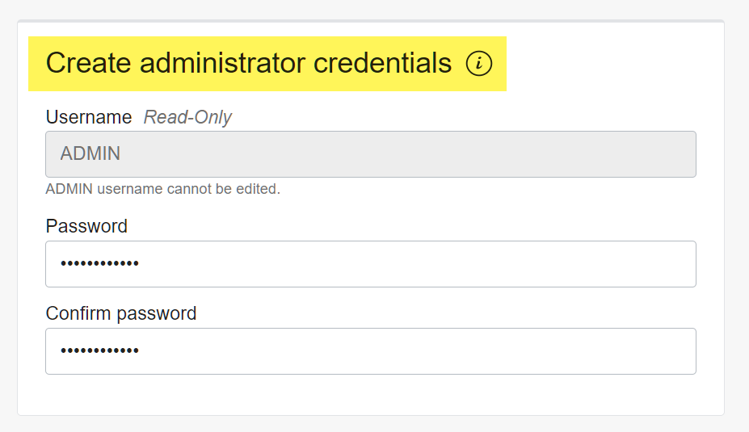

9. In the **Choose network access** section, select the **Secure access from everywhere** access type.     

    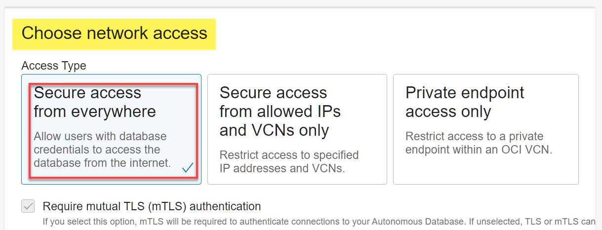

10. In the **Choose a license type** section, accept the default __Bring Your Own License (BYOL)__. Select this type when your organization has existing database licenses.

    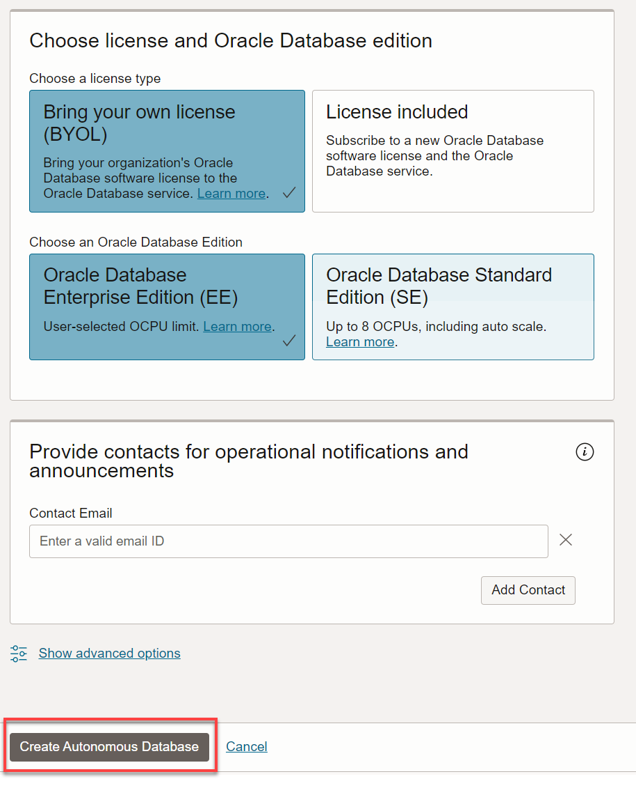

11. Click __Create Autonomous Database__.

12.  The **Autonomous Database Details** page is displayed. The status of your ADB instance is **PROVISIONING**.

    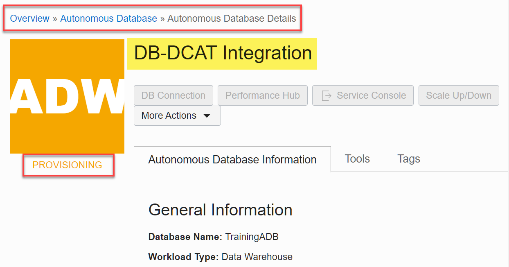

    In a few minutes, the instance status changes to **AVAILABLE**. At this point, your Autonomous Data Warehouse database instance is ready to use! Review your instance's details including its name, database version, OCPU count, and storage size.

    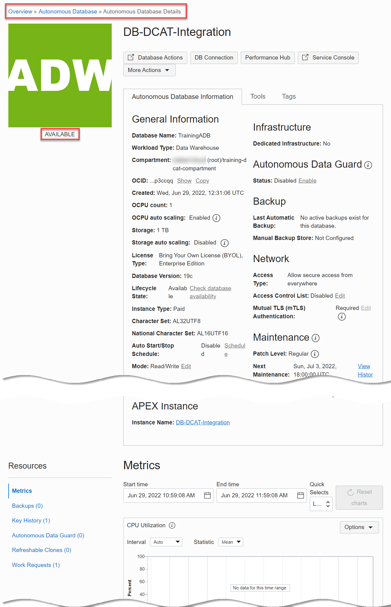

13. Click the **Autonomous Database** link in the breadcrumbs. The **Autonomous Database** page is displayed. The new Autonomous Database instance is displayed.

    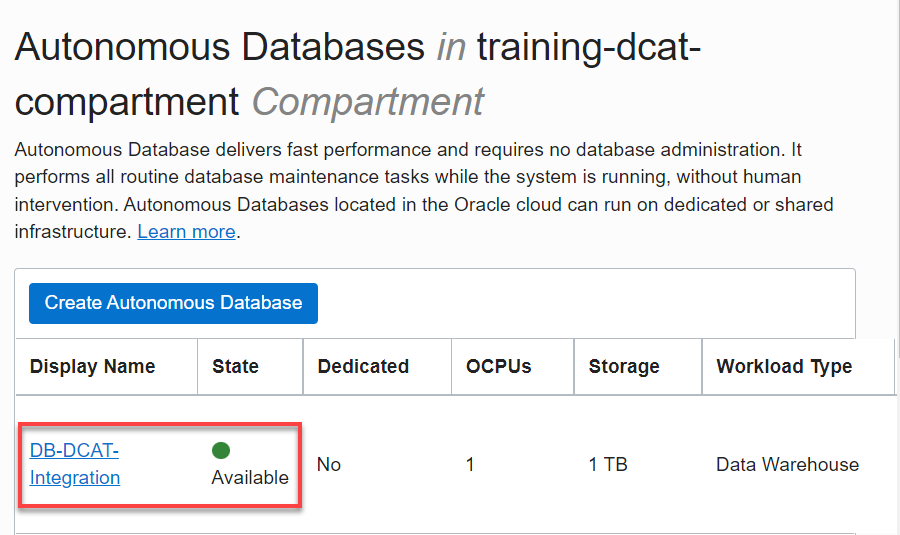

You may now proceed to the next lab.

</if>

## Learn More

* [Oracle Cloud Infrastructure Documentation](https://docs.cloud.oracle.com/en-us/iaas/Content/GSG/Concepts/baremetalintro.htm)
* [Data Catalog Overview](https://docs.oracle.com/en-us/iaas/data-catalog/using/overview.htm)
* [What Is a Data Catalog and Why Do You Need One?](https://www.oracle.com/big-data/what-is-a-data-catalog/)
* [Get Started with Data Catalog](https://docs.oracle.com/en-us/iaas/data-catalog/using/index.htm)
* [Managing a Business Glossary](https://docs.oracle.com/en-us/iaas/data-catalog/using/manage-glossary.htm#create-glossary)
* [Managing Dynamic Groups](https://docs.oracle.com/en-us/iaas/Content/Identity/Tasks/managingdynamicgroups.htm#Managing_Dynamic_Groups)
* [Writing Policies for Dynamic Groups](https://docs.oracle.com/en-us/iaas/Content/Identity/Tasks/callingservicesfrominstances.htm#Writing)
* [Using Oracle Autonomous Database on Shared Exadata Infrastructure](https://docs.oracle.com/en/cloud/paas/autonomous-database/adbsa/index.html)

## Acknowledgements
* **Author:** Lauran Serhal, Consulting User Assistance Developer, Oracle Database and Big Data
* **Contributor:** Marty Gubar, Product Manager, Server Technologies    
* **Last Updated By/Date:** Lauran Serhal, February 2022

Data about movies in this workshop were sourced from Wikipedia.

Copyright (C) Oracle Corporation.

Permission is granted to copy, distribute and/or modify this document under the terms of the GNU Free Documentation License, Version 1.3 or any later version published by the Free Software Foundation; with no Invariant Sections, no Front-Cover Texts, and no Back-Cover Texts. A copy of the license is included in the section entitled [GNU Free Documentation License](https://oracle.github.io/learning-library/data-management-library/autonomous-database/shared/adb-15-minutes/introduction/files/gnu-free-documentation-license.txt)
