# Synchronize Autonomous Database with Data Catalog

## Introduction

Autonomous Database can leverage the Data Catalog metadata to dramatically simplify management for access to your data lake's object storage. By synchronizing with Data Catalog metadata, Autonomous Database automatically creates external tables for each logical entity harvested by Data Catalog. These external tables are defined in database schemas that are created and fully managed by the metadata synchronization process. You can immediately query data without having to manually derive the schema for external data sources and manually create external tables.

Estimated Time: 30 minutes

<!-- Comments: Freetier conditional code ends on line 332. -->

### Objectives

In this lab, you will:

* Access the ADB SQL Worksheet
* Initialize the lab
* Connect your ADB instance to your Data Catalog instance
* Synchronize your ADB instance with your Data Catalog instance
* Query the generated log, schemas, and external tables

### Prerequisites

This lab assumes that you have successfully completed all of the preceding labs in the **Contents** menu.

## Task 1: Access the Autonomous Database SQL Worksheet

<if type="freetier">
1. Log in to the **Oracle Cloud Console**, if you are not already logged as the Cloud Administrator. You will complete all the labs in this workshop using this Cloud Administrator. On the **Sign In** page, select your tenancy, enter your username and password, and then click **Sign In**. The **Oracle Cloud Console** Home page is displayed.
</if>

<if type="livelabs">
1. Log in to the **Oracle Cloud Console**, if you are not already logged in, using your LiveLabs credentials and the **Launch OCI** button found in the **Reservation Information** panel. The **Oracle Cloud Console** Home page is displayed.
</if>

2. Open the **Navigation** menu and click **Oracle Database**. Under **Oracle Database**, click **Autonomous Database**.

<if type="livelabs">
3. On the **Autonomous Databases** page, click your **DB-DCAT** ADB instance.
    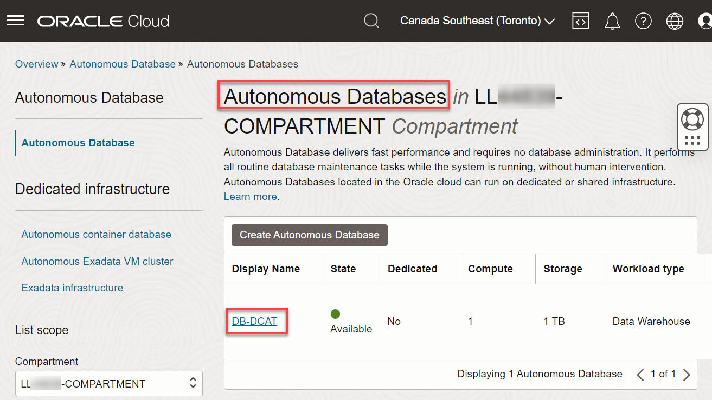
</if>
    <if type="freetier">
3. On the **Autonomous Databases** page, click your **DB-DCAT-Integration** ADB instance.
    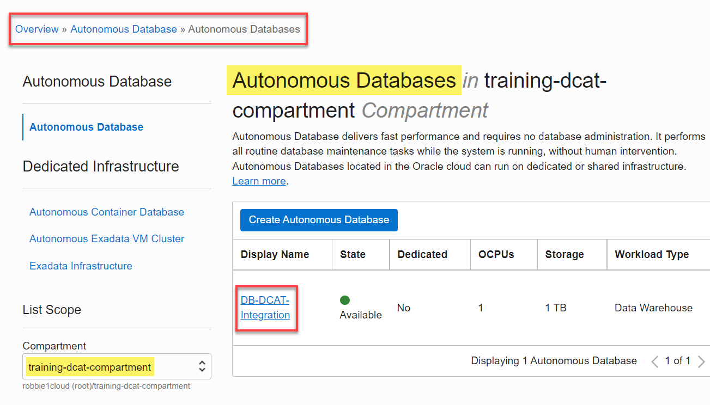
    </if>

4. On the **Autonomous Database details** page, click the **Database actions** drop-down list, and then select **SQL**.
    <if type="livelabs">
    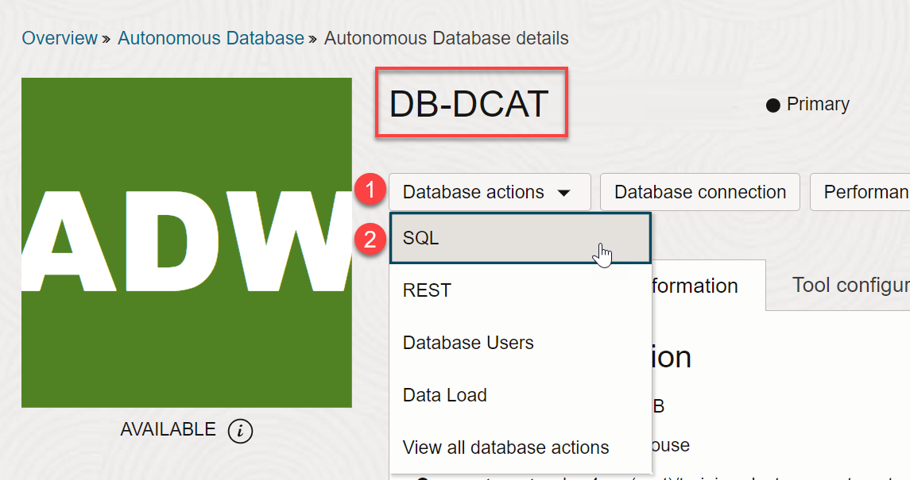
    </if>
    <if type="freetier">
    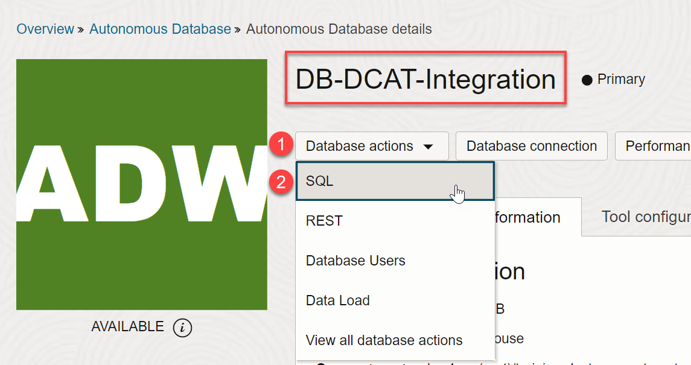
    </if>

    <if type="livelabs">
    >**Note:** If you are prompted for a username and password, enter the LiveLabs username and password that were provided for you in **Reservation Information** panel that is accessed from the **Run Workshop Access the Data Lake using Autonomous Database and Data Catalog** tab.

    </if>

    The **SQL Worksheet** is displayed. A warning message box about you being logged in as ADMIN user is displayed, close the message box.

    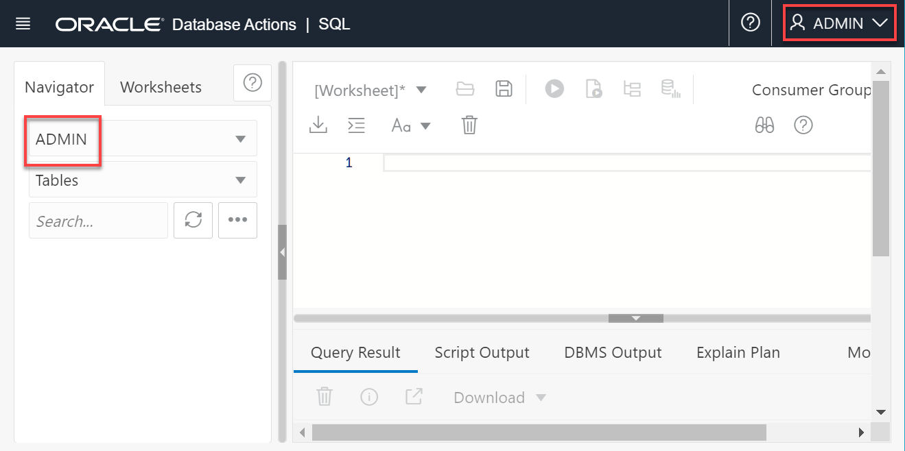

    > **Note:** In the remaining tasks in this lab, you will use the SQL Worksheet to run the necessary SQL statements to:
    * Initialize the lab to create the necessary structures such as the `moviestream` schema.
    * Connect to your Data Catalog instance from ADB and query its assets.
    * Synchronize your ADB instance with your Data Catalog instance.

## Task 2: Initialize the Lab

Create and run the PL/SQL procedures to initialize the lab before you synchronize ADB and Data Catalog. These initialization procedures will:
* Install the workshop utlities
* Add a database user named **moviestream**
* Create and populate several tables

1. Run the following script which installs the workshop utilities as the **``ADMIN``** user. It also creates a new user named **``moviestream``**. You will login to Oracle Machine Learning (OML) in the next lab using this new user to perform many queries. Finally, the script enables web access from your browser to Autonomous Database and its tools. **Note:** You can substitute the **``Training4ADB``** password for the new **``moviestream``** user that we used below with your own secured password; however, _remember and save the password - you will need it later_. Copy and paste the following script into your SQL Worksheet, and then click the **Run Script (F5)** icon in the Worksheet toolbar.

    ```
    <copy>
    -- Install the workshop utilities as the ADMIN user.
    -- Create a new user named "moviestream".
    -- Enable web access from your browser to ADB and its tools.

    declare
        l_uri varchar2(500) := 'https://objectstorage.us-ashburn-1.oraclecloud.com/n/c4u04/b/building_blocks_utilities/o/setup/workshop-setup.sql';
    begin
        dbms_cloud_repo.install_sql(
            content => to_clob(dbms_cloud.get_object(object_uri => l_uri))
        );
    end;
    /

    -- Add a user
    exec workshop.add_adb_user('moviestream','Training4ADB')

    begin
        ords_admin.enable_schema (
            p_enabled               => TRUE,
            p_schema                => 'moviestream',
            p_url_mapping_type      => 'BASE_PATH',
            p_auto_rest_auth        => TRUE
        );
    end;
    /
    </copy>
    ```

    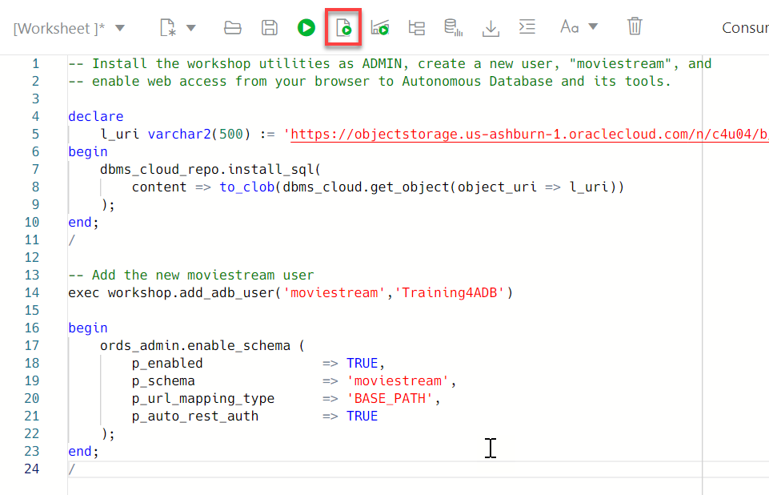

    The output is displayed in the **Script Output** tab at the bottom of the SQL Worksheet.

    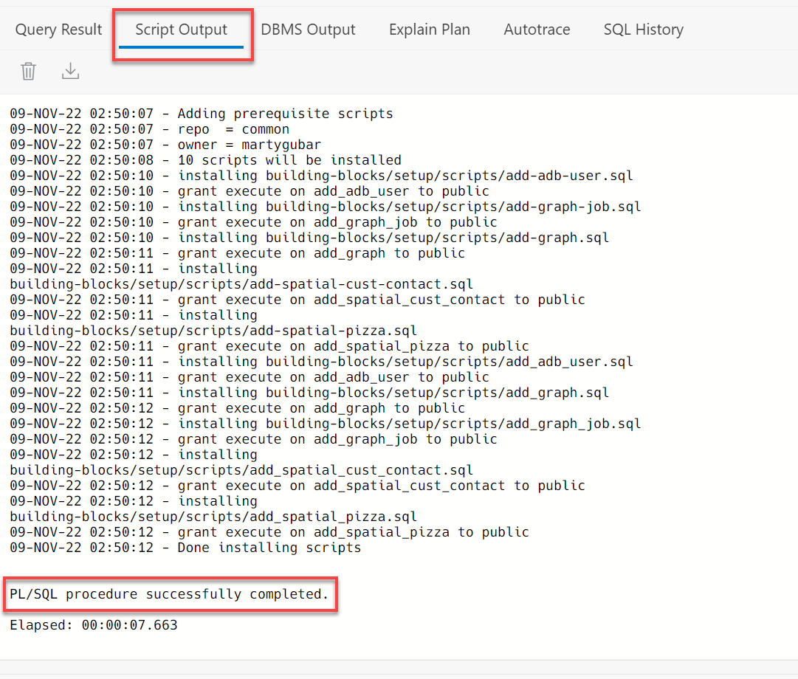

2. Sign out of the **ADMIN** user. Click the **ADMIN** drop-down list in the Worksheet banner, and then click **Sign Out**. A message box is displayed. Click **Leave**.

    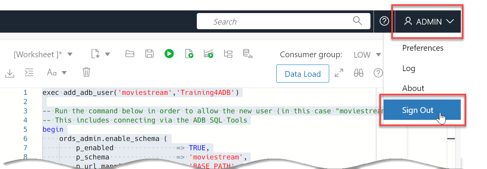

3. On the **Oracle REST Data Services** page, click **Sign in**. On the **Database Actions** page, sign in as the new **moviestream** user. Enter the username and password, and then click **Sign in**. On the **Database Actions | Launchpad** Home page, in the **Development** section, click the **SQL** card to display your SQL Worksheet.

    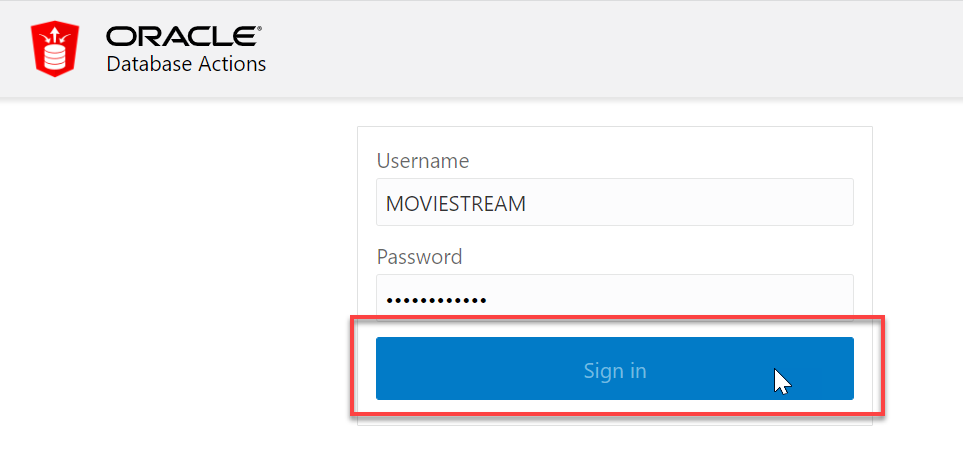

4. Create and populate the **moviestream** user tables. Copy and paste the following code into your SQL Worksheet, and then click the **Run Script (F5)** icon in the Worksheet toolbar.

    ```
    <copy>
    exec workshop.add_dataset('ALL')
    </copy>
    ```

    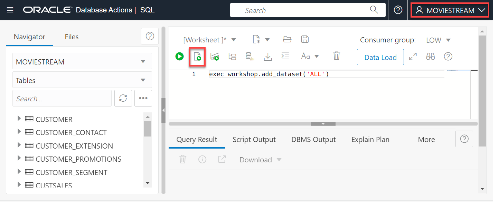

    It may take around five minutes for the script to complete as it is populating all of the tables. The output is displayed in the **Script Output** section.

    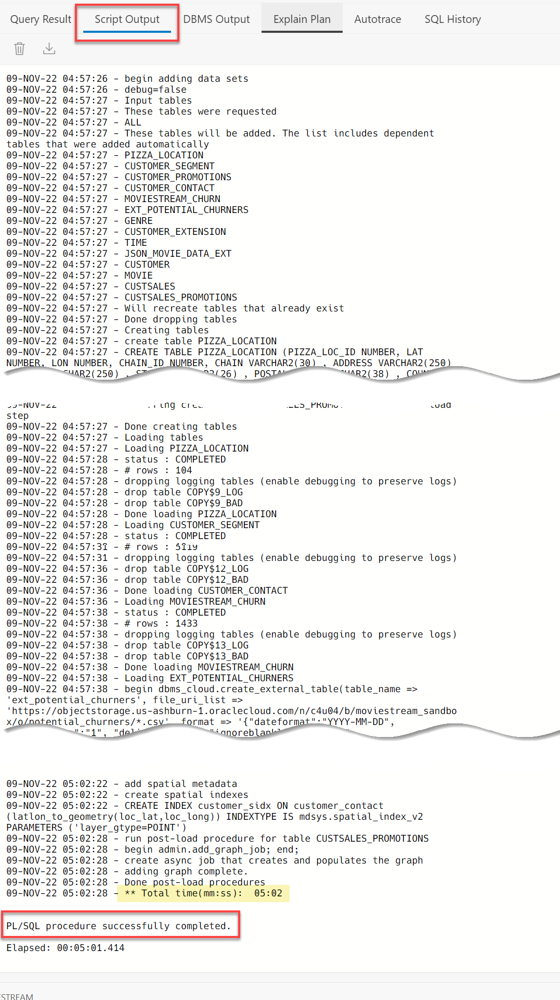

    >**Note:**
    If a **Code execution failed** message is displayed at the bottom of the SQL Worksheet and the above output is not displayed for you, ignore the message.

    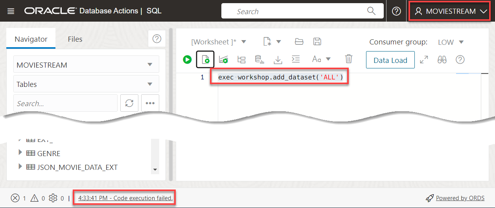

    If the **Code execution failed** message is displayed, you can still view the results of running the script. Copy the following query and then click the **Run Script (F5)** icon:

    ```
    <copy>
    select *
    from workshop_log
    order by EXECUTION_TIME desc;
    </copy>
    ```

    The query output is displayed in the **Script Output** tab.

    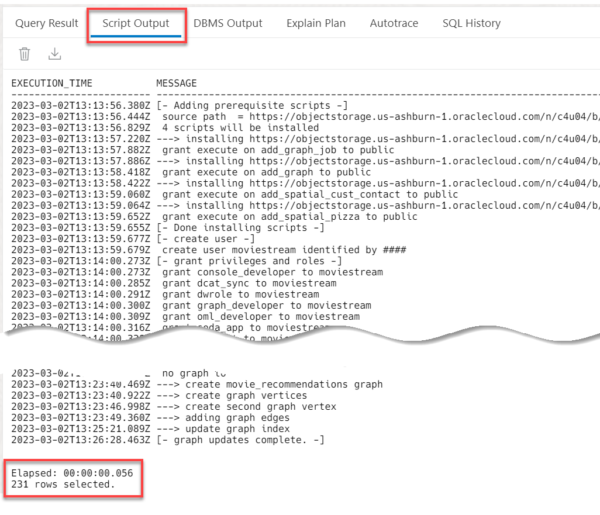

5. Sign out of the **moviestream** user. Click the **moviestream** drop-down list in the Worksheet banner, and then click **Sign Out**.

    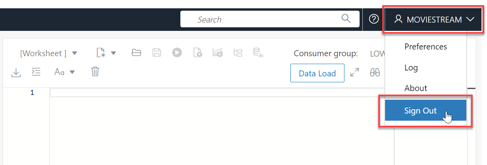

6. Sign in to your SQL Worksheet as the **ADMIN** user. You will run the commands in the next task as the **ADMIN** user. On the **Oracle REST Data Services** page, click **Sign in**. On the **Database Actions** page, sign in as the **admin** user. Enter the username and password, and then click **Sign in**. On the **Database Actions | Launchpad** Home page, in the **Development** section, click the **SQL** card to display your SQL Worksheet.

<if type="livelabs">
    >**Note:**
    Your assigned **admin** password is displayed in the **Reservation Information** panel. Click **Copy value** next to the **ADMIN Password** field.
    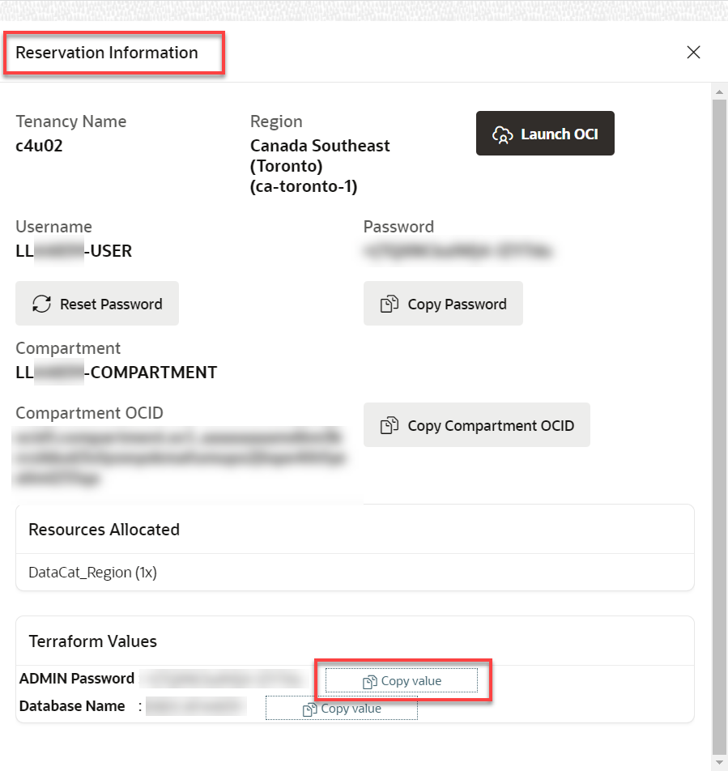
</if>

    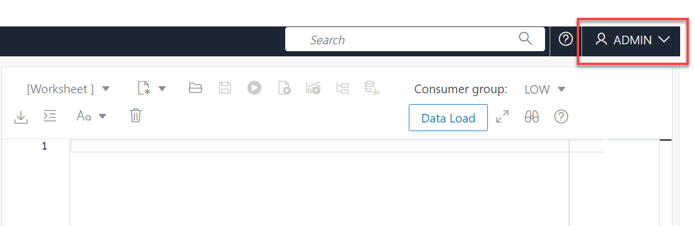

## Task 3: Connect to Data Catalog

In this task (in a later step), you will create a connection to your Data Catalog instance using the `set_data_catalog_conn` PL/SQL package procedure. This is required to synchronize the metadata with Data Catalog. An Autonomous Database instance can connect to a single Data Catalog instance. You only need to call this procedure once to set the connection. See [SET\_DATA\_CATALOG\_CONN Procedure](https://docs-uat.us.oracle.com/en/cloud/paas/exadata-express-cloud/adbst/ref-managing-data-catalog-connection.html#GUID-7734C568-076C-4BC5-A157-6DE11F548D2B). The credentials must have access to your Data Catalog asset and the data in the **`moviestream_sandbox`**, **`moviestream_landing`** and **`moviestream_gold`** Oracle Object Storage buckets that you use in this workshop.

<if type="freetier">
1. Enable Resource Principal to access Oracle Cloud Infrastructure Resources for the ADB instance. This creates the credential **`OCI$RESOURCE_PRINCIPAL`**. Click **Copy** to copy the following code, and then paste it into the SQL Worksheet. Place the cursor on any line of code, and then click the **Run Script (F5)** icon in the Worksheet toolbar. The result is displayed in the **Script Output** tab at the bottom of the worksheet.

    ```
    <copy>
    exec dbms_cloud_admin.enable_resource_principal();
    exec dbms_cloud_admin.enable_resource_principal('MOVIESTREAM');
    </copy>
    ```

    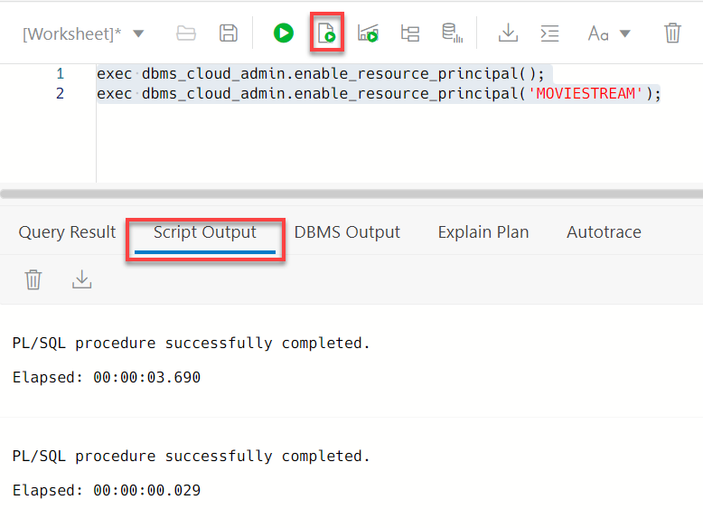

    >**Note:** You can use an Oracle Cloud Infrastructure Resource Principal with Autonomous Database. You or your tenancy administrator define the Oracle Cloud Infrastructure policies and a dynamic group that allows you to access Oracle Cloud Infrastructure resources with a resource principal. You do not need to create a credential object. Autonomous Database creates and secures the resource principal credentials you use to access the specified Oracle Cloud Infrastructure resources. See [Use Resource Principal to Access Oracle Cloud Infrastructure Resources](https://docs.oracle.com/en/cloud/paas/autonomous-database/adbsa/resource-principal.html#GUID-E283804C-F266-4DFB-A9CF-B098A21E496A)

2. Confirm that the resource principal was enabled. Click **Copy** to copy the following code, and then paste it into the SQL Worksheet. Place the cursor on any line of code, and then click the **Run Statement** icon in the Worksheet toolbar. The result is displayed in the **Query Result** tab at the bottom of the worksheet.

    ```
    <copy>
    select *
    from all_credentials;
    </copy>
    ```

    

3. Query the Object Storage bucket to ensure that the resource principal and privilege work. Use the `list_objects` function to list objects in the specified location on object storage, **`moviestream_sandbox`** bucket in our example. The results include the object names and additional metadata about the objects such as size, checksum, creation timestamp, and the last modification timestamp. Click **Copy** to copy and paste the following code into the SQL Worksheet, and then click the **Run Statement** icon in the Worksheet toolbar. The result is displayed in the **Query Result** tab at the bottom of the worksheet.

    ```
    <copy>
    select *
    from dbms_cloud.list_objects('OCI$RESOURCE_PRINCIPAL', 'https://objectstorage.us-ashburn-1.oraclecloud.com/n/c4u04/b/moviestream_sandbox/o/');
    </copy>
    ```

    >**Note:** The **`moviestream_sandbox`** bucket contains several data sets that are created by data scientists. This bucket is used by multiple workshops that capture the results of experiments; therefore, your results might not precisely match the following screen capture.

    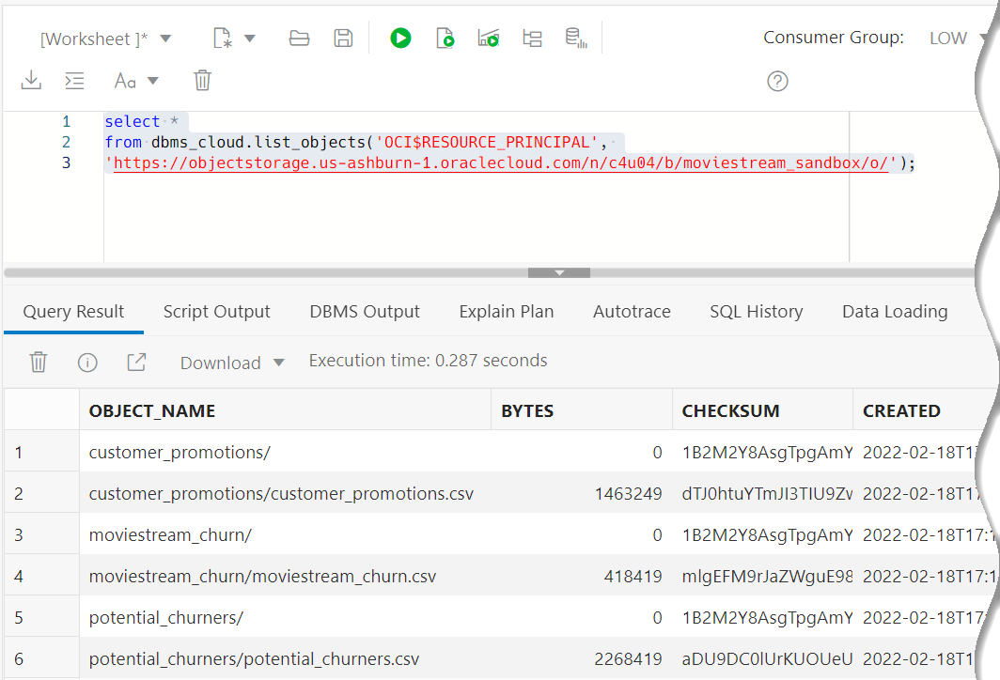

    The following screen capture displays the logical data entities in the **`moviestream_sandbox`** bucket as seen in Data Catalog. Those were harvested from the **`moviestream_sandbox`** public Oracle Object Storage bucket.

    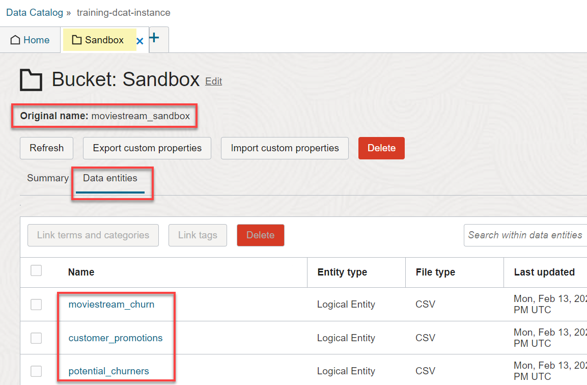

4. Set the credentials to use with Data Catalog and Object Storage. The **`set_data_catalog_credential`** procedure sets the Data Catalog access credential that is used for all access to the Data Catalog. The **`set_object_store_credential`** procedure sets the credential that is used by the external tables for accessing the Object Storage. Changing the Object Storage access credential alters all existing synced tables to use the new credential. Click **Copy** to copy the following code, and then paste it into the SQL Worksheet. Place the cursor on any line of code, and then click the **Run Script (F5)** icon in the Worksheet toolbar. The result is displayed in the **Script Output** tab at the bottom of the worksheet.

    ```
    <copy>
    exec dbms_dcat.set_data_catalog_credential(credential_name => 'OCI$RESOURCE_PRINCIPAL');
    exec dbms_dcat.set_object_store_credential(credential_name => 'OCI$RESOURCE_PRINCIPAL');
    </copy>
    ```

    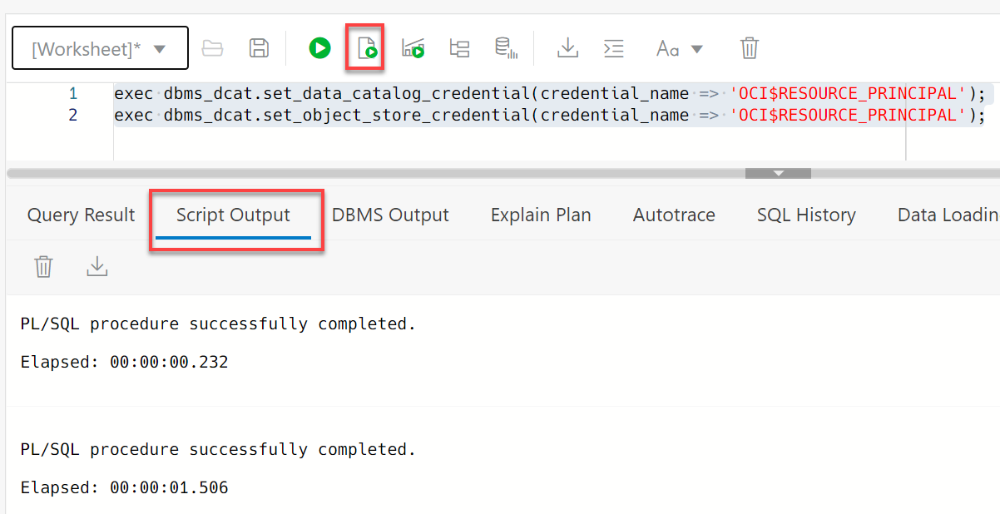

### **Create a Connection to your Data Catalog Instance**

Before you can create a connection to your Data Catalog instance, you will need to find your Data Catalog instance OCID and region identifier values. Your region identifier is associated with your region name that is displayed in the Console banner. This is where you deployed your Data Catalog instance.

1. Query the **`all_dcat_global_accessible_catalogs`** data dictionary view to find your Data Catalog instance OCID and region identifier values. Click **Copy** to copy the following code, and then paste it into the SQL Worksheet. Click the **Run Statement** icon in the Worksheet toolbar. The result is displayed in the **Query Result** tab at the bottom of the worksheet. In our example, we have three Data Catalog instances. The instance that we will use is in the **us-ashburn-1** region (first row).

    ```
    <copy>
    select *
    from all_dcat_global_accessible_catalogs;
    </copy>
    ```

    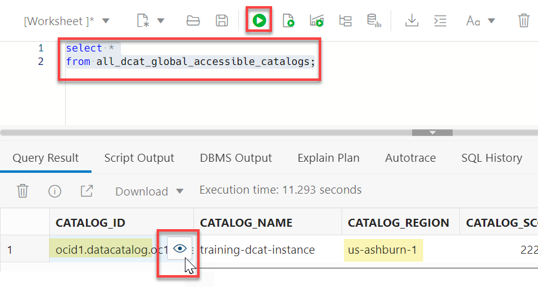

2.  To copy the **`CATALOG_ID`** (OCID) value, in the row for your Data Catalog instance, right-click the **CATALOG_ID** (OCID) cell, and then click **Copy** from the context menu. Paste the copied value into a text editor of your choice (such as Notepad in MS-Windows) as you will need it to connect to your Data Catalog instance.

    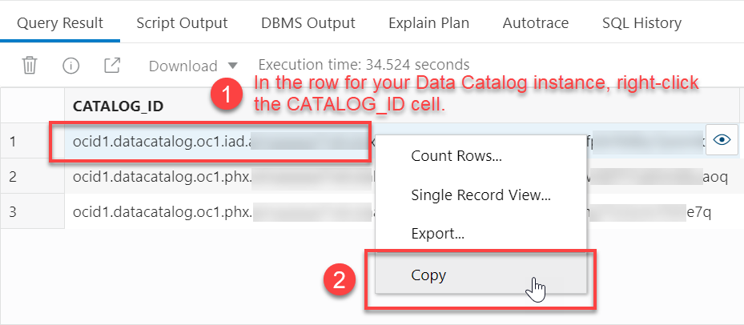

3. To copy the **`CATALOG_REGION`** (region identifier) value, in the row for your Data Catalog instance, right-click the **CATALOG_REGION** cell, and then click **Copy** from the context menu. Paste the copied value into a text editor of your choice as you will need it next.

    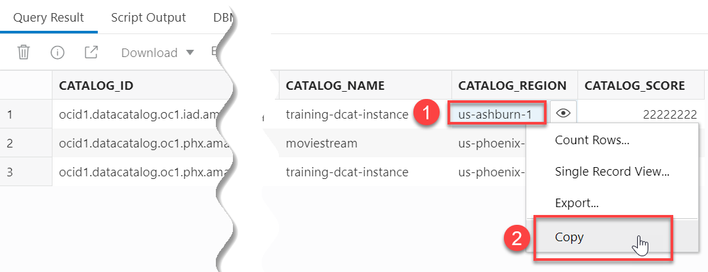

    In our example, we saved the two values to a Notepad file.

    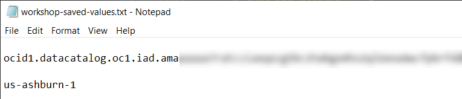

    >**Notes:**
    * For additional information on how to find your region identifier, see the [How do I find a region identifier?](https://livelabs.oracle.com/pls/apex/dbpm/r/livelabs/run-workshop?p210_wid=3263) OCI sprint.
    * For additional information on how to find your Data Catalog instance OCID, see the [How do I find a Data Catalog instance OCID?](https://livelabs.oracle.com/pls/apex/dbpm/r/livelabs/run-workshop?p210_wid=3262) OCI sprint.

4. Create a connection to your Data Catalog instance using the `set_data_catalog_conn` procedure. This is required to synchronize the metadata with Data Catalog. An Autonomous Database instance can connect to a single Data Catalog instance. You only need to call this procedure once to set the connection. Click **Copy** to copy the following code and paste it into the SQL Worksheet.

    ```
    <copy>
    begin
      dbms_dcat.set_data_catalog_conn (
            region => 'enter your region id where your data catalog is deployed',
            catalog_id => 'enter your data catalog ocid');
    end;
      /
    </copy>
    ```

5. Replace the **region** and **catalog_id** place holders text with your **`CATALOG_REGION`** and **`CATALOG_ID`** values that you have saved in the previous two steps. Click the **Run Script (F5)** icon in the Worksheet toolbar. This could take a couple of minutes.

    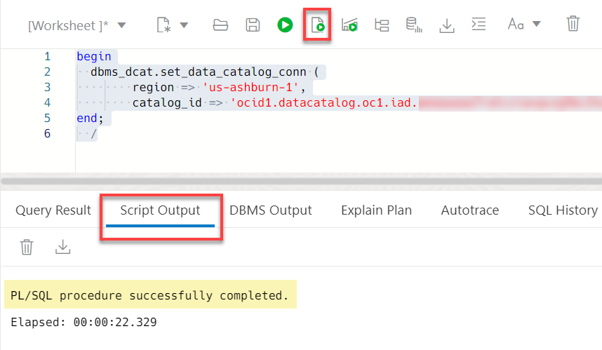

    >**Note:** If you are already have a connection and would like to start over, you must disconnect (initialize) from Data Catalog by using the **`dbms_dcat.unset_data_catalog_conn`** PL/SQL package procedure. This procedure removes an existing Data Catalog connection. It drops all of the protected schemas and external tables that were created as part of your previous synchronizations; however, it does not remove the metadata in Data Catalog. You should perform this action only when you no longer plan on using Data Catalog and the external tables that are derived, or if you want to start the entire process from the beginning.

    ```
    exec dbms_dcat.unset_data_catalog_conn;
    ```

6. Query your current Data Catalog connections and review the the DCAT ocid, its compartment, and the credentials that are used to access Oracle Object Storage and Data Catalog. Click **Copy** to copy the following code, and then paste it into the SQL Worksheet. Click the **Run Statement** icon in the Worksheet toolbar. The result is displayed in the **Query Result** tab at the bottom of the worksheet. For detailed information, see [Managing the Data Catalog Connection](https://docs-uat.us.oracle.com/en/cloud/paas/exadata-express-cloud/adbst/ref-managing-data-catalog-connection.html#GUID-BC3357A1-6F0E-4AEC-814E-71DB3E7BB63D).

    ```
    <copy>
    select *
    from all_dcat_connections;
    </copy>
    ```

    The connection to your `training-dcat-instance` Data Catalog instance that you created in this workshop is displayed.

    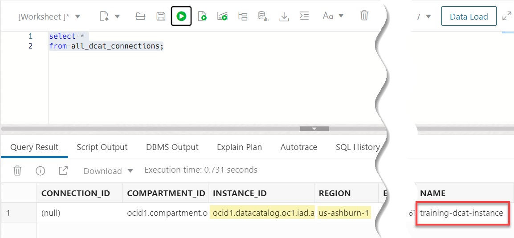

    You can use the `describe` SQL*Plus command to get familiar with the columns in the `all_dcat_connections` Data Catalog table. Copy and paste the following command into your SQL Worksheet, and then click the **Run Script (F5)** icon.

    ```
    <copy>
    describe all_dcat_connections;
    </copy>
    ```

    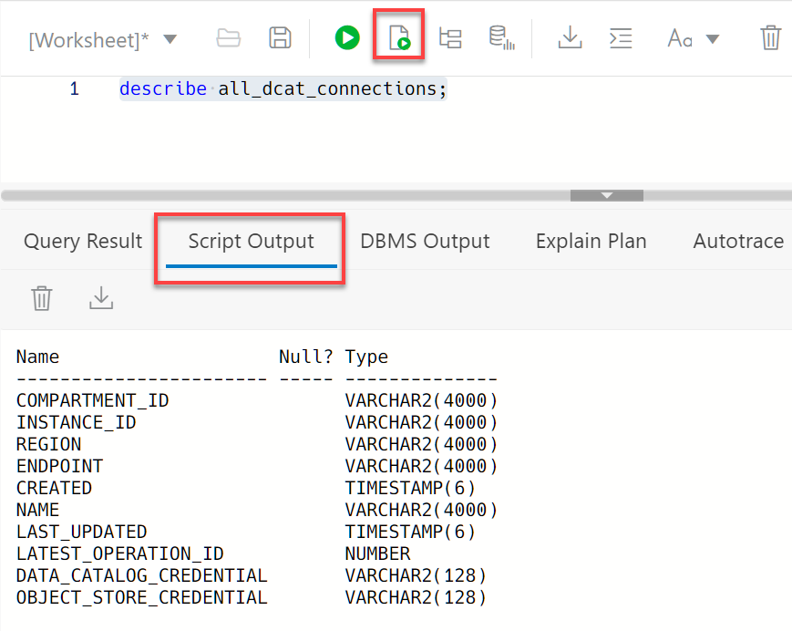


</if> <!-- End of freetier section -->

<!-- Begin LiveLabs section -->

<if type="livelabs">
1. Enable Resource Principal to access Oracle Cloud Infrastructure Resources for the ADB instance. This creates the credential **`OCI$RESOURCE_PRINCIPAL`**. Click **Copy** to copy the following code, and then paste it into the SQL Worksheet. Place the cursor on any line of code, and then click the **Run Script (F5)** icon in the Worksheet toolbar. The result is displayed in the **Script Output** tab at the bottom of the worksheet.

    ```
    <copy>
    exec dbms_cloud_admin.enable_resource_principal();
    exec dbms_cloud_admin.enable_resource_principal('MOVIESTREAM');
    </copy>
    ```

    

    >**Note:** You can use an Oracle Cloud Infrastructure Resource Principal with Autonomous Database. You or your tenancy administrator define the Oracle Cloud Infrastructure policies and a dynamic group that allows you to access Oracle Cloud Infrastructure resources with a resource principal. You do not need to create a credential object. Autonomous Database creates and secures the resource principal credentials you use to access the specified Oracle Cloud Infrastructure resources. See [Use Resource Principal to Access Oracle Cloud Infrastructure Resources](https://docs.oracle.com/en/cloud/paas/autonomous-database/adbsa/resource-principal.html#GUID-E283804C-F266-4DFB-A9CF-B098A21E496A)

2. Confirm that the resource principal was enabled. Click **Copy** to copy the following code, and then paste it into the SQL Worksheet. Place the cursor on any line of code, and then click the **Run Statement** icon in the Worksheet toolbar. The result is displayed in the **Query Result** tab at the bottom of the worksheet.

    ```
    <copy>
    select *
    from all_credentials;
    </copy>
    ```

    

3. Query the Object Storage bucket to ensure that the resource principal and privilege work. Use the `list_objects` function to list objects in the specified location on object storage, **`moviestream_sandbox`** bucket in our example. The results include the object names and additional metadata about the objects such as size, checksum, creation timestamp, and the last modification timestamp. Click **Copy** to copy and paste the following code into the SQL Worksheet, and then click the **Run Statement** icon in the Worksheet toolbar. The result is displayed in the **Query Result** tab at the bottom of the worksheet.

    ```
    <copy>
    select *
    from dbms_cloud.list_objects('OCI$RESOURCE_PRINCIPAL', 'https://objectstorage.us-ashburn-1.oraclecloud.com/n/c4u04/b/moviestream_sandbox/o/');
    </copy>
    ```

    >**Note:** The **`moviestream_sandbox`** bucket contains a **`potential_churners`** data set and potentially several other data sets created by data scientists. This bucket is used by multiple workshops that capture the results of experiments; therefore, your results might not precisely match the following screen capture.

    

    Here are the three logical data entities (this is a dynamic bucket so the results will vary) in the **`moviestream_sandbox`** bucket as seen in Data Catalog, **`potential_churners`**.

    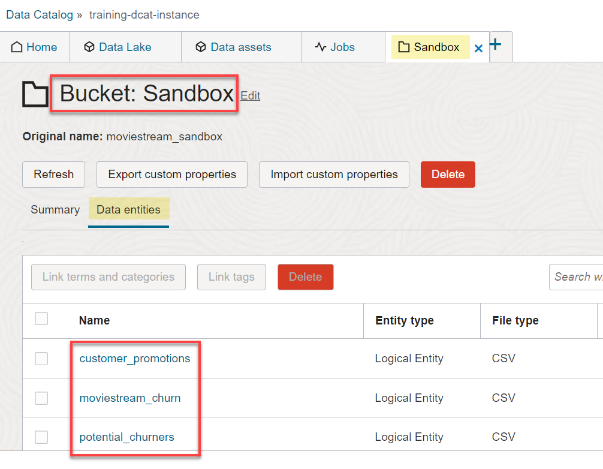

    This was harvested from the **`moviestream_sandbox`** public Oracle Object Storage bucket which contains three folders: **`customer_promotions`**, **`potential_churners`**, and **`moviestream_churn`**.

4. Set the credentials to use with Data Catalog and Object Storage. The **`set_data_catalog_credential`** procedure sets the Data Catalog access credential that is used for all access to the Data Catalog. The **`set_object_store_credential`** procedure sets the credential that is used by the external tables for accessing the Object Storage. Changing the Object Storage access credential alters all existing synced tables to use the new credential. Click **Copy** to copy the following code, and then paste it into the SQL Worksheet. Place the cursor on any line of code, and then click the **Run Script (F5)** icon in the Worksheet toolbar. The result is displayed in the **Script Output** tab at the bottom of the worksheet.

    ```
    <copy>
    exec dbms_dcat.set_data_catalog_credential(credential_name => 'OCI$RESOURCE_PRINCIPAL');
    exec dbms_dcat.set_object_store_credential(credential_name => 'OCI$RESOURCE_PRINCIPAL');
    </copy>
    ```

    

5. Query the **`all_dcat_global_accessible_catalogs`** data dictionary view to find your Data Catalog instance OCID and region identifier values. Click **Copy** to copy the following code, and then paste it into the SQL Worksheet. Click the **Run Statement** icon in the Worksheet toolbar. The result is displayed in the **Query Result** tab at the bottom of the worksheet. In our example, we have three Data Catalog instances. The instance that we will use is in the **us-ashburn-1** region (first row).

    ```
    <copy>
    select *
    from all_dcat_global_accessible_catalogs;
    </copy>
    ```

    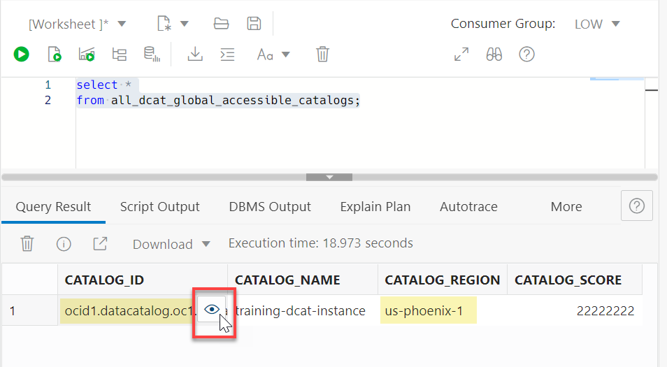

6.  To copy the **`CATALOG_ID`** (OCID) value, in the row for your Data Catalog instance, right-click the **CATALOG_ID** (OCID) cell, and then click **Copy** from the context menu. Paste the copied value into a text editor of your choice (such as Notepad in MS-Windows) as you will need it to connect to your Data Catalog instance.

    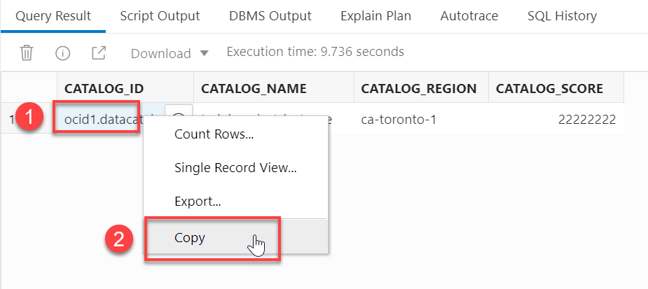

7. To copy the **`CATALOG_REGION`** (region identifier) value, in the row for your Data Catalog instance, right-click the **CATALOG_REGION** cell, and then click **Copy** from the context menu. Paste the copied value into a text editor of your choice as you will need it next.

    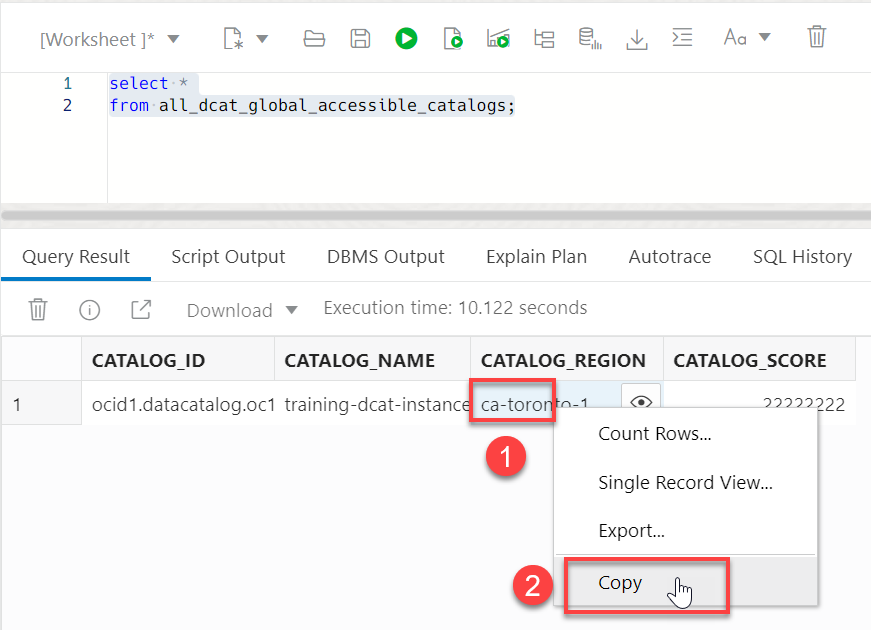

    In our example, we saved the two values to a Notepad file.

    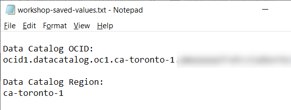

    >**Notes:**
    * For additional information on how to find your region identifier, see the [How do I find a region identifier?](https://livelabs.oracle.com/pls/apex/dbpm/r/livelabs/run-workshop?p210_wid=3263) OCI sprint.
    * For additional information on how to find your Data Catalog instance OCID, see the [How do I find a Data Catalog instance OCID?](https://livelabs.oracle.com/pls/apex/dbpm/r/livelabs/run-workshop?p210_wid=3262) OCI sprint.

8. Create a connection to your Data Catalog instance using the `set_data_catalog_conn` procedure. This is required to synchronize the metadata with Data Catalog. An Autonomous Database instance can connect to a single Data Catalog instance. You only need to call this procedure once to set the connection. Click **Copy** to copy the following code and paste it into the SQL Worksheet.

    ```
    <copy>
    begin
      dbms_dcat.set_data_catalog_conn (
            region => 'enter your region id where your data catalog is deployed',
            catalog_id => 'enter your data catalog ocid');
    end;
      /
    </copy>
    ```

9. Replace the **region** and **catalog_id** place holders text with your **`CATALOG_REGION`** and **`CATALOG_ID`** values that you have saved in the previous two steps. Click the **Run Script (F5)** icon in the Worksheet toolbar. This could take a couple of minutes.

    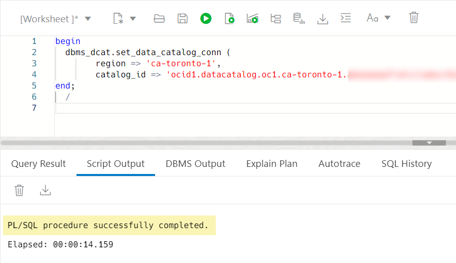
    >**Note:** If you are already have a connection and would like to start over, you must disconnect (initialize) from Data Catalog by using the **`dbms_dcat.unset_data_catalog_conn`** PL/SQL package procedure. This procedure removes an existing Data Catalog connection. It drops all of the protected schemas and external tables that were created as part of your previous synchronizations; however, it does not remove the metadata in Data Catalog. You should perform this action only when you no longer plan on using Data Catalog and the external tables that are derived, or if you want to start the entire process from the beginning.

    ```
    exec dbms_dcat.unset_data_catalog_conn;
    ```

10. Query your current Data Catalog connections and review the DCAT OCID, its compartment, and the credentials that are used to access Oracle Object Storage and Data Catalog. Click **Copy** to copy the following code, and then paste it into the SQL Worksheet. Click the **Run Statement** icon in the Worksheet toolbar. The result is displayed in the **Query Result** tab at the bottom of the worksheet. For detailed information, see [Managing the Data Catalog Connection](https://docs-uat.us.oracle.com/en/cloud/paas/exadata-express-cloud/adbst/ref-managing-data-catalog-connection.html#GUID-BC3357A1-6F0E-4AEC-814E-71DB3E7BB63D).

    ```
    <copy>
    select *
    from all_dcat_connections;
    </copy>
    ```

    The connection to your `training-dcat-instance` Data Catalog instance that you created in this workshop is displayed.

    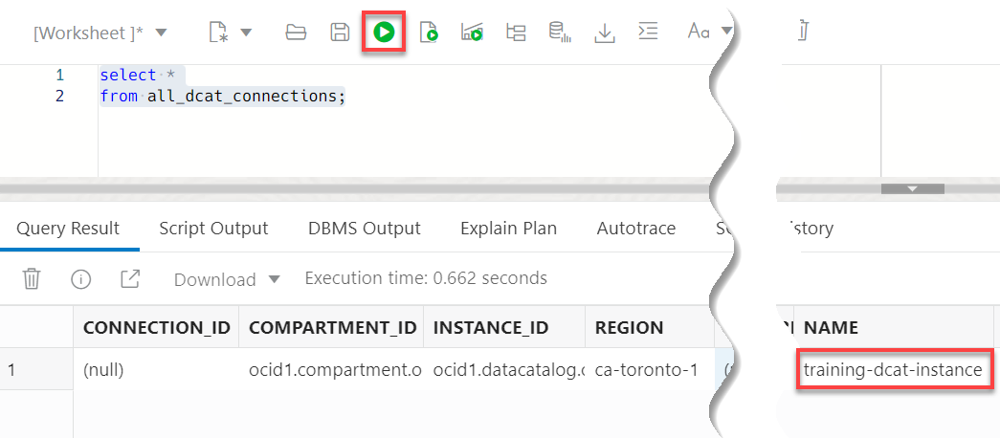

    You can use the `describe` SQL*Plus command to get familiar with the columns in the `all_dcat_connections` Data Catalog table:

    ```
    <copy>
    describe all_dcat_connections;
    </copy>
    ```

    

</if> <!-- End of livelabs section -->

## Task 4: Display Data Assets, Folders, and Entities

1. Display the available data assets in the connected Data Catalog instance. Copy and paste the following script into your SQL Worksheet, and then click the **Run Statement** icon in the Worksheet toolbar.

    ```
    <copy>
    select *
    from all_dcat_assets;
    </copy>
    ```

    The row for the only data asset that you created in your Data Catalog instance, **`Data Lake`**, is displayed in the **Query Result** tab.

    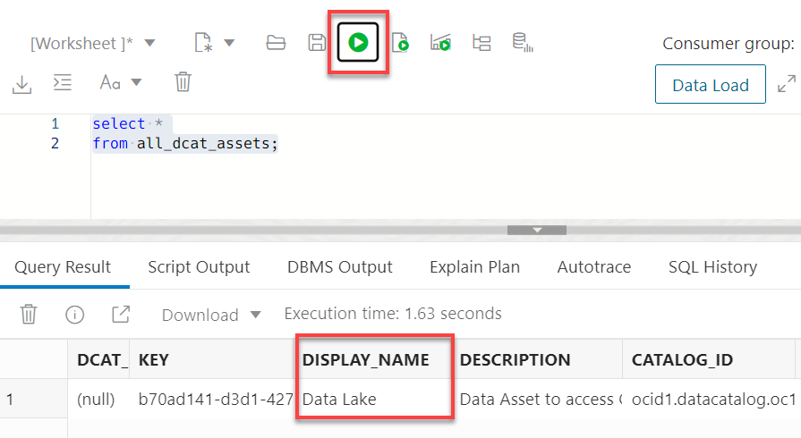

2. Display all Data Assets folders that were harvested from the **`Data Lake`** data asset. Copy and paste the following script into your SQL Worksheet, and then click the **Run Statement** icon in the Worksheet toolbar.

    The **`moviestream_sandbox`**, **`moviestream_gold`**, and **`moviestream_landing`** folders are displayed in the **Query Result** tab. Notice the custom business names that you provided for each bucket in an earlier lab: **`Sandbox`**, **`Gold`**, and **`Landing`**. This will make the generated schemas' names a bit shorter.

    ```
    <copy>
    select *
    from all_dcat_folders;
    </copy>
    ```

    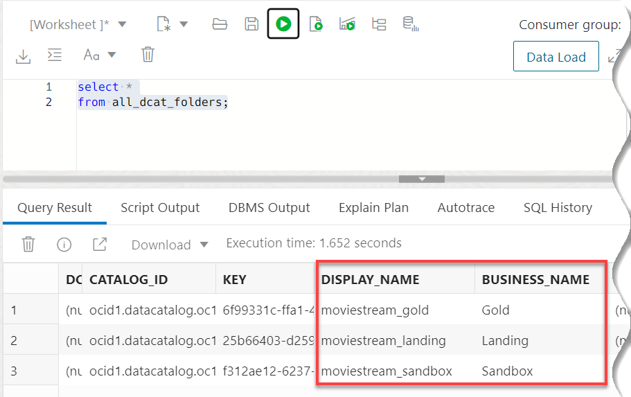

    You can use the following `describe` SQL*Plus command to get familiar with the columns in the `all_dcat_folders` Data Catalog table. Copy and paste the following command into your SQL Worksheet, and then click the **Run Script (F5)** icon.

    ```
    <copy>
    describe all_dcat_folders;
    </copy>
    ```

3. Display all the entities in the folders originating from Oracle Object Storage buckets referenced in the **`Data Lake`** data asset.

    ```
    <copy>
    select *
    from all_dcat_entities;
    </copy>
    ```

    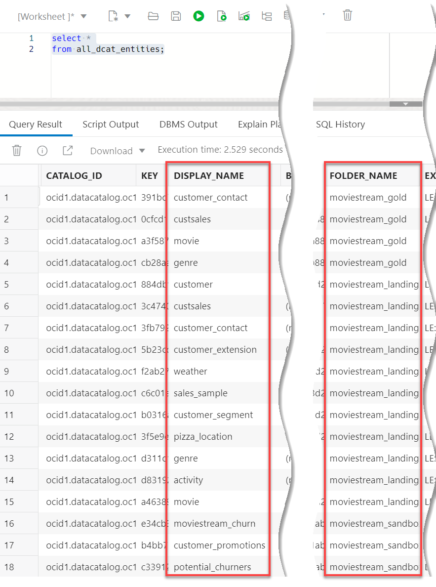

    >**Note:** The **`moviestream_sandbox`** bucket contains three data sets and can potentially contain several other data sets created by data scientists. This bucket is used by multiple workshops that capture the results of experiments; therefore, your results might not precisely match the above screen capture.

    You can use the `describe` SQL*Plus command to get familiar with the columns in the `all_dcat_entities` Data Catalog table. Copy and paste the following command into your SQL Worksheet, and then click the **Run Script (F5)** icon.

    ```
    <copy>
    describe all_dcat_entities;
    </copy>
    ```

## Task 5: Synchronize Autonomous Database with Data Catalog

1. Synchronize the **`moviestream_sandbox`** Object Storage Bucket, between Data Catalog and Autonomous Database using the **`dbms_dcat.run_sync`** PL/SQL package procedure. In order to synchronize just one bucket (folder), you'll need the folder's key, `moviestream_sandbox` in this example, and your `Data Lake` data asset key.

    ```
    <copy>
    select path, display_name, key as folder_key, data_asset_key
    from all_dcat_folders
    where display_name='moviestream_sandbox';
    </copy>
    ```

    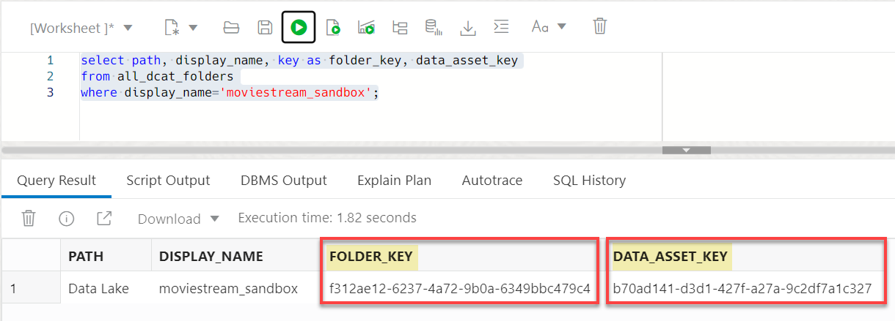

    To copy the **`FOLDER_KEY`** value, right-click the **`FOLDER_KEY`** cell, and then click **Copy** from the context menu. Paste the copied value into a text editor of your choice (such as Notepad on a Windows machine) as you will need it next.

    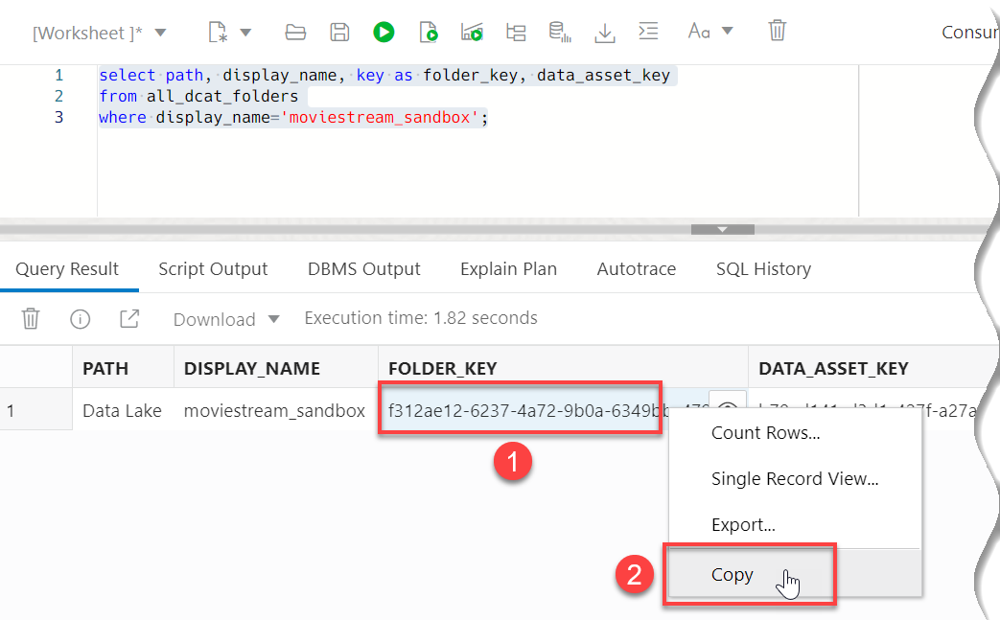

    To copy the **`DATA_ASSET_KEY`** value, right-click the **`DATA_ASSET_KEY`** cell, and then click **Copy** from the context menu. Paste the copied value into a text editor of your choice (such as Notepad on a Windows machine) as you will need it next.

    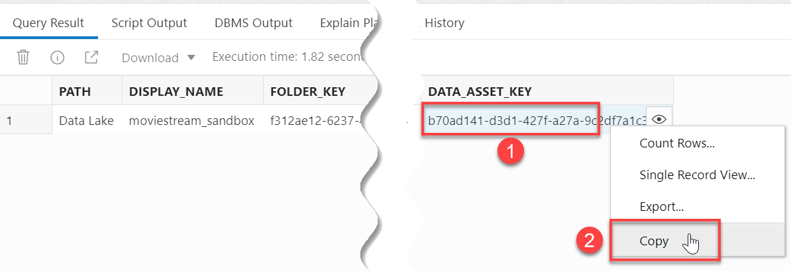

    In our example, we saved the two keys to a Notepad file.

    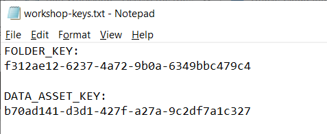

    > **Note:** In later steps, you will synchronize **all** of the available Object Storage buckets.

2. Copy and paste the following code into your SQL Worksheet. Replace the **`asset_id`** key value in the code with your **`data_asset_key`** value and the **`folder_list`** key value with your `folder_key` value that you copied in the previous step.

    The **`grant_read`** parameter lists the users or roles that are automatically granted **`READ`** privileges on all external tables processed when you invoke the **`run_sync`** procedure. All users/roles in the **`grant_read`** list are given **`READ`** privileges on all new or already existing external tables that correspond to entities specified by the **`synced_objects`** parameter. Autonomous Databases come with a predefined database role named **`DWROLE`**. This role provides the common privileges such as select on tables for a database developer or data scientist to perform real-time analytics. In our example, we are granting **`READ`** access on the Data Catalog sourced tables to the `dwrole` role. See [Manage User Privileges on Autonomous Database - Connecting with a Client Tool](https://docs.oracle.com/en/cloud/paas/autonomous-database/adbsa/manage-users-privileges.html#GUID-50450FAD-9769-4CF7-B0D1-EC14B465B873)Click the **Run Script (F5)** icon in the Worksheet toolbar. The result is displayed in the **Script Output** tab at the bottom of the worksheet.

    ```
    <copy>
    begin
    dbms_dcat.run_sync(synced_objects =>
        '{"asset_list": [
            {
                "asset_id":"b70ad141-d3d1-427f-a27a-9c2df7a1c327",
                "folder_list":["f312ae12-6237-4a72-9b0a-6349bbc479c4"]
            }
        ]}', grant_read => 'dwrole');
    end;
    /
    </copy>
    ```

    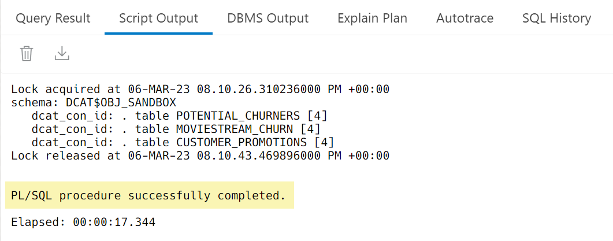

    Earlier in this workshop, you learned that when you perform the synchronization process between your ADB and Data Catalog instances, the schemas and tables are created automatically for you as you saw in the above step. By default, the name of a generated schema will start with **`DCAT$`** concatenated with the data asset's name, **`Data Lake`**, and the folder's (bucket's) name such as **`moviestream_sandbox`**; however, in **Lab 2, Harvest Technical Metadata from Oracle Object Storage**, in **Task 7: Customize the Business Name for the Object Storage Buckets**, you created a business name for each of the three buckets and removed the **`moviestream_`** prefix. For example, the generated schema name for the **`moviestream_sandbox`** as you can see in the above synchronization image is **`DCAT$DATA_LAKE_SANDBOX`** instead of **`DCAT$DATA_LAKE_MOVIESTREAM_SANDBOX`** which is a bit shorter. In this lab, you will also learn how to replace the data asset name in the schema's name with a shorter custom property override of your choice.

3. Review the generated log to identify any issues. The **`logfile_table`** column contains the name of the table containing the full log. Copy and paste the following script into your SQL Worksheet, and then click the **Run Statement** icon in the Worksheet toolbar.

    ```
    <copy>
    select type, start_time, status, logfile_table
    from user_load_operations
    order by start_time desc;
    </copy>
    ```

    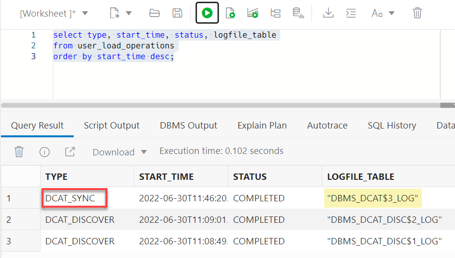

    Your **logfile_table** name might not match the result shown in the above image. If you have more than one log file generated, query the most recent log file table. Using the `order by start_time desc` clause displays the most recent log file first.

4. Review the full sync log. Copy and paste the following script into your SQL Worksheet, and then click the **Run Statement** icon in the Worksheet toolbar. Substitute the log table name with your own log table name that you identified in the previous step.

    ```
    <copy>
    select *
    from DBMS_DCAT$16_LOG
    order by log_timestamp desc;
    </copy>
    ```

    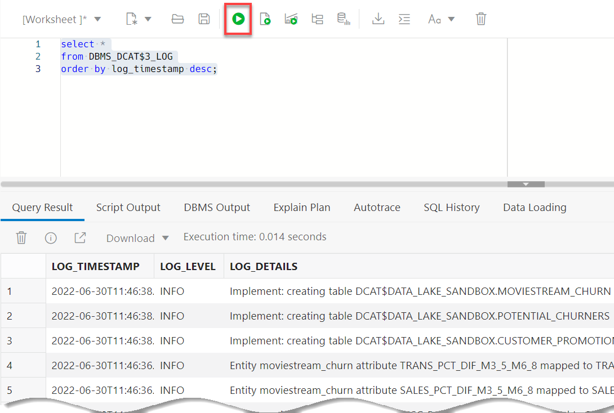

    >**Note:** The external table name that is created automatically, is **`DCAT$`** followed by the data asset name,**`Data_Lake`** (blank space replaced with an underscore character), followed by the business name for the Object Storage bucket that you specified earlier, **`sandbox`** (instead of moviestream_sandbox), followed by logical entity name, **`potential_churners`**.

    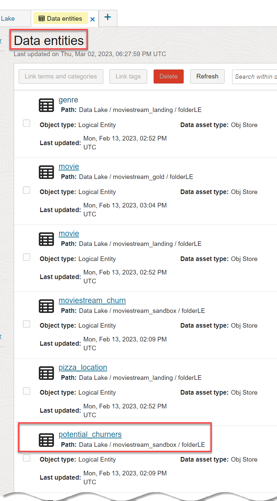


5. Query the available Data Catalog instance entities from within ADB. Copy and paste the following query into your SQL Worksheet, and then click the **Run Statement** icon in the Worksheet toolbar.

    ```
    <copy>
    select oracle_schema_name, oracle_table_name
    from dcat_entities;
    </copy>
    ```

    The schema and external table names are displayed.

    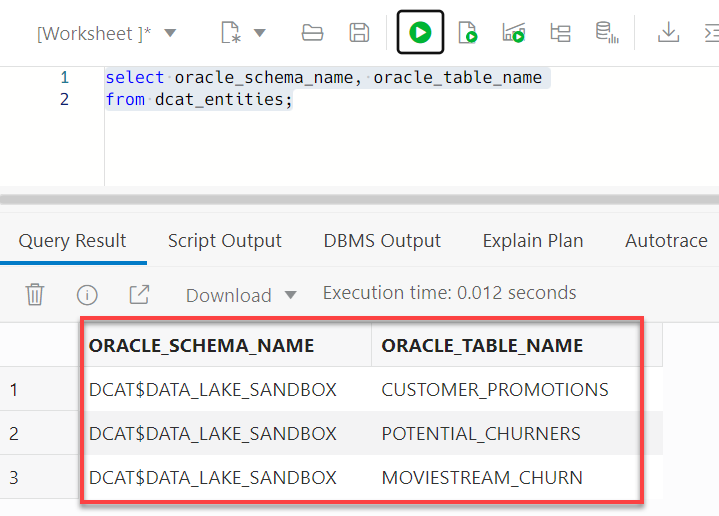

    The synchronization process creates schemas and external tables based on the Data Catalog data assets and logical entities. The name of the schema is displayed in the **`oracle_schema_name`** column and the name of the generated external table is displayed in the **`oracle_table_name`** column.

6. Describe the **`all_dcat_entities`** table that you will use in the next step to get familiar with its columns. Copy and paste the following query into your SQL Worksheet, and then click the **Run Script** icon.

    ```
    <copy>
    describe all_dcat_entities
    </copy>
    ```

    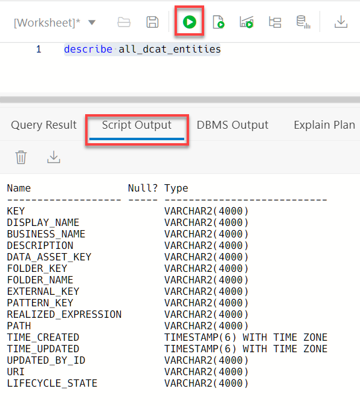

7. Display the Object Storage bucket folder name, logical (data) entity name, schema name, and external table name from the `all_dcat_entities` and `dcat_entities` tables. Copy and paste the following query into your SQL Worksheet, and then click the **Run Statement** icon in the Worksheet toolbar.

    ```
    <copy>
    select a.folder_name,
       a.display_name,
       a.business_name,
       a.description,
       lower(d.oracle_schema_name),
       lower(d.oracle_table_name)
    from all_dcat_entities a, dcat_entities d
    where a.data_asset_key = d.asset_key
    and a.key = d.entity_key
    order by 1,2;
    </copy>
    ```

    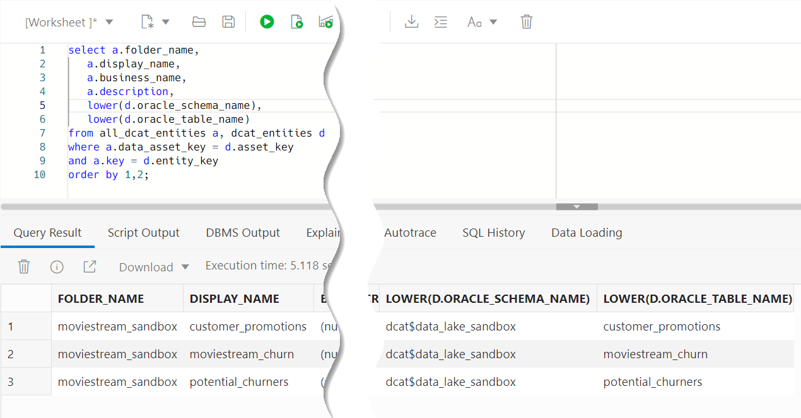

    >**Note:** The result shows the information for only one of the three Object Storage buckets, **`moviestream_sandbox`** because earlier, you performed the synchronization process only on this bucket and not the other two buckets. In the next task in this lab, you will synchronize all assets.

8. Query the first nine rows of the `potential_churners` external table. Copy and paste the following script into your SQL Worksheet, and then click the **Run Statement** icon in the Worksheet toolbar.

    ```
    <copy>
    select *
    from dcat$data_lake_sandbox.potential_churners
    where rownum < 10;
    </copy>
    ```

    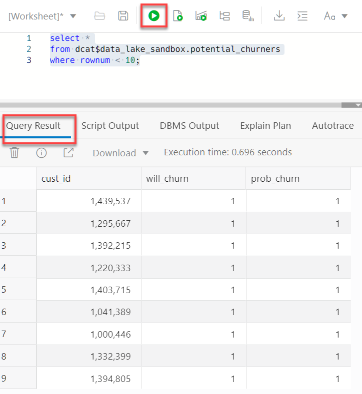

## Task 6: Provide a Custom Property Override for the Schema Name

In this task, you provide a custom property override for the schema name to use a short prefix instead of the data asset name as part of the generated schema name. By default, the name of a generated schema will start with the keyword **`DCAT$`** concatenated with the **data asset's name** and the **Object Storage folder's name** as follows:


As you already learned in this lab, the generated schema name for your `moviestream_sandbox` Oracle Object Storage bucket uses the `Data Lake` data asset name as part of the schema name as follows:


However, in **Lab 2: Harvest Technical Metadata from Oracle Object Storage**, in **Task 7: Customize the Business Name for the Object Storage Buckets**, you customized the business names for each of the three Oracle Object Storage buckets that you use in this workshop to make the generated schema names a bit shorter. You removed the **`moviestream_`** prefix from the name of each bucket. For example, you changed the business name for the **`moviestream_sandbox`** bucket to **`Sandbox`**; therefore, the schema name format that you saw already is as follows:


You will do one last customization to shorten the generated schemas' names a bit more. You will use a custom property override, **`obj`** (can be any prefix) that will be used instead of the actual data asset name, **`Data Lake`**, when you run the synchronization process. The generated schema name would be as follows for the `Sandbox` bucket.


1. Open the **Navigation** menu and click **Analytics & AI**. Under **Data Lake**, select **Data Catalog**. On the **Data Catalog Overview** page, click **Go to Data Catalogs**.

2. On the **Data Catalogs** page, click the **`training-dcat-instance`** Data Catalog instance link. Make sure your region where your Data Catalog region is deployed is selected in the Console banner.

3. On the **`training-dcat-instance`** **Home** page, click **Browse Data Assets** in the **Quick Actions** tile.

    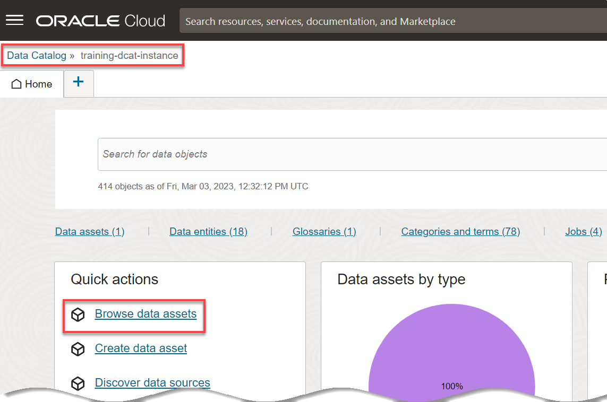
4. If you only have the one Data Asset created in this workshop, the **Oracle Object Storage: Data Lake** page is displayed.

5. In the **Summary** tab, in the **Schema Overrides** tile, click **Edit**.

    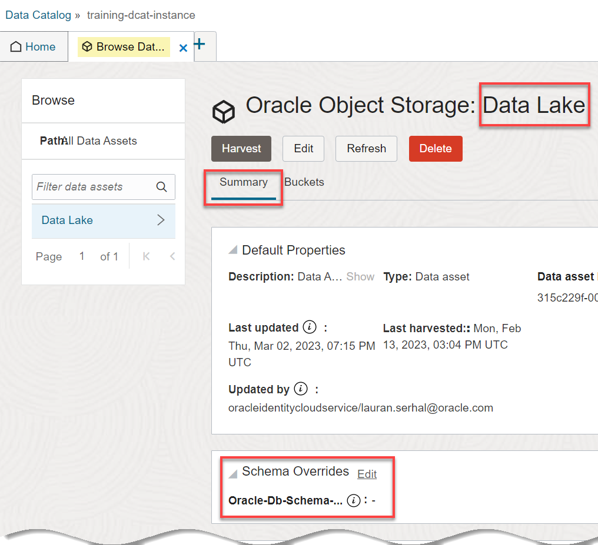

    > **Note:** The **Schema Overrides** tile will only be displayed after you connect ADB to Data Catalog.

6. In the **Edit Schema Overrides** dialog box, enter **`obj`** in the **Oracle-Db-Schema-Prefix** field, and then click **Save Changes**. This value will be used as the prefix to the schemas' that are generated by the synchronization process which is covered in the next lab. If you don't provide a prefix here, then the data asset name, **`Data Lake`**, will be used in schemas' names.

    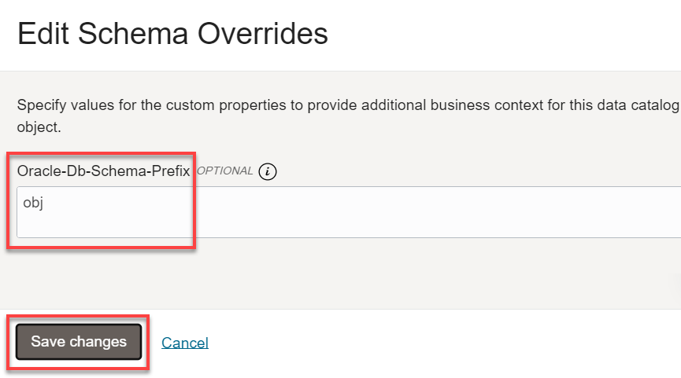

    The new prefix is displayed.

    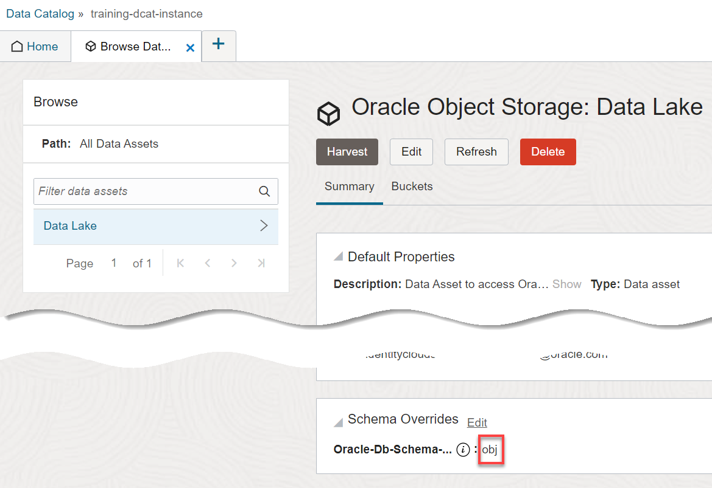

## Task 7: Synchronize All Data Assets in Data Catalog

So far in this lab, you synchronized only the **`moviestream_sandbox`** Object Storage Bucket. In this task, you will synchronize all of the data asset folders, namely, **`moviestream_landing`** and **`moviestream_gold`** Object Storage Buckets. You will also grant **`READ`** access on the Data Catalog sourced tables to the **`dwrole`** role. See [RUN_SYNC Procedure](https://docs.oracle.com/en/cloud/paas/autonomous-database/adbsa/ref-running-synchronizations.html#GUID-C94171B4-6C57-4707-B2D4-51BE0100F967).

1. Copy and paste the following code into your SQL Worksheet, and then click the **Run Script (F5)** icon in the Worksheet toolbar.

    ```
    <copy>
    begin
      dbms_dcat.run_sync('{"asset_list":["*"]}',
      grant_read => 'dwrole');
    end;
    /
    </copy>
    ```

    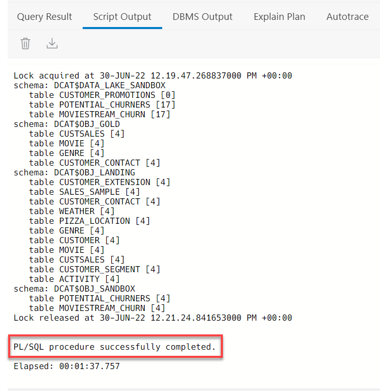

    The synchronization process can take up to two or more minutes to complete. When the full sync is completed successfully, the output is displayed at the bottom of the SQL Worksheet and a **PL/SQL procedure successfully completed** message is displayed in the **Script Output** tab. If you are using a LiveLabs environment, the output might look different.

    >**Note:** When the script execution completes, if you see a **Code Execution Failed** message on the Status bar at the bottom of the SQL Worksheet, ignore it. You will check the script execution status and results using a logfile in the next two steps.

2. Copy and paste the following code into your SQL Worksheet to query the **`user_load_operations`** table to find the name of the logfile table name that contains information about the sync operation. Click the **Run Script (F5)** icon in the Worksheet toolbar. Note the name of the **`logfile_table`**. The **`order by 3`** clause displays the most recent **DCAT_SYNC** operation based on start time first if there were more than one performed.

    ```
    <copy>
    select type, status, start_time, logfile_table
    from USER_LOAD_OPERATIONS
    where type = 'DCAT_SYNC'
    order by 3 desc;
    </copy>
    ```

      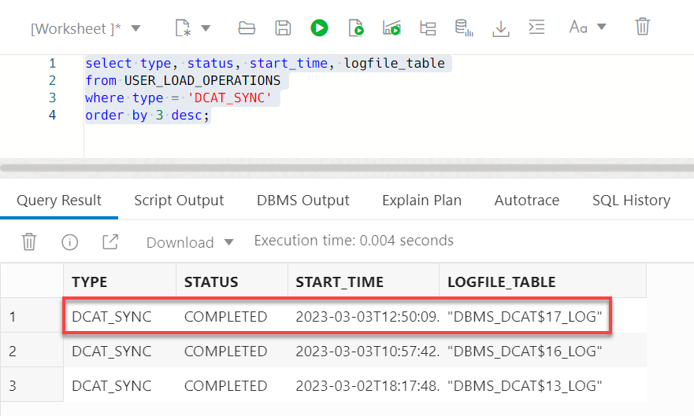

3.  Copy and paste the following code into your SQL Worksheet to query your **`logfile_table`** table that you identified in the previous to view the synchronization process information. Click the **Run Script (F5)** icon in the Worksheet toolbar. Substitute the logfile table name in the following query with your own logfile table name that you identified in the previous step.

    ```
    <copy>
    select *
    from DBMS_DCAT$17_LOG;
    </copy>
    ```

    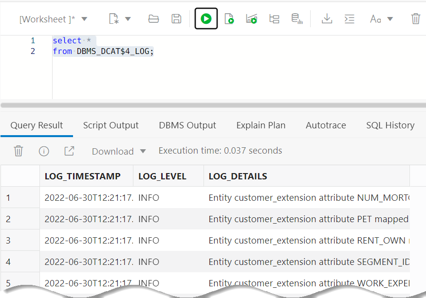

    >**Note:** You can automate the sync operation by using the following procedure which will check for new objects in Data Catalog every 3 minutes. In this workshop, we will not use this procedure because we know that our Data Catalog will not be updated.

    ```
    begin
       dbms_dcat.create_sync_job (
         synced_objects => '{"asset_list":["*"]}',
         repeat_interval => 'FREQ=MINUTELY;INTERVAL=3;'
       );
    end;
    /
    ```

4. Query the generated schemas and external tables after your synchronization. Copy and paste the following query into your SQL Worksheet, and then click the **Run Statement** icon in the Worksheet toolbar.

    ```
    <copy>
    select oracle_schema_name, oracle_table_name
    from dcat_entities;
    </copy>
    ```

    The schema and external table names are displayed. The generated schemas names now uses the **`obj`**  custom property override that you provided instead of the actual data asset name, **Data Lake**, followed by the business name for the buckets that you customized earlier such as **Gold** and **Landing** instead of **moviestream\_gold** and **moviestream_landing**; however, notice that the **obj** prefix was not used with the **Sandbox** bucket because you synchronized that folder before you added the **obj** prefix; therefore, the actual data asset name, **Data Lake**, was used instead.

    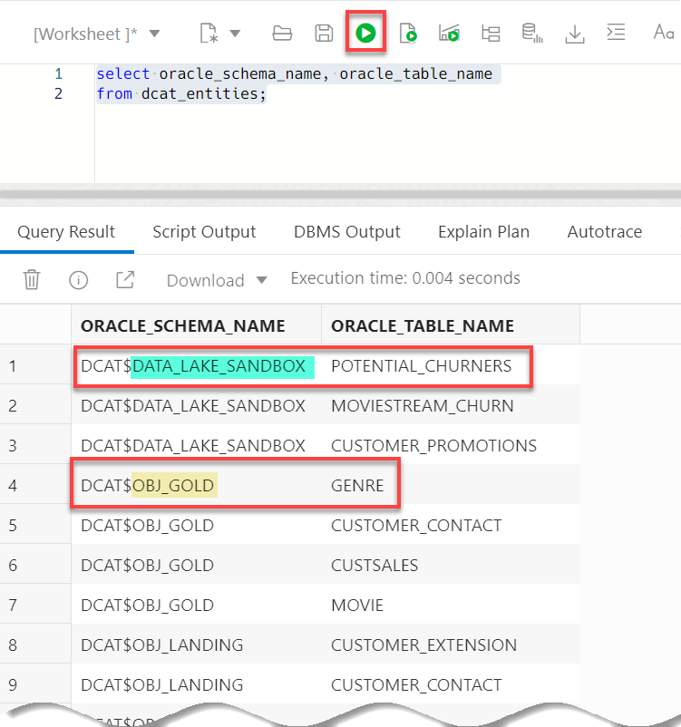

You may now proceed to the next lab.

## Learn More

* [DBMS_DCAT Package](https://docs-uat.us.oracle.com/en/cloud/paas/exadata-express-cloud/adbst/ref-dbms_dcat-package.html#GUID-4D927F21-E856-437B-B42F-727A2C02BE8D)
* [RUN_SYNC Procedure](https://docs.oracle.com/en/cloud/paas/autonomous-database/adbsa/ref-running-synchronizations.html#GUID-C94171B4-6C57-4707-B2D4-51BE0100F967)
* [Using Oracle Autonomous Database Serverless](https://docs.oracle.com/en/cloud/paas/autonomous-database/adbsa/index.html)
* [Connect with Built-in Oracle Database Actions](https://docs.oracle.com/en/cloud/paas/autonomous-database/adbsa/sql-developer-web.html#GUID-102845D9-6855-4944-8937-5C688939610F)
* [Oracle Cloud Infrastructure Documentation](https://docs.cloud.oracle.com/en-us/iaas/Content/GSG/Concepts/baremetalintro.htm)
* [Get Started with Data Catalog](https://docs.oracle.com/en-us/iaas/data-catalog/using/index.htm)
* [Data Catalog Overview](https://docs.oracle.com/en-us/iaas/data-catalog/using/overview.htm)


## Acknowledgements

* **Author:** Lauran Serhal, Consulting User Assistance Developer, Oracle Autonomous Database and Big Data
* **Contributor:** Marty Gubar, Product Manager, Server Technologies
* **Last Updated By/Date:** Lauran Serhal, May 2024

Data about movies in this workshop were sourced from Wikipedia.

Copyright (C) 2024, Oracle Corporation.

Permission is granted to copy, distribute and/or modify this document under the terms of the GNU Free Documentation License, Version 1.3 or any later version published by the Free Software Foundation; with no Invariant Sections, no Front-Cover Texts, and no Back-Cover Texts. A copy of the license is included in the section entitled [GNU Free Documentation License](https://oracle-livelabs.github.io/adb/shared/adb-15-minutes/introduction/files/gnu-free-documentation-license.txt)
