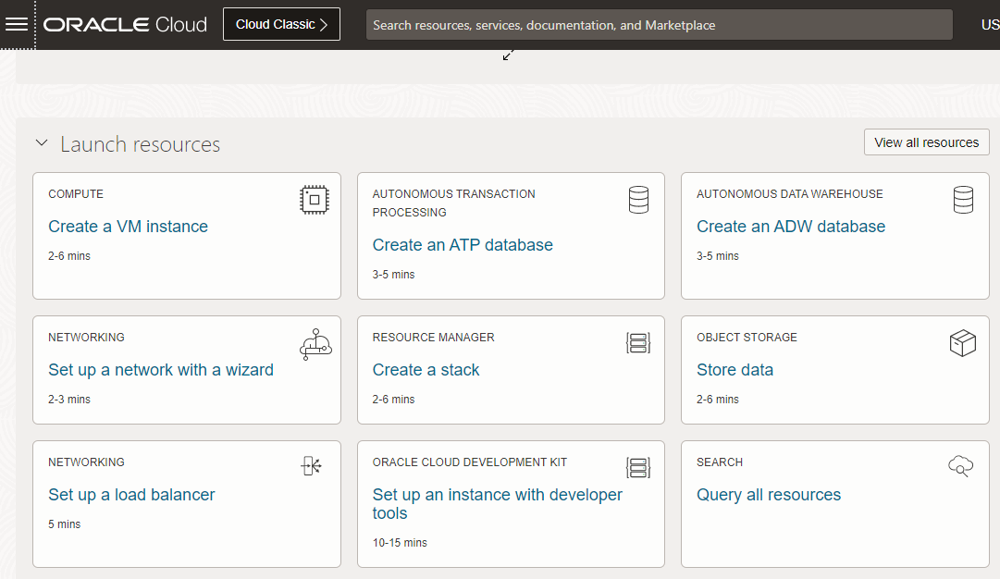
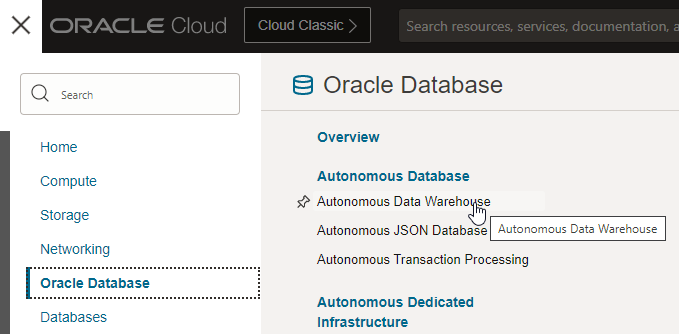
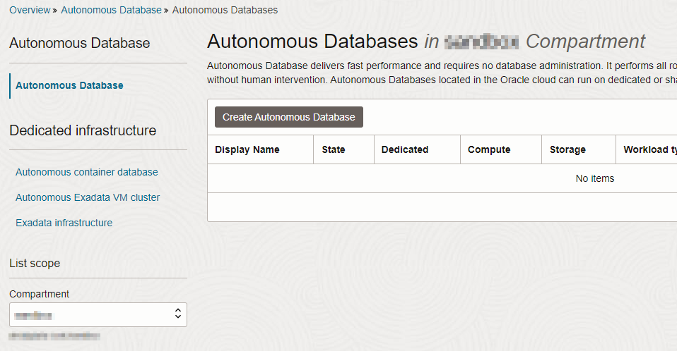
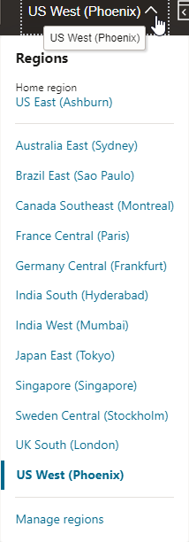
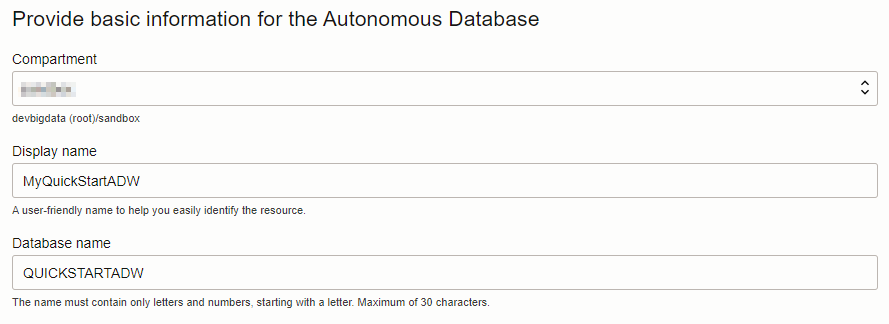
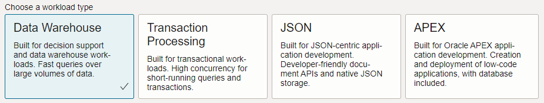
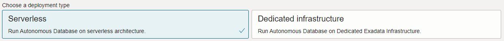
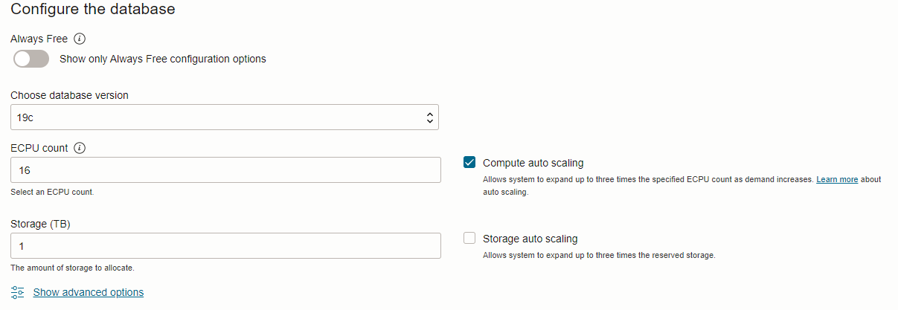
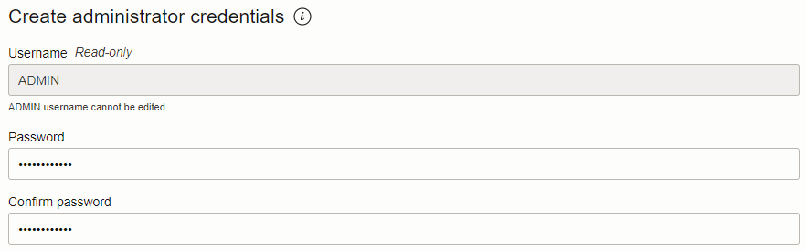
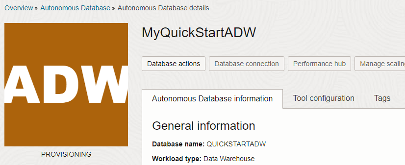

# Provision an Autonomous Database

## Introduction

This lab walks you through the steps to get started using the Oracle Autonomous Database (Autonomous Data Warehouse [ADW]) on Oracle Cloud. In this lab, you provision a new ADW instance.

Estimated Lab Time: 5 minutes

### Objectives

In this lab, you will:

*   Navigate to the Oracle Autonomous Data Warehouse cloud service using the Oracle Cloud Infrastructure console.
*   Provision a new Autonomous Data Warehouse database.

### Prerequisites

This lab assumes you have:

- **Note:** The timings and screenshots in this workshop are based on using 8 OCPUs. If you opt to configure fewer OCPUs the response times and query times will be longer.
- Completed the steps in the **Get Started** section seen in the Contents menu on the left.

## Task 1: Choose ADW from the Services Menu

1. Log in to the Oracle Cloud, as shown in the previous lab.
2. Once you are logged in, you are taken to the cloud services dashboard where you can see all the services available to you. Click the navigation menu in the upper left to show top level navigation choices.

    **Note:** You can also directly access your Autonomous Data Warehouse or Autonomous Transaction Processing service in the **Launch Resources** section of the dashboard.

    

3. This lab shows provisioning of an Autonomous Data Warehouse database, so click **Oracle Database** and then click **Autonomous Data Warehouse**.

    

4. Make sure your workload type is **Data Warehouse** or **All** to see your Autonomous Data Warehouse instances. Use the **List Scope** drop-down menu to select a compartment. If you are using a LiveLabs environment, be sure to select the compartment provided by the environment from the List Scope drop-down menu.

   **Note:** Avoid the use of the ManagedCompartmentforPaaS compartment as this is an Oracle default used for Oracle Platform Services.

5. This console shows that no databases yet exist. If there were a long list of databases, you could filter the list by the **State** of the databases (Available, Stopped, Terminated, and so on). You can also sort by **Workload Type**. Here, the **Data Warehouse** workload type is selected.

    

6. You can see your current default **region** in the top, right hand corner of the page.

    

## Task 2: Create the ADW Instance

1. Click **Create Autonomous Database** to start the instance creation process.

2. This brings up the **Create Autonomous Database** screen where you will specify the configuration of the instance.
3. Provide basic information for the autonomous database:

    - **Choose a compartment** - Select a compartment for the database from the drop-down list.
    - **Display Name** - Enter a memorable name for the database for display purposes. For this lab, use **MyQuickStartADW**.
    - **Database Name** - Use letters and numbers only, starting with a letter. Maximum length is 14 characters. (Underscores not initially supported.) For this lab, use **MYQUICKSTART**.

    

4. Choose a workload type. Select the workload type for your database from the choices:

    - **Data Warehouse** - For this lab, choose **Data Warehouse** as the workload type.
    - **Transaction Processing** - Alternatively, you could have chosen Transaction Processing as the workload type.

    

5. Choose a deployment type. Select the deployment type for your database from the choices:

    - **Shared Infrastructure** - For this lab, choose **Shared Infrastructure** as the deployment type.
    - **Dedicated Infrastructure** - Alternatively, you could have chosen Dedicated Infrastructure as the deployment type.

    

6. Configure the database:

    - **Choose database version** - Select a database version from the available versions.
    - **OCPU count** - Number of CPUs for your service<if type="livelabs">, choose **2 OCPUs** when you are running your workshop in LiveLabs sandbox environment</if>. Our example screenshot uses a database instance with **8 OCPUs**. If you opt to configure fewer OCPUs your response times and query times will be longer<if type="livelabs"> and similarly if you opt to configure more OCPUs your response times and query times will be shorter</if>.
    - **Storage (TB)** - Select your storage capacity in terabytes. For this lab, specify **1 TB** of storage.
    - **Auto Scaling** - For this lab, keep auto scaling enabled, to allow the system to automatically use up to three times more CPU and IO resources to meet workload demand.
    - **New Database Preview** - If a checkbox is available to preview a new database version, do NOT select it.

    

7. Create administrator credentials:

    - **Password and Confirm Password** - Specify a password for ADMIN user of the service instance. The password must meet the following requirements:
    - The password must be between 12 and 30 characters long and must include at least one uppercase letter, one lowercase letter, and one numeric character.
    - The password cannot contain the username.
    - The password cannot contain the double quote (") character.
    - The password must be different from the last 4 passwords used.
    - The password must not be the same password that is set less than 24 hours ago.
    - Re-enter the password to confirm it. Make a note of this password.

    

8. Choose a license type. For this lab, choose **License Included**. The two license types are:

    - **Bring Your Own License (BYOL)** - Select this type when your organization has existing database licenses.
    - **License Included** - Select this type when you want to subscribe to new database software licenses and the database cloud service.

9. Choose network access:
    - For this lab, accept the default, **"Allow secure access from everywhere"**.
    - If you want a private endpoint, to allow traffic only from the VCN you specify - where access to the database from all public IPs or VCNs is blocked, then select "Virtual cloud network" in the Choose network access area.
    - You can control and restrict access to your Autonomous Database by setting network access control lists (ACLs). You can select from 4 IP notation types: IP Address, CIDR Block, Virtual Cloud Network, Virtual Cloud Network OCID).

10. Click the **Create Autonomous Database** button.

11.  Your instance will begin provisioning. In a few minutes, the state will turn from Provisioning to Available. At this point, your Autonomous Data Warehouse database is ready to use! Have a look at your instance's details here including its name, database version, OCPU count, and storage size.

    

Please *proceed to the next lab*.

## Learn More

- Click [here](https://docs.oracle.com/en/cloud/paas/autonomous-data-warehouse-cloud/user/autonomous-workflow.html#GUID-5780368D-6D40-475C-8DEB-DBA14BA675C3) for documentation on the typical workflow for using Autonomous Data Warehouse.

## Acknowledgements

- **Author** - Nilay Panchal, ADB Product Management
- **Adapted for Cloud by** - Richard Green, Principal Developer, Database User Assistance
- **Contributors** - Oracle LiveLabs QA Team (Jeffrey Malcolm Jr, Intern | Arabella Yao, Product Manager Intern)
- **Last Updated By/Date** - Mike Matthews, March 2023