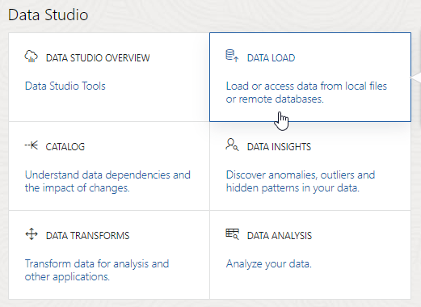
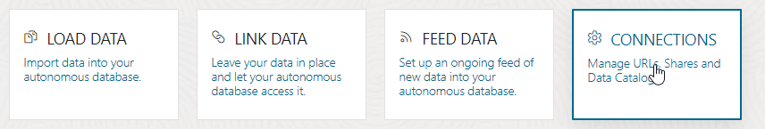
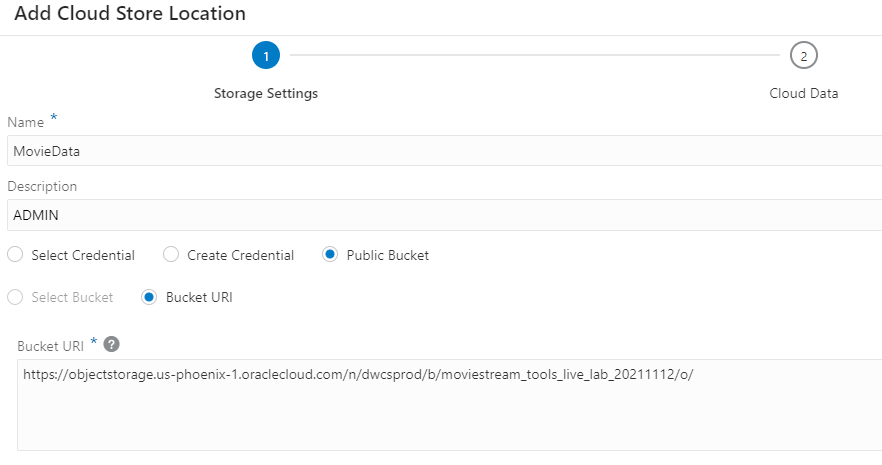
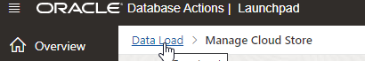
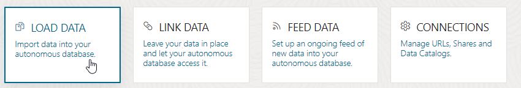
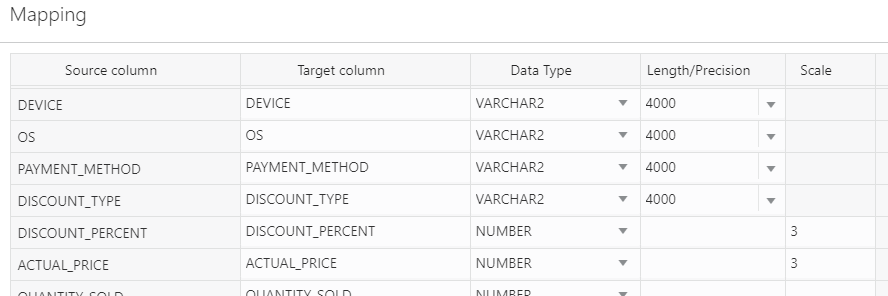
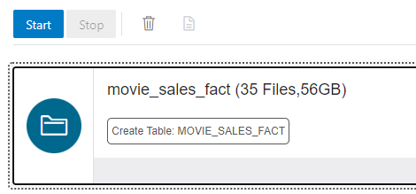

# Load Movie Sales Data

## Introduction

To help us do some financial analysis, the IT Team at MovieStream has created a data extract for us from the MovieStream operational systems. The quarter-end closing process takes a few days, so some of our data contains an early snapshot of our company's financial trading data. We can expect a second set of files a bit later, which will contain the final updates that reflect the closed-status of the accounts.

Estimated Lab Time: 25 minutes

### Objectives

In this lab, you will use the Autonomous Data Warehouse's built-in Data Load tool to load in a set of files.

### Prerequisites

This lab assumes you have:

- Created the Autonomous Data Warehouse database in the previous lab.

## Overview Of The Data Loading Process

Autonomous Data Warehouse provides different ways to load data depending on your needs, including built-in tools to help you load data files, and a scripting-based approach that gives you more control. In this lab, we will learn how to populate a new data warehouse using the built-in Data Load tool. Later in this workshop, we will use the same tool to load a set of data files containing just updates and corrections. In many cases with this type of sales analysis, you will get an initial file to load containing a "draft" view or soft-close view of the latest sales data. A "final", verified, sales data set is often then published later in the month after all the sales transactions have been processed and correctly booked. This is the scenario we are using in this workshop.

### What About Data Quality In Your Autonomous Data Warehouse?

In the real world, it is highly likely that our data files will be imperfect - that is, they will contain formatting errors, have duplicate records, and so on. Therefore, in the next lab we will review how Autonomous Data Warehouse can enforce business rules to ensure our data warehouse only contains structurally correct and valid data. In this lab, we are going to assume that our data loading files are perfectly formatted and only contain valid records. 

### Where Are My Data Files Stored?

Oracle Autonomous Data Warehouse makes it easy to load data files from many different locations: your local computer, other databases, and object stores such as Oracle OCI Object Storage, Amazon S3, Microsoft Azure Blob Storage and many others.

### What is Oracle Cloud Infrastructure (OCI) Object Storage?

The OCI Object Storage service is an internet-scale, high-performance storage platform that offers reliable and cost-efficient data durability. The Object Storage service can store an unlimited amount of unstructured data of any content type, including analytic data and rich content, like images and videos. For more information, [see the documentation here](https://docs.oracle.com/en-us/iaas/Content/Object/Concepts/objectstorageoverview.htm).

A wide range of file formats are supported including comma-separated, tab delimited, AVRO, parquet, and more. For this data loading scenario, we will access data files that have been stored in a  **public bucket**  in Oracle Cloud Infrastructure Object Storage.

**Note:**  All timings for data loading in this workshop assume an ADW instance is co-located in the same data center or close to one of the regional data centers containing the public buckets. If this is not the case then your timings for specific steps may vary.

## Task 1: Link to OCI Object Storage

In this step, we will add a link from the Autonomous Data Warehouse to the public bucket on OCI Object Storage so that it can load data from this location.

1. From your Autonomous Database Details page, click the **Database Actions** button:

    

2. On the login screen, enter the username **ADMIN**, and the admin password you set up when provisioning the ADW instance. Click **Sign in**.

3. In the **Data Studio** section of the Database Actions page, click the **Data Load** card:

    

4. Under **Administration**, click the **Cloud Locations** card:

    

5. Click the **+ Add Cloud Store Location** button.

6. Enter the **Name** of the cloud storage location as **MovieData**.

7. As the files we are loading from are in a public bucket, select **Public Bucket**.

8. Under **Bucket URI**, copy and paste the closest regional location **Regional URI String** to where your Autonomous Data Warehouse is running from the options below, so that the database can load data from the files as quickly as possible.

	*For example, if your ADW is located in our UK-London data center then you would select the first regional URI string for "Europe, Middle East, Africa" which is for a public bucket located in the London data center: 'https://objectstorage.uk-london-1.oraclecloud.com/n/dwcsprod/b/moviestream_tools_live_lab_20211112/o/'*

 
<table class="wrapped relative-table confluenceTable" style="width: 100.0%;">
	<colgroup>
		<col style="width: 12.019421%;"/>
        <col style="width: 12.019421%;"/>
		<col style="width: 45.07344%;"/>
	</colgroup>
	<tbody>
		<tr>
			<th colspan="1" class="confluenceTh">Geographical Region</th>
            <th colspan="1" class="confluenceTh">Location</th>
			<th colspan="1" class="confluenceTh">Regional URI String</th>
		</tr>
		<tr>
			<td colspan="1" class="confluenceTd">Europe, Middle East, Africa</td>
            <td colspan="1" class="confluenceTd">London</td>
			<td class="confluenceTd">https://objectstorage.uk-london-1.oraclecloud.com/n/dwcsprod/b/moviestream_tools_live_lab_20211112/o/ 
            </td>
		</tr>
		<tr>
			<td colspan="1" class="confluenceTd"></td>
            <td colspan="1" class="confluenceTd">Frankfurt</td>
			<td class="confluenceTd">https://objectstorage.eu-frankfurt-1.oraclecloud.com/n/dwcsprod/b/moviestream_tools_live_lab_20211112/o/ 
            </td>
		</tr>
				<tr>
			<td colspan="1" class="confluenceTd">Americas</td>
            <td colspan="1" class="confluenceTd">Phoenix</td>
			<td colspan="1" class="confluenceTd">https://objectstorage.us-phoenix-1.oraclecloud.com/n/dwcsprod/b/moviestream_tools_live_lab_20211112/o/ 
            </td>
		</tr>
		<tr>
			<td colspan="1" class="confluenceTd"></td>
            <td colspan="1" class="confluenceTd">San Jose</td>
			<td colspan="1" class="confluenceTd">https://objectstorage.us-sanjose-1.oraclecloud.com/n/dwcsprod/b/moviestream_tools_live_lab_20211112/o/ 
            </td>
		</tr>
		<tr>
			<td colspan="1" class="confluenceTd"></td>
            <td colspan="1" class="confluenceTd">Ashburn</td>
			<td colspan="1" class="confluenceTd">https://objectstorage.us-ashburn-1.oraclecloud.com/n/dwcsprod/b/moviestream_tools_live_lab_20211112/o/ 
            </td>
		</tr>
		<tr>
			<td colspan="1" class="confluenceTd">Japan</td>
            <td colspan="1" class="confluenceTd">Tokyo</td>
			<td colspan="1" class="confluenceTd">https://objectstorage.ap-tokyo-1.oraclecloud.com/n/dwcsprod/b/moviestream_tools_live_lab_20211112/o/ 
			</td>
		</tr>
		<tr>
			<td colspan="1" class="confluenceTd">Asia &amp; Oceania</td>
            <td colspan="1" class="confluenceTd">Mumbai</td>
			<td colspan="1" class="confluenceTd">https://objectstorage.ap-mumbai-1.oraclecloud.com/n/dwcsprod/b/moviestream_tools_live_lab_20211112/o/ 
			</td>
		</tr>
	</tbody>
</table>
 

9. The final screen should look like this, noting that the URL will vary depending on your region:

    

10. Click the **Next** button to ensure the details are valid. The Cloud Data section shows the folders in the bucket. Then click **Create**.

## Task 2: Load Sales Data

### Background

All the MovieStream data files for this workshop are stored in a public bucket in OCI Object Storage. For this initial data load into our new data warehouse, we will use the Data Load tool to import sales data for 2018 to 2020. There are 35 separate data files for the sales data stored in the public bucket. We can either load each file individually, or we can bulk load all the files in one step. In this case, we will load the data from all the files into a new table in a single step.

1. Click **Data Load** from the breadcrumb link, or use the menu on the left and select **Data Load** then **Home**:

    

2. The Data Load tool allows us to load data from various locations, including local files, linked databases, or cloud storage locations. We can also choose to load data, link to data in cloud locations, or feed data in from such locations on a recurring basis. In this case, we want to load data from our newly created cloud storage link, so select **LOAD DATA** and **CLOUD STORAGE**, then click **Next**:

    

3. The left hand side of the screen shows our **MOVIEDATA** cloud location, and a list of folders containing files for loading. Expand the **movie\_sales\_fact** folder to show a list of csv files. We can see that there is a file for each month of sales data.

4. As we want to load all the files into a single table, rather than selecting any one file, we want to drag the whole **movie\_sales\_fact** folder to the right hand pane. This then shows a prompt to confirm that we want to load all 35 objects to a single target table. Click **Yes**.

5. After a few seconds, we now have a card in the right hand pane, representing a single data loading task that we can run. Click the menu icon and click **Settings** to review and check the configuration.

6. The settings show us that the column names for our new table have been derived from a header row in the CSV files. We can change the settings to suit our needs. We need to specify the way in which some of the table columns store numeric values, as this will be important to our calculations later on. Scroll down the list of columns in the **Mapping** section and find the **LIST\_PRICE** column. Specify its **Scale** setting as 2, to store numbers with 2 decimal places. Then, change the **Scale** setting to 3 for the columns **ACTUAL\_PRICE** and **DISCOUNT\_PERCENT**:

    

7. Click the **Close** button to close the settings. Now, we can run the load task by clicking the **Start** button. Confirm by clicking **Run** in the pop-up dialog.

    

	If your autonomous database is running with 8 OCPUs, and the object storage files are located in the same region as your autonomous database, the data load task should take between 4 to 7 minutes. The time taken will vary depending on how many OCPUs there are, and how close the data is.

	Note that you can scale your autonomous database up and down to use more or fewer OCPUs from the console page on Oracle Cloud Infrastructure.

8. Once the data load task is complete, a green tick icon appears next to it, and the row count shows 97890562 loaded rows, with no errors. Click the name of the directory ("movie_sales_fact/ (56GB)"), and then click **Table** on the left hand side to show a preview of the data loaded in the table. 

This means we have now successfully loaded the initial movie sales data.

## Next Steps

- Experiment with using the Data Load tool with your own data.

- Review the [Oracle Autonomous Database documentation for the Data Load tool](https://docs.oracle.com/en/cloud/paas/autonomous-database/adbsa/load-data-database-actions.html#GUID-432CC3EE-0714-426D-9C93-B964FA795048)

## Want to Learn More?

[Click here](https://docs.oracle.com/en/cloud/paas/autonomous-database/adbsa/load-data.html#GUID-1351807C-E3F7-4C6D-AF83-2AEEADE2F83E) for more information about the different options for loading data into an Autonomous Database. 

Please *proceed to the next lab*.

## **Acknowledgements**

* **Authors** - Keith Laker and Mike Matthews, ADB Product Management
* **Adapted for Cloud by** - Richard Green, Principal Developer, Database User Assistance
* **Last Updated By/Date** - Mike Matthews, March 2023
