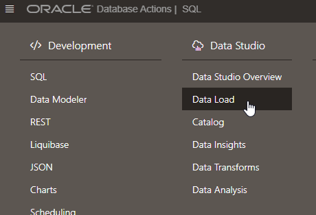
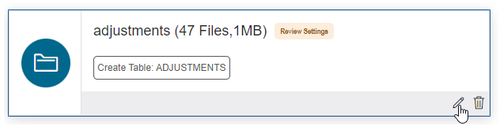
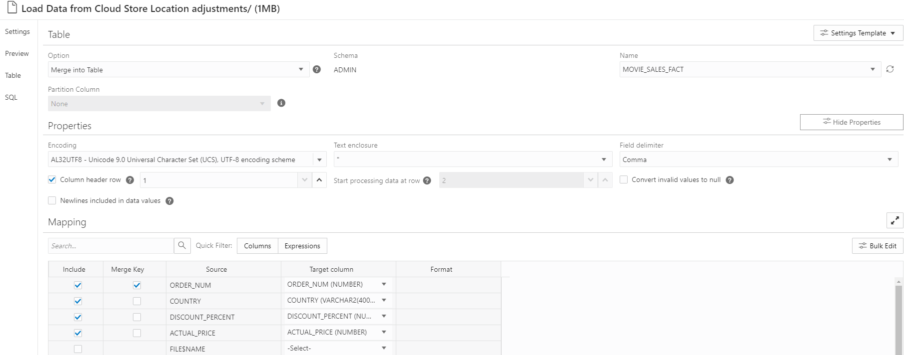
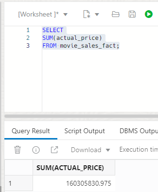

# Update the Sales Data

## Introduction

Autonomous Database automatically manages the data storage process for you, so there are no settings to monitor or tweak. You simply load your data, update your data and let Autonomous Database efficiently manage how that data is stored. In this lab you will update the movie sales data using the Data Load tool to merge in a number of adjustment files.

Estimated Lab Time: 15 minutes

### Objectives

In this lab, you will:

*   Determine how much space the movie sales table is consuming.
*   Update the movie sales data using Data Studio to merge in data from adjustment files.
*   Confirm the very small increase in space usage after updating the data.

### Prerequisites

This lab assumes you have:

- Added a data integrity constraint in the previous lab.

## Overview 
MovieStream is a global business with finance departments distributed around the world. Each of these periodically generates a number of financial adjustments for customers in their respective countries. In practice, these will come in at various times and will need to be processed one-by-one. In this section we are going to process all the regional adjustment files at once, but it is important to bear in mind that each would usually be processed immediately on arrival (and therefore individually) so that we can always get the most up-to-date information from our warehouse. Below we will run the update process by merging in the adjustment files for all the countries into our fact table.


## Task 1: Find out the space usage of the Movie Sales data

1. To find out how much space our movie sales table (movie\_sales\_fact) is consuming, we can run the following query in our SQL worksheet:

    ```
    <copy>
    SELECT
    segment_name,
    SUM(bytes)/1024/1024/1024 AS gb
    FROM user_segments
    WHERE segment_type='TABLE'
    AND segment_name = 'MOVIE_SALES_FACT'
    GROUP BY segment_name;
    </copy>
    ```

2. This will return something similar to the results shown below: 8.23 GB.

    


## Task 2: Merge in the adjustments from files

In this task, we will merge in all the country-specific adjustment files into our fact table.

1. Open the menu in the top left of the screen, and click **Data Load** in the **Data Studio** section.

    

2. As in the lab where you loaded the data, select **LOAD DATA** and **Cloud Store**.

3. From the **MOVIEDATA** bucket, drag the **adjustments** folder into the right-hand pane and click **Yes** to load all 47 objects into a single target table.

4. Click the pencil icon for the load task, and select **Settings**:

    

5. In this case, we do not want to create a new table, but to merge all these adjustments into our current fact table. Change the Option from **Create Table** to **Merge into Table**. Then, under **Name**, select the **MOVIE\_SALES\_FACT** table.

6. In the **Mapping** section, make sure the **Merge Key** box for the column **ORDER\_NUM** is ticked, as this column will be the key column for the merge. This means that any records in the table with the same **ORDER\_NUM** value as one of the records in the adjustment file will be updated, and any adjustment file records with new **ORDER\_NUM** values will be added as new records in the table. The final settings should look like this:

    

Click the **Close** icon when you have the settings as above.

7. Click the **Start** button to start the data load job, and click **Run** in the dialog box.

The job should take between 3 to 4 minutes to run, and should merge in 48.7K adjustment rows. Note that the primary key that we created earlier helps the database quickly and efficiently to locate the records that need to be updated by each MERGE statement.

## Task 3: Verify the results

1. Click the menu in the top left of the screen, and click **SQL** in the **Development** section.

2. Let's run a simple query to validate that our financial adjustments file has been successfully processed. Copy and paste the following query into your SQL worksheet:

    ```
    <copy>
	SELECT
    SUM(actual_price)
    FROM movie_sales_fact;
	</copy>
    ```

4. This shows that our revenue has gone down a little, since we are now reporting a figure of $160,305,830.975 (vs. the previous value of $160,365,556.83):

    

	It looks like the data has been successfully adjusted.

5. Now, let's re-check the space usage of the MOVIE\_SALES\_FACT table by re-running the space calculation query:

    ```
    <copy>
	SELECT
    segment_name,
    SUM(bytes)/1024/1024/1024 AS gb
    FROM user_segments
    WHERE segment_type='TABLE'
    AND segment_name='MOVIE_SALES_FACT'
    GROUP BY segment_name;
	</copy>
    ```

6. This will return something similar to the results shown below: 8.29 GB. This is a very, very slight increase in space usage! The previous value was 8.23 GB.

    


## Summary

Why is the lab important? This is a real-world scenario for the majority of data warehouse projects. Your data warehouse platform needs to manage updates to your data efficiently and without using excess storage. The Oracle Database is built around a storage model that was designed from the start to efficiently manage data updates since these are normally a must-have requirement for data management projects.

Oracle Autonomous Database automatically manages the data storage process for you so there are no settings to monitor or tweak. You simply load your data, update your data, and let Autonomous Database efficiently manage how that data is stored.

## Next Steps

- Experiment with using Data Studio with your own data.

- Look at the new [LiveLabs workshop for the Database Actions data loading tools which are built into Autonomous Database](https://livelabs.oracle.com/pls/apex/dbpm/r/livelabs/view-workshop?wid=789)

## Want to Learn More?

- [Click here](https://docs.oracle.com/en/cloud/paas/autonomous-database/adbsa/load-data.html#GUID-1351807C-E3F7-4C6D-AF83-2AEEADE2F83E) for more information about how to load data into Autonomous Database. 

## **Acknowledgements**

* **Authors** - Keith Laker and Mike Matthews, ADB Product Management
* **Adapted for Cloud by** - Richard Green, Principal Developer, Database User Assistance
* **Last Updated By/Date** - Mike Matthews, May 2024
