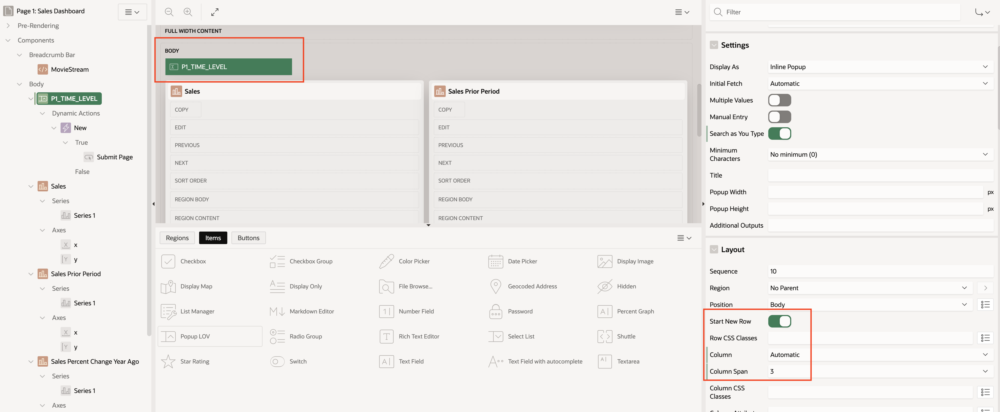
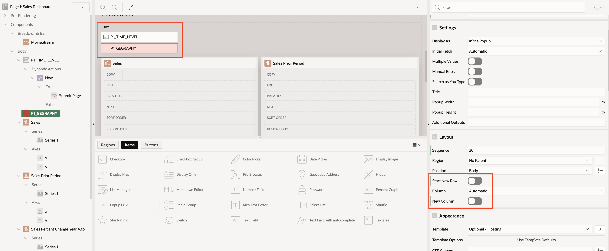
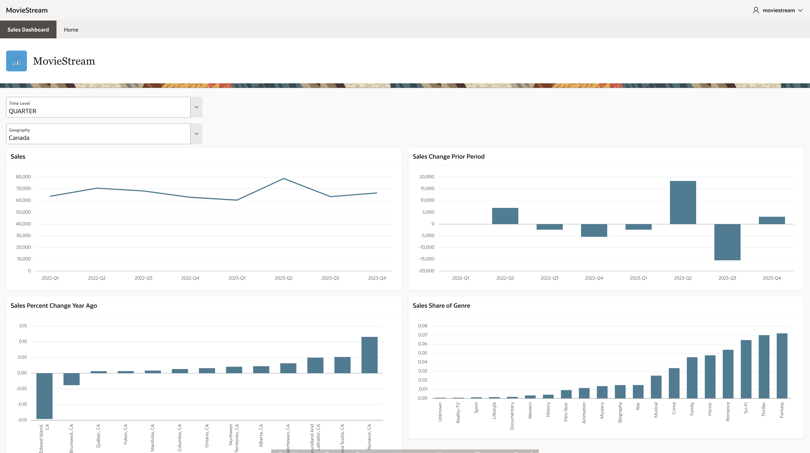

# Add Data Selectors to the Sales Dashboard

## Introduction

In this lab, you will add data selectors to the Sales Dashboard and update the queries to use the selections.

Estimated Time:  20 minutes.

### Objectives

In this lab, you will learn how to:

- Create select lists using queries select from the data dictionary and hierarchies.
- Implement user selections with queries selecting from the analytic view.

### Prerequisites:

- Complete the previous lab.

## Task 1 - Add Time Level Selector

The Sales and Sales Change Year Ago charts use static selections, selecting Month level data.  

In this task, you will add a Popup LOV that allows the user to select time periods by choosing the values of the analytic view's TIME hierarchy.

1. Add a **Popup LOV** item to the page as shown in the illustration below.
1. **Name** the item **P1\_TIME\_LEVEL**.
1. The **Label** should default to **Time Level**.
1. In the **Layout** section, set **Column Span** to **3**.

5.  In **List of Values** choose **SQL Query**.
5.  Replace the **SQL Query** with the following query. Note that this query selects from a data dictionary view.  All analytic view metadata is available in data dictionary views.  This view will return the levels of the TIME hierarchy.

~~~SQL
<copy>
SELECT
    level_name as d,
    level_name as r
FROM
    user_hier_levels
WHERE
    hier_name = 'TIME'
ORDER BY
    order_num;
</copy>
~~~

7. In the **Settings** section set **Display Extra Values** to **off**.
7. Set **Display Null Value** to **off**.
7. In the **Default** section set:
- **Type**:  **Static**
- **Static Value**:
~~~SQL
<copy>
MONTH
</copy>
~~~

A dynamic action will submit and refresh the page.

1. Select the **P1\_TIME\_LEVEL** item.
1. Create a dynamic action.
1. Accept **Change** as the default event.
1. Set the **True** action to **Submit Page**

Feel free to run the page and test the Time Level selector. It's not hooked up to the query, so it will not yet affect the charts.

## Task 2 - Add a Geography Member Selector

In this task, you will add a Popup LOV that allows the user to choose a Geography hierarchy member. 

1. Add a **Popup LOV** item to the page as shown in the illustration below.
1. **Name** the item **P1_GEOGRAPHY**.
1. The **Label** should default to **Geography**.
1. If the **P1_GEOGRAPHY** is correctly positioned, **Start New Row** and **New Column** will be **off** in the **Settings** section. If not, try to reposition it but do not worry it is not perfect.

5. In the **List of Values** section, choose **Type:  SQL Query**.
5. Enter the following **SQL Query**.

~~~
<copy>
SELECT
    member_name        d
  , member_unique_name r
FROM
    geography
WHERE
    level_name IN ('ALL', 'CONTINENT', 'COUNTRY' )
ORDER BY
    hier_order;
</copy>
~~~

The query selects the hierarchy member-friendly name (MEMBER\_NAME) and primary key value (MEMBER\_UNIQUE\_NAME) at the  ALL, CONTINENT, and COUNTRY levels. This query can be used with any hierarchy.

7. In the **Settings** section set **Display Extra Values** to **off**.
7. Set **Display Null Value** to **off**.
7. In the **Default** section set:
- **Type**:  **Static**
- **Static Value**:
~~~
<copy>
[ALL].[ALL]
</copy>
~~~
Note: **[ALL].[ALL]** is the key value (MEMBER\_UNIQUE\_NAME) of the grand total hierarchy member.

A dynamic action will submit and refresh the page.

1. Select the **P1\_GEOGRAPHY\_MEMBER** item.
1. Create a dynamic action.
1. Accept **Change** as the default event.
1. Set the True action to **Submit Page**

Feel free to run the page and test the Geography selector. It's not hooked up to the query, so it will not yet affect the charts.

## Task 3 - Update the Sales Chart Query

Update the query used by the Sales chart to use the Time Level and Geography selectors.  The query will select time periods at the chosen level and the chosen Geography value. Note that this query follows the familiar SELECT ... FROM ... WHERE pattern.  Joins and GROUP BY are replaced by the HIERARCHIES clause.

1.  Replace the SQL Query used by the Sales chart with the following query:

~~~SQL
<copy>
SELECT
    time.member_name AS time
  , sales
FROM
  analytic view (
    USING movie_sales_av
      HIERARCHIES (
        time
        , geography
    )
  )
WHERE
    time.level_name = NVL(:P1_TIME_LEVEL,'MONTH')
    AND geography.member_unique_name = NVL(:P1_GEOGRAPHY,'[ALL].[ALL]')
ORDER BY
    time.hier_order;
</copy>
~~~

Feel free to run the page and test the chart.  The selectors will now be active for this chart.

## Task 4 - Update the Sales Change Prior Period Chart Query

The query to the Sales Change Prior Period chart will also use the Time Level and Geography selections.  Note that this query following the same pattern as the previous pattern, but uses the USING form of FROM and ADD MEASURES.

1.  Replace the SQL Query used by the Sales Change Prior Period chart with the following query:

~~~SQL
<copy>
SELECT
    time.member_name  AS time
  , sales_change_prior_period
FROM
  analytic view (
    USING movie_sales_av
      HIERARCHIES (
        time
        , geography
    )
    ADD MEASURES (
      sales_change_prior_period AS (LAG_DIFF(sales) OVER (HIERARCHY time OFFSET 1 WITHIN LEVEL))
    )
  )
WHERE
    time.level_name = NVL(:P1_TIME_LEVEL,'MONTH')
    AND geography.member_unique_name = NVL(:P1_GEOGRAPHY,'[ALL].[ALL]')
ORDER BY
    time.hier_order;
</copy>
~~~

Feel free to run the page and test the chart.  The selectors will now be active for this chart.

## Task 5 - Update the Sales Percent Change Year Ago Chart Query

The query to the Sales Percent Change Year Ago chart will use the Geography selection to select the children of the selected value.   Again, the same query pattern is used.  The filter uses the PARENT\_UNIQUE\_NAME column which will result in the query returning the children of the parent hierarchy member.

1.  Replace the SQL Query used by the Update the Sales Percent Change Year Ago chart with the following query:

~~~SQL
<copy>
SELECT
  time.member_name AS time
  , geography.member_name  AS geography
  , sales_pct_change_year_ago
FROM
  analytic view (
    USING movie_sales_av
      HIERARCHIES (
        time
        , geography
    )
    ADD MEASURES (
      sales_pct_change_year_ago AS (LAG_DIFF_PERCENT(sales) OVER (HIERARCHY time OFFSET 1 ACROSS ANCESTOR AT LEVEL YEAR))
    )
  )
WHERE
    geography.parent_unique_name = NVL(:P1_GEOGRAPHY,'[ALL].[ALL]')
    AND time.level_name = 'YEAR'
    AND time.year = '2023'
ORDER BY
    sales_pct_change_year_ago;
</copy>
~~~

Feel free to run the page and test the chart.  The Geography selector will now be active for this chart.

## Task 6 - Update the Sales Share of Genre Query

The query to the Sales Share of Genre chart will also use the Geography selection.  The geography value is used to select the children of the selected geography.  This query includes a SHARE calculation. SHARE calculations return the ration of the current member to another member, in this case the ALL member (that is, the grand total).

1.  Replace the SQL Query used by the Sales Share of Genre chart with the following query:

~~~SQL
<copy>
SELECT
  search_genre.member_name  AS genre
  , sales_share_genre
FROM
  analytic view (
    USING movie_sales_av
      HIERARCHIES (
          time
        , geography
        , search_genre
    )
    ADD MEASURES (
      -- The ratio of sales of the current genre to total sales
      sales_share_genre AS (SHARE_OF(sales HIERARCHY search_genre MEMBER ALL))
    )
  )
WHERE
    time.level_name = 'YEAR'
    AND time.year = '2023'
    AND search_genre.level_name = 'SEARCH_GENRE'
    AND geography.member_unique_name = NVL(:P1_GEOGRAPHY,'[ALL].[ALL]')
ORDER BY sales_share_genre;
</copy>
~~~

**Run the page and test the chart.**  The Geography selector will now be active for this chart.

## Notes About the Queries

The charts now allow interactive selections of the time periods.  If the queries select from tables, all the column names used in the query would need to change.  With the analytic view queries, the only thing that changed was the value of the level filter.  The reuse of the query template simplifies SQL generation in APEX applications.

The completed Sales Dashboard will look like this.

## Summary

In this lab, your updated charts allow users to change time periods and geographies.  In upgrading the charts, you should have observed that only minor changes to the query templates were required.

This Live Lab introduced you to creating an APEX application using an analytic view.  The analytic view simplifies SQL generation in APEX application by providing a a foundation that replaces complex collections of tables with single view that eliminates the need for joins, aggregation (GROUP BY), returns rows at detail and aggregate values using a consistent set of columns, includes helpful hierarchical attributes, and provides unique calculation expressions. 

Each analytic view includes the same set of hierarchical attribute columns, making it easy to transfer knowledge and code from one application and analytic view to the next. Most SQL generation can be accomplished using simple, reusable query templates.

You may now **proceed to the next lab**.

## Acknowledgements

- Created By/Date - William (Bud) Endress, Product Manager, Autonomous AI Database, June 2023
- Last Updated By - William (Bud) Endress, May 2024

Data about movies in this workshop were sourced from **Wikipedia**.

Copyright (C)  Oracle Corporation.

Permission is granted to copy, distribute and/or modify this document
under the terms of the GNU Free Documentation License, Version 1.3
or any later version published by the Free Software Foundation;
with no Invariant Sections, no Front-Cover Texts, and no Back-Cover Texts.
A copy of the license is included in the section entitled [GNU Free Documentation License](files/gnu-free-documentation-license.txt)