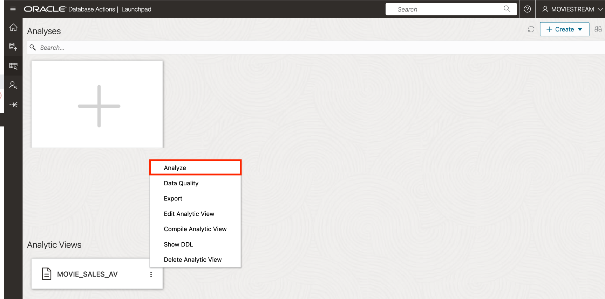
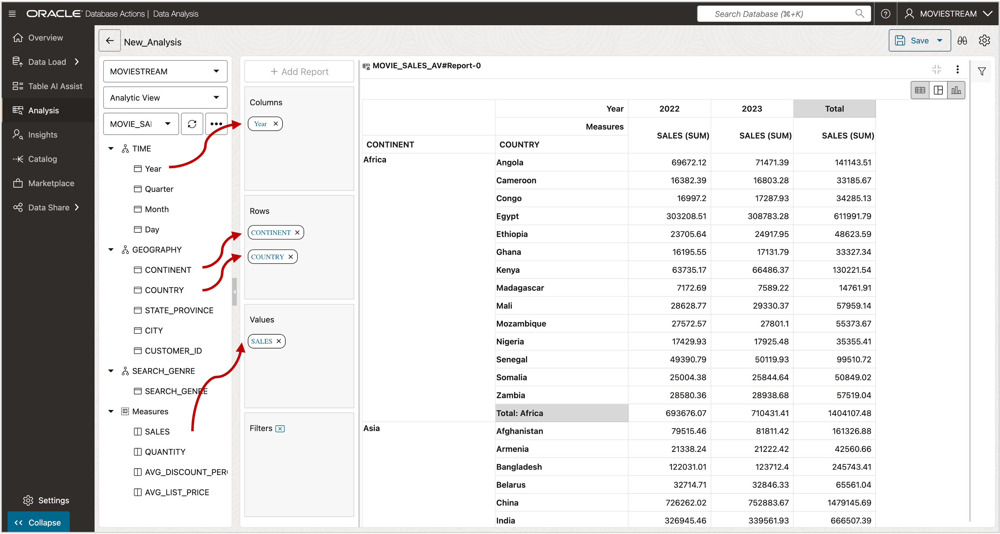
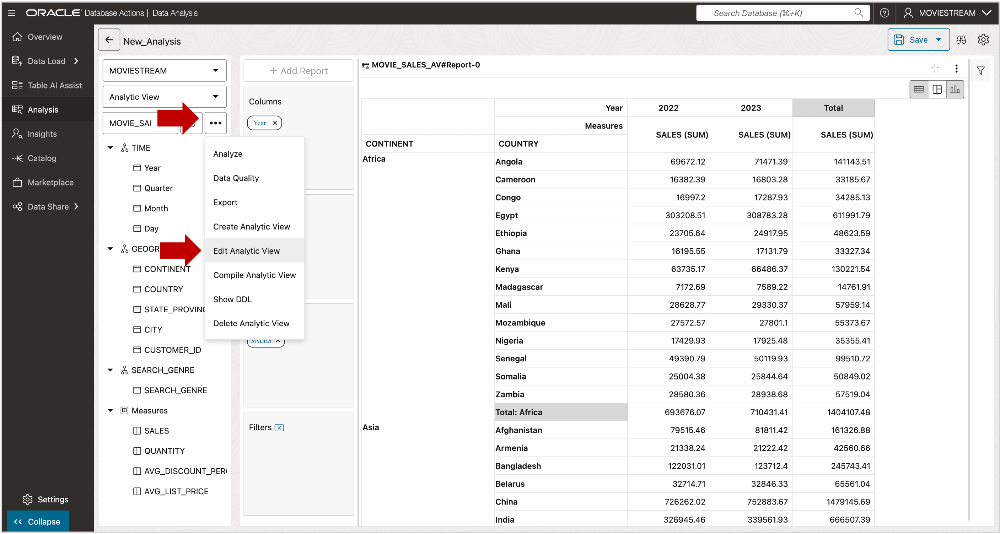
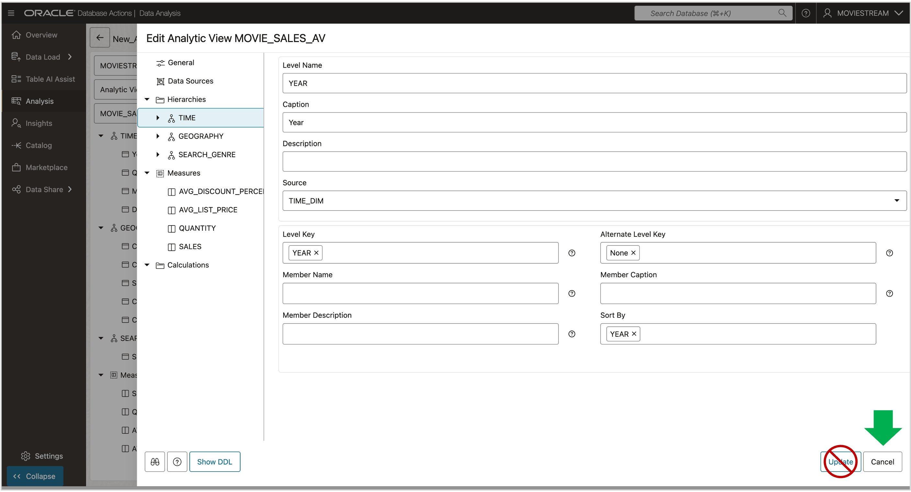

# Create an Analytic View

## Introduction

This lab uses three hierarchy views and an analytic view that reference the tables created in the previous lab.  You will create these objects using a script.

This analytic view could be created using the Database Actions Data Studio Analysis tool.  To learn how, see the [Get Started With Analytic Views using Data Studio](https://livelabs.oracle.com/pls/apex/dbpm/r/livelabs/view-workshop?wid=3594) Live Lab.

Estimated Time:  5 minutes.

### Objectives

In this lab, you will:

- Create attribute dimensions, hierarchies, and an analytic view.

### Prerequisites:

- Complete the previous lab.

## Task 1 - Create the Analytic View objects.

To create the analytic view objects used in this lab.

1.  Using SQL Worksheet, connect to the database using the  **MOVIESTREAM** (or other) user created in Lab 3.
2.  Run the following commands in SQL Worksheet.  They can be run all at once as a script or individually, as you prefer.

~~~SQL
<copy>

 CREATE OR REPLACE ATTRIBUTE DIMENSION time_ad
    USING time_dim ATTRIBUTES (
        year
        , quarter
        , month
        , day_id)
    LEVEL year
        CLASSIFICATION CAPTION VALUE 'Year'
        KEY (year)
        MEMBER NAME year
        MEMBER CAPTION year
        MEMBER DESCRIPTION year
    LEVEL quarter
        CLASSIFICATION CAPTION VALUE 'Quarter'
        KEY (quarter)
        MEMBER NAME quarter
        MEMBER CAPTION quarter
        MEMBER DESCRIPTION quarter
        DETERMINES (year)
    LEVEL month
        CLASSIFICATION CAPTION VALUE 'Month'
        KEY (month)
        MEMBER NAME month
        MEMBER CAPTION month
        MEMBER DESCRIPTION month
        DETERMINES (quarter)
    LEVEL day
        CLASSIFICATION CAPTION VALUE 'Day'
        KEY (day_id)
        MEMBER NAME TO_CHAR(day_id)
        MEMBER CAPTION TO_CHAR(day_id)
        MEMBER DESCRIPTION TO_CHAR(day_id)
        DETERMINES (month);

CREATE OR REPLACE HIERARCHY time
    USING time_ad (
        day      CHILD OF
        month    CHILD OF
        quarter  CHILD OF
        year);

CREATE OR REPLACE ATTRIBUTE DIMENSION geography_ad
    USING customer_dim
    ATTRIBUTES (
        continent
        , country
        , state_province
        , city
        , customer_id)
    LEVEL continent
        KEY (continent)
    LEVEL country
        KEY (country)
        DETERMINES (continent)
    LEVEL state_province
        KEY (state_province)
        DETERMINES (country)
    LEVEL city
        KEY (city)
        DETERMINES (state_province)
    LEVEL customer_id
        KEY (customer_id)
        DETERMINES (city);

CREATE OR REPLACE HIERARCHY geography
    USING geography_ad (
        customer_id    CHILD OF
        city           CHILD OF
        state_province CHILD OF
        country        CHILD OF
        continent);

CREATE OR REPLACE ATTRIBUTE DIMENSION search_genre_ad
    USING search_genre_dim
    ATTRIBUTES (
        genre_id
        , genre_name)
    LEVEL search_genre
        KEY genre_id
        MEMBER NAME genre_name
        DETERMINES (genre_name);

CREATE OR REPLACE HIERARCHY search_genre
    USING search_genre_ad (
        search_genre);

CREATE OR REPLACE ANALYTIC VIEW movie_sales_av
    USING movie_sales_fact
    DIMENSION BY (
        time_ad
            KEY (day_id) REFERENCES (day_id) SPARSE
            HIERARCHIES (TIME DEFAULT),
        geography_ad
            KEy (cust_id) REFERENCES (CUSTOMER_ID) sparse
            HIERARCHIES (GEOGRAPHY DEFAULT),
        search_genre_ad
            KEY (genre_id) REFERENCES (genre_id) SPARSE
            HIERARCHIES (SEARCH_GENRE DEFAULT))
  MEASURES (
    sales FACT (sales) AGGREGATE BY SUM
    , quantity FACT (quantity) AGGREGATE BY SUM
    , avg_discount_percent FACT (discount_percent) AGGREGATE BY AVG
    , avg_list_price FACT (list_price) AGGREGATE BY AVG)
    DEFAULT MEASURE sales;
</copy>
~~~

## Task 2 - View the Analytic View in Database Actions Analysis

You can view the analytic view in the Database Actions Analysis application.

1.  Return to the Database Actions Launchpad
1. Choose **DATA ANALYSIS** application in the **Data Studio** section.
1.  Using the vertical ellipsis (...)  choose Analyze.

The basic structure of the analytic view is displayed in the tree on the left side.  You will see three hierarchies, columns in the hierarchies, and four measures.  A report is displayed on the right side.

Feel free to experiment with the Analysis application for a few minutes.

You can also view the analytic view in the editor.

1.  Return to the Analysis application home screen.
1.  Using the virtual ellipsis (...)  choose Edit.

Feel free to explore the editor.

 When you are done exploring the editor:

1. Press the **Cancel** button to exit out. **Do not make changes to the analytic view or press the Update button.**

You may now **proceed to the next lab**

## Acknowledgements

- Created By/Date - William (Bud) Endress, Product Manager, Autonomous AI Database, June 2023
- Last Updated By - William (Bud) Endress, May 2024
 2023

Data about movies in this workshop were sourced from **Wikipedia**.

Copyright (C)  Oracle Corporation.

Permission is granted to copy, distribute and/or modify this document
under the terms of the GNU Free Documentation License, Version 1.3
or any later version published by the Free Software Foundation;
with no Invariant Sections, no Front-Cover Texts, and no Back-Cover Texts.
A copy of the license is included in the section entitled [GNU Free Documentation License](files/gnu-free-documentation-license.txt)