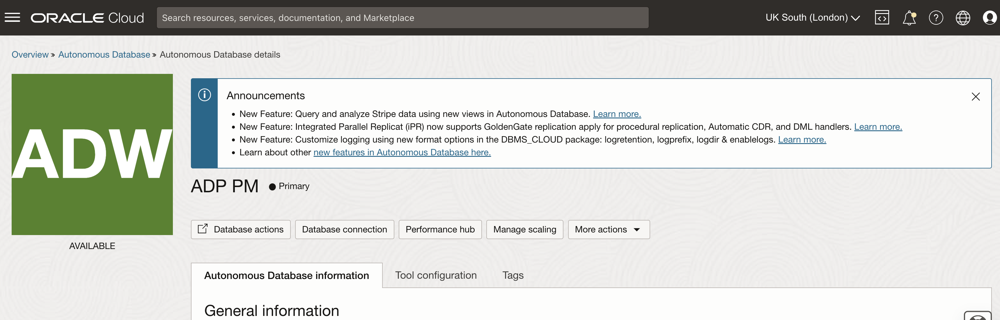
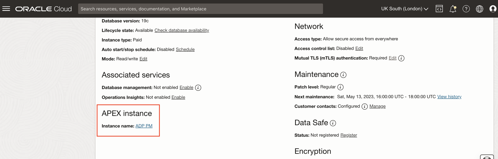
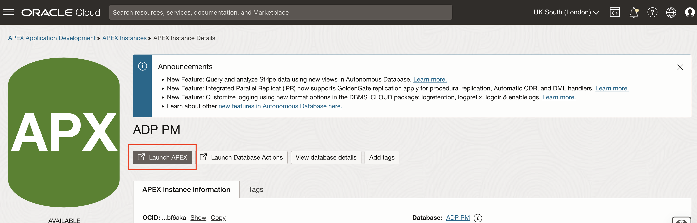
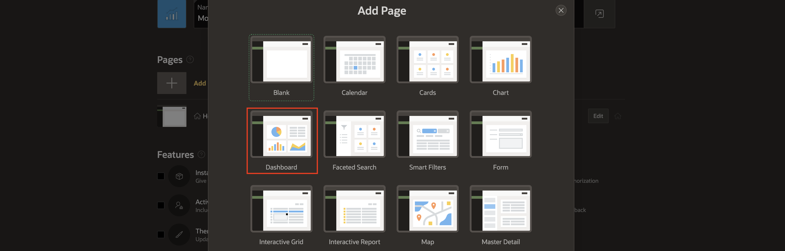
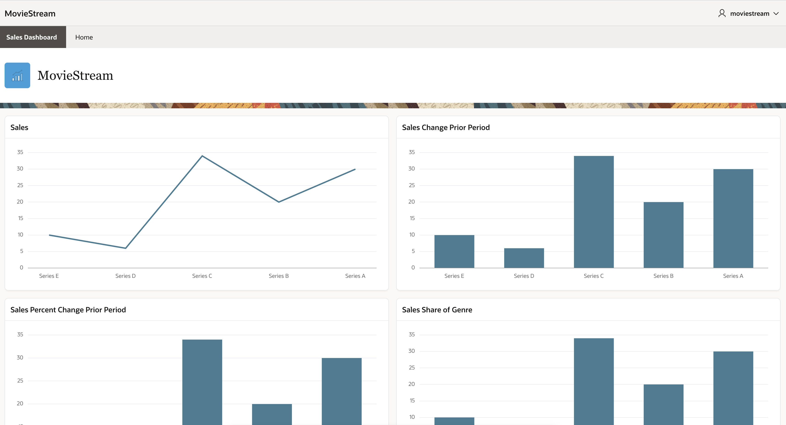

# Create a New Application

## Introduction

Now that you know the basics about querying hierarchies and analytic views, it is time to put that knowledge to work.  This lab guides you down the path of building an application that allows the user make their own data selections, choose measures, and apply transformations to those measures using analytic view expressions.

The application as shown in this lab will have a certain layout and appearance.  It is not important that your application look exactly like this sample application. As an APEX developer, you know that APEX makes it very easy to change the layout and appearance of an application.  What is important is that you learn how items and regions can use analytic views.

Estimated Time:  10 minutes.

### Objectives

In this lab, you will:

- Create a new APEX workspace
- Create new APEX application

### Prerequisites:

- Complete the previous lab.

### Task Outline

Depending on whether you using a Live Lab tenancy, your own tenancy, or even an on-premise instance, the exact steps required to create a new APEX application will vary.  This lab will provide the steps for an Oracle Live Lab tenancy.  

The task outline follows:

1. Login into the Autonomous Database console as the ADMIN user.
1. Access Database Actions
1. Access APEX WORKSPACES in the Administration section.
1. Create a new workspace
1. Log into the workspace as the MOVIESTREAM user.
1. Create a new APEX application.

##  Task 1 - Login to APEX

The Database Actions tools can be accessed directly using a URL or through the Autonomous Database console.

If you are running this lab in your tenancy and do not have access to the Autonomous Database console,  ask the administrator of the database to provide you with the URL.

1. If you have access to the Autonomous Database console, access it now..

2. Scroll down until you see APEX instance.  Click on the **Instance name** link.

3. Launch APEX.  It would be a good idea to bookmark this link.

3. Sign into the MovieStream workspace as the MovieStream user.  (The password was Welcome#1234 the script used to create the user earlier in this Workshop.)

You should now be at the APEX main page.

## Task 2 Create a New Application

In this task, you will create a new application.  Feel free to choose a different theme or menu type.

1. Choose **App Builder**.
1. Choose **Create** or **Create a New Application**.
1. Choose **New Application**
1. Choose **Add Page**.
1. Choose **Dashboard**.
1. Set up the dashboard as follows.
- Provide a **Page Name**, for example _Sales Dashboard_
- Choose **Advanced** and **Set as home page**
- Chart 1: **Name: Sales, Type:  Line**
- Chart 2: **Name: Sales Change Prior Period, Type: Bar**
- Chart 3: **Name: Sales Percent Change Year Ago, Type: Bar**
- Chart 4: **Name: Sales Share of Genre**

1. Press **Add Page**
1. Choose an Icon and press **Save Icon**.
1. Provide a **Name** for the application, for example _MovieStream_.
1. Choose an appearance. The example in this lab uses:
- **Redwood Light**
- **Top Menu**
12. Press **Save Changes**.
12. Press the **Create Application** button.
12. **Run Application**

Congratulations, you are now the proud owner of four generic graphs!

You may now **proceed to the next lab** and start making the graphs come to life!

## Acknowledgements

- Created By/Date - William (Bud) Endress, Product Manager, Autonomous Database, February 2023
- Last Updated By - William (Bud) Endress, February 2023

Data about movies in this workshop were sourced from **Wikipedia**.

Copyright (C)  Oracle Corporation.

Permission is granted to copy, distribute and/or modify this document
under the terms of the GNU Free Documentation License, Version 1.3
or any later version published by the Free Software Foundation;
with no Invariant Sections, no Front-Cover Texts, and no Back-Cover Texts.
A copy of the license is included in the section entitled [GNU Free Documentation License](files/gnu-free-documentation-license.txt)