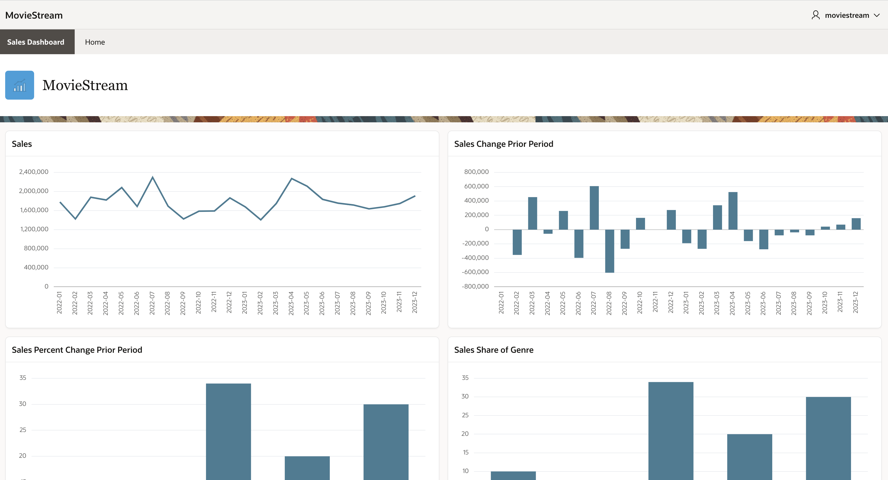
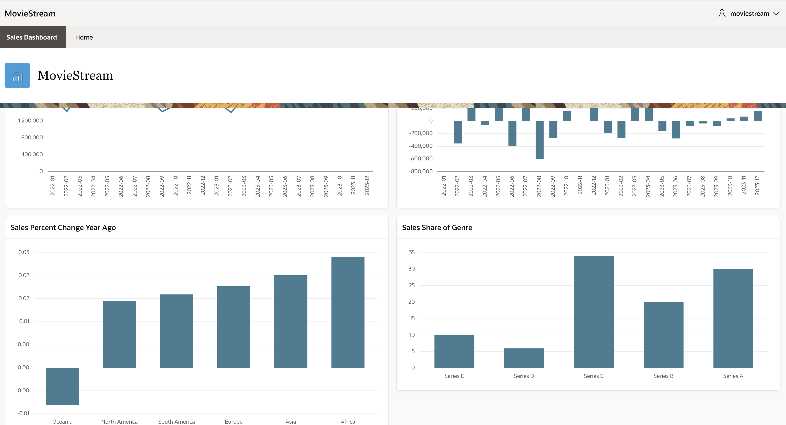

# Add Data to Graphs using the Analytic View 

## Introduction

Every APEX region needs a data source.  You will add queries that select from your analytic view as the data source for each chart.  You will configure your charts as:

- Sales by time.
- Sales change from prior period by time
- Sales percent change from same period one year ago by geography.
- Sales share of search genre.

You will start by creating static graphs. In the next lab you will add interactive data selections.

Estimated Time:  20 minutes.

### Objectives

In this lab, you will:

- Learn how simple query templates that select from the analytic view make it very easy to provide data sources to APEX regions.

### Prerequisites:

- Complete the previous lab.

### Task 1 - Provide a Data Source to the Sales Chart

In this task, you will add a SQL Query as the Source to the Sales by Time chart.

1. Select the **Sales Dashboard** page in the APEX App Builder.
1. Select the **Sales** chart.
1.  For the chart's **Source** choose:
- **Location:  Local Database**
- **Type:  SQL Query**
- Enter the following **SQL Query**.

This query selects sales at the Month level.

~~~SQL
<copy>
SELECT
    time.member_name AS time
  , sales
FROM
  analytic view (
    USING movie_sales_av
      HIERARCHIES (
        time
    )
  )
WHERE
    time.level_name = 'MONTH'
ORDER BY
    time.hier_order;
</copy>
~~~

Feel free to set any other attributes according to your preferences.

Next, map the series to the data source.

1. Select **Series 1** within this chart.
1. As the **Source** choose **Location:  Region Source**.
1.  Set Column Mappings
- Label: **TIME**
- Value: **SALES** 

To ensure that all time periods will be displayed:

1. In the **Performance** section set the **Maximum Rows to Process** to **1000**.

View the result:

1. **Run** the page.

### Task 2 - Provide a Data Source to the Sales Change Prior Period Chart

In this task, you will add a SQL Query as the Source to the Sales by Time chart.

1. Select the **Sales Dashboard** page in the APEX App Builder.
1. Select the **Sales Change Prior Period** chart.
1.  For the chart's **Source** choose:
- **Location:  Local Database**
- **Type:  SQL Query**
- Enter the following **SQL Query**.

This query selects sales change from the prior period at the Month level.  This query uses the USING form of the FROM clause and includes a calculated measure.

~~~SQL
<copy>
SELECT
    time.member_name  AS time
  , sales_chg_prior_period
FROM
  analytic view (
    USING movie_sales_av
      HIERARCHIES (
        time
    )
    ADD MEASURES (
      sales_chg_prior_period AS (LAG_DIFF(sales) OVER (HIERARCHY time OFFSET 1 WITHIN LEVEL))
    )
  )
WHERE
    time.level_name = 'MONTH'
ORDER BY
    time.hier_order;
</copy>
~~~

Feel free to set any other attributes according to your preferences.

Next, map the series to the data source.

1. Select **Series 1** within this chart.
1. As the **Source** choose **Location:  Region Source**.
1.  Set Column Mappings
- Label: **TIME**
- Value: **SALES_CHG_PRIOR_PERIOD** 

To ensure that all time periods will be displayed:

1. In the **Performance** section set the **Maximum Rows to Process** to **1000**.

View the result:

1. **Run** the page.

### Task 3 - Provide a Data Source to the Sales Percent Change Year Ago Chart

In this task, you will add a SQL Query as the Source to the Sales by Time chart.

1. Select the **Sales Dashboard** page in the APEX App Builder.
1. Select the **Sales Percent Change Year Ago** chart.
1.  For the chart's **Source** choose:
- **Location:  Local Database**
- **Type:  SQL Query**
- Enter the following **SQL Query**.

This query selects percent change in sales from the same period one year ago at the continent level.  This query uses the USING form of the FROM clause and includes a calculated measure.

~~~SQL
<copy>
SELECT
  time.member_name AS time
  , geography.member_name  AS geography
  , sales_pct_change_year_ago
FROM
  analytic view (
    USING movie_sales_av
      HIERARCHIES (
        time
        , geography
    )
    ADD MEASURES (
      sales_pct_chg_year_ago AS (LAG_DIFF(sales) OVER (HIERARCHY time OFFSET 1 ACROSS ANCESTOR AT LEVEL YEAR))
    )
  )
WHERE
    geography.level_name = 'CONTINENT'
    AND time.level_name = 'YEAR'
    AND time.year = '2023'
ORDER BY
    sales_pct_change_year_ago;
</copy>
~~~

Feel free to set any other attributes according to your preferences.

Next, map the series to the data source.

1. Select **Series 1** within this chart.
1. As the **Source** choose **Location:  Region Source**.
1.  Set Column Mappings.
- Label: **TIME**
- Value: **SALES\_PCT\_CHG\_YEAR\_AGO** 

To ensure that all time periods will be displayed:

1. In the **Performance** section set the **Maximum Rows to Process** to **1000**.

Format the y-axis.

1. In **Value** section, set:
- **Format** to **Decimal**.
- **Decimal Places** to **2*.

View the result:

1. **Run** the page.

### Task 4 - Provide a Data Source to the Sales Share of Genre Chart

In this task, you will add a SQL Query as the Source to the Sales Share of Genre chart. 

1. Select the **Sales Dashboard** page in the APEX App Builder.
1. Select the **Sales Share of GenrePercent Change Year Ago** chart.
1.  For the chart's **Source** choose:
- **Location:  Local Database**
- **Type:  SQL Query**
- Enter the following **SQL Query**.

Sales Share of Genre is the ratio of sales for the current genre to the sales of all genre.  This query selects sales share of genre for year 2023.

~~~SQL
<copy>
SELECT
  search_genre.member_name  AS genre
  , sales_share_genre
FROM
  analytic view (
    USING movie_sales_av
      HIERARCHIES (
          time
        , search_genre
    )
    ADD MEASURES (
      -- The ratio of sales of the current genre to total sales
      sales_share_genre AS (SHARE_OF(sales HIERARCHY search_genre MEMBER ALL))
    )
  )
WHERE
    time.level_name = 'YEAR'
    AND time.year = '2023'
    AND search_genre.level_name = 'SEARCH_GENRE'
ORDER BY sales_share_genre;
</copy>
~~~

Feel free to set any other attributes according to your preferences.

Next, map the series to the data source.

1. Select **Series 1** within this chart.
1. As the **Source** choose **Location:  Region Source**.
1.  Set Column Mappings
- Label: **GENRE**
- Value: **SALES\_SHARE\_GENRE** 

Format the y-axis.

1. In **Value** section, set:
- **Format** to **Decimal**.
- **Decimal Places** to **2*.

View the result:

1. **Run** the page.

## Summary

In this lab you created four charts and in interactive grid.  The query for each chart and the report selects from the analytic view using the same query template, with calculated measures added using the ADD MEASURES clause.

You may now **proceed to the next lab**.
## Acknowledgements

- Created By/Date - William (Bud) Endress, Product Manager, Autonomous Database, February 2023
- Last Updated By - William (Bud) Endress, February 2023

Data about movies in this workshop were sourced from **Wikipedia**.

Copyright (C)  Oracle Corporation.

Permission is granted to copy, distribute and/or modify this document
under the terms of the GNU Free Documentation License, Version 1.3
or any later version published by the Free Software Foundation;
with no Invariant Sections, no Front-Cover Texts, and no Back-Cover Texts.
A copy of the license is included in the section entitled [GNU Free Documentation License](files/gnu-free-documentation-license.txt)