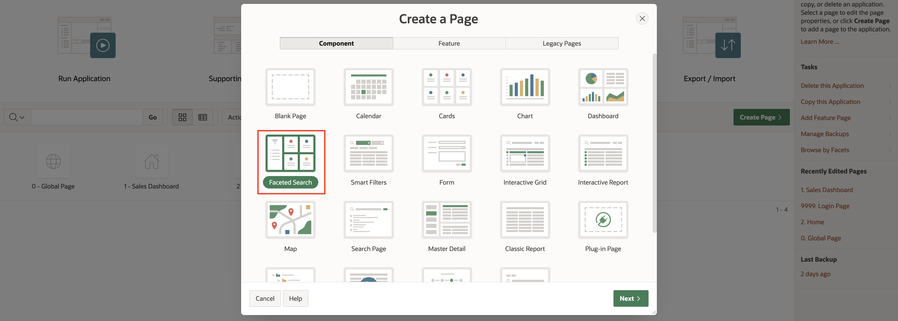
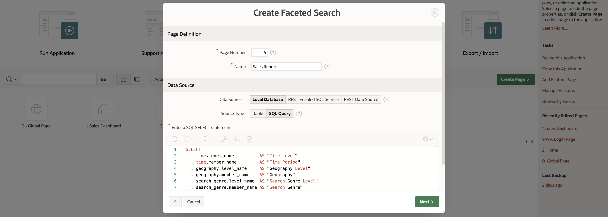
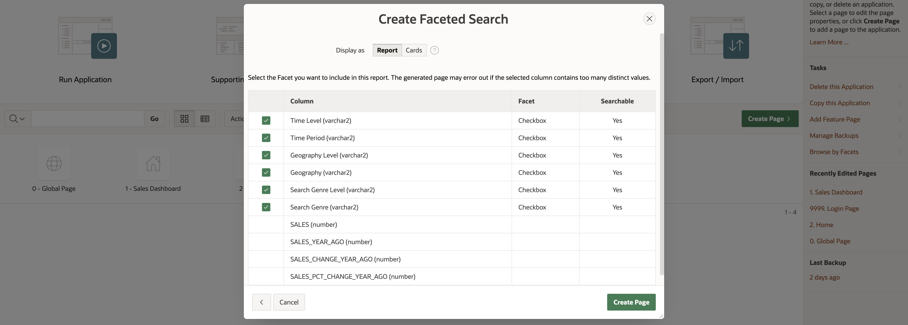
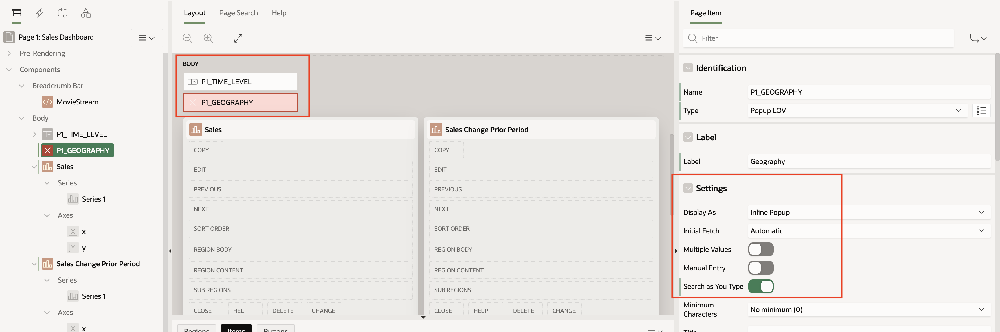

# Created a Faceted Search Report

## Introduction

An APEX Faceted Search page is a quick and easy way to create a report with data selectors.  An analytic view makes it particularly easy to create a Faceted Search that allows users to select from data at different levels of aggregation and included calculations.

The queries on the Sales Dashboard page defined calculation on-the-fly in queries. For the Faceted Search page, this lab will demonstrate using calculations that are defined in the analytic view.

Estimated Time:  15 minutes.

### Objectives

In this lab, you will learn how to:

- How to create a Faceted Search page using an analytic view.

### Prerequisites:

- This lab requires the completion of labs 2-4.  Completing all of the previous labs will help you get a better understand of how APEX can use analytic views, but they are not all required.

### Task 1 - Replace the Analytic View

The Faceted Search page will included three calculated measures:

- Sales year ago.
- Sales change from year ago.
- Sales percent change from year ago.

Sales percent change from year ago was included as an on-the-fly calculation on one fo the charts in the Sales Dashboard page.  The name of the embedded calculation is different from the on-the-fly calculation to avoid name conflicts.

1.  Using SQL Worksheet, run the following command to replace the analytic view.

~~~SQL
<COPY>
CREATE OR REPLACE ANALYTIC VIEW movie_sales_av
    USING movie_sales_fact
    DIMENSION BY (
        time_ad
            KEY (day_id) REFERENCES (day_id) SPARSE
            HIERARCHIES (TIME DEFAULT),
        geography_ad
            KEY (cust_id) REFERENCES (CUSTOMER_ID) sparse
            HIERARCHIES (GEOGRAPHY DEFAULT),
        search_genre_ad
            KEY (genre_id) REFERENCES (genre_id) SPARSE
            HIERARCHIES (SEARCH_GENRE DEFAULT))
  MEASURES (
    sales FACT (sales) AGGREGATE BY SUM
    , quantity FACT (quantity) AGGREGATE BY SUM
    , avg_discount_percent FACT (discount_percent) AGGREGATE BY AVG
    , avg_list_price FACT (list_price) AGGREGATE BY AVG
    -- Embedded Calculations
    , sales_year_ago AS (LAG(sales) OVER (HIERARCHY time OFFSET 1 ACROSS ANCESTOR AT LEVEL YEAR))
    , sales_change_year_ago AS (LAG_DIFF(sales) OVER (HIERARCHY time OFFSET 1 ACROSS ANCESTOR AT LEVEL YEAR))
    , sales_percent_change_year_ago AS (LAG_DIFF_PERCENT(sales) OVER (HIERARCHY time OFFSET 1 ACROSS ANCESTOR AT LEVEL YEAR))
     )
    DEFAULT MEASURE sales;
</COPY>
~~~

### Task 2 - Create a New Faceted Search Page

In this task you will create a new faceted search page.

1. Return to the main page for the MovieStream application in the APEX App Builder.
1. Choose Create Page.
1. Choose the Faceted Search Page.

4. **Name** the page **Sales Faceted Search**.
4. **Data Source:  Local Database**.
4. **Source Type:  SQL Query**.
4. Enter the following **SQL SELECT statement**:

~~~SQL
<COPY>
SELECT
    time.level_name          AS "Time Level"
  , time.member_name         AS "Time Period"
  , geography.level_name     AS "Geography Level"
  , geography.member_name    AS "Geography"
  , search_genre.level_name  AS "Search Genre Level"
  , search_genre.member_name AS "Search Genre"
  , sales AS "Sales"
  , sales_year_ago AS "Sales Year Ago"
  , sales_change_year_ago AS "Sales Change Year Ago"
  , sales_percent_change_year_ago AS "Sales Percent Change Year Ago"
FROM
  movie_sales_av
    HIERARCHIES (
      time
      , geography
      , search_genre);
</COPY>
~~~

The Create Faceted Search dialog will look like this.

8. Choose **Display as Report**.

The column roles should correctly default to the selections as shown in the following illustration.

9. Continue by pressing **Create Page**.
9. You will return to the Page Designer where you can **run the page**.

4. In the **Settings** section set **Display Extra Values** to **off**..
4. Set **Display Null Value** to **off**.
4. So that you can view the session state of this item,  **Store value encrypted in session state** to **off**.

### Task 3 - Add a Dynamic Action to the P2_TIME_LEVEL item.

A dynamic action will submit and refresh the page.

1. Create a dynamic action.
1. Accept **Change** as the default event.
1. Set the True action to **Submit Page**

Feel free to run the page and test the Time Level selector.

### Task 4 - Add a Geography Member Selector

In this task, you will add a Popup LOV that allows the user to choose a geography hierarchy member. 

1. Add a **Popup LOV** item to the page.
1. **Name** the item **P1_GEOGRAPHY**.
1. The **Label** should default to **Geography**.
1. In the **Layout** section choose:
- **Region:  No Parent**
- **Position:  Body**
- **Column Span: 3***
1. In the **Default** section set:
- **Type**:  **Static**
- **Static Value**:  **[ALL].[ALL]**

Note: **[ALL].[ALL]** is the key (MEMBER_UNIQUE_NAME) of the grant total hierarchy member.

The query selects the hierarchy member friendly name (MEMBER\_NAME) and primary key value (MEMBER\_UNIQUE\_NAME) at the  ALL, CONTINENT, and COUNTRY levels.

4.  Enter the following **SQL Query**.

~~~SQL
<copy>
SELECT
    member_name        display_value
  , member_unique_name return_value
FROM
    geography
WHERE
    level_name IN ('ALL', 'CONTINENT', 'COUNTRY' )
ORDER BY
    hier_order;
</copy>
~~~

5. In the **Settings** section set **Display Extra Values** to **off**..
5. Set **Display Null Value** to **off**.
5. So that you can view the session state of this item, **Store value encrypted in session state** to **off**.

Feel free to run the page and test the Geography selector.

### Task 5 - Add a Dynamic Action to the P3_GEOGRAPHY_MEMBER item.

A dynamic action will submit and refresh the page.

1.  Create a dynamic action.
1. Accept **Change** as the default event.
1.  Set the True action to **Submit Page**

## Task 6 - Update the Sales Chart Query

Update the query used by the Sales chart to use the Time Level and Geography selectors. The query will select time periods at the selected level and geography to the selected geography member.

1.  Replace the SQL Query used by the Sales chart with the following query:

~~~SQL
<copy>
SELECT
    time.member_name AS time
  , sales
FROM
  analytic view (
    USING movie_sales_av
      HIERARCHIES (
        time
        , geography
    )
  )
WHERE
    time.level_name = NVL(:P1_TIME_LEVEL,'MONTH')
    AND geography.member_unique_name = NVL(:P1_GEOGRAPHY,'[ALL].[ALL]')
ORDER BY
    time.hier_order;
</copy>
~~~

## Task 7 - Update the Sales Change Prior Period Chart Query

The query to the Sales Change Prior Period chart will also use the Time Level and Geography selections.

1.  Replace the SQL Query used by the Sales chart with the following query:

~~~SQL
<copy>
SELECT
    time.member_name  AS time
  , sales_change_prior_period
FROM
  analytic view (
    USING movie_sales_av
      HIERARCHIES (
        time
        , geography
    )
    ADD MEASURES (
      sales_change_prior_period AS (LAG_DIFF(sales) OVER (HIERARCHY time OFFSET 1 WITHIN LEVEL))
    )
  )
WHERE
    time.level_name = NVL(:P1_TIME_LEVEL,'MONTH')
    AND geography.member_unique_name = NVL(:P1_GEOGRAPHY,'[ALL].[ALL]')
ORDER BY
    time.hier_order;
</copy>
~~~

## Task 8 - Update the Sales Percent Change Year Ago Chart Query

The query to the Sales Percent Change Year Ago chart will also use the Time Level and Geography selections.  The geography value will be used to select the children of the selected geography.  Note that the filter uses the PARENT_UNIQUE_NAME column.

1.  Replace the SQL Query used by the Update the Sales Percent Change Year Ago chart with the following query:

~~~SQL
<copy>
SELECT
  time.member_name AS time
  , geography.member_name  AS geography
  , sales_pct_change_year_ago
FROM
  analytic view (
    USING movie_sales_av
      HIERARCHIES (
        time
        , geography
    )
    ADD MEASURES (
      sales_pct_change_year_ago AS (LAG_DIFF_PERCENT(sales) OVER (HIERARCHY time OFFSET 1 ACROSS ANCESTOR AT LEVEL YEAR))
    )
  )
WHERE
    geography.parent_unique_name = NVL(:P1_GEOGRAPHY,'[ALL].[ALL]')
    AND time.level_name = 'YEAR'
    AND time.year = '2023'
ORDER BY
    sales_pct_change_year_ago;
</copy>
~~~

## Task 9 - Update the Genre Share Chart Query

The query to the Genre Share chart will also use the Time Level and Geography selections.  The geography value will be used to select the children of the selected geography.  Note that the filter uses the PARENT_UNIQUE_NAME column.

1.  Replace the SQL Query used by the Genre Share chart with the following query:

~~~SQL
<copy>
SELECT
  search_genre.member_name  AS genre
  , sales_share
FROM
  analytic view (
    USING movie_sales_av
      HIERARCHIES (
          time
        , geography
        , search_genre
    )
    ADD MEASURES (
      -- The ratio of sales of the current genre to total sales
      sales_share AS (SHARE_OF(sales HIERARCHY search_genre MEMBER ALL))
    )
  )
WHERE
    time.level_name = 'YEAR'
    AND time.year = '2023'
    AND search_genre.level_name = 'SEARCH_GENRE'
    AND geography.member_unique_name = NVL(:P1_GEOGRAPHY,'[ALL].[ALL]')
ORDER BY sales_share;
</copy>
~~~

### Notes About the Queries

The charts now allow interactive selections of the time periods.  If the queries selected from tables, all of the column names used in the query would need to change.  With the analytic view queries, the only thing that changed was the value of the level filter.  The reuse of the query template simplifies SQL generation in APEX applications.

~~~
## Summary

In this lab, you updated charts allow users to change time periods and geographies.  In upgrading the charts, you should have observed that only minor changes to the query templates were required.

You may now **proceed to the next lab**.

## Acknowledgements

- Created By/Date - William (Bud) Endress, Product Manager, Autonomous Database, February 2023
- Last Updated By - William (Bud) Endress, February 2023

Data about movies in this workshop were sourced from **Wikipedia**.

Copyright (C)  Oracle Corporation.

Permission is granted to copy, distribute and/or modify this document
under the terms of the GNU Free Documentation License, Version 1.3
or any later version published by the Free Software Foundation;
with no Invariant Sections, no Front-Cover Texts, and no Back-Cover Texts.
A copy of the license is included in the section entitled [GNU Free Documentation License](files/gnu-free-documentation-license.txt)