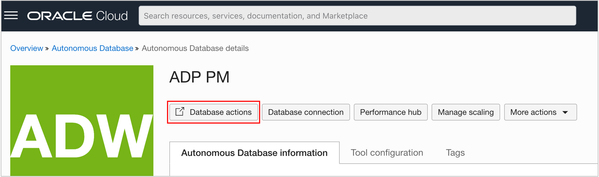

# Open SQL Worksheet

## Introduction

You will connect to Autonomous Database and run SQL commands to create a user, add workshop utilities, and load sample data.  This lab provides instructions for connecting to SQL Worksheet using your browser.  You may use a different tool, such as SQL Developer Desktop.

Estimated Time:  Less than 5 minutes.

### Objectives

In this lab, you will:

- Open SQL Worksheet.

### Prerequisites:

- Access to the Autonomous Database Console or a URL to Autonomous Database Actions.

## Task 1 - Connect to the Database Actions Tool Set

You will use the Data Studio Analysis tool to create your Analytic View.  Data Studio is part of the Database Actions tool set, which contains many different types of tools.

You can connect to Database Actions using the Autonomous Database Service Console or a URL provided by your Autonomous Database administrator.

1.  Choose the Database Actions button if you connect via the Autonomous Database Service Console.

## Task 2 - Connect to SQL Worksheet

SQL Worksheet allows you to run SQL commands in the Oracle Database.  You will run SQL commands to create a database user and load sample data.

1.  Choose the SQL button.