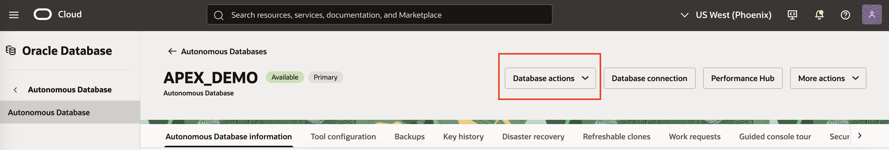
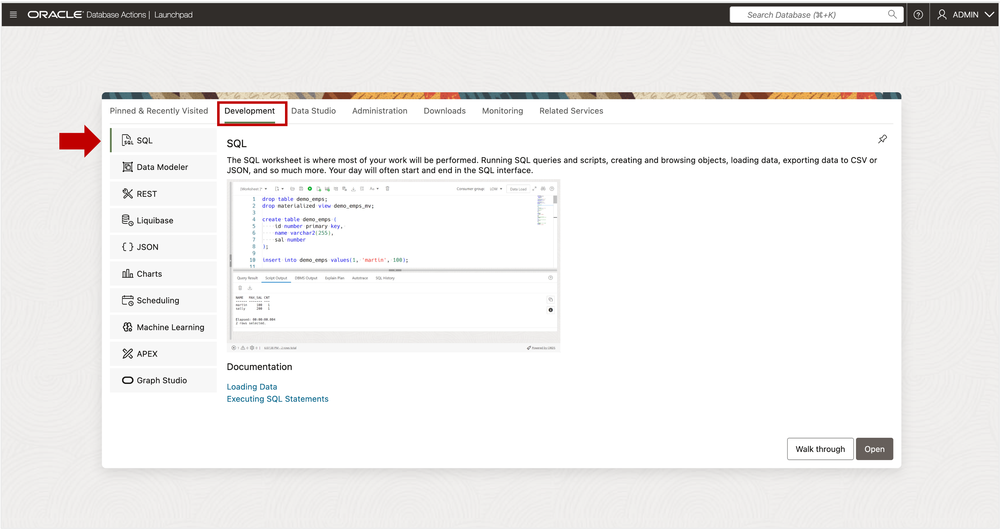

# Open SQL Worksheet

## Introduction

You will connect to Autonomous AI Database and run SQL commands to create a user, add workshop utilities, and load sample data.  This lab provides instructions for connecting to SQL Worksheet using your browser.  If you prefer to use a different tool such as SQL Developer desktop, feel free to do so.

Estimated Time:  Less than 5 minutes.

### Objectives

In this lab, you will:

- Open Oracle Autonomous AI Database Actions.
- Open SQL Worksheet.

### Prerequisites:

- Access to the Autonomous AI Database Console or a URL to Autonomous AI Database Actions.

## Task 1 - Connect to the Database Actions Tool Set

You will use SQL Worksheet to run a script that loads data and creates the sample analytic view.  You will also the Data Studio Analysis tool to view the design of the analytic view and run a report.  Data Studio is part of the Database Actions tool set, which contains many different types of tools.

You can connect to Database Actions using the Autonomous AI Database Service Console or a URL provided by your Autonomous AI Database administrator.

1.  Choose the Database Actions button if you connect via the Autonomous AI Database Service Console.

## Task 2 - Connect to SQL Worksheet

SQL Worksheet allows you to run SQL commands in the Oracle Database.  You will run SQL commands to create a database user, load sample data, and create the analytic view.

1.  Choose the SQL button.

You may now **proceed to the next lab**.

## Acknowledgements

- Created By/Date - William (Bud) Endress, Product Manager, Autonomous AI Database, June 2023
- Last Updated By - William (Bud) Endress, May 2024

Data about movies in this workshop were sourced from **Wikipedia**.

Copyright (C)  Oracle Corporation.

Permission is granted to copy, distribute and/or modify this document
under the terms of the GNU Free Documentation License, Version 1.3
or any later version published by the Free Software Foundation;
with no Invariant Sections, no Front-Cover Texts, and no Back-Cover Texts.
A copy of the license is included in the section entitled [GNU Free Documentation License](files/gnu-free-documentation-license.txt)