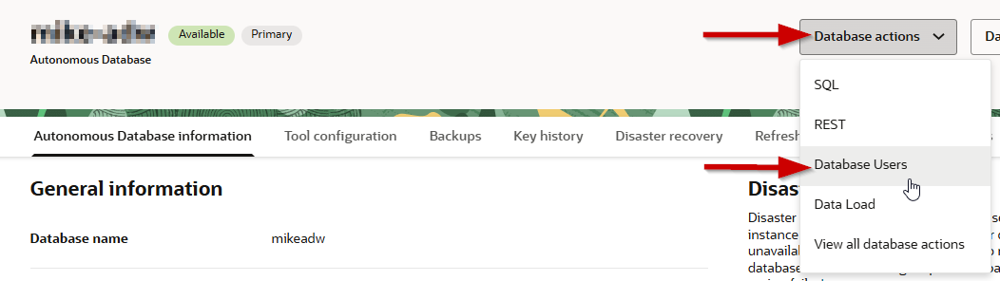
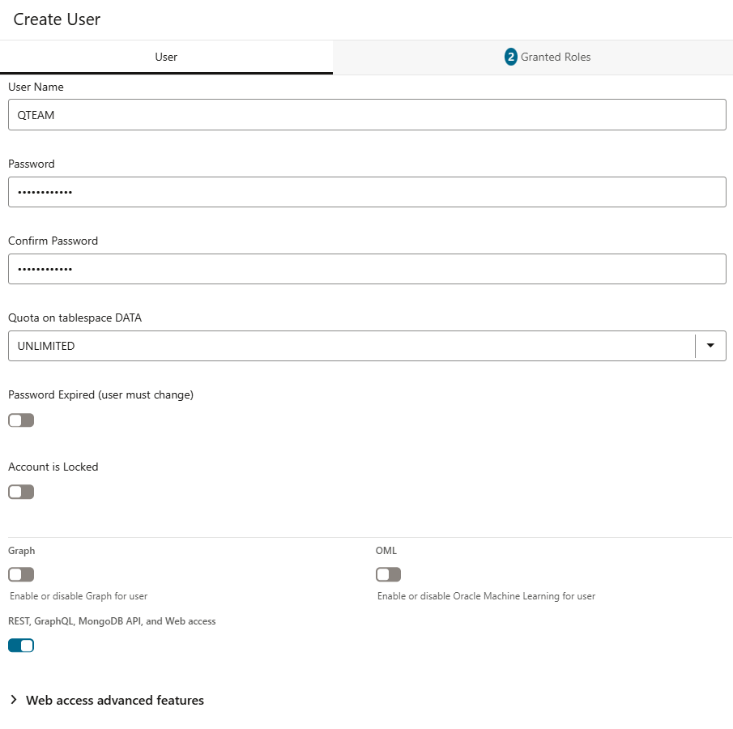
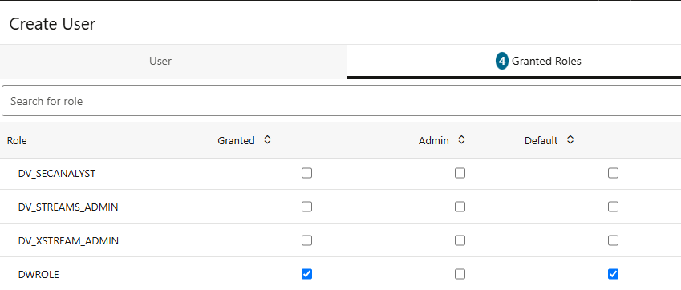
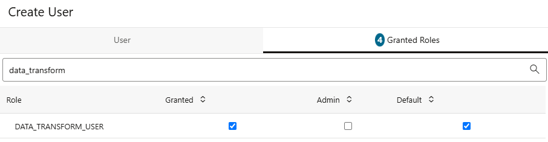
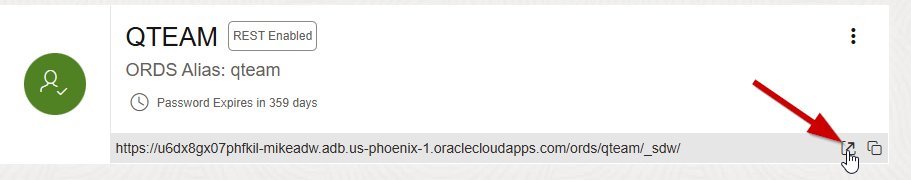
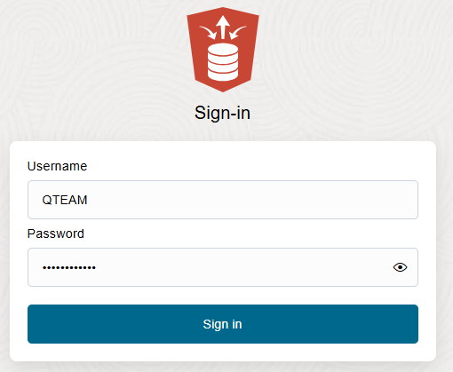

# Create a Database User

## Introduction

In this lab, you will create a database user.

Estimated Time: 10 minutes

Watch the video below for a quick walk-through of the lab.
[Create a database user](videohub:1_bqbg5sf2)

### Objectives

In this lab, you will:

- Create the database user that you will use in the next lab
- Update the user's profile to grant access to load and store data
- Update the user's profile to grant access to data transforms
- Log in as the user

### Prerequisites

To complete this lab, you need to have the following:

- Completed Autonomous AI Database provisioning

## Task 1: Create New Database User

When you create a new Autonomous AI Database, you automatically get an account called ADMIN which is your super administrator user. In the real world, you will want to keep your data completely separate from the administration processes. Therefore, you will need to know how to create separate new users and grant them access to your data warehouse. This section will guide you through this process using the "New User" wizard within the SQL Worksheet (one of the built-in tools in Autonomous AI Lakehouse).

For this workshop, we need to create one new user.

1.  Navigate to the **Details** page of the Autonomous AI Database you provisioned in the "Provision an ADB Instance" lab. Click the **Database Users** button from the pull down menu on **Database actions**.
    

2.  This will take you to the Database Actions User Management page, logged in as the ADMIN user. You can see that your ADMIN user is listed as the current user. On the right-hand side, click the "+ **Create User**" button.

3.  The **Create User** form will appear on the right-hand side of your browser window. Use the settings below to complete the form:

    - User Name: **QTEAM**
    - Password: make up your own suitably strong password.
 
    > **Note:** Rules for User Passwords - Autonomous AI Lakehouse requires strong passwords. User passwords must meet the following default password complexity rules:
  
    - Password must be between 12 and 30 characters long
    - Must include at least one uppercase letter, one lowercase letter, and one numeric character
    - Cannot contain the username
    - Cannot contain the double quote (") character

    There is more information available in the documentation about password rules and how to create your own password rules. See here: [Create Users on Autonomous AI Database](https://docs.oracle.com/en/cloud/paas/autonomous-database/adbsa/manage-users-create.html#GUID-B5846072-995B-4B81-BDCB-AF530BC42847)
  
    - Select **UNLIMITED** from the drop-down menu for **Quota on tablespace DATA**
  
4.  Enable RSET, GraphQL, MongoDB API, and Web access
 
5.  The completed **User** tab should look like this:

    

7.  You need the following user roles to enable the Data Studio tools used in this and other related workshops:

    - **DWROLE:** to grant access to load and store data
    - **DATA\_TRANSFORM\_USER:** to grant access to transform data

    > **Note:** Access to the Data Transforms tool may grant the user visibility to other users' data since the tool allows you to import and view data from any schema. Please be aware of this and enable this role selectively.

    Click on the **Granted Roles** tab at the top of the form and add the following roles by checking the boxes in the first (Granted) and third columns (Default):

    > **Note:** Ensure that for each role the **Granted** and **Default** options are selected.
 
    

    Notice that two additional roles have already been automatically assigned: **CONNECT** and **RESOURCE**.  

    Search for the **DATA\_TRANSFORM\_USER** role and click on **Granted** and **Default** options.

    
    
    Finally, click the **Create User** button at the bottom of the form.
    
## Task 2: Login as User QTEAM

Now you need to switch to working as the user QTEAM, so you can start the next lab on data loading.

1.  Find the card for the user QTEAM and click on the box with the upward pointing arrow at the bottom of the card.

    

2.  Enter the username QTEAM and the password you defined in Task 1 when you created this user.

    

3.  This will launch the Database Actions Launchpad page.

Now you have connected to your Autonomous AI Lakehouse with your new user. 

You may now **proceed to the next lab**.

## Learn More

See the documentation on [Managing Users on Autonomous AI Database](https://docs.oracle.com/en/cloud/paas/autonomous-database/adbsa/manage.html#GUID-AD7ACC07-AAF7-482A-8845-9C726B1BA86D). This topic describes administration tasks for managing users on Autonomous AI Database.

## Acknowledgements

- Created By/Date - Keith Laker, Product Manager, Autonomous AI Database, March 2021
- Contributors - Nilay Panchal, Rick Green, Patrick Wheeler, Marty Gubar, Bud Endress, Jayant Mahto, Mike Matthews, Ashish Jain
- Last Updated By - Mike Matthews, June 2025
