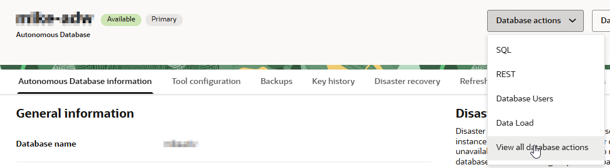
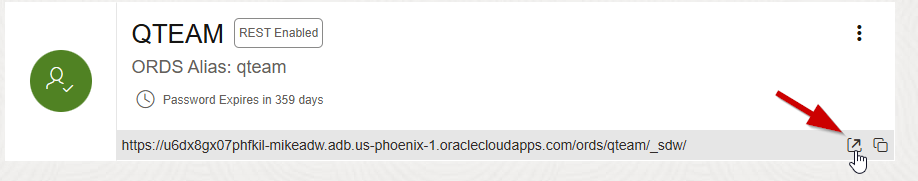
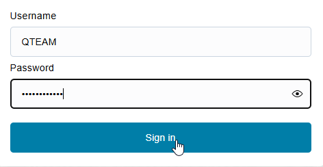
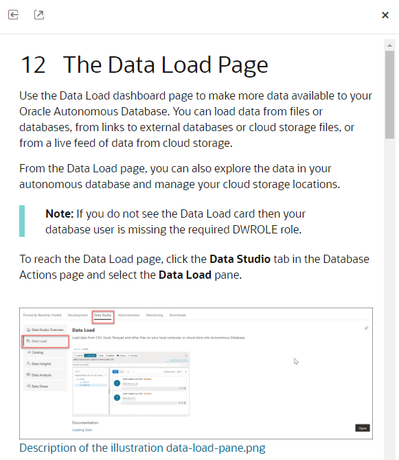
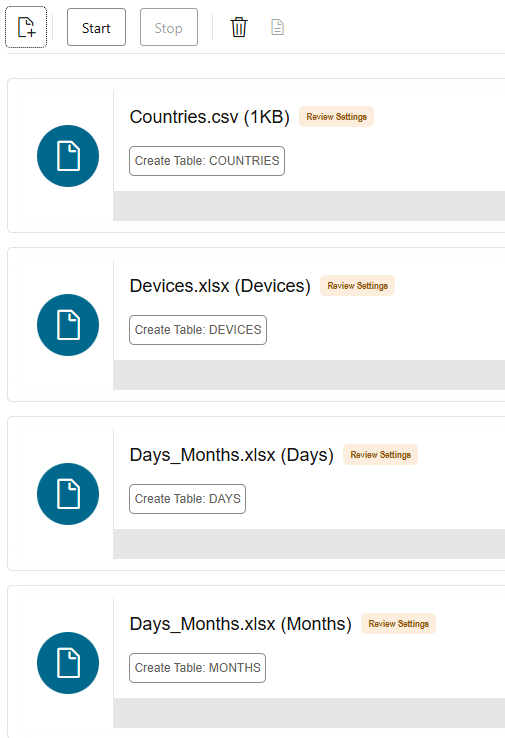
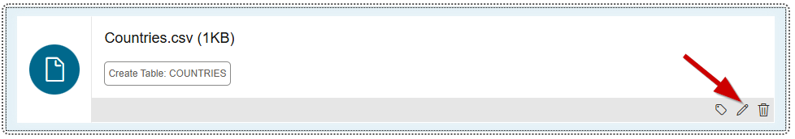
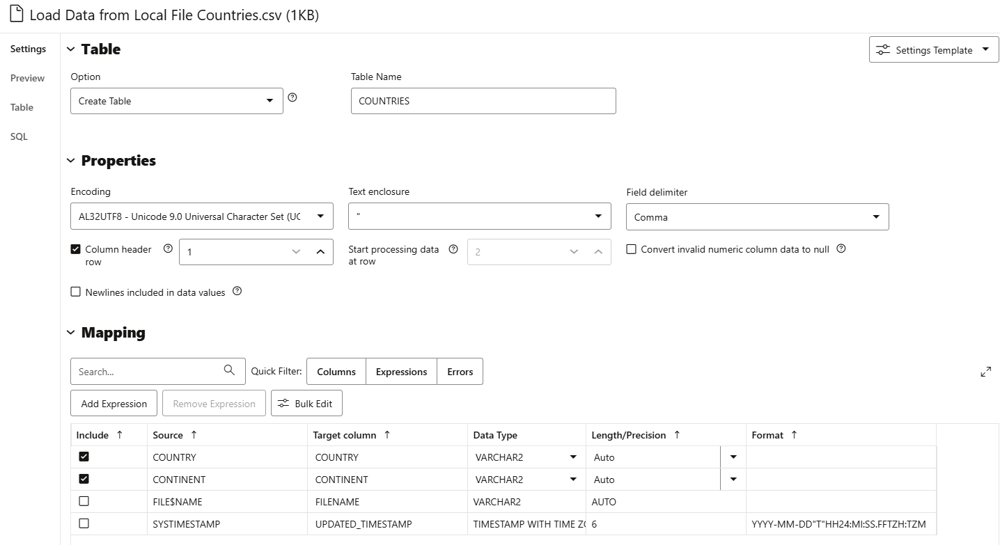
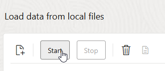
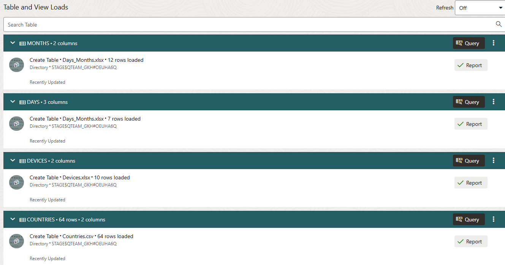

# Load data from local files

## Introduction

This lab introduces the Data Studio application built into the Oracle Autonomous AI Database and shows the various ways it can load data into the database.

This lab, and the full functionality of Data Studio, is applicable to both Autonomous AI Lakehouse and Autonomous Transaction Processing (ATP) databases. 

Estimated Time: 10 minutes

### Objectives

In this lab, you will:

- Familiarize yourself with the Data Studio application
- Load data from local files

### Prerequisites

To complete this lab, you need to have completed the two previous labs, so that you have:

- Created an Autonomous AI Lakehouse instance
- Created a new QTEAM user

## Task 1: Overview of Data Studio

### Introduction

Oracle Autonomous AI Database comes with a built-in Data Studio application that can help you with many of the typical data warehousing tasks. This application is complementary to various capabilities accessible via the SQL command line, which themselves are covered by other workshops.  

**Let's get started!**

### Access Data Studio

Data Studio is linked from the **Database Actions** home page.

In the previous lab, you created the database user **QTEAM**, and you should still be connected as user QTEAM. If you are already logged in as QTEAM, and on the Database Actions home page, you may go directly to Step 4. 

Otherwise, there are two ways to reach the Database Actions home page, where you can find Data Studio and other useful tools for your database.

1. Via the Autonomous AI Database console page
2. Directly via URI

### Access Database Actions via the Console

On the Autonomous AI Database Details page, click the **View all database actions** button from the **Database action** drop-down:

  

### Access Database Actions directly via URI

When user QTEAM was created (in a previous step), a card appeared on the Database Users screen, similar to what is shown below. Notice the URI at the bottom of the card.

Click the **Open in new tab** icon to open a new tab. This URL may be used to access the Database Actions page of Autonomous AI Database Tools directly, without needing to use the OCI Console. You may want to bookmark this link so that you can easily launch the page at any time.

  

3. Once you have launched the Database Actions page, sign in as user QTEAM, with the password assigned previously, and click **Sign In**.

  

4. This will take you to the Autonomous AI Database **Database Actions** page (shown below), with a link to Data Studio. 

  

5. If you want more information about Data Studio, hover over the sections on the left hand side, and click the links under the **Documentation** section. This will pop open a documentation page giving an outline of the relevant Data Studio tool. To close the help tray, simply click the  **X**.

  

## Task 2: Load Data from Local Files

In this task, you will learn how to load data into Autonomous AI Database tables from files on your local machine. In this case, we will load two Excel spreadsheets and a csv file, but the process is much the same for any supported type of file that you may have locally, for example because you downloaded it from a public data site, or because it was emailed to you.

Supported file types for loading locally include:

- .csv (Comma-separated values) or .tsv (Tab-separated values) files
- .xls or .xlsx files (Excel spreadsheets)
- .txt files with delimited text
- .avro (AVRO) files
- .json (JSON) files
- .xml (XML) files

For more information on the specific supported format of JSON, AVRO and XML files see the **[online help](https://docs.oracle.com/en/database/oracle/sql-developer-web/sdwad/loading-data.html#GUID-44B34EA1-41AC-4C76-945F-81CBBA5E6CA1)**

>**Important:**Your computer may not support downloading files to your local disk. If you are in this situation, you may be able to access other files of the types listed above that will allow you to proceed through the lab. If not, please skip to the next lab to learn how to load data from cloud storage.

### Preparation

Below are the files that you will be using during this part of the workshop. Before you can begin, you need to download these files to your local computer and make a note of where they are stored, because you will need to use them later in this section. Click each of the links below to download the files.

- Click **[here](https://objectstorage.us-phoenix-1.oraclecloud.com/n/dwcsprod/b/MovieStream-QTEAM-Download/o/Days_Months.xlsx)** to download the **Days\_Months.xlsx** Excel file to your local computer.
- Click **[here](https://objectstorage.us-phoenix-1.oraclecloud.com/n/dwcsprod/b/MovieStream-QTEAM-Download/o/Devices.xlsx)** to download the **Devices.xlsx** Excel file to your local computer.
- Click **[here](https://objectstorage.us-phoenix-1.oraclecloud.com/n/dwcsprod/b/MovieStream-QTEAM-Download/o/Countries.csv)** to download the **Countries.csv** CSV file to your local computer.

    > **Note:** The **Countries.csv** file might appear as new tab in your browser rather than simply downloading. Please use the Save or Save As feature in your browser's File menu to save the file as **Countries.csv**, and make a note of where you saved it. Note that if you have previously run other similar workshops, you may have these files already in your download folder. If this is the case, the above files will save with different names, such as **Days\_Months.xlsx(2)**. If you encounter this issue, use the original files rather than the ones you have just downloaded.

**Before you proceed -**  be sure to take note of the location of the three files that you downloaded to your local computer.

1. To load the files from your local computer, you need to launch the Data Load tool of Data Studio from the Database Actions home page:

  

2. Click on the first card in - **LOAD DATA** and make sure **Local File** is selected in the top left of the screen. 

  

3. Next, you need to locate the three files (Countries.csv, Days_Months.xlsx and Devices.xlsx) that you downloaded earlier! If they are easily accessible, then you can simply drag **ALL THREE** files at one time, and drop them onto to canvas as stated in the text on the screen.

4. An alternative approach is to click **Select Files** button in the middle of the screen, which will open the file explorer on your local computer where you can locate your data files: Countries.csv, Days\_Months.xlsx, and Devices.xlsx. You can select all the files in a single operation.

    >**Note:** Even though you only picked three files, four cards will appear for the data TARGETS to be loaded.

  

  Why do you have  ***four***  cards listed on the data loading screen? This is because the spreadsheet file **Days\_Months.xlsx** contains two worksheets: one for Days and one for Months. The data loading wizard automatically parsed your spreadsheet and created a separate data loading card for each worksheet. 

5. Before you load any data, let's review what the data loading wizard has discovered about the data within your data files. Let's focus on the **Countries.csv** file. Click the ellipsis on the right side of the card, then click **Settings** to inspect the data loading properties:

  

6. In the bar on the left, there are links for Settings, Preview, Table, SQL and Errors. This screenshot shows the **Settings** page. Observe that this shows the structural information and intelligent default values that the data load wizard has created from simply looking at the file.

  

7. How does it do this? Most csv files contain structural information about the data within the file in the first row. Notice that there is a tick box selected, **Column header row**.

8. This has allowed the data load wizard to discover that your data file contains two columns of data: **COUNTRY** and **CONTINENT**. The default table name has based derived from the filename. Click the drop-down menu under **Option**.

  

9. Notice that various operations are supported. Where you have an existing table that you want to load into, the other options come into play. In this case, we want to create a new table, so accept the default option,  **Create Table**.

  > **Note:**  This wizard creates the table for you during the data load process! Notice also that the wizard has automatically mapped the columns. The column mappings looks sensible, both in terms of column names and data types.

10. Click **Close**  in the bottom right to return to the Data Load card and then click the **Start** button in the menu panel to start the Data Load job, then click **Run** in the pop-up box to confirm.

  

  The time taken to load each file depends on factors including file size and network speed. The progress of each task can be monitored from the status bar and the ring to the left of each job card. When the ring is complete, the data from the file has been successfully loaded into a table.

  

   Normally, we would then check that the data has been correctly loaded by examining the new tables in the **Catalog**. However, in this case we will do this after loading some more data.

### RECAP: Loading Data from local files

In this part of the workshop, you used the new data loading tool to quickly load data into your data warehouse from three local data files simply by dragging and dropping them onto the Data Load canvas. One file was in CSV format and the other two were Excel spreadsheets. One of the spreadsheets contained two worksheets and each one was loaded into its own table. The data loading process automatically created new tables containing the appropriate column structures based on the data within each file.

In a few clicks, you were able to define and load data into four new tables without having to write any SQL code. It was all done with a few mouse clicks.

You may now **proceed to the next lab**.

## Acknowledgements

- Created By/Date - Mike Matthews Product Management, Autonomous AI Database, January 2023
- Contributors - Patrick Wheeler, Ashish Jain, Rick Green
- Last Updated By - Mike Matthews, August 2025
