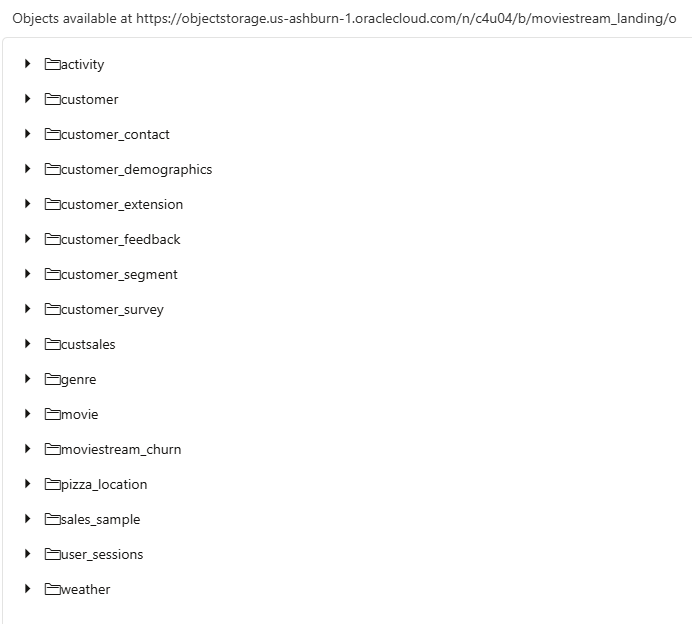
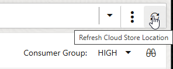
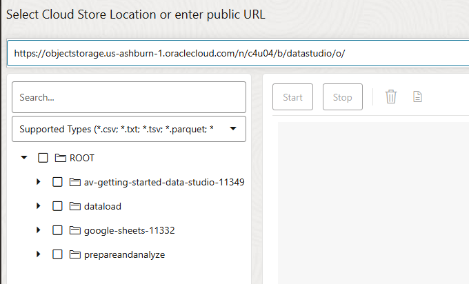
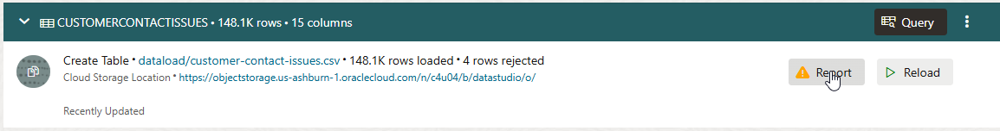
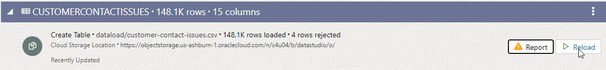
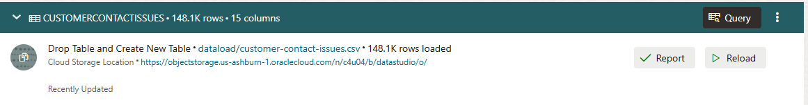
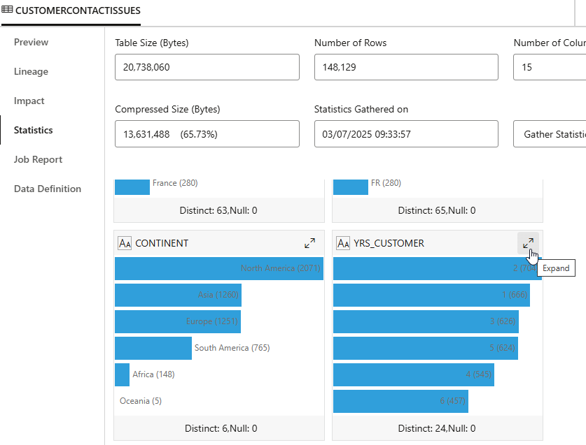

# Load data from cloud storage

## Introduction

This lab shows how to connect your Autonomous AI Database to a cloud storage system so that it can load data from it, and also how to resolve issues that you may encounter when loading data from files.

Estimated Time: 25 minutes

### Objectives

In this lab, you will:

- Connect your Autonomous AI Database to a cloud storage system
- Load data into new tables in the database from cloud storage
- Learn how to review and resolve common issues when loading data

### Prerequisites

To complete this lab, you need to have completed Labs 1 and 2 in this workshop, so that you have:

- Created an Autonomous AI Lakehouse instance
- Created a new QTEAM user

You do not need to have completed Lab 3.

## Task 1: Connect to Cloud Storage

In the previous lab, you loaded data from files that you located on your local computer. In this lab, you are going to load some more data, but this time using files on cloud storage.

There are two parts to this process, and the first part only needs to be performed once. The two parts are:

1. Set up connection to the cloud storage system
2. Load the files

Note that in this example, we will be using files on Oracle Cloud Infrastructure Object Storage. However, the process is the same for loading files from other cloud storage systems, such as Amazon Web Services S3, Azure Storage, and Google Cloud Platform Storage.

### Set Up a Cloud Location

1. To begin this process, you need to navigate to the **Data Load** page in Data Studio, from the Database Actions home page.
  
2. On the **Data Load** main page, click the **Connections** card so you can define a new connection to your cloud storage system.
  
3. Click the **Create** button in the upper left and select **New Cloud Store Location**. Set the Name to **MOVIESTREAMLANDING**, select the **Public Bucket** radio option, and copy and paste the following Bucket URI:

 ```
    $ <copy>https://objectstorage.us-ashburn-1.oraclecloud.com/n/c4u04/b/moviestream_landing/o</copy>
 ```

  

  Your completed form should look like the one above. When you have completed these details, click **Next**.

 4. The **Cloud Data** page allows you to verify your cloud storage connection by showing a preview of the available objects contained in it. This is useful to ensure the location is set up correctly. In this case, this should look as below:

   

 5. Click the **Create** button to complete the registration of this cloud location.

## Task 2: Load Data Files from a Cloud Location

1. Navigate back to the main Data Load page again using the breadcrumb link. Click the **Load Data** card, then select **Cloud Store** on the top ribbon. 

  

2. Make sure the **MOVIESTREAMLANDING** cloud location is selected. If it does not appear, click the **Refresh** button on the far right of the toolbar, then select it.

  

  Now you see a file browser-like view of your Object Store. In this case we want to load the **activity**, **customer\_extension**, **customer\_segment** and **pizza\_location** files. To do this, we can either select and drag the subfolders containing each of these files, or drag the files themselves, to the right hand side of the screen. 

  Two warning messages will appear in the top right of the screen. These are to indicate that some columns from the **customer\_extension** and **customer\_segment** files have been detected as containing possible PI (Personally Identifiable) data. These warnings allow you to exclude such columns from the load process if you do not want users to be able to see the data. However, for this workshop, you can ignore these warnings. 

  >**Note**: The selection of a folder allows the loading of multiple files that are in the same structure into a single table. If you drag and drop a folder, rather than a file, a prompt appears to confirm that you want to load all files in this folder into a single table. In this case, all our folders contain a single file, so click **Yes** on each prompt. If you have a folder containing files in different structures and you want to load many of them, you should drag across each file separately so that separate tables can be created, each with the correct columns and data.

  

3. You can edit the settings of each of the data loading tasks by clicking the pencil icon on the right-hand side of each card. Do this for the **activity** load task: 

  

4. On this page, we can check the properties of the load task, and make any changes to column names or data types. 

  

  Note that the Data Type for three of the columns (cust\_id, genre\_id and movie\_id) has been detected as NUMBER. The remaining columns have been detected as VARCHAR2 columns, with the Length/Precision set to **Auto**. The **Auto** setting will analyze the full data set and automatically create columns that are comfortably long enough to store the longest found values for each column. With larger files, it may be more performance-efficient to specify the Length yourself so that this analysis is avoided.

  In this case there is no need to make any changes. You can close the form and then click the **Start** button to start your data load job. 

  The job should take less than a minute to complete. You can see the number of rows loaded into each table.

  


## Task 3: Review and resolve data loading issues

In this task, we are going to load a file that contains a few minor data issues that will stop it from loading completely. We will learn how to resolve the loading issues so that we load the data fully and without errors. Note that the data issues themselves can then be fixed using the built-in **Data Transforms** component of Data Studio, though we will not do this in the workshop.

### Load directly from URI

Where you want to download and load data from a file from a cloud location that you do not need to save, and which does not require credentials, you can simply paste the URI into the cloud location screen when loading data. 

1. On the Data Load screen, select **Load Data** and **Cloud Store** again.

2. This time, rather than using any of the saved cloud storage locations, we are going to paste the following URI into the **Select Cloud Store Location or enter public URL** bar. To do this, select the default contents of the bar and delete them to clear the bar. Then copy and paste the below URI:

 ```
    $ <copy>https://objectstorage.us-ashburn-1.oraclecloud.com/n/c4u04/b/datastudio/o/</copy>
 ```

  

2. Expand the dataload folder and drag over the file **customer-contact-issues.csv** to the right hand side. Ignore the warning about PI columns.

3. Click the pencil icon to open the settings for the load task.

4. The settings look reasonable. Note that some of the columns, including **YRS_CUSTOMER** have been detected as numbers. Click **Close** to close the settings screen and then click the **Start** button to run the load job.

5. In this case, when the task completes, it shows a warning icon, and indicates that there were 4 rejected rows:

  

6. Click the **Report** button to review the errors:

  

7. In the **Summary Error Log** section, we can see that there were 4 occurrences of an error loading the **YRS\_CUSTOMER** column. If we expand the **Detail Error Log** section at the bottom of the screen, we can work out why 4 rows failed. In all cases there was an error processing the column **YRS\_CUSTOMER** because these rows did not contain a valid number. If we expand the size of the **Data** column, we can see the values "eight", "six", and 2 cases of "unknown" which have caused the problem:

  

  Click **Close** to close the task view.

8. We have options here as to what to do. In some cases, we might decide it is acceptable to keep the table without these rows in it. We aldo had the option to download the errored records, fix the errors, and load these into our target table. Or, we can choose to recreate the table and reload the data, changing the data type of the **YRS_CUSTOMER** column to a text type so that we can load all the records, as we know we can fix the data using the built-in **Data Transforms** part of Data Studio, or by using Table AI Assist. To do this, we can use the **Reload** option on the load task to change and rerun the data load:

  

9. This is where Data Studio can help us out. It knows about the error, and can suggest a recommended fix! Click **Yes** to apply the recommended fix.

  

10. Notice that the load task has been recreated, but now shows **Drop Table and Create New Table** rather than **Create Table**:

  

11. Click the pencil icon to check the settings of the reloaded load task. In the bottom **Mapping** section, scroll down to find the **YRS_CUSTOMER** column. The Data Type for this column is now VARCHAR2 rather than NUMBER. 

12. Now we can click **Close** to close the settings for the load task, and rerun it by clicking the **Start** button.

  This time, when the task completes, it shows no errors, and that all rows were loaded correctly! 

  

## Task 4: Inspect the newly loaded table

1. Click the name of the table (CUSTOMERCONTACTISSUES) on the Data Load screen to view the table.

  


2. Click **Statistics** on the panel to the left of the screen. Statistics help you quickly understand the structure and content of the table and to verify that data has been loaded correctly. 

3. Scroll down to find the card relating to the **YRS_CUSTOMER** column. Notice that its icon denotes that it is a text (VARCHAR) column. Click on the Expand button to view the statistics in more detail.

  

4. This now shows the distribution of values for the **YRS_CUSTOMER** column. Find the small scroll bar to the left of the graph and scroll down. You will see the captured values "eight", "six" and "unknown" that we have now loaded:

  


## RECAP

In this lab, you used Data Studio's data loading tool to load data from cloud storage. First, we set up a cloud storage location that we want to use regularly, and loaded some files from it in a few easy steps. Then, we learnt how to load directly from a URI, and how to resolve common types of issue with data loading - in this case, we had a handful of rows with mismatched data types, but Data Studio provided a recommended fix that resolved the issue.

You may now **proceed to the next lab**.

## Acknowledgements

- Created By/Date - Mike Matthews Product Management, Autonomous AI Database, January 2023
- Contributors - Patrick Wheeler, Keith Laker, Ashish Jain, Rick Green, Nilay Panchal, Hermann Baer
- Last Updated By - Mike Matthews, August 2025
