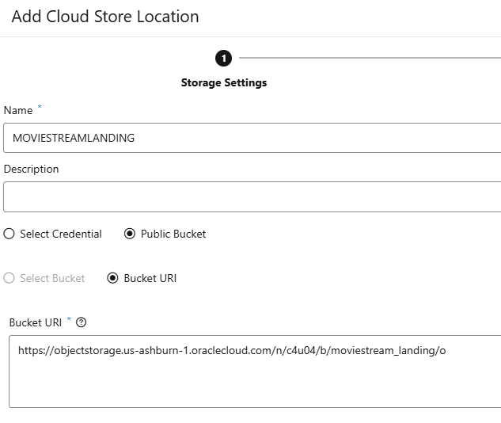

### Load Data from Cloud Storage

In the previous lab, you loaded data from files that you located on your local computer. In this lab, you are going to load some more data, but this time using files on cloud storage.

There are two parts to this process, and the first part only needs to be performed once. The two parts are:

1. Set up connection to the cloud storage system
2. Load the files

Note that in this example, we will be using files on Oracle Cloud Infrastructure Object Storage. However, the process is the same for loading files from other cloud storage systems, such as Amazon Web Services S3, Azure Storage, and Google Cloud Platform Storage.

### Set Up Cloud Location

1. To begin this process, you need to navigate to the **Data Load** page in Data Studio. 
  
2. On the **Data Load** main page, click the **Cloud Locations** card so you can define a new connection to your cloud storage system.
  
3. Click the **Add Cloud Storage** button on the upper right and define a Cloud Storage location using the following URI:

    https://objectstorage.us-ashburn-1.oraclecloud.com/n/c4u04/b/moviestream_landing/o

    

  Your completed form should look like the one above. When you have completed these details, click **Next**.

  4. The **Cloud Data** page allows you to verify your cloud storage connection by showing a preview of the files contained in it. This is useful to ensure the location is set up correctly.

### Load Data Files from A Cloud Storage Location

4. Navigate back to the main Data Load page again using the breadcrumb link. Click the two cards for  **Load Data**  from  **Cloud Storage **and then click the blue **Next** button. 
  
21. Now you see a file browser-like view of your Object Store. Locate the file **Movie\_Sales\_2020.csv** in the left part of the screen. Click and drag this file onto the canvas on the right. 
  
22. As before, you can edit the properties of your new data load job by clicking the **pencil** button on the right-hand side of the card. 
  
23. You can use this page to quickly review the properties sheet and make any changes to column names or data types. As soon as you are satisfied with the format, you can close the form and then click the **green arrow** button to start your data load job. 
  

### Inspect Data In Table MOVIE\_SALES\_2020

24. Navigate to the **Data Load** main page and click the **Explore** card. You'll now see table MOVIE\_SALES\_2020 has been loaded into your Autonomous Data Warehouse.
25. Click this table and then click **Source Statistics** on the panel to the left of the screen. Statistics help you quickly understand the structure and content of the table. In this case, this data presents a nice simple way to characterize the data you've just loaded. 
  
