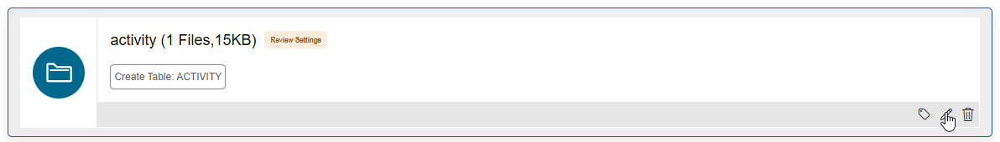
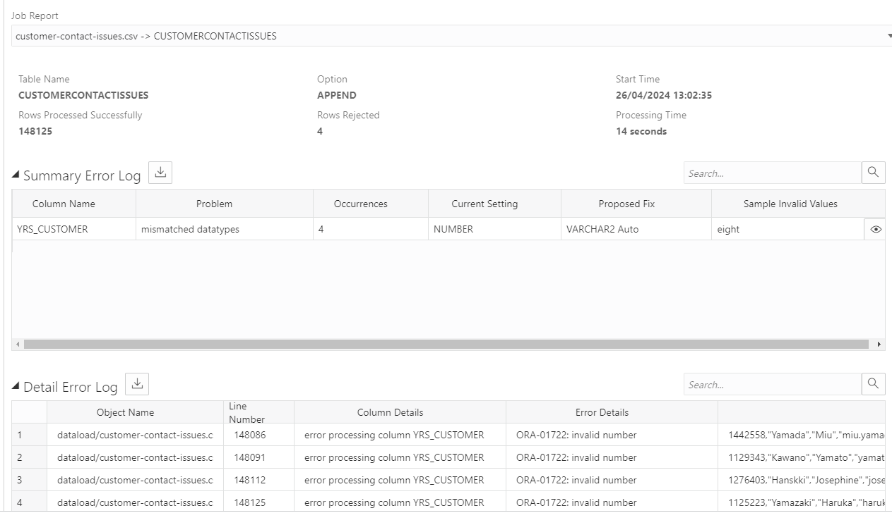
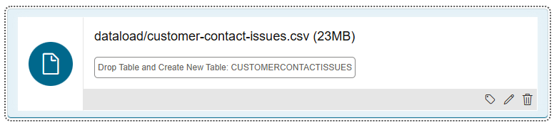

# Using Data Studio to load data from Cloud Storage

## Introduction

This lab shows how to connect your Autonomous Database to a cloud storage system so that it can load data from it, and also how to resolve issues that you may encounter when loading data from files.

Estimated Time: 25 minutes

Watch the video below for a quick walk through of the lab.

[](youtube:youtubeid)

### Objectives

In this lab, you will:

- Connect your Autonomous Database to a cloud storage system
- Load data into new tables in the database from cloud storage
- Learn how to review and resolve common issues when loading data

### Prerequisites

To complete this lab, you need to have completed Labs 1 and 2 in this workshop, so that you have:

- Created an Autonomous Data Warehouse instance
- Created a new QTEAM user

You do not need to have completed Lab 3.

## Task 1: Connect to Cloud Storage

In the previous lab, you loaded data from files that you located on your local computer. In this lab, you are going to load some more data, but this time using files on cloud storage.

There are two parts to this process, and the first part only needs to be performed once. The two parts are:

1. Set up connection to the cloud storage system
2. Load the files

Note that in this example, we will be using files on Oracle Cloud Infrastructure Object Storage. However, the process is the same for loading files from other cloud storage systems, such as Amazon Web Services S3, Azure Storage, and Google Cloud Platform Storage.

### Set Up a Cloud Location

1. To begin this process, you need to navigate to the **Data Load** page in Data Studio. 
  
2. On the **Data Load** main page, click the **Cloud Locations** card so you can define a new connection to your cloud storage system.
  
3. Click the **Add Cloud Storage** button on the upper right and define a Cloud Storage location. Set the Name to **MOVIESTREAMLANDING**, select the **Public Bucket** radio option, and copy and paste the following Bucket URI:

 ```
    $ <copy>https://objectstorage.us-ashburn-1.oraclecloud.com/n/c4u04/b/moviestream_landing/o</copy>
 ```

  

  Your completed form should look like the one above. When you have completed these details, click **Next**.

 4. The **Cloud Data** page allows you to verify your cloud storage connection by showing a preview of the available objects contained in it. This is useful to ensure the location is set up correctly. In this case, this should look as below:

   

 5. Click the **Create** button to complete the registration of this cloud location.

## Task 2: Load Data Files from a Cloud Location

1. Navigate back to the main Data Load page again using the breadcrumb link. Click the two cards for  **Load Data**  from  **Cloud Store** and then click the blue **Next** button. 
  

2. Now you see a file browser-like view of your Object Store. In this case we want to load the **activity**, **customer_extension**, **customer_segment** and **pizza_location** files. To do this, we can either select and drag the subfolders containing each of these files, or drag the files themselves, to the right hand side of the screen. 
  

**Note**: The selection of a folder allows the loading of multiple files that are in the same structure into a single table. If you drag and drop a folder, rather than a file, a prompt appears to confirm that you want to load all files in this folder into a single table. In this case, all our folders contain a single file, so you can just say Yes to the prompt. If you have a folder containing files in different structures and you want to load many of them, you should drag across each file separately so that separate tables can be created, each with the correct columns and data.

3. As before, you can edit the properties of each of the data loading tasks by opening the menu on the right-hand side of each card and selecting **Settings**. Do this for the **activity** load task: 
  

4. On this page, we can check the properties of the load task, and make any changes to column names or data types. 

  

Note that the Data Type for three of the columns (cust_id, genre_id and movie_id) has been detected as NUMBER. The remaining columns have been detected as VARCHAR2 columns, with the Length/Precision set to **Auto**. The **Auto** setting will analyze the full data set and automatically create columns that are comfortably long enough to store the longest found values for each column. With larger files, it may be more performance-efficient to specify the Length/Precision yourself so that this analysis is avoided.

In this case there is no need to make any changes. You can close the form and then click the **green arrow** button to start your data load job. 

  

The job should take less than a minute to complete. You can see the number of rows loaded into each table.

  

## Task 3: Review and resolve data loading issues

In this task, we are going to load a file that contains a few minor data issues that will stop it from loading completely. We will learn how to resolve the loading issues so that we load the data fully and without errors. Note that the data issues themselves can then be fixed using the built-in **Data Transforms** component of Data Studio, though we will not do this in the workshop.

### Load directly from URI

Where you want to download and load data from a file from a cloud location that you do not need to save, and which does not require credentials, you can simply paste the URI into the cloud location screen when loading data. 

1. On the Data Load screen, select **Load Data** and **Cloud Store** again, and click **Next**

2. This time, rather than using the saved cloud store, we are going to paste the following URI into the cloud location bar:

 ```
    $ <copy>https://objectstorage.us-phoenix-1.oraclecloud.com/n/adwc4pm/b/MovieStreamData/o</copy>
 ```

  

2. Drag over the file **customer-contact-issues.csv** to the right hand side.

3. Click on the menu of the load task and select **Settings**

4. The settings look reasonable. Note that some of the columns, including **YRS_CUSTOMER** have been detected as numbers. Click **Close** to close the settings screen and then click the green run button to run the load job.

5. In this case, when the task completes, it shows a warning icon, and indicates that there were 4 rejected rows:

  

6. The name of the file on the completed load task is a link to see more information about the completed task. Click this, then click the **Errors** option on the left hand side to review the errors:

  

7. We can see a very clear indication of why these 4 rows failed. In all cases there was an error processing the column **YRS_CUSTOMER** because these rows did not contain a valid number. If we expand the size of the **Data** column, we can see the values "eight", "six", and 2 cases of "unknown" which have caused the problem:

  

  Click **Close** to close the task view.

8. We have options here as to what to do. In some cases, we might decide it is acceptable to keep the table without these rows in it, but in this case we want to get a complete load of all rows, as we know we can fix the data using the built-in **Data Transforms** part of Data Studio. To correct the issues in the data load, we can use the **Reload Cart** option in the bottom right hand corner of the Data Load screen to change and rerun the data load:

  

9. After reloading the cart, click on the file name of the load task to review the settings. Note that an error message appears warning us that the load task is currently attempting to create a table that already exists, as we have already loaded it. 

  

10. In this case, we want to drop and recreate the table with the same name, so what we need to do is change the **Option** drop down to **Drop table and create new table**, and then re-select the table **CUSTOMERCONTACTISSUES** under **Name**, as follows:

  

11. Next, we know that the **YRS_CUSTOMER** column actually contains some strings, so we should change its data type to **VARCHAR2** in the **Mapping** section:

  

12. Now we can click **Close** to close the settings for the load task, and rerun it by clicking the green run button.

This time, when the task completes, it shows no errors, and that all rows were loaded correctly! 

  


## Inspect the newly loaded table

10. Click on **Catalog** from the Data Studio navigation menu on the left hand side. 

  

Under **Saved Searches** on the right hand side, click on **Tables, views and analytic views owned by QTEAM** to see a list of the tables you have created in this and previous labs.

11. Click the **CUSTOMERCONTACTISSUES** table and then click **Statistics** on the panel to the left of the screen. Statistics help you quickly understand the structure and content of the table and to verify that data has been loaded correctly. In some cases, the Statistics may not be gathered yet. In this case, click on the **Gather Statistics** button. After about 30 seconds, click on the **Refresh** button, and the statistics should be available.

12. Scroll down to find the card relating to the **YRS_CUSTOMER** column. Notice that its icon denotes that it is a text (VARCHAR) column. Click on the Expand button to view the statistics in more detail.

  

13. This now shows the distribution of values for the **YRS_CUSTOMER** column. Find the small scroll bar to the left of the graph and scroll down. You will see the captured values "eight", "six" and "unknown" that we have now loaded:

  

## RECAP

In this lab, you used Data Studio's data loading tool to load data from cloud storage. First, we set up a cloud storage location that we want to use regularly, and loaded some files from it in a few easy steps. Then, we learnt how to load directly from a URI, and how to resolve common types of issue with data loading - in this case, where we had a handful of rows with mismatched data types.

## Acknowledgements

- Created By/Date - Mike Matthews Product Management, Autonomous Database, January 2023
- Contributors - Patrick Wheeler, Keith Laker, Ashish Jain, Rick Green, Nilay Panchal, Hermann Baer
- Last Updated By - Mike Matthews, January 2023
