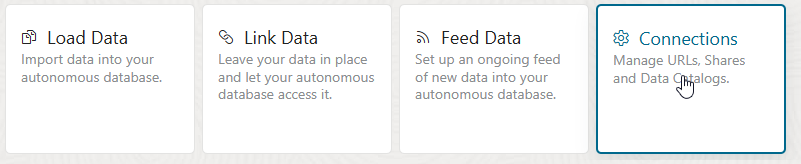
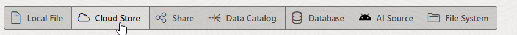
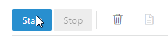
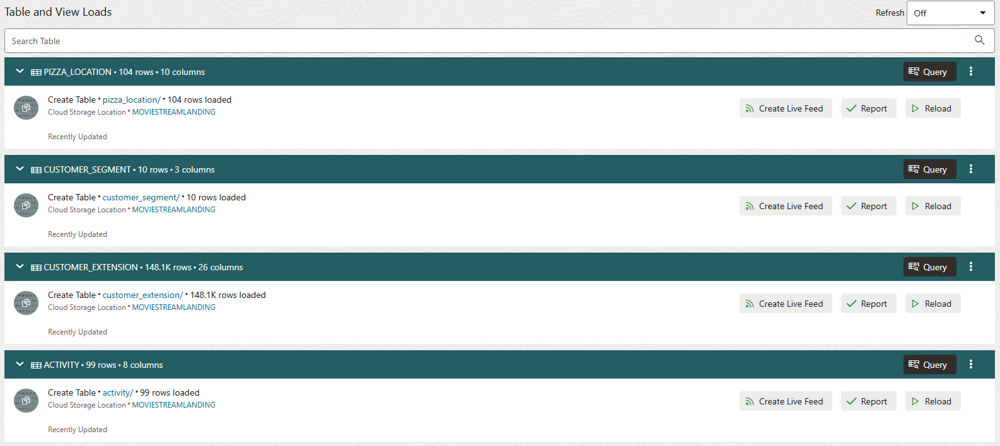

### Load Data from Cloud Storage

In the previous lab, you loaded data from files that you located on your local computer. In this lab, you are going to load some more data, but this time using files on cloud storage.

There are two parts to this process, and the first part only needs to be performed once. The two parts are:

1. Set up connection to the cloud storage system
2. Load the files

Note that in this example, we will be using files on Oracle Cloud Infrastructure Object Storage. However, the process is the same for loading files from other cloud storage systems, such as Amazon Web Services S3, Azure Storage, and Google Cloud Platform Storage.

### Set Up Cloud Location

1. To begin this process, you need to navigate to the **Data Load** page in Data Studio. 
  
2. On the **Data Load** main page, click the **Cloud Locations** card so you can define a new connection to your cloud storage system.
  
3. Click the **Add Cloud Storage** button on the upper right and define a Cloud Storage location. Set the Name to **MOVIESTREAMLANDING**, select the **Public Bucket** radio option, and copy and paste the following Bucket URI:

 ```
    $ <copy>https://objectstorage.us-ashburn-1.oraclecloud.com/n/c4u04/b/moviestream_landing/o</copy>
 ```

  

  Your completed form should look like the one above. When you have completed these details, click **Next**.

 4. The **Cloud Data** page allows you to verify your cloud storage connection by showing a preview of the available objects contained in it. This is useful to ensure the location is set up correctly. In this case, this should look as below:

   

 5. Click the **Create** button to complete the registration of this cloud location.

### Load Data Files from A Cloud Storage Location

 6. Navigate back to the main Data Load page again using the breadcrumb link. Click the two cards for  **Load Data**  from  **Cloud Store** and then click the blue **Next** button. 
  

 7. Now you see a file browser-like view of your Object Store. In this case we want to load the **activity**, **customer_extension**, **customer_segment** and **pizza_location** files. To do this, we can either select and drag the subfolders containing each of these files, or drag the files themselves, to the right hand side of the screen. 
  

**Note**: The selection of a folder allows the loading of multiple files that are in the same structure into a single table. If you drag and drop a folder, rather than a file, a prompt appears to confirm that you want to load all files in this folder into a single table. In this case, all our folders contain a single file, so you can just say Yes to the prompt. If you have a folder containing files in different structures and you want to load many of them, you should drag across each file separately so that separate tables can be created, each with the correct columns and data.

8. As before, you can edit the properties of each of the data loading tasks by opening the menu on the right-hand side of each card and selecting **Settings**. Do this for the **activity** load task: 
  

9. On this page, we can check the properties of the load task, and make any changes to column names or data types. 

  

Note that the Data Type for three of the columns (cust_id, genre_id and movie_id) has been detected as NUMBER. The remaining columns have been detected as VARCHAR2 columns, with the Length/Precision set to **Auto**. The **Auto** setting will analyze the full data set and automatically create columns that are comfortably long enough to store the longest found values for each column. With larger files, it may be more performance-efficient to specify the Length/Precision yourself so that this analysis is avoided.

In this case there is no need to make any changes. You can close the form and then click the **green arrow** button to start your data load job. 

  

The job should take less than a minute to complete. You can see the number of rows loaded into each table.

  

### Inspect the newly loaded tables

10. Click on **Catalog** from the Data Studio navigation menu on the left hand side. 

  

Under **Saved Searches** on the right hand side, click on **Tables, views and analytic views owned by QTEAM** to see a list of the tables you have created in this and previous labs.

11. Click the **ACTIVITY** table and then click **Statistics** on the panel to the left of the screen. Statistics help you quickly understand the structure and content of the table and to verify that data has been loaded correctly.

  
